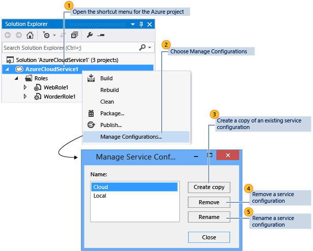
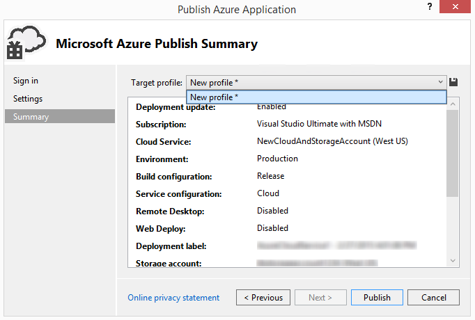
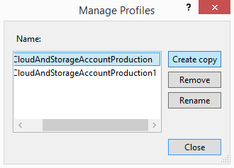

<properties
   pageTitle="How to manage service configurations and profiles | Microsoft Azure"
   description="Learn how to work with service configurations and profiles configuration files| which store settings for the deployment environments and publish settings for cloud services."
   services="visual-studio-online"
   documentationCenter="na"
   authors="TomArcher"
   manager="douge"
   editor="" />
<tags
   ms.service="multiple"
   ms.devlang="dotnet"
   ms.topic="article"
   ms.tgt_pltfrm="na"
   ms.workload="multiple"
   ms.date="06/01/2016"
   ms.author="tarcher" />

# How to manage service configurations and profiles

## Overview

When you publish a cloud service, Visual Studio stores configuration information in two kinds of configuration files: service configurations and profiles. Service configurations (.cscfg files) store settings for the deployment environments for an Azure cloud service. Azure uses these configuration files when it manages your cloud services. On the other hand, profiles (.azurePubxml files) store publish settings for cloud services. These settings are a record of what you choose when you use the publish wizard, and are used locally by Visual Studio. This topic explains how to work with both types of configuration files.

## Service Configurations

You can create multiple service configurations to use for each of your deployment environments. For example, you might create a service configuration for the local environment that you use to run and test an Azure application and another service configuration for your production environment.

You can add, delete, rename, and modify these service configurations based on your requirements. You can manage these service configurations from Visual Studio, as shown in the following illustration.

You can also open the **Manage Configurations** dialog box from the role’s property pages. To open the properties for a role in your Azure project, open the shortcut menu for that role, and then choose **Properties**. On the **Settings** tab, expand the **Service Configuration** list, and then select **Manage** to open the **Manage Configurations** dialog box.

### To add a service configuration

1. In Solution Explorer open the shortcut menu for the Azure project and then select **Manage Configurations**.

    The **Manage Service Configurations** dialog box appears.

1. To add a service configuration, you must create a copy of an existing configuration. To do this, choose the configuration that you want to copy from the Name list and then select **Create copy**.

1. (Optional) To give the service configuration a different name, choose the new service configuration from the Name list and then select **Rename**. In the **Name** text box, type the name that you want to use for this service configuration and then select **OK**.

    A new service configuration file that is named ServiceConfiguration.[New Name].cscfg is added to the Azure project in Solution Explorer.

### To delete a service configuration

1. In Solution Explorer, open the shortcut menu for the Azure project and then select **Manage Configurations**.

    The **Manage Service Configurations** dialog box appears.

1. To delete a service configuration, choose the configuration that you want to delete from the **Name** list and then select **Remove**. A dialog box appears to verify that you want to delete this configuration.

1. Select **Delete**.

     The service configuration file is removed from the Azure project in Solution Explorer.

### To rename a service configuration

1. In Solution Explorer, open the shortcut menu for the Azure project, and then select **Manage Configurations**.

    The **Manage Service Configurations** dialog box appears.

1. To rename a service configuration, choose the new service configuration from the **Name** list, and then select **Rename**. In the **Name** text box, type the name that you want to use for this service configuration, and then select **OK**.

    The name of the service configuration file is changed in the Azure project in Solution Explorer.

### To change a service configuration

- If you want to change a service configuration, open the shortcut menu for the specific role you want to change in the Azure project, and then select **Properties**. See [How to: Configure the Roles for an Azure Cloud Service with Visual Studio](https://msdn.microsoft.com/library/azure/hh369931.aspx) for more information.

## Make different setting combinations by using profiles

By using a profile, you can automatically fill in the **Publish Wizard** with different combinations of settings for different purposes. For example, you can have one profile for debugging and another for release builds. In that case, your **Debug** profile would have **IntelliTrace** enabled and the **Debug** configuration selected, and your **Release** profile would have **IntelliTrace** disabled and the **Release** configuration selected. You could also use different profiles to deploy a service using a different storage account.

When you run the wizard for the first time, a default profile is created. Visual Studio stores the profile in a file that has an .azurePubXml extension, which is added to your Azure project under the **Profiles** folder. If you manually specify different choices when you run the wizard later, the file automatically updates. Before you run the following procedure, you should have already published your cloud service at least once.

### To add a profile

1. Open the shortcut menu for your Azure project, and then select **Publish**.

1. Next to the **Target profile** list, select the **Save Profile** button, as the following illustration shows. This creates a profile for you.

    

1. After the profile is created, select **<Manage…>** in the **Target profile** list.

    The **Manage Profiles** dialog box appears, as the following illustration shows.

    

1. In the **Name** list, choose a profile, and then select **Create Copy**.

1. Choose the **Close** button.

    The new profile appears in the Target profile list.

1. In the **Target profile** list, select the profile that you just created. The Publish Wizard settings are filled in with the choices from the profile you selected.

1. Select the **Previous** and **Next** buttons to display each page of the Publish Wizard, and then customize the settings for this profile. See [Publish Azure Application Wizard](http://go.microsoft.com/fwlink/p/?LinkID=623085) for information.

1. After you finish customizing the settings, select **Next** to go back to the Settings page. The profile is saved when you publish the service by using these settings or if you select **Save** next to the list of profiles.

### To rename or delete a profile

1. Open the shortcut menu for your Azure project, and then select **Publish**.

1. In the **Target profile** list, select **Manage**.

1. In the **Manage Profiles** dialog box, select the profile that you want to delete, and then select **Remove**.

1. In the confirmation dialog box that appears, select **OK**.

1. Select **Close**.

### To change a profile

1. Open the shortcut menu for your Azure project, and then select **Publish**.

1. In the **Target profile** list, select the profile that you want to change.

1. Select the **Previous** and **Next** buttons to display each page of the Publish Wizard, and then change the settings you want. See [Publish Azure Application Wizard](http://go.microsoft.com/fwlink/p/?LinkID=623085) for information.

1. After you finish changing the settings, select **Next** to go back to the **Settings** page.

1. (Optional) select **Publish** to publish the cloud service using the new settings. If you don’t want to publish your cloud service at this time, and you close the Publish Wizard, Visual Studio asks you if you want to save the changes to the profile.

## Next steps

To learn about configuring other parts of your Azure project from Visual Studio, see [Configuring an Azure Project](http://go.microsoft.com/fwlink/p/?LinkID=623075)
