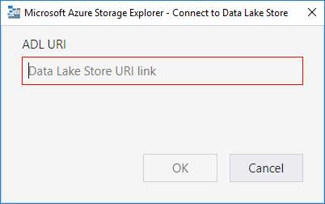

# Get started with Storage Explorer

## Overview

Azure Storage Explorer is a standalone app that enables you to easily work with Azure Storage data on Windows, macOS, and Linux. In this article, you learn several ways of connecting to and managing your Azure storage accounts.

![Microsoft Azure Storage Explorer][0]

## Prerequisites

# [Windows](#tab/windows)

Azure Storage Explorer is supported on the following versions of Windows:

* Windows 10 (recommended)
* Windows 8
* Windows 7

For all versions of Windows, .NET Framework 4.6.2 or greater is required.

[Download and install Storage Explorer](https://www.storageexplorer.com)

# [macOS](#tab/macos)

Azure Storage Explorer is supported on the following versions of macOS:

* macOS 10.12 "Sierra" and later versions

[Download and install Storage Explorer](https://www.storageexplorer.com)

# [Linux](#tab/linux)

Azure Storage Explorer is supported on the following distributions of Linux:

* Ubuntu 18.04 x64
* Ubuntu 16.04 x64
* Ubuntu 14.04 x64

Azure Storage Explorer may work on other distributions, but only ones listed above are officially supported.

For more help installing Storage Explorer on Linux, see the [Troubleshooting Guide](https://docs.microsoft.com/azure/storage/common/storage-explorer-troubleshooting#linux-dependencies).

The Azure Storage Explorer [Release Notes](https://go.microsoft.com/fwlink/?LinkId=838275&clcid=0x409) contain specific steps for some distributions.

[Download and install Storage Explorer](https://www.storageexplorer.com)

---

## Connect to a storage account or service

Storage Explorer provides several ways to connect to storage accounts. In general you can either:

* [Sign in to Azure to access your subscriptions and their resources](#sign-in-to-azure)
* [Attach a specific Storage or CosmosDB resource](#attach-a-specific-resource)

### Sign in to Azure

> [!NOTE]
> To fully access resources after signing in, Storage Explorer requires both management (ARM) and data layer permissions. This means that you need Azure AD permissions which give you access to your Storage account, the containers in the account, and the data in the containers. If you only have permissions at the data layer, consider using [Attach with Azure AD](#add-a-resource-via-azure-ad). For more information on the exact permissions Storage Explorer requires, see the [troubleshooting guide](https://docs.microsoft.com/azure/storage/common/storage-explorer-troubleshooting?tabs=1804#role-based-access-control-permission-issues).
>
>

1. In Storage Explorer, select **Manage Accounts** to go to the **Account Management Panel**.

    ![Manage Accounts][1]

2. The left pane now displays all the Azure accounts you've signed in to. To connect to another account, select **Add an account**

3. If you want to sign into a national cloud or an Azure Stack, click on the **Azure environment** dropdown to select which Azure cloud you want to use. Once you have chosen your environment, click the **Sign in...** button. If you are signing in to Azure Stack, see [Connect Storage Explorer to an Azure Stack subscription](/azure-stack/user/azure-stack-storage-connect-se) for more information.

    ![Sign In Option][2]

4. After you successfully sign in with an Azure account, the account and the Azure subscriptions associated with that account are added to the left pane. Select the Azure subscriptions that you want to work with, and then select **Apply** (Selecting **All subscriptions:** toggles selecting all or none of the listed Azure subscriptions).

    ![Select Azure subscriptions][3]

    The left pane displays the storage accounts associated with the selected Azure subscriptions.

    ![Selected Azure subscriptions][4]

### Attach a specific resource
    
There are a variety of options for attaching a resource to Storage Explorer. You can:

* [Add a resource via Azure AD](#add-a-resource-via-azure-ad): If you only have permissions at the data layer, then you can use this option to add a Blob container or an ADLS Gen2 Blob container.
* [Use a connection string](#use-a-connection-string): If you have a connection string to a Storage Account. Storage Explorer supports both key and [SAS](storage/common/storage-dotnet-shared-access-signature-part-1.md) connection strings.
* [Use a SAS URI](#use-a-sas-uri): If you have a [SAS](storage/common/storage-dotnet-shared-access-signature-part-1.md) URI to a Blob Container, File Share, Queue, or Table. To get a SAS URI, you can either use [Storage Explorer](#generate-a-sas-in-storage-explorer) or the [Azure portal](https://portal.azure.com).
* [Use a name and key](#use-a-name-and-key): If you know either of the account keys to your Storage Account, you can use this option to quickly connect. The keys for your Storage Account are located on the Storage Account **Access keys** blade at the [Azure portal](https://portal.azure.com).
* [Attach to a local emulator](#attach-to-a-local-emulator): If you're using one of the available Azure Storage emulators, use this option to easily connect to your emulator.
* [Connect to an Azure Cosmos DB account by using a connection string](#connect-to-an-azure-cosmos-db-account-by-using-a-connection-string): If you have a connection string to a CosmosDB instance.
* [Connect to Azure Data Lake Store by URI](#connect-to-azure-data-lake-store-by-uri): If you have a URI to an Azure Data Lake Store.

#### Add a resource via Azure AD

1. Open the **Connect Dialog** by clicking on the **connect button** on the left hand, vertical toolbar.

    ![Connect to Azure storage option][9]

2. If you have not already done so, use the **Add an Azure Account** option to sign in to the Azure Account which has access to the resource. After signing in return to the **Connect Dialog**.

3. Select the **Add a resource via Azure Active Directory (Azure AD)** option and click **Next**.

4. Select the Azure Account which has access to the Storage resource you want to attach and the subscription that the resource is in and then click **Next**.

5. Choose the resource type you want to attach, and then enter the information needed to connect. The inputs on this page will change depending on what type of resource you are adding. Make sure to choose the correct type of resource. Once you have filled in the required information click **Next**.

6. Review the connection summary and make sure all of the information is correct. If all of the information looks correct then click **Connect**, otherwise return to the previous pages with the **Back** button to correct any wrong information.

Once the connection is successfully added, the resource tree will automatically navigate to the node representing the connection. If for some reason it doesn't, look under **Local & Attached** → **Storage Accounts** → **(Attached Containers)** → **Blob Containers**. If Storage Explorer was unable to add your connection, or if you cannot access your data after successfully adding the connection, then consult the [troubleshooting guide](https://docs.microsoft.com/azure/storage/common/storage-explorer-troubleshooting) for help.

#### Use a connection string

1. Open the **Connect Dialog** by clicking on the **connect button** on the left hand, vertical toolbar.

    ![Connect to Azure storage option][9]

2. Select the **Use a connection string** option and click **Next**.

3. Choose a display name for your connection and enter in your connection string. Then click **Next**.

4. Review the connection summary and make sure all of the information is correct. If all of the information looks correct then click **Connect**, otherwise return to the previous pages with the **Back** button to correct any wrong information.

Once the connection is successfully added, the resource tree will automatically navigate to the node representing the connection. If for some reason it doesn't, look under **Local & Attached** → **Storage Accounts**. If Storage Explorer was unable to add your connection, or if you cannot access your data after successfully adding the connection, then consult the [troubleshooting guide](https://docs.microsoft.com/azure/storage/common/storage-explorer-troubleshooting) for help.

#### Use a SAS URI

1. Open the **Connect Dialog** by clicking on the **connect button** on the left hand, vertical toolbar.

    ![Connect to Azure storage option][9]

2. Select the **Use a shared access signature (SAS) URI** option and click **Next**.

3. Choose a display name for your connection and enter in your SAS URI. The service endpoint for the type of resource you are attaching should autofill. If you are using a custom endpoint then it is possible it may not. Click **Next**.

4. Review the connection summary and make sure all of the information is correct. If all of the information looks correct then click **Connect**, otherwise return to the previous pages with the **Back** button to correct any wrong information.

Once the connection is successfully added, the resource tree will automatically navigate to the node representing the connection. If for some reason it doesn't, look under **Local & Attached** → **Storage Accounts** → **(Attached Containers)** → **the service node for the type of container you attached**. If Storage Explorer was unable to add your connection, or if you cannot access your data after successfully adding the connection, then consult the [troubleshooting guide](https://docs.microsoft.com/azure/storage/common/storage-explorer-troubleshooting) for help.

#### Use a name and key

1. Open the **Connect Dialog** by clicking on the **connect button** on the left hand, vertical toolbar.

    ![Connect to Azure storage option][9]

2. Select the **Use a storage account name and key** option and click **Next**.

3. Choose a display name for your connection.

4. Enter in your Storage account name and either of its access keys.

5. Choose the **Storage domain** to use and then click **Next**.

4. Review the connection summary and make sure all of the information is correct. If all of the information looks correct then click **Connect**, otherwise return to the previous pages with the **Back** button to correct any wrong information.

Once the connection is successfully added, the resource tree will automatically navigate to the node representing the connection. If for some reason it doesn't, look under **Local & Attached** → **Storage Accounts**. If Storage Explorer was unable to add your connection, or if you cannot access your data after successfully adding the connection, then consult the [troubleshooting guide](https://docs.microsoft.com/azure/storage/common/storage-explorer-troubleshooting) for help.

#### Attach to a local emulator

Storage Explorer supports emulators on all platforms. The two currently official available emulators are:
* [Azure storage emulator](storage/common/storage-use-emulator.md) (Windows only)
* [Azurite](https://github.com/azure/azurite) (Windows, macOS, or Linux)

If your emulator is running on the default ports you can use the **Emulator - Default Ports** node, which can always be found under **Local & Attached** → **Storage Accounts**, to quickly access your emulator. If you want to use a different name for your connection or if your emulator is not running on the default ports, then follow the below steps.

1. Start your emulator. When you do, make a note of what ports the emulator is listening on for each service type. You will need to know this information later.

   > [!IMPORTANT]
   > Storage Explorer does not automatically start your emulator. You must start it yourself.

2. Open the **Connect Dialog** by clicking on the **connect button** on the left hand, vertical toolbar.

    ![Connect to Azure storage option][9]

3. Select the **Attach to a local emulator** option and click **Next**.

4. Choose a display name for your connection and enter in the ports your emulator is listening on for each service type. By default, the text boxes will contain the default port values for most emulators. The **Files port** is also left blank by default as neither of the official emulators currently support the Files service. If the emulator you are using does support it though, then you can enter in the port which is being used. Click **Next**.

5. Review the connection summary and make sure all of the information is correct. If all of the information looks correct then click **Connect**, otherwise return to the previous pages with the **Back** button to correct any wrong information.

Once the connection is successfully added, the resource tree will automatically navigate to the node representing the connection. If for some reason it doesn't, look under **Local & Attached** → **Storage Accounts**. If Storage Explorer was unable to add your connection, or if you cannot access your data after successfully adding the connection, then consult the [troubleshooting guide](https://docs.microsoft.com/azure/storage/common/storage-explorer-troubleshooting) for help.

#### Connect to an Azure Cosmos DB account by using a connection string

Besides manage Azure Cosmos DB accounts through Azure subscription, an alternative way of connecting to an Azure Cosmos DB is to use a connection string. Use the following steps to connect using a connection string.

1. Find **Local and Attached** in the left tree, right-click **Azure Cosmos DB Accounts**, choose **Connect to Azure Cosmos DB...**

    ![connect to Azure Cosmos DB by connection string][21]

2. Choose Azure Cosmos DB API, paste your **Connection String**, and then click **OK** to connect Azure Cosmos DB account. For information on retrieving the connection string, see [Get the connection string](https://docs.microsoft.com/azure/cosmos-db/manage-account).

    ![connection-string][22]

#### Connect to Azure Data Lake Store by URI

If you want to get access to the resources, which do not exist in your subscription. But others grant you to get the Uri for the resources. In this case, you can connect to Data Lake Store using the Uri after you have signed in. Refer to following steps.

1. Open Storage Explorer.
2. In the left pane, expand **Local and Attached**.
3. Right-click **Data Lake Store**, and - from the context menu - select **Connect to Data Lake Store...**.

    

4. Enter the Uri, then the tool navigates to the location of the URL you just entered.

    

    

## Generate a SAS in Storage Explorer

### Account level SAS

1. Right-click the storage account you want share, and then select **Get Shared Access Signature...**.

    ![Get SAS context menu option][14]

2. In the **Generate Shared Access Signature** dialog box, specify the time frame and permissions that you want for the account, and then click the **Create** button.

    ![Get SAS dialog box][15]

3. You can now either copy the **Connection string** or the raw **Query string** to your clipboard.

### Service level SAS

[How to get a SAS for a blob container in Storage Explorer](vs-azure-tools-storage-explorer-blobs.md#get-the-sas-for-a-blob-container)

## Search for storage accounts

If you need to find a storage resource and do not know where it is, you can use the search box at the top of the left pane to search for the resource.

As you type in the search box, the left pane displays all resources that match the search value you've entered up to that point. For example, a search for **endpoints** is shown in the following screenshot:

![Storage account search][23]

> [!NOTE]
> Use the **Account Management Panel** to deselect any subscriptions that do not contain the item you are searching for to improve the execution time of your search. You can also right-click on a node and choose **Search From Here** to start searching from a specific node.
>
>

## Next steps

* [Manage Azure Blob Storage resources with Storage Explorer](vs-azure-tools-storage-explorer-blobs.md)
* [Manage Azure Cosmos DB in Azure Storage Explorer  (Preview)](./cosmos-db/storage-explorer.md)
* [Manage Azure Data Lake Store resources with Storage Explorer](./data-lake-store/data-lake-store-in-storage-explorer.md)

[0]: ./media/vs-azure-tools-storage-manage-with-storage-explorer/Overview.png
[1]: ./media/vs-azure-tools-storage-manage-with-storage-explorer/ManageAccounts.png
[2]: ./media/vs-azure-tools-storage-manage-with-storage-explorer/ConnectDialog-SignInSelected.png
[3]: ./media/vs-azure-tools-storage-manage-with-storage-explorer/AccountPanel.png
[4]: ./media/vs-azure-tools-storage-manage-with-storage-explorer/SubscriptionNode.png
[5]: ./media/vs-azure-tools-storage-manage-with-storage-explorer/ConnectDialog.png
[7]: ./media/vs-azure-tools-storage-manage-with-storage-explorer/PortalAccessKeys.png
[8]: ./media/vs-azure-tools-storage-manage-with-storage-explorer/AccessKeys.png
[9]: ./media/vs-azure-tools-storage-manage-with-storage-explorer/ConnectDialog.png
[10]: ./media/vs-azure-tools-storage-manage-with-storage-explorer/ConnectDialog-AddWithKeySelected.png
[11]: ./media/vs-azure-tools-storage-manage-with-storage-explorer/ConnectDialog-NameAndKeyPage.png
[12]: ./media/vs-azure-tools-storage-manage-with-storage-explorer/AttachedWithKeyAccount.png
[13]: ./media/vs-azure-tools-storage-manage-with-storage-explorer/AttachedWithKeyAccount-Detach.png
[14]: ./media/vs-azure-tools-storage-manage-with-storage-explorer/GetSharedAccessSignature.png
[15]: ./media/vs-azure-tools-storage-manage-with-storage-explorer/SharedAccessSignatureDialog.png
[16]: ./media/vs-azure-tools-storage-manage-with-storage-explorer/ConnectDialog-WithConnStringOrSASSelected.png
[17]: ./media/vs-azure-tools-storage-manage-with-storage-explorer/ConnectDialog-ConnStringOrSASPage-1.png
[18]: ./media/vs-azure-tools-storage-manage-with-storage-explorer/AttachedWithSASAccount.png
[19]: ./media/vs-azure-tools-storage-manage-with-storage-explorer/ConnectDialog-ConnStringOrSASPage-2.png
[20]: ./media/vs-azure-tools-storage-manage-with-storage-explorer/ServiceAttachedWithSAS.png
[21]: ./media/vs-azure-tools-storage-manage-with-storage-explorer/connect-to-db-by-connection-string.png
[22]: ./media/vs-azure-tools-storage-manage-with-storage-explorer/connection-string.png
[23]: ./media/vs-azure-tools-storage-manage-with-storage-explorer/Search.png
