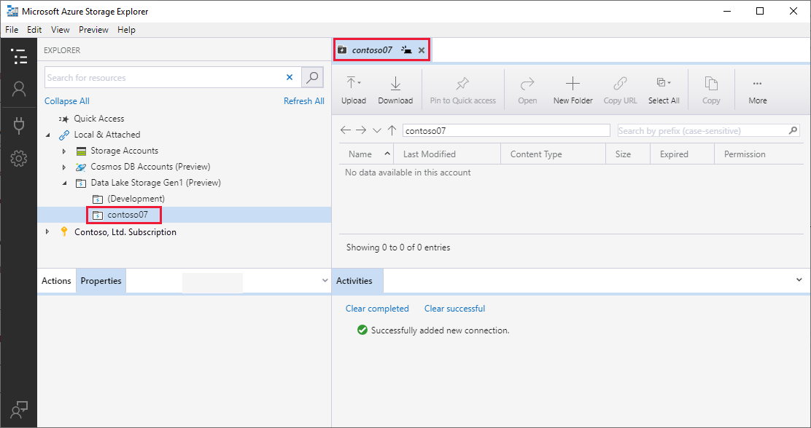

# Get started with Storage Explorer

## Overview

Microsoft Azure Storage Explorer is a standalone app that makes it easy to work with Azure Storage data on Windows, macOS, and Linux. In this article, you'll learn several ways of connecting to and managing your Azure storage accounts.

![Microsoft Azure Storage Explorer][0]

## Prerequisites

# [Windows](#tab/windows)

The following versions of Windows support Storage Explorer:

* Windows 10 (recommended)
* Windows 8
* Windows 7

For all versions of Windows, Storage Explorer requires .NET Framework 4.7.2 at a minimum.

# [macOS](#tab/macos)

The following versions of macOS support Storage Explorer:

* macOS 10.12 Sierra and later versions

# [Linux](#tab/linux)

Storage Explorer is available in the [Snap Store](https://snapcraft.io/storage-explorer) for most common distributions of Linux. We recommend Snap Store for this installation. The Storage Explorer snap installs all of its dependencies and updates when new versions are published to the Snap Store.

For supported distributions, see the [snapd installation page](https://snapcraft.io/docs/installing-snapd).

Storage Explorer requires the use of a password manager. You might have to connect to a password manager manually. You can connect Storage Explorer to your system's password manager by running the following command:

```bash
snap connect storage-explorer:password-manager-service :password-manager-service
```

Storage Explorer is also available as a *.tar.gz* download. You have to install dependencies manually. The following distributions of Linux support *.tar.gz* installation:

* Ubuntu 18.04 x64
* Ubuntu 16.04 x64
* Ubuntu 14.04 x64

The *.tar.gz* installation might work on other distributions, but only these listed ones are officially supported.

For more help installing Storage Explorer on Linux, see [Linux dependencies](https://docs.microsoft.com/azure/storage/common/storage-explorer-troubleshooting#linux-dependencies) in the Azure Storage Explorer troubleshooting guide.

---

## Download and install

To download and install Storage Explorer, see [Azure Storage Explorer](https://www.storageexplorer.com).

## Connect to a storage account or service

Storage Explorer provides several ways to connect to storage accounts. In general you can either:

* [Sign in to Azure to access your subscriptions and their resources](#sign-in-to-azure)
* [Attach a specific Storage or CosmosDB resource](#attach-a-specific-resource)

### Sign in to Azure

> [!NOTE]
> To fully access resources after you sign in, Storage Explorer requires both management (Azure Resource Manager) and data layer permissions. This means that you need Azure Active Directory (Azure AD) permissions, which give you access to your storage account, the containers in the account, and the data in the containers. If you have permissions only at the data layer, consider [adding a resource through Azure AD](#add-a-resource-via-azure-ad). For more information about the specific permissions Storage Explorer requires, see the [Azure Storage Explorer troubleshooting guide](https://docs.microsoft.com/azure/storage/common/storage-explorer-troubleshooting#rbac-permissions-issues).

1. In Storage Explorer, select **View** > **Account Management** or select the **Manage Accounts** button.

    ![Manage Accounts][1]

1. **ACCOUNT MANAGEMENT** now displays all the Azure accounts you've signed in to. To connect to another account, select **Add an account**.

1. In **Connect to Azure Storage**, select an Azure cloud from **Azure environment** to sign in to a national cloud or an Azure Stack. After you choose your environment, select **Next**.

    ![Option to sign in][2]

    Storage Explorer opens a page for you to sign in. For more information, see [Connect storage explorer to an Azure Stack subscription or storage account](/azure-stack/user/azure-stack-storage-connect-se).

1. After you successfully sign in with an Azure account, the account and the Azure subscriptions associated with that account appear under **ACCOUNT MANAGEMENT**. Select **All subscriptions** to toggle your selection between all or none of the listed Azure subscriptions. Select the Azure subscriptions that you want to work with, and then select **Apply**.

    ![Select Azure subscriptions][3]

    **EXPLORER** displays the storage accounts associated with the selected Azure subscriptions.

    ![Selected Azure subscriptions][4]

### Attach a specific resource

There are several ways to attach to a resource in Storage Explorer:

* [Add a resource via Azure AD](#add-a-resource-via-azure-ad). If you have permissions only at the data layer, use this option to add a blob container or an Azure Data Lake Storage Gen2 Blob storage container.
* [Use a connection string](#use-a-connection-string). Use this option if you have a connection string to a storage account. Storage Explorer supports both key and [shared access signature](storage/common/storage-dotnet-shared-access-signature-part-1.md) connection strings.
* [Use a shared access signature URI](#use-a-shared-access-signature-uri). If you have a [shared access signature URI](storage/common/storage-dotnet-shared-access-signature-part-1.md) to a blob container, file share, queue, or table, use it to attach to the resource. To get a shared access signature URI, you can either use [Storage Explorer](#generate-a-sas-in-storage-explorer) or the [Azure portal](https://portal.azure.com).
* [Use a name and key](#use-a-name-and-key). If you know either of the account keys to your storage account, you can use this option to quickly connect. Find your keys in the storage account page by selecting **Settings** > **Access keys** in the [Azure portal](https://portal.azure.com).
* [Attach to a local emulator](#attach-to-a-local-emulator). If you're using one of the available Azure Storage emulators, use this option to easily connect to your emulator.
* [Connect to an Azure Cosmos DB account by using a connection string](#connect-to-an-azure-cosmos-db-account-by-using-a-connection-string). Use this option if you have a connection string to a CosmosDB instance.
* [Connect to Azure Data Lake Store by URI](#connect-to-azure-data-lake-store-by-uri). Use this option if you have a URI to Azure Data Lake Store.

#### Add a resource via Azure AD

1. Select the **Connect** symbol to open **Connect to Azure Storage**.

    ![Connect to Azure storage option][9]

1. If you haven't already done so, use the **Add an Azure Account** option to sign in to the Azure account that has access to the resource. After you sign in, return to **Connect to Azure Storage**.

1. Select **Add a resource via Azure Active Directory (Azure AD)**, and then select **Next**.

1. Select an Azure account and tenant. These values must have access to the Storage resource you want to attach to. Select **Next**.

1. Choose the resource type you want to attach. Enter the information needed to connect. 

   The information you enter on this page depends on what type of resource you're adding. Make sure to choose the correct type of resource. After you've entered the required information, select **Next**.

1. Review the **Connection Summary** to make sure all the information is correct. If it is, select **Connect**. Otherwise, select **Back** to return to the previous pages to fix any incorrect information.

After the connection is successfully added, the resource tree goes to the node that represents the connection. The resource appears under **Local & Attached** > **Storage Accounts** > **(Attached Containers)** > **Blob Containers**. If Storage Explorer couldn't add your connection, or if you can't access your data after successfully adding the connection, see the [Azure Storage Explorer troubleshooting guide](https://docs.microsoft.com/azure/storage/common/storage-explorer-troubleshooting).

#### Use a connection string

1. Select the **Connect** symbol to open **Connect to Azure Storage**.

    ![Connect to Azure storage option][9]

1. Select **Use a connection string**, and then select **Next**.

1. Choose a display name for your connection and enter your connection string. Then, select **Next**.

1. Review the **Connection Summary** to make sure all the information is correct. If it is, select **Connect**. Otherwise, select **Back** to return to the previous pages to fix any incorrect information.

After the connection is successfully added, the resource tree goes to the node that represents the connection. The resource appears under **Local & Attached** > **Storage Accounts**. If Storage Explorer couldn't add your connection, or if you can't access your data after successfully adding the connection, see the [Azure Storage Explorer troubleshooting guide](https://docs.microsoft.com/azure/storage/common/storage-explorer-troubleshooting).

#### Use a shared access signature URI

1. Select the **Connect** symbol to open **Connect to Azure Storage**.

    ![Connect to Azure storage option][9]

1. Select **Use a shared access signature (SAS) URI**, and then select **Next**.

1. Choose a display name for your connection and enter your shared access signature URI. The service endpoint for the type of resource you're attaching should autofill. If you're using a custom endpoint, it's possible it might not. Select **Next**.

1. Review the **Connection Summary** to make sure all the information is correct. If it is, select **Connect**. Otherwise, select **Back** to return to the previous pages to fix any incorrect information.

After the connection is successfully added, the resource tree goes to the node that represents the connection. The resource appears under **Local & Attached** > **Storage Accounts** > **(Attached Containers)** > *the service node for the type of container you attached*. If Storage Explorer couldn't add your connection, see the [Azure Storage Explorer troubleshooting guide](https://docs.microsoft.com/azure/storage/common/storage-explorer-troubleshooting). See the troubleshooting guide if you can't access your data after successfully adding the connection.

#### Use a name and key

1. Select the **Connect** symbol to open **Connect to Azure Storage**.

    ![Connect to Azure storage option][9]

1. Select **Use a storage account name and key**, and then select **Next**.

1. Choose a display name for your connection.

1. Enter your storage account name and either of its access keys.

1. Choose the **Storage domain** to use and then select **Next**.

1. Review the **Connection Summary** to make sure all the information is correct. If it is, select **Connect**. Otherwise, select **Back** to return to the previous pages to fix any incorrect information.

After the connection is successfully added, the resource tree goes to the node that represents the connection. The resource appears under **Local & Attached** > **Storage Accounts**. If Storage Explorer couldn't add your connection, or if you can't access your data after successfully adding the connection, see the [Azure Storage Explorer troubleshooting guide](https://docs.microsoft.com/azure/storage/common/storage-explorer-troubleshooting).

#### Attach to a local emulator

Storage Explorer currently supports two official Storage emulators:

* [Azure Storage emulator](storage/common/storage-use-emulator.md) (Windows only)
* [Azurite](https://github.com/azure/azurite) (Windows, macOS, or Linux)

If your emulator is listening on the default ports, you can use the **Emulator - Default Ports** node to access your emulator. Look for **Emulator - Default Ports** under **Local & Attached** > **Storage Accounts**.

If you want to use a different name for your connection, or if your emulator isn't running on the default ports, follow these steps:

1. Start your emulator. Enter the command `AzureStorageEmulator.exe status` to display the ports for each service type.

   > [!IMPORTANT]
   > Storage Explorer doesn't automatically start your emulator. You must start it manually.

1. Select the **Connect** symbol to open **Connect to Azure Storage**.

    ![Connect to Azure storage option][9]

1. Select **Attach to a local emulator**, and then select **Next**.

1. Choose a display name for your connection and enter the ports your emulator is listening on for each service type. **Attach to a Local Emulator** suggests the default port values for most emulators. **Files port** is blank, because neither of the official emulators currently support the Files service. If the emulator you're using does support Files, you can enter the port to use. Then, select **Next**.

1. Review the **Connection Summary** and make sure all the information is correct. If it is, select **Connect**. Otherwise, select **Back** to return to the previous pages to fix any incorrect information.

After the connection is successfully added, the resource tree goes to the node that represents the connection. The node should appear under **Local & Attached** > **Storage Accounts**. If Storage Explorer couldn't add your connection, or if you can't access your data after successfully adding the connection, see the [Azure Storage Explorer troubleshooting guide](https://docs.microsoft.com/azure/storage/common/storage-explorer-troubleshooting).

#### Connect to an Azure Cosmos DB account by using a connection string

Instead of managing Azure Cosmos DB accounts through an Azure subscription, you can connect to Azure Cosmos DB by using a connection string. To connect, follow these steps:

1. Under **EXPLORER**, expand **Local & Attached**, right-click **Cosmos DB Accounts**, and select **Connect to Azure Cosmos DB**.

    ![Connect to Azure Cosmos DB by connection string][21]

1. Select the Azure Cosmos DB API, enter your **Connection String** data, and then select **OK** to connect the Azure Cosmos DB account. For information about how to retrieve the connection string, see [Manage an Azure Cosmos account](https://docs.microsoft.com/azure/cosmos-db/manage-account).

    ![Connection string][22]

#### Connect to Azure Data Lake Store by URI

You can access a resource that's not in your subscription. You need someone who has access to that resource to give you the resource URI. After you sign in, connect to Data Lake Store by using the URI. To connect, follow these steps:

1. Under **EXPLORER**, expand **Local & Attached**.

1. Right-click **Data Lake Storage Gen1**, and select **Connect to Data Lake Storage Gen1**.

    

1. Enter the URI, and then select **OK**. Your Data Lake Store appears under **Data Lake Storage**.

    

This example uses Data Lake Storage Gen1. Azure Data Lake Storage Gen2 is now available. For more information, see [What is Azure Data Lake Storage Gen1](./data-lake-store/data-lake-store-overview.md).

## Generate a shared access signature in Storage Explorer<a name="generate-a-sas-in-storage-explorer"></a>

### Account level shared access signature

1. Right-click the storage account you want share, and then select **Get Shared Access Signature**.

    ![Get shared access signature context menu option][14]

1. In **Shared Access Signature**, specify the time frame and permissions you want for the account, and then select **Create**.

    ![Get a shared access signature][15]

1. Copy either the **Connection string** or the raw **Query string** to your clipboard.

### Service level shared access signature

You can get a shared access signature at the service level. For more information, see [Get the SAS for a blob container](vs-azure-tools-storage-explorer-blobs.md#get-the-sas-for-a-blob-container).

## Search for storage accounts

To find a storage resource, you can search in the **EXPLORER** pane.

As you enter text in the search box, Storage Explorer displays all resources that match the search value you've entered up to that point. This example shows a search for **endpoints**:

![Storage account search][23]

> [!NOTE]
> To speed up your search, use **Account Management** to deselect any subscriptions that don't contain the item you're searching for. You can also right-click a node and select **Search From Here** to start searching from a specific node.
>
>

## Next steps

* [Manage Azure Blob storage resources with Storage Explorer](vs-azure-tools-storage-explorer-blobs.md)
* [Work with data using Azure Storage Explorer](./cosmos-db/storage-explorer.md)
* [Manage Azure Data Lake Store resources with Storage Explorer](./data-lake-store/data-lake-store-in-storage-explorer.md)

[0]: ./media/vs-azure-tools-storage-manage-with-storage-explorer/Overview.png
[1]: ./media/vs-azure-tools-storage-manage-with-storage-explorer/ManageAccounts.png
[2]: ./media/vs-azure-tools-storage-manage-with-storage-explorer/connect-to-azure-storage-azure-environment.png
[3]: ./media/vs-azure-tools-storage-manage-with-storage-explorer/account-panel-subscriptions-apply.png
[4]: ./media/vs-azure-tools-storage-manage-with-storage-explorer/SubscriptionNode.png
[5]: ./media/vs-azure-tools-storage-manage-with-storage-explorer/ConnectDialog.png
[7]: ./media/vs-azure-tools-storage-manage-with-storage-explorer/PortalAccessKeys.png
[8]: ./media/vs-azure-tools-storage-manage-with-storage-explorer/AccessKeys.png
[9]: ./media/vs-azure-tools-storage-manage-with-storage-explorer/ConnectDialog.png
[10]: ./media/vs-azure-tools-storage-manage-with-storage-explorer/ConnectDialog-AddWithKeySelected.png
[11]: ./media/vs-azure-tools-storage-manage-with-storage-explorer/ConnectDialog-NameAndKeyPage.png
[12]: ./media/vs-azure-tools-storage-manage-with-storage-explorer/AttachedWithKeyAccount.png
[13]: ./media/vs-azure-tools-storage-manage-with-storage-explorer/AttachedWithKeyAccount-Detach.png
[14]: ./media/vs-azure-tools-storage-manage-with-storage-explorer/get-shared-access-signature-for-storage-explorer.png
[15]: ./media/vs-azure-tools-storage-manage-with-storage-explorer/create-shared-access-signature-for-storage-explorer.png
[16]: ./media/vs-azure-tools-storage-manage-with-storage-explorer/ConnectDialog-WithConnStringOrSASSelected.png
[17]: ./media/vs-azure-tools-storage-manage-with-storage-explorer/ConnectDialog-ConnStringOrSASPage-1.png
[18]: ./media/vs-azure-tools-storage-manage-with-storage-explorer/AttachedWithSASAccount.png
[19]: ./media/vs-azure-tools-storage-manage-with-storage-explorer/ConnectDialog-ConnStringOrSASPage-2.png
[20]: ./media/vs-azure-tools-storage-manage-with-storage-explorer/ServiceAttachedWithSAS.png
[21]: ./media/vs-azure-tools-storage-manage-with-storage-explorer/connect-to-cosmos-db-by-connection-string.png
[22]: ./media/vs-azure-tools-storage-manage-with-storage-explorer/connection-string-for-cosmos-db.png
[23]: ./media/vs-azure-tools-storage-manage-with-storage-explorer/storage-explorer-search-for-resource.png
