<properties
   pageTitle="Browsing and managing storage resources with Server Explorer | Microsoft Azure"
   description="Browsing and managing storage resources with Server Explorer"
   services="visual-studio-online"
   documentationCenter="na"
   authors="TomArcher"
   manager="douge"
   editor="" />
<tags
   ms.service="storage"
   ms.devlang="multiple"
   ms.topic="article"
   ms.tgt_pltfrm="na"
   ms.workload="na"
   ms.date="07/18/2016"
   ms.author="tarcher" />

# Browsing and Managing Storage Resources with Server Explorer

[AZURE.INCLUDE [storage-try-azure-tools](../../includes/storage-try-azure-tools.md)]

## Overview
If you've installed the Azure Tools for Microsoft Visual Studio, you can view blob, queue, and table data from your storage accounts for Azure. The Azure Storage node in Server Explorer shows data that’s in your local storage emulator account and your other Azure storage accounts.

To view Server Explorer in Visual Studio, on the menu bar, choose **View**, **Server Explorer**. The storage node shows all of the storage accounts that exist under each Azure subscription/certificate you're connected to. If your storage account doesn't appear, you can add it by following the instructions [later in this topic](#add-storage-accounts-by-using-server-explorer).

Starting in Azure SDK 2.7, you can also use the new Cloud Explorer to view and manage your Azure resources. See [Managing Azure Resources with Cloud Explorer](./vs-azure-tools-resources-managing-with-cloud-explorer.md) for more information.

## View and manage storage resources in Visual Studio

Server Explorer automatically shows a list of blobs, queues, and tables in your storage emulator account. The storage emulator account is listed in Server Explorer under the Storage node as the **Development** node.

To see the storage emulator account’s resources, expand the **Development** node. If the storage emulator hasn’t been started when you expand the **Development** node, it will automatically start. This can take several seconds. You can continue to work in other areas of Visual Studio while the storage emulator starts.

To view resources in a storage account, expand the storage account’s node in Server Explorer. The following sub-nodes appear:

- Blobs

- Queues

- Tables

## Work with Blob Resources

The Blobs node displays a list of containers for the selected storage account. Blob containers contain blob files, and you can organize these blobs into folders and subfolders. See [How to use Blob Storage from .NET](./storage/storage-dotnet-how-to-use-blobs.md) for more information.

### To create a blob container

1. Open the shortcut menu for the **Blobs** node, and then choose **Create Blob Container**.

1. Enter the name of the new container in the **Create Blob Container** dialog box and then choose **Ok**.

    

    >[AZURE.NOTE] The blob container name must begin with a number (0-9) or lowercase letter (a-z).

### To delete a blob container

- Open the shortcut menu for the blob container you want to remove and then choose **Delete**.

### To display a list of the items contained in a blob container

- Open the shortcut menu for a blob container name in the list and then choose **View Blob Container**.

    When you view the contents of a blob container, it appears in a tab known as the blob container view.

    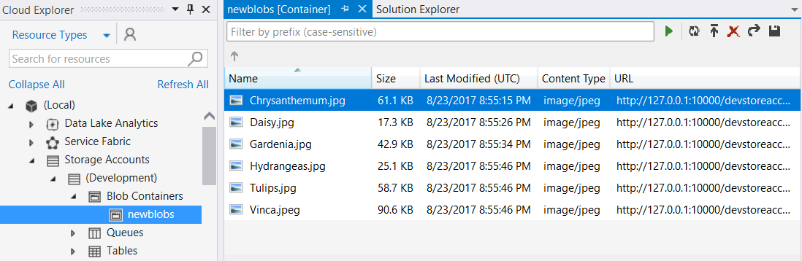

    You can perform the following operations on blobs by using the buttons in the top-right corner of the blob container view:

    - Enter a filter value and apply it

    - Refresh the list of blobs in the container

    - Upload a file

    - Delete a blob

      >[AZURE.NOTE] Deleting a file from a blob container doesn’t delete the underlying file; it only removes it from the blob container.

    - Open a blob

    - Save a blob to the local computer

### To create a folder or subfolder in a blob container

1. Choose the blob container in Server Explorer. In the container window, choose the **Upload Blob** button.

    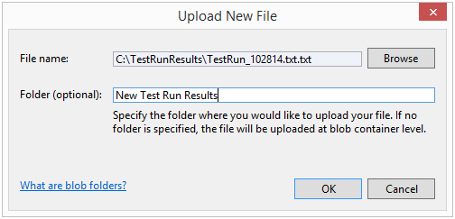

1. In the **Upload New File** dialog box, choose the **Browse** button to specify the file you want to upload, and then enter a folder name in the **Folder (optional)** box.

    You can add subfolders in container folders by following the same procedure. If you don’t specify a folder name, the file will be uploaded to the top level of the blob container.The file appears in the specified folder in the container.

    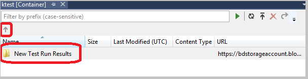

1. Double-click the folder or press ENTER to see the contents of the folder. When you’re in the container’s folder, you can navigate back to the root of the container by choosing the **Open Parent Directory** (up arrow) button.

### To delete a container folder

 - Delete all of the files in the folder

    >[AZURE.NOTE] Because folders in blob containers are virtual folders, you can’t create an empty folder, nor can you delete a folder to delete its file contents. You have to delete the entire contents of a folder to delete the folder.

### To filter blobs in a container

You can filter the blobs that are displayed by specifying a common prefix.

For example, if you enter the prefix `hello` in the filter text box and then choose the **Execute** (**!**)button, only blobs that begin with 'hello' appear.

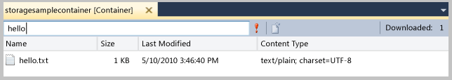

>[AZURE.NOTE] The filter field is case-sensitive and doesn’t support filtering with wildcard characters. Blobs can only be filtered by prefix. The prefix may include a delimiter if you are using a delimiter to organize blobs in a virtual hierarchy. For example, filtering on the prefix HelloFabric/ returns all blobs beginning with that string.

### To download blob data

- In **Server Explorer**, open the shortcut menu for one or more blobs and then choose **Open**, or choose the blob name and then choose the **Open** button, or double-click the blob name.

    The progress of a blob download appears in the **Azure Activity Log** window.

    The blob opens in the default editor for that file type. If the operating system recognizes the file type, the file opens in a locally installed application; otherwise, you're prompted to choose an application that’s appropriate for the file type of the blob. The local file that’s created when you download a blob is marked as read-only.

    Blob data is cached locally and checked against the blob's last modified time in the Blob service. If the blob has been updated since it was last downloaded, it will be downloaded again; otherwise the blob will be loaded from the local disk. By default a blob is downloaded to a temporary directory. To download blobs to a specific directory, open the shortcut menu for the selected blob names and choose **Save As**. When you save a blob in this manner, the blob file is not opened, and the local file is created with read-write attributes.

### To upload blobs

- Choose the **Upload Blob** button when the container is open for viewing in the blob container view.

    You can choose one or more files to upload, and you can upload files of any type. The **Azure Activity Log** shows the progress of the upload. For more information about how to work with blob data, see [How to use the Azure Blob Storage Service in .NET](http://go.microsoft.com/fwlink/p/?LinkId=267911).

### To view logs transferred to blobs

- If you are using Azure Diagnostics to log data from your Azure application and you have transferred logs to your storage account, you’ll see containers that were created by Azure for these logs. Viewing these logs in Server Explorer is an easy way to identify problems with your application, especially if it’s been deployed to Azure. For more information about Azure Diagnostics, see [Collect Logging Data by Using Azure Diagnostics](https://msdn.microsoft.com/library/azure/gg433048.aspx).

### To get the URL for a blob

- Open the blob’s shortcut menu and then choose **Copy URL**.

### To edit a blob

- Select the blob and then choose the **Open Blob** button.

    The file is downloaded to a temporary location and opened on the local computer. You must upload the blob again after you make changes.

## Work with Queue Resources

Storage services queues are hosted in an Azure storage account and you can use them to allow your cloud service roles to communicate with each other and with other services by a message passing mechanism. You can access the queue programmatically through a cloud service and over a web service for external clients. You can also access the queue directly by using Server Explorer in Visual Studio.

When you develop a cloud service that uses queues, you might want to use Visual Studio to create queues and work with them interactively while you develop and test your code.

In Server Explorer, you can view the queues in a storage account, create and delete queues, open a queue to view its messages, and add messages to a queue. When you open a queue for viewing, you can view the individual messages, and you can perform the following actions on the queue by using the buttons in the top-left corner:

- Refresh the view of the queue

- Add a message to the queue

- Dequeue the topmost message.

- Clear the entire queue

The following image shows a queue that contains two messages.

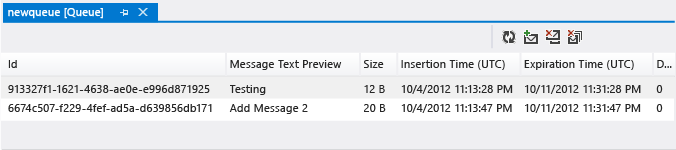

For more information about storage services queues, see [How to: Use the Queue Storage Service](http://go.microsoft.com/fwlink/?LinkID=264702). For information about the web service for storage services queues, see [Queue Service Concepts](http://go.microsoft.com/fwlink/?LinkId=264788). For information about how to send messages to a storage services queue by using Visual Studio, see [Sending Messages to a Storage Services Queue](https://msdn.microsoft.com/library/azure/jj649344.aspx).

>[AZURE.NOTE] Storage services queues are distinct from service bus queues. For more information about service bus queues, see Service Bus Queues, Topics, and Subscriptions.

## Work with Table Resources

The Azure Table storage service stores large amounts of structured data. The service is a NoSQL datastore which accepts authenticated calls from inside and outside the Azure cloud. Azure tables are ideal for storing structured, non-relational data.

### To create a table

1. In Server Explorer, select the **Tables** node of the storage account, and then choose **Create Table**.

1. In the **Create Table** dialog box, enter a name for the table.

### To view table data

1. In Server Explorer, open the **Azure** node, and then open the **Storage** node.

1. Open the storage account node that you are interested in, and then open the **Tables** node to see a list of tables for the storage account.

1. Open the shortcut menu for a table and then choose **View Table**.

    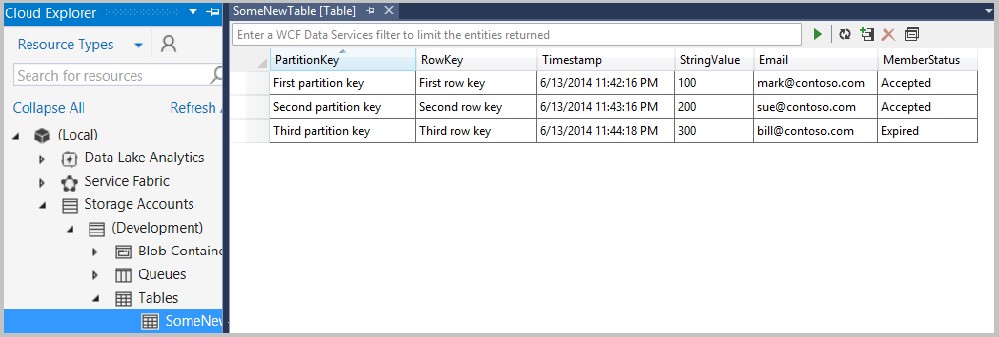

The table is organized by entities (shown in rows) and properties (shown in columns). For example, the following illustration shows entities listed in the **Table Designer**:

### To edit table data

1. In the **Table Designer**, open the shortcut menu for an entity (a single row) or a property (a single cell) and then choose **Edit**.

    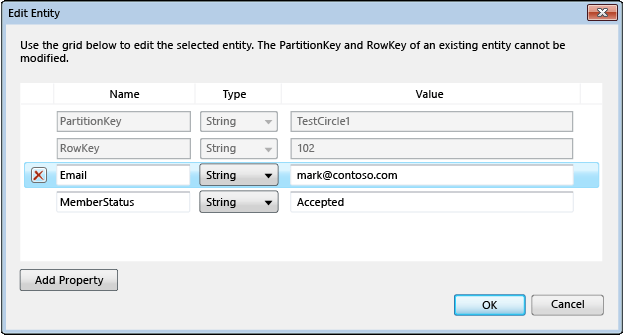

    Entities in a single table aren’t required to have the same set of properties (columns). Keep in mind the following restrictions on viewing and editing table data.
    - You can’t view or edit binary data (type byte[]), but you can store it in a table.

    - You can’t edit the **PartitionKey** or **RowKey** values, because table storage in Azure doesn't support that operation.

    - You can’t create a property called Timestamp, Azure Storage services use a property with that name.

    - If you enter a DateTime value, you must follow a format that's appropriate to the region and language settings of your computer (for example, MM/DD/YYYY HH:MM:SS [AM|PM] for U.S. English).

### To add entities

1. In the **Table Designer**, choose the **Add Entity** button, which is near the top-right corner of the table view.

    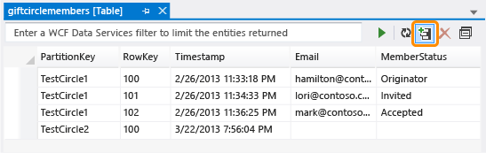

1. In the **Add Entity** dialog box, enter the values of the **PartitionKey** and **RowKey** properties.

    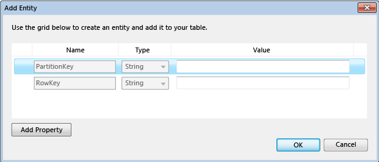

    Enter the values carefully because you can't change them after you close the dialog box unless you delete the entity and add it again.

### To filter entities

You can customize the set of entities that appear in a table if you use the query builder.

1. To open the query builder, open a table for viewing.

1. Choose the rightmost button on the table view’s toolbar.

    The **Query Builder** dialog box appears. The following illustration shows a query that's being built in the query builder.

    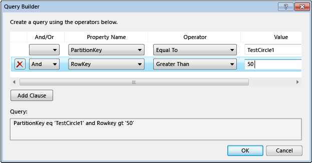

1. When you’re done building the query, close the dialog box. The resulting text form of the query appears in a text box as a WCF Data Services filter.

1. To run the query, choose the green triangle icon.

    You can also filter entity data that appears in the **Table Designer** if you enter a WCF Data Services filter string directly in the filter field. This kind of string is similar to a SQL WHERE clause but is sent to the server as an HTTP request. For information about how to construct filter strings, see [Constructing Filter Strings for the Table Designer](https://msdn.microsoft.com/library/azure/ff683669.aspx).

    The following illustration shows an example of a valid filter string:

    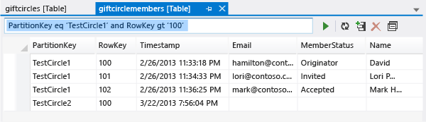

### Refresh storage data

When Server Explorer connects to or gets data from a storage account, it might take up to a minute for the operation to complete. If it can’t connect, the operation might time out. While data is retrieved, you can continue to work in other parts of Visual Studio. To cancel the operation if it’s taking too long, choose the **Stop Refresh** button on the Server Explorer toolbar.

#### To refresh blob container data

- Select the **Blobs** node beneath **Storage** and choose the **Refresh** button on the Server Explorer toolbar.

- To refresh the list of blobs that is displayed, choose the **Execute** button.

#### To refresh table data

- Select the **Tables** node beneath **Storage** and choose the **Refresh** button.

- To refresh the list of entities that is displayed in the **Table Designer**, choose the **Execute** button on the **Table Designer**.

#### To refresh queue data

- Select the **Queues** node, and then choose the **Refresh** button.

#### To refresh all items in a storage account

- Choose the account name, and then choose the **Refresh** button on the toolbar for Server Explorer.

### Add storage accounts by using Server Explorer

There are two ways to add storage accounts by using Server Explorer. You can create a new storage account in your Azure subscription, or you can attach an existing storage account.

#### To create a new storage account by using Server Explorer

1. In Server Explorer, open the shortcut menu for the Storage node, and then choose Create Storage Account.

    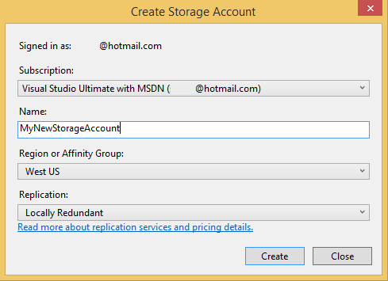

1. Select or enter the following information for the new storage account in the **Create Storage Account** dialog box.

    - The Azure subscription to which you want to add the storage account.

    - The name you want to use for the new storage account.

    - The region or affinity group (such as West US or East Asia).

    - The type of replication you want to use for the storage account, such as Geo-Redundant.

1. Choose **Create**.

    The new storage account appears in the **Storage** list in Solution Explorer.

#### To attach an existing storage account by using Server Explorer

1. In Server Explorer, open the shortcut menu for the Azure storage node, and then choose **Attach External Storage**.

    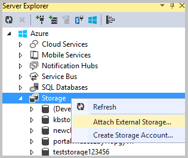

1. Select or enter the following information for the new storage account in the **Create Storage Account** dialog box.

    - The name of the existing storage account you want to attach. You can enter a name or select it from the list.

    - The key for the selected storage account. This value is typically provided for you when you select a storage account. If you want Visual Studio to remember the storage account key, select the Remember account key box.

    - The protocol to use to connect to the storage account, such as HTTP, HTTPS, or a custom endpoint. See [How to Configure Connection Strings](https://msdn.microsoft.com/library/azure/ee758697.aspx) for more information about custom endpoints.

### To view the secondary endpoints

- If you created a storage account using the **Read-Access Geo Redundant** replication option, you can view its secondary endpoints. Open the shortcut menu for the account name, and then choose **Properties**.

    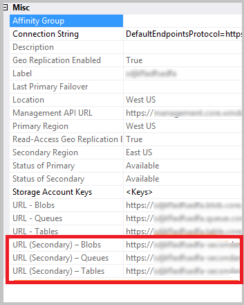

### To remove a storage account from Server Explorer

- In Server Explorer, open the shortcut menu for the account name, and then choose **Delete**. If you delete a storage account, any saved key information for that account is also removed.

    >[AZURE.NOTE] If you delete a storage account from Server Explorer, it doesn’t affect your storage account or any data that it contains; it simply removes the reference from Server Explorer. To permanently delete a storage account, use the [Azure classic portal](http://go.microsoft.com/fwlink/?LinkID=213885).

## Next steps

To learn more about how use Azure storage services, see [Accessing the Azure Storage Services](https://msdn.microsoft.com/library/azure/ee405490.aspx).
