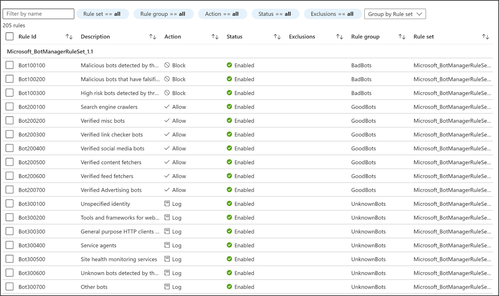

# Azure Web Application Firewall on Azure Front Door

Azure Web Application Firewall on Azure Front Door provides centralized protection for your web applications. A web application firewall (WAF) defends your web services against common exploits and vulnerabilities. It keeps your service highly available for your users and helps you meet compliance requirements.

Azure Web Application Firewall on Azure Front Door is a global and centralized solution. It's deployed on Azure network edge locations around the globe. WAF-enabled web applications inspect every incoming request delivered by Azure Front Door at the network edge.

A WAF prevents malicious attacks close to the attack sources before they enter your virtual network. You get global protection at scale without sacrificing performance. A WAF policy easily links to any Azure Front Door profile in your subscription. New rules can be deployed within minutes, so you can respond quickly to changing threat patterns.

[!INCLUDE [ddos-waf-recommendation](../../../includes/ddos-waf-recommendation.md)]

Azure Front Door has [two tiers](../../frontdoor/standard-premium/overview.md):

- Standard
- Premium

Azure Web Application Firewall is natively integrated with Azure Front Door Premium with full capabilities. For Azure Front Door Standard, only [custom rules](#custom-authored-rules) are supported.

## Protection

Azure Web Application Firewall protects your:

* Web applications from web vulnerabilities and attacks without modifications to back-end code.
* Web applications from malicious bots with the IP Reputation Rule Set.
* Applications against DDoS attacks. For more information, see [Application DDoS protection](../shared/application-ddos-protection.md).

## WAF policy and rules

You can configure a [WAF policy](waf-front-door-create-portal.md) and associate that policy to one or more Azure Front Door domains for protection. A WAF policy consists of two types of security rules:

- Custom rules that the customer created.
- Managed rule sets that are a collection of Azure-managed preconfigured sets of rules.

When both are present, custom rules are processed before processing the rules in a managed rule set. A rule is made of a match condition, a priority, and an action. Action types supported are ALLOW, BLOCK, LOG, and REDIRECT. You can create a fully customized policy that meets your specific application protection requirements by combining managed and custom rules.

Rules within a policy are processed in a priority order. Priority is a unique integer that defines the order of rules to process. A smaller integer value denotes a higher priority, and those rules are evaluated before rules with a higher integer value. After a rule is matched, the corresponding action that was defined in the rule is applied to the request. After such a match is processed, rules with lower priorities aren't processed further.

A web application delivered by Azure Front Door can have only one WAF policy associated with it at a time. However, you can have an Azure Front Door configuration without any WAF policies associated with it. If a WAF policy is present, it's replicated to all of our edge locations to ensure consistent security policies across the world.

## WAF modes

You can configure a WAF policy to run in two modes:

- **Detection**: When a WAF runs in detection mode, it only monitors and logs the request and its matched WAF rule to WAF logs. It doesn't take any other actions. You can turn on logging diagnostics for Azure Front Door. When you use the portal, go to the **Diagnostics** section.
- **Prevention**: In prevention mode, a WAF takes the specified action if a request matches a rule. If a match is found, no further rules with lower priority are evaluated. Any matched requests are also logged in the WAF logs.

## WAF actions

WAF customers can choose to run from one of the actions when a request matches a rule's conditions:

- **Allow**: The request passes through the WAF and is forwarded to the origin. No further lower priority rules can block this request.
- **Block**: The request is blocked and the WAF sends a response to the client without forwarding the request to the origin.
- **Log**: The request is logged in the WAF logs and the WAF continues evaluating lower priority rules.
- **Redirect**: The WAF redirects the request to the specified URI. The URI specified is a policy-level setting. After configuration, all requests that match the **Redirect** action are sent to that URI.
- **Anomaly score**: The total anomaly score is increased incrementally when a rule with this action is matched. This default action is for Default Rule Set 2.0 or later. It isn't applicable for the Bot Manager Rule Set.

## WAF rules

A WAF policy can consist of two types of security rules:

- Custom rules, authored by the customer and managed rule sets
- Azure-managed preconfigured sets of rules

### Custom-authored rules

To configure custom rules for a WAF, use the following controls:

- **IP allow list and block list**: You can control access to your web applications based on a list of client IP addresses or IP address ranges. Both IPv4 and IPv6 address types are supported. This list can be configured to either block or allow those requests where the source IP matches an IP in the list.
- **Geographic-based access control**: You can control access to your web applications based on the country code that's associated with a client's IP address.
- **HTTP parameters-based access control**: You can base rules on string matches in HTTP/HTTPS request parameters. Examples include query strings, POST args, Request URI, Request Header, and Request Body.
- **Request method-based access control**: You base rules on the HTTP request method of the request. Examples include GET, PUT, or HEAD.
- **Size constraint**: You can base rules on the lengths of specific parts of a request, such as query string, Uri, or Request Body.
- **Rate limiting rules**: A rate control rule limits abnormally high traffic from any client IP address. You might configure a threshold on the number of web requests allowed from a client IP during a one-minute duration. This rule is distinct from an IP list-based allow/block custom rule that either allows all or blocks all requests from a client IP. Rate limits can be combined with other match conditions, such as HTTP(S) parameter matches for granular rate control.

### Azure-managed rule sets

Azure-managed rule sets provide an easy way to deploy protection against a common set of security threats. Because Azure manages these rule sets, the rules are updated as needed to protect against new attack signatures. The Azure-managed Default Rule Set includes rules against the following threat categories:

- Cross-site scripting
- Java attacks
- Local file inclusion
- PHP injection attacks
- Remote command execution
- Remote file inclusion
- Session fixation
- SQL injection protection
- Protocol attackers

Custom rules are always applied before rules in the Default Rule Set are evaluated. If a request matches a custom rule, the corresponding rule action is applied. The request is either blocked or passed through to the back end. No other custom rules or the rules in the Default Rule Set are processed. You can also remove the Default Rule Set from your WAF policies.

For more information, see [Web Application Firewall Default Rule Set rule groups and rules](waf-front-door-drs.md).

### Bot protection rule set

You can enable a managed bot protection rule set to take custom actions on requests from known bot categories.

Three bot categories are supported:

- **Bad**: Bad bots include bots from malicious IP addresses and bots that have falsified their identities. Malicious IP addresses are sourced from the Microsoft Threat Intelligence feed and updated every hour. [Intelligent Security Graph](https://www.microsoft.com/security/operations/intelligence) powers Microsoft Threat Intelligence and is used by multiple services, including Microsoft Defender for Cloud.
- **Good**: Good bots include validated search engines.
- **Unknown**: Unknown bots include other bot groups that have identified themselves as bots. Examples include market analyzers, feed fetchers, and data collection agents. Unknown bots are classified via published user agents without any other validation.

The WAF platform manages and dynamically updates bot signatures. You can set custom actions to block, allow, log, or redirect for different types of bots.

If bot protection is enabled, incoming requests that match bot rules are logged. You can access WAF logs from a storage account, an event hub, or Log Analytics. For more information about how the WAF logs requests, see [Azure Web Application Firewall monitoring and logging](waf-front-door-monitor.md).

## Configuration

You can configure and deploy all WAF policies by using the Azure portal, REST APIs, Azure Resource Manager templates, and Azure PowerShell. You can also configure and manage Azure WAF policies at scale by using Firewall Manager integration. For more information, see [Use Azure Firewall Manager to manage Azure Web Application Firewall policies](../shared/manage-policies.md).

## Monitoring

Monitoring for a WAF on Azure Front Door is integrated with Azure Monitor to track alerts and easily monitor traffic trends. For more information, see [Azure Web Application Firewall monitoring and logging](waf-front-door-monitor.md).

## Next steps

- Learn about [Azure Web Application Firewall on Azure Application Gateway](../ag/ag-overview.md).
- Learn more about [Azure network security](../../networking/security/index.yml).