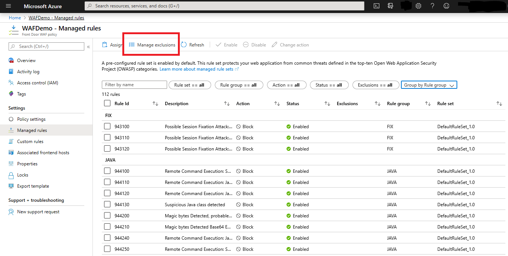
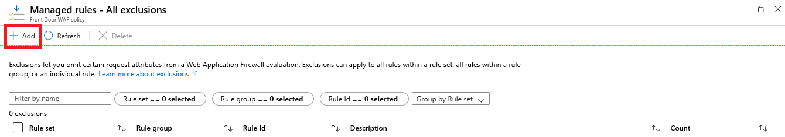
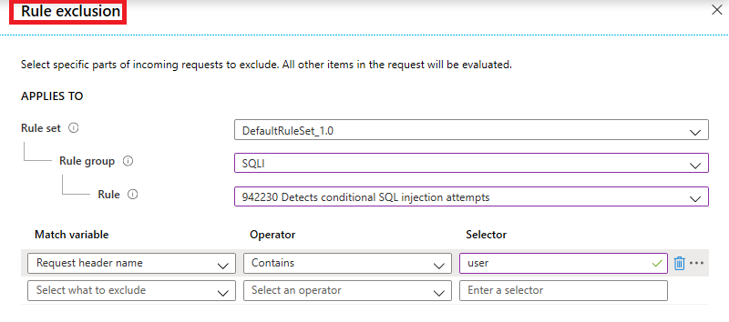

# Web Application Firewall (WAF) with Front Door Service exclusion lists 

Sometimes Web Application Firewall (WAF) might block a request that you want to allow for your application. For example, Active Directory inserts tokens that are used for authentication. These tokens can contain special characters that may trigger a false positive from the WAF rules. WAF exclusion lists allow you to omit certain request attributes from a WAF evaluation.  An exclusion list can be configured using  [PowerShell](/powershell/module/az.frontdoor/New-AzFrontDoorWafManagedRuleExclusionObject), [Azure CLI](/cli/azure/network/front-door/waf-policy/managed-rules/exclusion#az_network_front_door_waf_policy_managed_rules_exclusion_add), [Rest API](/rest/api/frontdoorservice/webapplicationfirewall/policies/createorupdate), or the Azure portal. The following example shows the Azure portal configuration. 
## Configure exclusion lists using the Azure portal
**Manage exclusions** is accessible from WAF portal under **Managed rules**

 An example exclusion list:

This example excludes the value in the *user* header field. A valid request may include the *user* field that contains a string that triggers a SQL injection rule. You can exclude the *user* parameter in this case so that the WAF rule doesn't evaluate anything in the field.

The following attributes can be added to exclusion lists by name. The values of the fields you use  aren't evaluated against WAF rules, but their names are evaluated. The exclusion lists remove inspection of the field's value.

* Request header name
* Request cookie name
* Query string args name
* Request body post args name

You can specify an exact request header, body, cookie, or query string attribute match.  Or, you can optionally specify partial matches. The following operators are the supported match criteria:

- **Equals**:  This operator is used for an exact match. For example, to select a header named **bearerToken**, use the equals operator with the selector set as **bearerToken**.
- **Starts with**: This operator matches all fields that start with the specified selector value.
- **Ends with**:  This operator matches all request fields that end with the specified selector value.
- **Contains**: This operator matches all request fields that contain the specified selector value.
- **Equals any**: This operator matches all request fields. * is the selector value.

Header and cookie names are case insensitive.

If a header value, cookie value, post argument value, or query argument value produces false positives for some rules, you can exclude that part of the request from consideration by the rule:

|matchVariableName from WAF logs  |Rule exclusion in Portal  |
|---------|---------|
|CookieValue:SOME_NAME        |Request cookie name Equals SOME_NAME|
|HeaderValue:SOME_NAME        |Request header name Equals SOME_NAME|
|PostParamValue:SOME_NAME     |Request body post args name Equals SOME_NAME|
|QueryParamValue:SOME_NAME    |Query string args name Equals SOME_NAME|

We currently only support rule exclusions for the above matchVariableNames in their WAF logs. For any other matchVariableNames, you must either disable rules that give false positives, or create a custom rule that explicitly allows those requests. In particular, when the matchVariableName is CookieName, HeaderName, PostParamName, or QueryParamName, it means the name itself is triggering the rule. Rule exclusion has no support for these matchVariableNames at this time.

If you exclude a Request body post args named *FOO*, no rule should show PostParamValue:FOO as the matchVariableName in your WAF logs. However, you may still see a rule with matchVariableName InitialBodyContents which matches on the value of the post param FOO since post param values are part of the InitialBodyContents.

You can apply exclusion lists to all rules within the managed rule set, to rules for a specific rule group, or to a single rule as shown in the previous example.

## Define exclusion based on Web Application Firewall Logs
 [Azure Web Application Firewall monitoring and logging](waf-front-door-monitor.md) shows matched details of a blocked request. If a header value, cookie value, post argument value, or query argument value produces false positives for some rules, you can exclude that part of the request from being considered by the rule. The following table shows example values from WAF logs and the corresponding exclusion conditions.

|matchVariableName from WAF logs	|Rule exclusion in Portal|
|--------|------|
|CookieValue:SOME_NAME	|Request cookie name Equals SOME_NAME|
|HeaderValue:SOME_NAME	|Request header name Equals SOME_NAME|
|PostParamValue:SOME_NAME|	Request body post args name Equals SOME_NAME|
|QueryParamValue:SOME_NAME|	Query string args name Equals SOME_NAME|

## Next steps

After you configure your WAF settings, learn how to view your WAF logs. For more information, see [Front Door diagnostics](../afds/waf-front-door-monitor.md).