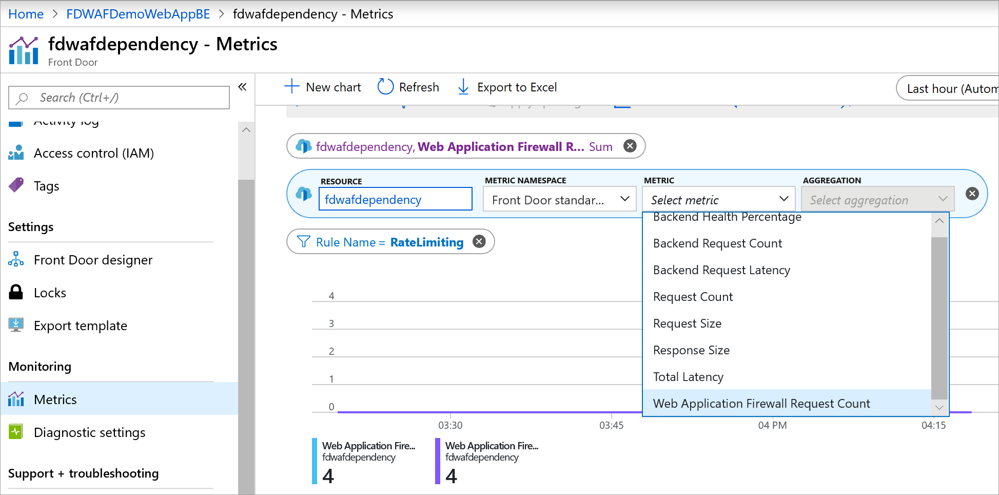

# Azure Web Application Firewall monitoring and logging 

Azure Web Application Firewall (WAF) monitoring and logging are provided through logging and integration with Azure Monitor and Azure Monitor logs.

## Azure Monitor

WAF with FrontDoor log is integrated with [Azure Monitor](../../azure-monitor/overview.md). Azure Monitor allows you to track diagnostic information including WAF alerts and logs. You can configure WAF monitoring within the Front Door resource in the portal under the **Diagnostics** tab or through the Azure Monitor service directly.

From Azure portal, go to Front Door resource type. From **Monitoring**/**Metrics** tab on the left, you can add **WebApplicationFirewallRequestCount** to track number of requests that match WAF rules. Custom filters can be created based on action types and rule names.



## Logs and diagnostics

WAF with Front Door provides detailed reporting on each threat it detects. Logging is integrated with Azure Diagnostics logs and alerts are recorded in a json format. These logs can be integrated with [Azure Monitor logs](../../azure-monitor/insights/azure-networking-analytics.md).


FrontdoorAccessLog logs all requests that are forwarded to customer back-ends. FrontdoorWebApplicationFirewallLog logs any request that matches a WAF rule.

The following example query obtains WAF logs on blocked requests:

``` WAFlogQuery
AzureDiagnostics
| where ResourceType == "FRONTDOORS" and Category == "FrontdoorWebApplicationFirewallLog"
| where action_s == "Block"

```

The following example query obtains AccessLogs entries:

``` AccessLogQuery
AzureDiagnostics
| where ResourceType == "FRONTDOORS" and Category == "FrontdoorAccessLog"


```

## Next steps

- Learn more about [Front Door](../../frontdoor/front-door-overview.md).

