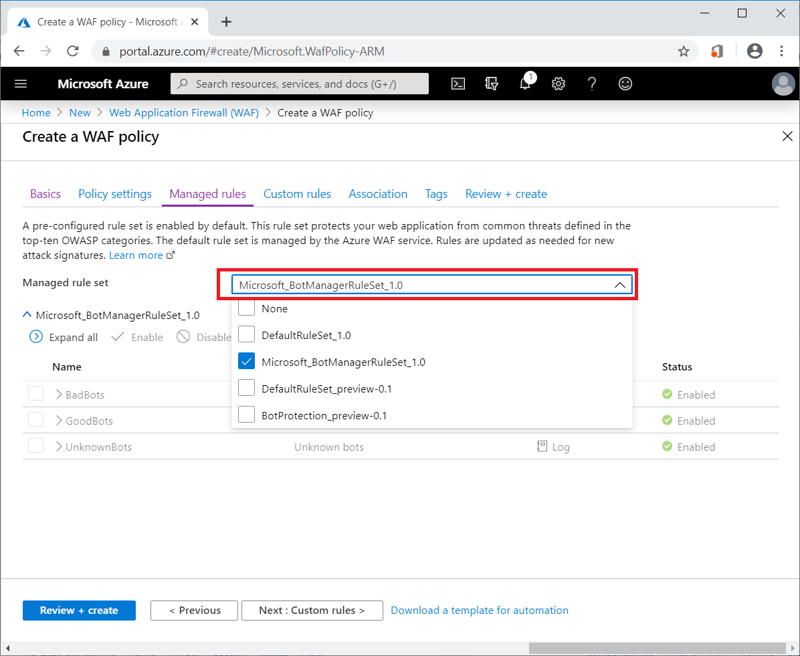

# Configure bot protection for Web Application Firewall

Azure WAF for Front Door provides bot rules to identify good bots and protect from bad bots. This article shows you how to configure bot protection rule in Azure Web Application Firewall (WAF) for Front Door by using Azure portal. Bot protection rule can also be configured using CLI, Azure PowerShell, or Azure Resource Manager template.

## Prerequisites

Create a basic WAF policy for Front Door by following the instructions described in [Create a WAF policy for Azure Front Door by using the Azure portal](waf-front-door-create-portal.md).

## Enable bot protection rule set

In the **Managed Rules** page when creating a Web Application Firewall policy, first find **Managed rule set** section, select the check box in front of the rule **Microsoft_BotManager_1.0** from the drop-down menu, and then select **Review + Create**.

   

## Next steps

- Learn how to [monitor WAF](waf-front-door-monitor.md).
