# Tune Azure Web Application Firewall for Azure Front Door

The Microsoft-managed default rule set is based on the [OWASP Core Rule Set](https://github.com/SpiderLabs/owasp-modsecurity-crs/tree/v3.1/dev) and includes Microsoft Threat Intelligence collection rules.

It's often expected that web application firewall (WAF) rules must be tuned to suit the specific needs of the application or organization that's using the WAF. Organizations commonly achieve tuning by taking one of the following actions:

- Defining rule exclusions.
- Creating custom rules.
- Disabling rules that might be causing issues or false positives.

This article describes what you can do if requests that should pass through your WAF are blocked.

> [!NOTE]
> The Microsoft-managed rule set isn't available for the Azure Front Door Standard SKU. For more information about the different tier SKUs, see [Feature comparison between tiers](../../frontdoor/standard-premium/tier-comparison.md#feature-comparison-between-tiers).

Read the [Azure Front Door WAF overview](afds-overview.md) and the [WAF Policy for Azure Front Door](waf-front-door-create-portal.md) documents. Also, enable [WAF monitoring and logging](waf-front-door-monitor.md). These articles explain how the WAF functions, how the WAF rule sets work, and how to access WAF logs.

## Understand WAF logs

The purpose of WAF logs is to show every request that's matched or blocked by the WAF. It's a collection of all evaluated requests that are matched or blocked. If you notice that the WAF blocks a request that it shouldn't (a false positive), you can do a few things.

First, narrow down and find the specific request. You can [configure a custom response message](./waf-front-door-configure-custom-response-code.md) to include the `trackingReference` field to easily identify the event and perform a log query on that specific value. Look through the logs to find the specific URI, timestamp, or client IP of the request. When you find the related log entries, you can act on false positives.

For example, say you have legitimate traffic that contains the string `1=1` that you want to pass through your WAF. Here's what the request looks like:

```
POST http://afdwafdemosite.azurefd.net/api/Feedbacks HTTP/1.1
Host: afdwafdemosite.azurefd.net
Content-Type: application/x-www-form-urlencoded
Content-Length: 55

UserId=20&captchaId=7&captchaId=15&comment="1=1"&rating=3
```

If you try the request, the WAF blocks traffic that contains your `1=1` string in any parameter or field. This string is often associated with a SQL injection attack. You can look through the logs and see the timestamp of the request and the rules that blocked or matched.

The following example shows a log entry that was generated based on a rule match. You can use the following Log Analytics query to find requests that were blocked within the last 24 hours.

::: zone pivot="front-door-standard-premium"

```kusto
AzureDiagnostics
| where Category == 'FrontDoorWebApplicationFirewallLog'
| where TimeGenerated > ago(1d)
| where action_s == 'Block'
```

::: zone-end

::: zone pivot="front-door-classic"

```kusto
AzureDiagnostics
| where Category == 'FrontdoorWebApplicationFirewallLog'
| where TimeGenerated > ago(1d)
| where action_s == 'Block'
```

::: zone-end

In the `requestUri` field, you can see the request was made to `/api/Feedbacks/` specifically. Going further, find the rule ID `942110` in the `ruleName` field. Knowing the rule ID, you could go to the [OWASP ModSecurity Core Rule Set official repository](https://github.com/coreruleset/coreruleset) and search by that [rule ID](https://github.com/coreruleset/coreruleset/blob/v3.1/dev/rules/REQUEST-942-APPLICATION-ATTACK-SQLI.conf) to review its code and understand exactly what this rule matches on.

Then, by checking the `action` field, you can see that this rule is set to block requests upon matching. You can confirm that the request was blocked by the WAF because the `policyMode` is set to `prevention`.

Now, check the information in the `details` field. This field is where you can see the `matchVariableName` and the `matchVariableValue` information. This rule was triggered because someone input `1=1` in the `comment` field of the web app.

::: zone pivot="front-door-standard-premium"

```json
{
    "time": "2020-09-24T16:43:04.5422943Z",
    "resourceId": "/SUBSCRIPTIONS/<Subscription ID>/RESOURCEGROUPS/<Resource Group Name>/PROVIDERS/MICROSOFT.CDN/PROFILES/AFDWAFDEMOSITE",
    "category": "FrontDoorWebApplicationFirewallLog",
    "operationName": "Microsoft.Cdn/Profiles/WebApplicationFirewallLog/Write",
    "properties": {
        "clientIP": "1.1.1.1",
        "clientPort": "53566",
        "socketIP": "1.1.1.1",
        "requestUri": "http://afdwafdemosite.azurefd.net:80/api/Feedbacks/",
        "ruleName": "DefaultRuleSet-1.0-SQLI-942110",
        "policy": "AFDWAFDemoPolicy",
        "action": "Block",
        "host": "afdwafdemosite.azurefd.net",
        "trackingReference": "0mMxsXwAAAABEalekYeI4S55qpi5R7R0/V1NURURHRTA4MTIAZGI4NGQzZDgtNWQ5Ny00ZWRkLTg2ZGYtZDJjNThlMzI2N2I4",
        "policyMode": "prevention",
        "details": {
            "matches": [
                {
                    "matchVariableName": "PostParamValue:comment",
                    "matchVariableValue": "\"1=1\""
                }
            ],
            "msg": "SQL Injection Attack: Common Injection Testing Detected",
            "data": "Matched Data: \"1=1\" found within PostParamValue:comment: \"1=1\""
        }
    }
}
```

::: zone-end

::: zone pivot="front-door-classic"

```json
{
    "time": "2020-09-24T16:43:04.5422943Z",
    "resourceId": "/SUBSCRIPTIONS/<Subscription ID>/RESOURCEGROUPS/<Resource Group Name>/PROVIDERS/MICROSOFT.NETWORK/FRONTDOORS/AFDWAFDEMOSITE",
    "category": "FrontdoorWebApplicationFirewallLog",
    "operationName": "Microsoft.Network/FrontDoor/WebApplicationFirewallLog/Write",
    "properties": {
        "clientIP": "1.1.1.1",
        "clientPort": "53566",
        "socketIP": "1.1.1.1",
        "requestUri": "http://afdwafdemosite.azurefd.net:80/api/Feedbacks/",
        "ruleName": "DefaultRuleSet-1.0-SQLI-942110",
        "policy": "AFDWAFDemoPolicy",
        "action": "Block",
        "host": "afdwafdemosite.azurefd.net",
        "trackingReference": "0mMxsXwAAAABEalekYeI4S55qpi5R7R0/V1NURURHRTA4MTIAZGI4NGQzZDgtNWQ5Ny00ZWRkLTg2ZGYtZDJjNThlMzI2N2I4",
        "policyMode": "prevention",
        "details": {
            "matches": [
                {
                    "matchVariableName": "PostParamValue:comment",
                    "matchVariableValue": "\"1=1\""
                }
            ],
            "msg": "SQL Injection Attack: Common Injection Testing Detected",
            "data": "Matched Data: \"1=1\" found within PostParamValue:comment: \"1=1\""
        }
    }
}
```

::: zone-end

There's also value in checking the access logs to expand your knowledge about a given WAF event. Next, review the log that was generated as a response to the preceding event.

You can see these logs are related because the `trackingReference` value is the same. Among various fields that provide general insight, such as `userAgent` and `clientIP`, notice the `httpStatusCode` and `httpStatusDetails` fields. Here, you can see that the client received an HTTP 403 response, which confirms that this request was denied and blocked.

::: zone pivot="front-door-standard-premium"

```json
{
    "time": "2020-09-24T16:43:04.5430764Z",
    "resourceId": "/SUBSCRIPTIONS/<Subscription ID>/RESOURCEGROUPS/<Resource Group Name>/PROVIDERS/MICROSOFT.CDN/PROFILES/AFDWAFDEMOSITE",
    "category": "FrontDoorAccessLog",
    "operationName": "Microsoft.Cdn/Profiles/AccessLog/Write",
    "properties": {
        "trackingReference": "0mMxsXwAAAABEalekYeI4S55qpi5R7R0/V1NURURHRTA4MTIAZGI4NGQzZDgtNWQ5Ny00ZWRkLTg2ZGYtZDJjNThlMzI2N2I4",
        "httpMethod": "POST",
        "httpVersion": "1.1",
        "requestUri": "http://afdwafdemosite.azurefd.net:80/api/Feedbacks/",
        "requestBytes": "2160",
        "responseBytes": "324",
        "userAgent": "Mozilla/5.0 (Windows NT 10.0; Win64; x64) AppleWebKit/537.36 (KHTML, like Gecko) Chrome/85.0.4183.83 Safari/537.36",
        "clientIp": "1.1.1.1",
        "socketIp": "1.1.1.1",
        "clientPort": "53566",
        "timeToFirstByte": "0.01",
        "timeTaken": "0.011",
        "securityProtocol": "",
        "routingRuleName": "DemoBERoutingRule",
        "rulesEngineMatchNames": [],
        "backendHostname": "13.88.65.130:3000",
        "isReceivedFromClient": true,
        "httpStatusCode": "403",
        "httpStatusDetails": "403",
        "pop": "WST",
        "cacheStatus": "CONFIG_NOCACHE"
    }
}
```

::: zone-end

::: zone pivot="front-door-classic"

```json
{
    "time": "2020-09-24T16:43:04.5430764Z",
    "resourceId": "/SUBSCRIPTIONS/<Subscription ID>/RESOURCEGROUPS/<Resource Group Name>/PROVIDERS/MICROSOFT.NETWORK/FRONTDOORS/AFDWAFDEMOSITE",
    "category": "FrontdoorAccessLog",
    "operationName": "Microsoft.Network/FrontDoor/AccessLog/Write",
    "properties": {
        "trackingReference": "0mMxsXwAAAABEalekYeI4S55qpi5R7R0/V1NURURHRTA4MTIAZGI4NGQzZDgtNWQ5Ny00ZWRkLTg2ZGYtZDJjNThlMzI2N2I4",
        "httpMethod": "POST",
        "httpVersion": "1.1",
        "requestUri": "http://afdwafdemosite.azurefd.net:80/api/Feedbacks/",
        "requestBytes": "2160",
        "responseBytes": "324",
        "userAgent": "Mozilla/5.0 (Windows NT 10.0; Win64; x64) AppleWebKit/537.36 (KHTML, like Gecko) Chrome/85.0.4183.83 Safari/537.36",
        "clientIp": "1.1.1.1",
        "socketIp": "1.1.1.1",
        "clientPort": "53566",
        "timeToFirstByte": "0.01",
        "timeTaken": "0.011",
        "securityProtocol": "",
        "routingRuleName": "DemoBERoutingRule",
        "rulesEngineMatchNames": [],
        "backendHostname": "13.88.65.130:3000",
        "isReceivedFromClient": true,
        "httpStatusCode": "403",
        "httpStatusDetails": "403",
        "pop": "WST",
        "cacheStatus": "CONFIG_NOCACHE"
    }
}
```

::: zone-end

## Resolve false positives

To make an informed decision about handling a false positive, it's important to familiarize yourself with the technologies your application uses. For example, say there isn't a SQL server in your technology stack, and you're getting false positives related to those rules. Disabling those rules doesn't necessarily weaken your security.

With this information, and the knowledge that rule 942110 is the one that matched the `1=1` string in the example, you can do a few things to stop this legitimate request from being blocked:

* **Use exclusion lists.** For more information about exclusion lists, see [Azure Web Application Firewall with Azure Front Door exclusion lists](waf-front-door-exclusion.md).
* **Change WAF actions.** For more information about what actions can be taken when a request matches a rule's conditions, see [WAF Actions](afds-overview.md#waf-actions).
* **Use custom rules.** For more information about custom rules, see [Custom rules for Azure Web Application Firewall with Azure Front Door](waf-front-door-custom-rules.md).
* **Disable rules.**

> [!TIP]
> When you select an approach to allow legitimate requests through the WAF, try to make it as narrow as you can. For example, it's better to use an exclusion list than to disable a rule entirely.

### Use exclusion lists

One benefit of using an exclusion list is that only the match variable you select to exclude will be no longer inspected for that given request. That is, you can choose between specific request headers, request cookies, query string arguments, or request body post arguments to be excluded if a certain condition is met, as opposed to excluding the whole request from being inspected. The other nonspecified variables of the request are inspected normally.

Exclusions are a global setting. The configured exclusion applies to all traffic that passes through your WAF, not just a specific web app or URI. For example, this could be a concern if `1=1` is a valid request in the body for a certain web app, but not for others under the same WAF policy.

If it makes sense to use different exclusion lists for different applications, consider using different WAF policies for each application and applying them to each application's front end.

When you configure exclusion lists for managed rules, you can choose to exclude:

- All rules within a rule set.
- All rules within a rule group.
- An individual rule.

You can configure an exclusion list by using [PowerShell](/powershell/module/az.frontdoor/New-AzFrontDoorWafManagedRuleExclusionObject), the [Azure CLI](/cli/azure/network/front-door/waf-policy/managed-rules/exclusion), the [REST API](/rest/api/frontdoorservice/webapplicationfirewall/policies/createorupdate), Bicep, Azure Resource Manager templates, or the Azure portal.

* **Exclusions at a rule level:** Applying exclusions at a rule level means that the specified exclusions won't be analyzed against that individual rule only. It will still be analyzed by all other rules in the rule set. This is the most granular level for exclusions. You can use it to fine-tune the managed rule set based on the information you find in the WAF logs when you troubleshoot an event.
* **Exclusions at a rule group level:** Applying exclusions at a rule group level means that the specified exclusions won't be analyzed against that specific set of rule types. For example, selecting **SQLI** as an excluded rule group indicates the defined request exclusions won't be inspected by any of the SQLI-specific rules. It will still be inspected by rules in other groups, such as **PHP**, **RFI**, or **XSS**. This type of exclusion can be useful when you're sure the application isn't susceptible to specific types of attacks. For example, an application that doesn't have any SQL databases could have all SQLI rules excluded without it being detrimental to its security level.
* **Exclusions at a rule set level:** Applying exclusions at a rule set level means that the specified exclusions won't be analyzed against any of the security rules available in that rule set. This exclusion is comprehensive, so use it carefully.

In this example, you perform an exclusion at the most granular level by applying an exclusion to a single rule. You want to exclude the match variable **Request body post args name** that contains `comment`. You can see the match variable details in the firewall log: `"matchVariableName": "PostParamValue:comment"`. The attribute is `comment`. You can also find this attribute name a few other ways. For more information, see [Find request attribute names](#find-request-attribute-names).

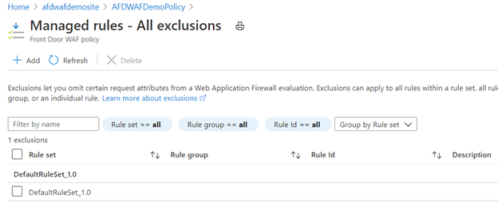

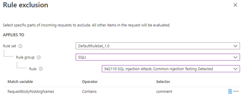

Occasionally, there are cases where specific parameters get passed into the WAF in a manner that might not be intuitive. For example, a token gets passed when you authenticate by using Azure Active Directory (Azure AD). The token `__RequestVerificationToken` usually gets passed in as a request cookie.

In some cases where cookies are disabled, this token is also passed in as a request post argument. For this reason, to address Azure AD token false positives, you must ensure that `__RequestVerificationToken` is added to the exclusion list for both `RequestCookieNames` and `RequestBodyPostArgsNames`.

Exclusions on a field name (**Selector**) means that the value will no longer be evaluated by the WAF. The field name itself continues to be evaluated and in rare cases it might match a WAF rule and trigger an action.

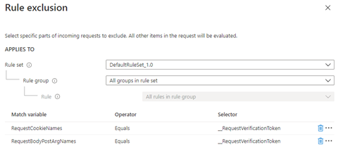

### Change WAF actions

Another way to handle the behavior of WAF rules is by choosing the action it takes when a request matches a rule's conditions. The available actions are [Allow, Block, Log, and Redirect](afds-overview.md#waf-actions).

In this example, the default action **Block** changed to the **Log** action on rule 942110. This action causes the WAF to log the request and continue evaluating the same request against the remaining lower priority rules.

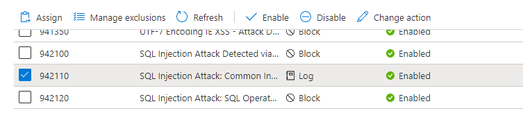

After you perform the same request, you can refer back to the logs and see that this request was a match on rule ID 942110. The `action_s` field now indicates **Log** instead of **Block**. The log query was then expanded to include the `trackingReference_s` information to see what else happened with this request.

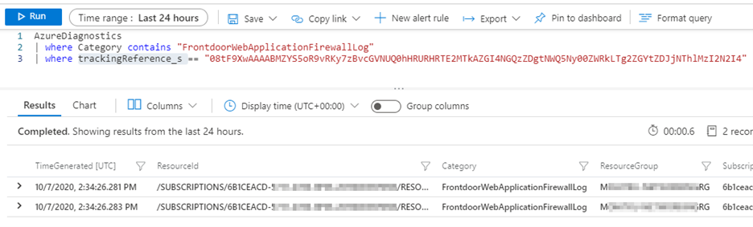

Now you can see a different SQLI rule match that occurs milliseconds after rule ID 942110 was processed. The same request matched on rule ID 942310, and this time the default action **Block** was triggered.

Another advantage of using the **Log** action during WAF tuning or troubleshooting is that you can identify if multiple rules within a specific rule group are matching and blocking a given request. You can then create your exclusions at the appropriate level, that is, at the rule or rule group level.

### Use custom rules

After you identify what's causing a WAF rule match, you can use custom rules to adjust how the WAF responds to the event. Custom rules are processed before managed rules. They can contain more than one condition, and their actions can be [Allow, Deny, Log, or Redirect](afds-overview.md#waf-actions).

> [!WARNING]
> When a request matches a custom rule, the WAF engine stops processing the request. Managed rules won't be processed for this request and neither will other custom rules with a lower priority.

The following example shows a custom rule with two conditions. The first condition looks for the `comment` value in the request body. The second condition looks for the `/api/Feedbacks/` value in the request URI.

By using a custom rule, you can be the most granular so that you can fine-tune your WAF rules and deal with false positives. In this case, you're not taking action only based on the `comment` request body value, which could exist across multiple sites or apps under the same WAF policy.

When you include another condition to also match on a particular request URI `/api/Feedbacks/`, you ensure this custom rule truly applies to this explicit use case that you vetted out. In this way, the same attack, if performed against different conditions, is still inspected and prevented by the WAF engine.

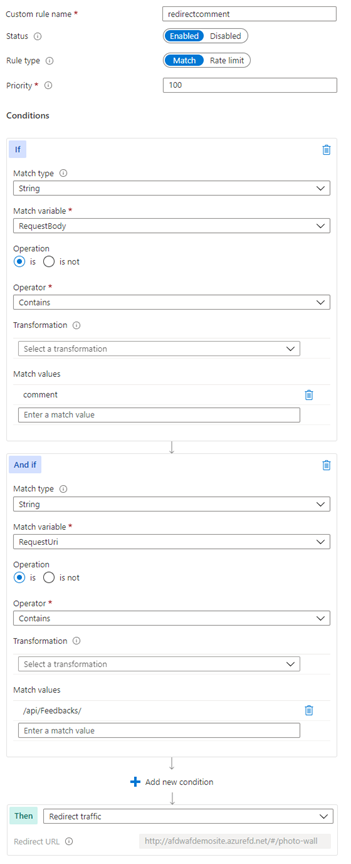

When you explore the log, you can see that the `ruleName_s` field contains the name given to the custom rule  `redirectcomment`. In the `action_s` field, you can see that the **Redirect** action was taken for this event. In the `details_matches_s` field, you can see the details for both conditions were matched.

### Disable rules

Another way to get around a false positive is to disable the rule that matched the input the WAF thought was malicious. Because you parsed the WAF logs and narrowed the rule down to 942110, you can disable it in the Azure portal. For more information, see [Customize Azure Web Application Firewall rules by using the Azure portal](../ag/application-gateway-customize-waf-rules-portal.md#disable-rule-groups-and-rules).

Disabling a rule is a benefit when you're sure that all requests meeting that specific condition are legitimate requests, or when you're sure the rule doesn't apply to your environment (such as disabling a SQL injection rule because you have non-SQL back ends).

Disabling a rule is a global setting that applies to all front-end hosts associated to the WAF policy. When you choose to disable a rule, you might be leaving vulnerabilities exposed without protection or detection for any other front-end hosts associated to the WAF policy.

If you want to use Azure PowerShell to disable a managed rule, see the [`PSAzureManagedRuleOverride`](/powershell/module/az.frontdoor/new-azfrontdoorwafmanagedruleoverrideobject) object documentation. If you want to use the Azure CLI, see the [`az network front-door waf-policy managed-rules override`](/cli/azure/network/front-door/waf-policy/managed-rules/override) documentation.

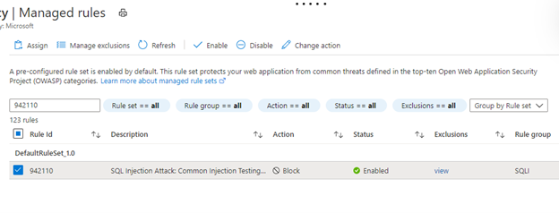

> [!TIP]
> Document any changes you make to your WAF policy. Include example requests to illustrate the false positive detection. Explain why you added a custom rule, disabled a rule or rule set, or added an exception. If you redesign your application in the future, you might need to verify that your changes are still valid. Or you might be audited or need to justify why you reconfigured the WAF policy from its default settings.

## Find request fields

By using a browser proxy like [Fiddler](https://www.telerik.com/fiddler), you can inspect individual requests and determine what specific fields of a webpage are called. This technique is helpful when you need to exclude certain fields from inspection by using exclusion lists in the WAF.

### Find request attribute names

In this example, the field where the `1=1` string was entered is called `comment`. This data was passed in the body of a POST request.

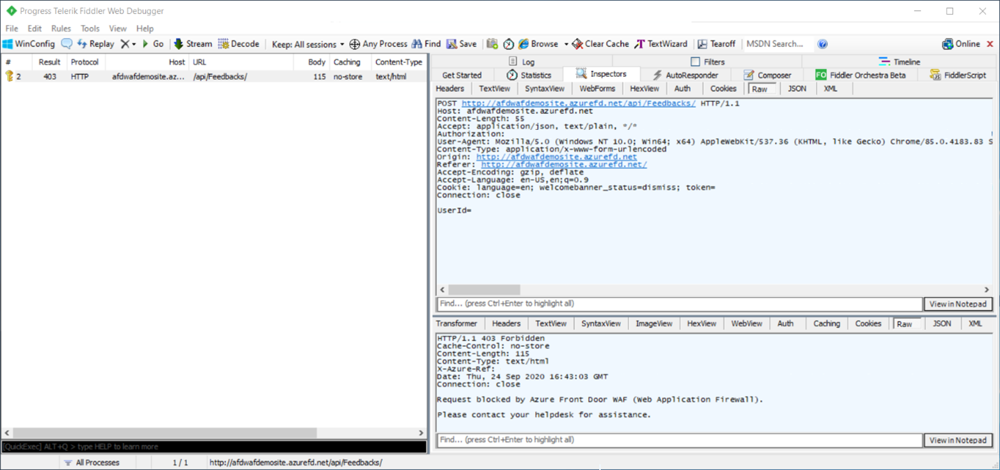

You can exclude this field. To learn more about exclusion lists, see [Web application firewall exclusion lists](./waf-front-door-exclusion.md). You can exclude the evaluation in this case by configuring the following exclusion:

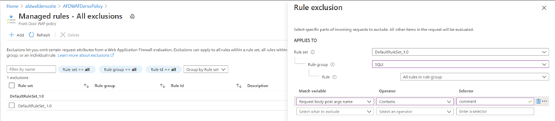

You can also examine the firewall logs to get the information to see what you need to add to the exclusion list. To enable logging, see [Monitor metrics and logs in Azure Front Door](./waf-front-door-monitor.md).

::: zone pivot="front-door-standard-premium"

Examine the firewall log in the `PT1H.json` file for the hour that the request you want to inspect occurred. The `PT1H.json` files are available in the storage account containers where the `FrontDoorWebApplicationFirewallLog` and the `FrontDoorAccessLog` diagnostic logs are stored.

::: zone-end

::: zone pivot="front-door-classic"

Examine the firewall log in the `PT1H.json` file for the hour that the request you want to inspect occurred. The `PT1H.json` files are available in the storage account containers where the `FrontdoorWebApplicationFirewallLog` and the `FrontdoorAccessLog` diagnostic logs are stored.

::: zone-end

In this example, you can see the rule that blocked the request (with the same Transaction Reference) and that occurred at the same time.

::: zone pivot="front-door-standard-premium"

```json
{
    "time": "2020-09-24T16:43:04.5422943Z",
    "resourceId": "/SUBSCRIPTIONS/<Subscription ID>/RESOURCEGROUPS/<Resource Group Name>/PROVIDERS/MICROSOFT.CDN/PROFILES/AFDWAFDEMOSITE",
    "category": "FrontDoorWebApplicationFirewallLog",
    "operationName": "Microsoft.Cdn/Profiles/WebApplicationFirewallLog/Write",
    "properties": {
        "clientIP": "1.1.1.1",
        "clientPort": "53566",
        "socketIP": "1.1.1.1",
        "requestUri": "http://afdwafdemosite.azurefd.net:80/api/Feedbacks/",
        "ruleName": "DefaultRuleSet-1.0-SQLI-942110",
        "policy": "AFDWAFDemoPolicy",
        "action": "Block",
        "host": "afdwafdemosite.azurefd.net",
        "trackingReference": "0mMxsXwAAAABEalekYeI4S55qpi5R7R0/V1NURURHRTA4MTIAZGI4NGQzZDgtNWQ5Ny00ZWRkLTg2ZGYtZDJjNThlMzI2N2I4",
        "policyMode": "prevention",
        "details": {
            "matches": [
                {
                    "matchVariableName": "PostParamValue:comment",
                    "matchVariableValue": "\"1=1\""
                }
            ],
            "msg": "SQL Injection Attack: Common Injection Testing Detected",
            "data": "Matched Data: \"1=1\" found within PostParamValue:comment: \"1=1\""
        }
    }
}
```

::: zone-end

::: zone pivot="front-door-classic"

```json
{
    "time": "2020-09-24T16:43:04.5422943Z",
    "resourceId": "/SUBSCRIPTIONS/<Subscription ID>/RESOURCEGROUPS/<Resource Group Name>/PROVIDERS/MICROSOFT.NETWORK/FRONTDOORS/AFDWAFDEMOSITE",
    "category": "FrontdoorWebApplicationFirewallLog",
    "operationName": "Microsoft.Network/FrontDoor/WebApplicationFirewallLog/Write",
    "properties": {
        "clientIP": "1.1.1.1",
        "clientPort": "53566",
        "socketIP": "1.1.1.1",
        "requestUri": "http://afdwafdemosite.azurefd.net:80/api/Feedbacks/",
        "ruleName": "DefaultRuleSet-1.0-SQLI-942110",
        "policy": "AFDWAFDemoPolicy",
        "action": "Block",
        "host": "afdwafdemosite.azurefd.net",
        "trackingReference": "0mMxsXwAAAABEalekYeI4S55qpi5R7R0/V1NURURHRTA4MTIAZGI4NGQzZDgtNWQ5Ny00ZWRkLTg2ZGYtZDJjNThlMzI2N2I4",
        "policyMode": "prevention",
        "details": {
            "matches": [
                {
                    "matchVariableName": "PostParamValue:comment",
                    "matchVariableValue": "\"1=1\""
                }
            ],
            "msg": "SQL Injection Attack: Common Injection Testing Detected",
            "data": "Matched Data: \"1=1\" found within PostParamValue:comment: \"1=1\""
        }
    }
}
```

::: zone-end

With your knowledge of how the Azure-managed rule sets work, you know that the rule with the `action: Block` property is blocking based on the data matched in the request body. (For more information, see [Azure Web Application Firewall in Azure Front Door](afds-overview.md).) You can see in the details that it matched a pattern (`1=1`) and the field is named `comment`. Follow the same previous steps to exclude the request body post args name that contains `comment`.

### Find request header names

Fiddler is a useful tool to find request header names. The following screenshot shows the headers for this GET request, which include `Content-Type` and `User-Agent`. You can also use request headers to create exclusions and custom rules in the WAF.

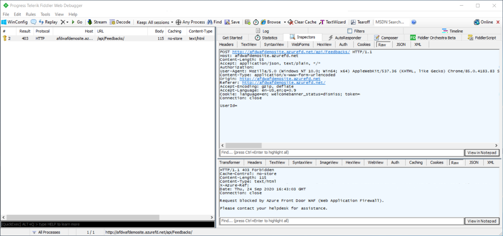

Another way to view request and response headers is to look inside the developer tools of your browser, such as Microsoft Edge or Chrome. You can select F12 or right-click **Inspect** > **Developer Tools**. Select the **Network** tab. Load a webpage and select the request you want to inspect.

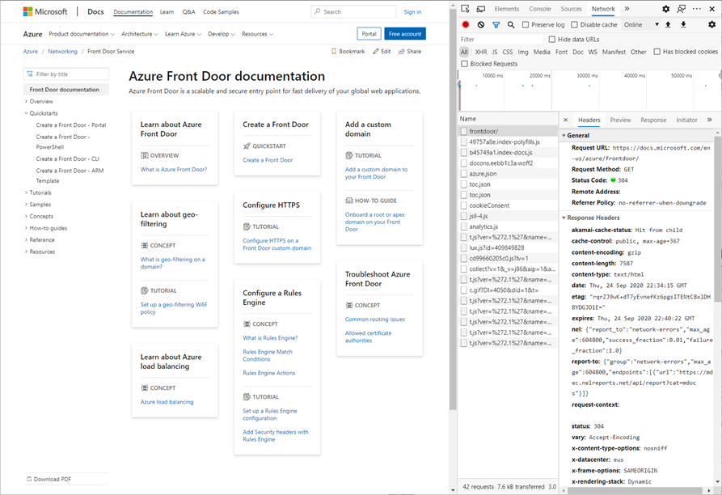

### Find request cookie names

If the request contains cookies, select the **Cookies** tab to view them in Fiddler. Cookie information can also be used to create exclusions or custom rules in the WAF.

## Anomaly scoring rule

If you see rule ID 949110 during the process of tuning your WAF, its presence indicates that the request was blocked by the [anomaly scoring](waf-front-door-drs.md#anomaly-scoring-mode) process.

Review the other WAF log entries for the same request by searching for the log entries with the same tracking reference. Look at each of the rules that were triggered. Tune each rule by following the guidance in this article.

## Next steps

- Learn about [Azure Web Application Firewall](../overview.md).
- Learn how to [create an instance of Azure Front Door](../../frontdoor/quickstart-create-front-door.md).
