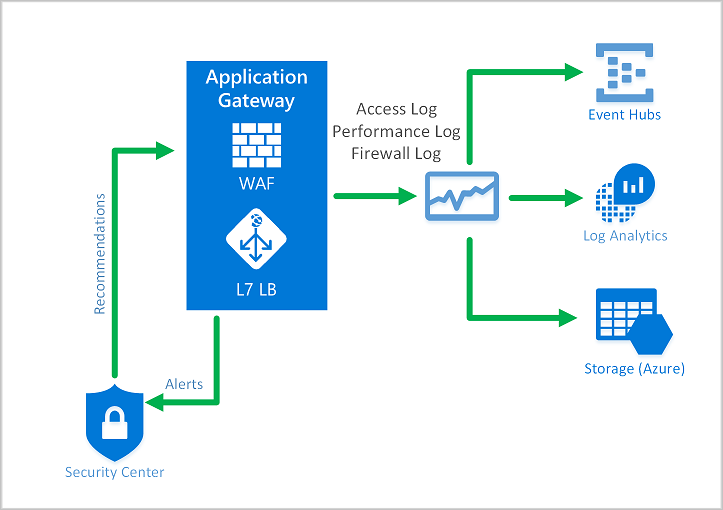
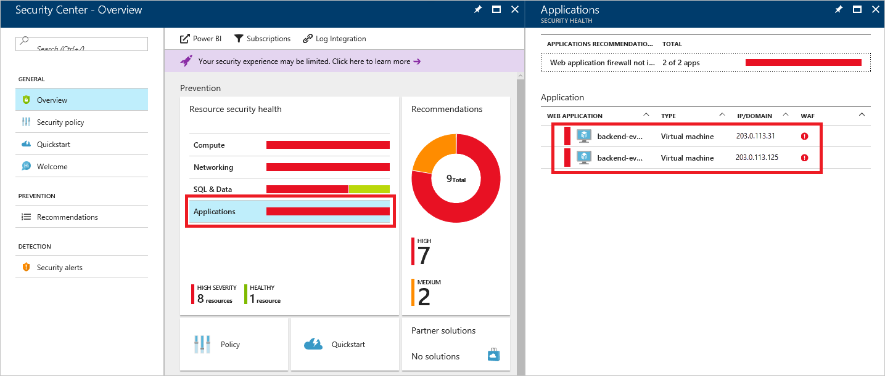
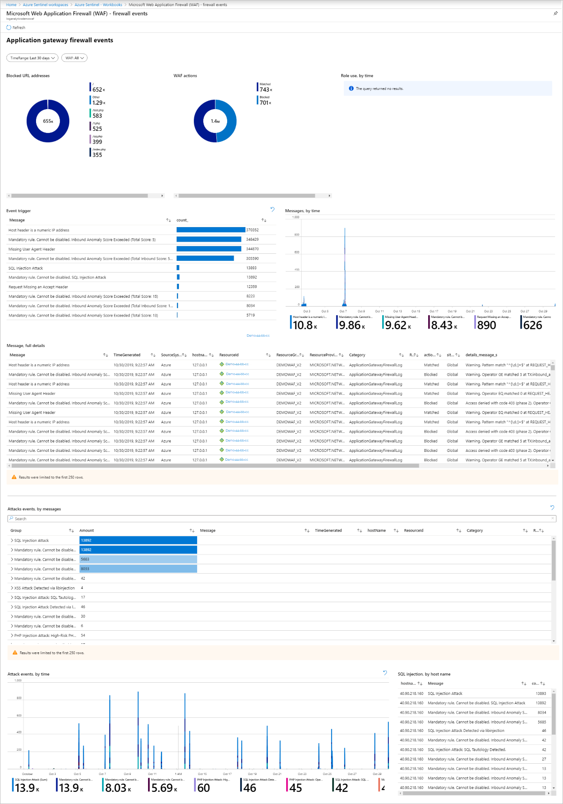

# Azure Web Application Firewall on Azure Application Gateway

Azure Web Application Firewall (WAF) on Azure Application Gateway provides centralized protection of your web applications from common exploits and vulnerabilities. Web applications are increasingly targeted by malicious attacks that exploit commonly known vulnerabilities. SQL injection and cross-site scripting are among the most common attacks.

WAF on Application Gateway is based on [Core Rule Set (CRS)](https://www.owasp.org/index.php/Category:OWASP_ModSecurity_Core_Rule_Set_Project) 3.1, 3.0, or 2.2.9 from the Open Web Application Security Project (OWASP). The WAF automatically updates to include protection against new vulnerabilities, with no additional configuration needed. 

All of the WAF features listed below exist inside of a WAF Policy. You can create multiple policies, and they can be associated with an Application Gateway, to individual listeners, or to path-based routing rules on an Application Gateway. This way, you can have separate policies for each site behind your Application Gateway if needed. For more information on WAF Policies, see [Create a WAF Policy](create-waf-policy-ag.md).

   > [!NOTE]
   > Per-site and per-URI WAF Policies are in Public Preview. That means this feature is subject to Microsoft's Supplemental Terms of Use. For more information, see [Supplemental Terms of Use for Microsoft Azure Previews](https://azure.microsoft.com/support/legal/preview-supplemental-terms/).


Application Gateway operates as an application delivery controller (ADC). It offers Transport Layer Security (TLS), previously known as Secure Sockets Layer (SSL), termination, cookie-based session affinity, round-robin load distribution, content-based routing, ability to host multiple websites, and security enhancements.

Application Gateway security enhancements include TLS policy management and end-to-end TLS support. Application security is strengthened by WAF integration into Application Gateway. The combination protects your web applications against common vulnerabilities. And it provides an easy-to-configure central location to manage.

## Benefits

This section describes the core benefits that WAF on Application Gateway provides.

### Protection

* Protect your web applications from web vulnerabilities and attacks without modification to back-end code.

* Protect multiple web applications at the same time. An instance of Application Gateway can host up to 40 websites that are protected by a web application firewall.

* Create custom WAF policies for different sites behind the same WAF 

* Protect your web applications from malicious bots with the IP Reputation ruleset (preview)

### Monitoring

* Monitor attacks against your web applications by using a real-time WAF log. The log is integrated with [Azure Monitor](../../azure-monitor/overview.md) to track WAF alerts and easily monitor trends.

* The Application Gateway WAF is integrated with Azure Security Center. Security Center provides a central view of the security state of all your Azure resources.

### Customization

* Customize WAF rules and rule groups to suit your application requirements and eliminate false positives.

* Associate a WAF Policy for each site behind your WAF to allow for site-specific configuration

* Create custom rules to suit the needs of your application

## Features

- SQL-injection protection.
- Cross-site scripting protection.
- Protection against other common web attacks, such as command injection, HTTP request smuggling, HTTP response splitting, and remote file inclusion.
- Protection against HTTP protocol violations.
- Protection against HTTP protocol anomalies, such as missing host user-agent and accept headers.
- Protection against crawlers and scanners.
- Detection of common application misconfigurations (for example, Apache and IIS).
- Configurable request size limits with lower and upper bounds.
- Exclusion lists let you omit certain request attributes from a WAF evaluation. A common example is Active Directory-inserted tokens that are used for authentication or password fields.
- Create custom rules to suit the specific needs of your applications.
- Geo-filter traffic to allow or block certain countries/regions from gaining access to your applications. (preview)
- Protect your applications from bots with the bot mitigation ruleset. (preview)

## WAF Policy

To enable a Web Application Firewall on an Application Gateway, you must create a WAF Policy. This Policy is where all of the managed rules, custom rules, exclusions, and other customizations such as file upload limit exist. 

### Core rule sets

Application Gateway supports three rule sets: CRS 3.1, CRS 3.0, and CRS 2.2.9. These rules protect your web applications from malicious activity.

For more information, see [Web application firewall CRS rule groups and rules](application-gateway-crs-rulegroups-rules.md).

### Custom rules

Application Gateway also supports custom rules. With custom rules, you can create your own rules, which are evaluated for each request that passes through WAF. These rules hold a higher priority than the rest of the rules in the managed rule sets. If a set of conditions is met, an action is taken to allow or block. 

The geomatch operator is now available in public preview for custom rules. Please see [geomatch custom rules](custom-waf-rules-overview.md#geomatch-custom-rules-preview) for more information.

> [!NOTE]
> The geomatch operator for custom rules is currently in public preview and is provided with a preview service level agreement. Certain features may not be supported or may have constrained capabilities. See the [Supplemental Terms of Use for Microsoft Azure Previews](https://azure.microsoft.com/support/legal/preview-supplemental-terms/) for details.

For more information on custom rules, see [Custom Rules for Application Gateway.](custom-waf-rules-overview.md)

### Bot Mitigation (preview)

A managed Bot protection rule set can be enabled for your WAF to block or log requests from known malicious IP addresses, alongside the managed ruleset. The IP addresses are sourced from the Microsoft Threat Intelligence feed. Intelligent Security Graph powers Microsoft threat intelligence and is used by multiple services including Azure Security Center.

> [!NOTE]
> Bot protection rule set is currently in public preview and is provided with a preview service level agreement. Certain features may not be supported or may have constrained capabilities. See the [Supplemental Terms of Use for Microsoft Azure Previews](https://azure.microsoft.com/support/legal/preview-supplemental-terms/) for details.

If Bot Protection is enabled, incoming requests that match Malicious Bot's client IPs are logged in the Firewall log, see more information below. You may access WAF logs from storage account, event hub, or log analytics. 

### WAF modes

The Application Gateway WAF can be configured to run in the following two modes:

* **Detection mode**: Monitors and logs all threat alerts. You turn on logging diagnostics for Application Gateway in the **Diagnostics** section. You must also make sure that the WAF log is selected and turned on. Web application firewall doesn't block incoming requests when it's operating in Detection mode.
* **Prevention mode**: Blocks intrusions and attacks that the rules detect. The attacker receives a "403 unauthorized access" exception, and the connection is closed. Prevention mode records such attacks in the WAF logs.

> [!NOTE]
> It is recommended that you run a newly deployed WAF in Detection mode for a short period of time in a production environment. This provides the opportunity to obtain [firewall logs](../../application-gateway/application-gateway-diagnostics.md#firewall-log) and update any exceptions or [custom rules](./custom-waf-rules-overview.md) prior to transition to Prevention mode. This can help reduce the occurrence of unexpected blocked traffic.

### Anomaly Scoring mode

OWASP has two modes for deciding whether to block traffic: Traditional mode and Anomaly Scoring mode.

In Traditional mode, traffic that matches any rule is considered independently of any other rule matches. This mode is easy to understand. But the lack of information about how many rules match a specific request is a limitation. So, Anomaly Scoring mode was introduced. It's the default for OWASP 3.*x*.

In Anomaly Scoring mode, traffic that matches any rule isn't immediately blocked when the firewall is in Prevention mode. Rules have a certain severity: *Critical*, *Error*, *Warning*, or *Notice*. That severity affects a numeric value for the request, which is called the Anomaly Score. For example, one *Warning* rule match contributes 3 to the score. One *Critical* rule match contributes 5.

|Severity  |Value  |
|---------|---------|
|Critical     |5|
|Error        |4|
|Warning      |3|
|Notice       |2|

There's a threshold of 5 for the Anomaly Score to block traffic. So, a single *Critical* rule match is enough for the Application Gateway WAF to block a request, even in Prevention mode. But one *Warning* rule match only increases the Anomaly Score by 3, which isn't enough by itself to block the traffic.

> [!NOTE]
> The message that's logged when a WAF rule matches traffic includes the action value "Blocked." But the traffic is actually only blocked for an Anomaly Score of 5 or higher.  

### WAF monitoring

Monitoring the health of your application gateway is important. Monitoring the health of your WAF and the applications that it protects are supported by integration with Azure Security Center, Azure Monitor, and Azure Monitor logs.



#### Azure Monitor

Application Gateway logs are integrated with [Azure Monitor](../../azure-monitor/overview.md). This allows you to track diagnostic information, including WAF alerts and logs. You can access this capability on the **Diagnostics** tab in the Application Gateway resource in the portal or directly through Azure Monitor. To learn more about enabling logs, see [Application Gateway diagnostics](../../application-gateway/application-gateway-diagnostics.md).

#### Azure Security Center

[Security Center](../../security-center/security-center-intro.md) helps you prevent, detect, and respond to threats. It provides increased visibility into and control over the security of your Azure resources. Application Gateway is [integrated with Security Center](../../application-gateway/application-gateway-integration-security-center.md). Security Center scans your environment to detect unprotected web applications. It can recommend Application Gateway WAF to protect these vulnerable resources. You create the firewalls directly from Security Center. These WAF instances are integrated with Security Center. They send alerts and health information to Security Center for reporting.



#### Azure Sentinel

Microsoft Azure Sentinel is a scalable, cloud-native, security information event management (SIEM) and security orchestration automated response (SOAR) solution. Azure Sentinel delivers intelligent security analytics and threat intelligence across the enterprise, providing a single solution for alert detection, threat visibility, proactive hunting, and threat response.

With the built-in Azure WAF firewall events workbook, you can get an overview of the security events on your WAF. This includes events, matched and blocked rules, and everything else that gets logged in the firewall logs. See more on logging below. 




#### Logging

Application Gateway WAF provides detailed reporting on each threat that it detects. Logging is integrated with Azure Diagnostics logs. Alerts are recorded in the .json format. These logs can be integrated with [Azure Monitor logs](../../azure-monitor/insights/azure-networking-analytics.md).


```json
{
  "resourceId": "/SUBSCRIPTIONS/{subscriptionId}/RESOURCEGROUPS/{resourceGroupId}/PROVIDERS/MICROSOFT.NETWORK/APPLICATIONGATEWAYS/{appGatewayName}",
  "operationName": "ApplicationGatewayFirewall",
  "time": "2017-03-20T15:52:09.1494499Z",
  "category": "ApplicationGatewayFirewallLog",
  "properties": {
    {
      "instanceId": "ApplicationGatewayRole_IN_0",
      "clientIp": "52.161.109.145",
      "clientPort": "0",
      "requestUri": "/",
      "ruleSetType": "OWASP",
      "ruleSetVersion": "3.0",
      "ruleId": "920350",
      "ruleGroup": "920-PROTOCOL-ENFORCEMENT",
      "message": "Host header is a numeric IP address",
      "action": "Matched",
      "site": "Global",
      "details": {
        "message": "Warning. Pattern match \"^[\\\\d.:]+$\" at REQUEST_HEADERS:Host ....",
        "data": "127.0.0.1",
        "file": "rules/REQUEST-920-PROTOCOL-ENFORCEMENT.conf",
        "line": "791"
      },
      "hostname": "127.0.0.1",
      "transactionId": "16861477007022634343"
      "policyId": "/subscriptions/1496a758-b2ff-43ef-b738-8e9eb5161a86/resourceGroups/drewRG/providers/Microsoft.Network/ApplicationGatewayWebApplicationFirewallPolicies/globalWafPolicy",
      "policyScope": "Global",
      "policyScopeName": " Global "
    }
  }
} 

```

## Application Gateway WAF SKU pricing

The pricing models are different for the WAF_v1 and WAF_v2 SKUs. Please see the [Application Gateway pricing](https://azure.microsoft.com/pricing/details/application-gateway/) page to learn more. 

## Next steps

- Get started by [Creating a WAF policy](create-waf-policy-ag.md)
- Learn more about [WAF managed rules](application-gateway-crs-rulegroups-rules.md)
- Learn more about [Custom Rules](custom-waf-rules-overview.md)
- Learn about [Web Application Firewall on Azure Front Door](../afds/afds-overview.md)

