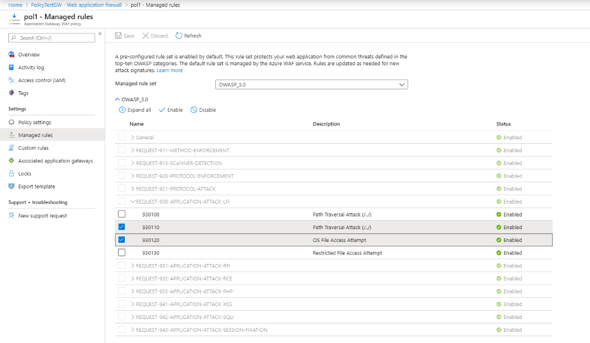

# Web Application Firewall DRS and CRS rule groups and rules

Application Gateway web application firewall (WAF) protects web applications from common vulnerabilities and exploits. Azure-managed rule sets provide an easy way to deploy protection against a common set of security threats. Since such rule sets are managed by Azure, the rules are updated as needed to protect against new attack signatures. Default rule set also includes the Microsoft Threat Intelligence Collection rules that are written in partnership with the Microsoft Intelligence team to provide increased coverage, patches for specific vulnerabilities, and better false positive reduction.

Customers also have the option of using rules that are defined based on the OWASP core rule sets 3.2, 3.1, 3.0, or 2.2.9. 

Rules can be disabled on a rule-by-rule basis, or you can set specific actions by individual rule. This article contains the current rules and rule sets offered. In the rare occasion that a published ruleset needs to be updated, it will be documented here.

> [!NOTE]
> When changing from one ruleset version to another all disabled and enabled rule settings will return to the default for the ruleset your are migrating to. This means that if you previously disabled or enabled a rule, you will need to disable or enable it again once you've moved to the new ruleset version.

## Default rule sets

The Azure-managed Default Rule Set (DRS) includes rules against the following threat categories:

-	Cross-site scripting
-	Java attacks
-	Local file inclusion
-	PHP injection attacks
-	Remote command execution
-	Remote file inclusion
-	Session fixation
-	SQL injection protection
-	Protocol attackers
The version number of the DRS increments when new attack signatures are added to the rule set.

## Microsoft Threat Intelligence Collection rules

The Microsoft Threat Intelligence Collection rules are written in partnership with the Microsoft Threat Intelligence team to provide increased coverage, patches for specific vulnerabilities, and better false positive reduction.

> [!NOTE]
> Please follow the below guidance to tune WAF while you get started with 2.1 on Application Gateway WAF. Details of the rules are as below. 

|Rule ID |Rule Group|Description  |Details|
|---------|---------|---------|---------|
|942110      |SQLI|SQL Injection Attack: Common Injection Testing Detected |Disable, Replaced by MSTIC rule 99031001 |
|942150      |SQLI|SQL Injection Attack|Disable, Replaced by MSTIC rule 99031003 |
|942260      |SQLI|Detects basic SQL authentication bypass attempts 2/3 |Disable, Replaced by MSTIC rule 99031004 |
|942430      |SQLI|Restricted SQL Character Anomaly Detection (args): # of special characters exceeded (12)|Disable, Too many false positives.|
|942440      |SQLI|SQL Comment Sequence Detected|Disable, Replaced by MSTIC rule 99031002 |
|99005006|MS-ThreatIntel-WebShells|Spring4Shell Interaction Attempt|Keep the rule enabled to prevent against SpringShell vulnerability|
|99001014|MS-ThreatIntel-CVEs|Attempted Spring Cloud routing-expression injection [CVE-2022-22963](https://www.cve.org/CVERecord?id=CVE-2022-22963)|Keep the rule enabled to prevent against SpringShell vulnerability|
|99001015|MS-ThreatIntel-WebShells|Attempted Spring Framework unsafe class object exploitation [CVE-2022-22965](https://www.cve.org/CVERecord?id=CVE-2022-22965)|Keep the rule enabled to prevent against SpringShell vulnerability|
|99001016|MS-ThreatIntel-WebShells|Attempted Spring Cloud Gateway Actuator injection [CVE-2022-22947](https://www.cve.org/CVERecord?id=CVE-2022-22947)|Keep the rule enabled to prevent against SpringShell vulnerability|

## Core rule sets

The Application Gateway WAF comes pre-configured with CRS 3.2 by default, but you can choose to use any other supported CRS version.
 
CRS 3.2 offers a new engine and new rule sets defending against Java injections, an initial set of file upload checks, and fewer false positives compared with earlier versions of CRS. You can also [customize rules to suit your needs](application-gateway-customize-waf-rules-portal.md). Learn more about the new [Azure WAF engine](waf-engine.md).

> [!div class="mx-imgBorder"]
> 

The WAF protects against the following web vulnerabilities:

- SQL-injection attacks
- Cross-site scripting attacks
- Other common attacks, such as command injection, HTTP request smuggling, HTTP response splitting, and remote file inclusion
- HTTP protocol violations
- HTTP protocol anomalies, such as missing host user-agent and accept headers
- Bots, crawlers, and scanners
- Common application misconfigurations (for example, Apache and IIS)

## Tuning of Managed rule sets

Both DRS and CRS are enabled by default in Detection mode in your WAF policies. You can disable or enable individual rules within the Managed Rule Set to meet your application requirements. You can also set specific actions per rule. The DRS/CRS supports block, log and anomaly score actions. The Bot Manager ruleset supports the allow, block and log actions.

Sometimes you might need to omit certain request attributes from a WAF evaluation. A common example is Active Directory-inserted tokens that are used for authentication. You can configure exclusions to apply when specific WAF rules are evaluated, or to apply globally to the evaluation of all WAF rules. Exclusion rules apply to your whole web application. For more information, see [Web Application Firewall (WAF) with Application Gateway exclusion lists](application-gateway-waf-configuration.md).

By default, DRS version 2.1 / CRS version 3.2 and above will leverage anomaly scoring when a request matches a rule, CRS 3.1 and below will block matching requests by default. Additionally, custom rules can be configured in the same WAF policy if you wish to bypass any of the pre-configured rules in the Core Rule Set.

Custom rules are always applied before rules in the Core Rule Set are evaluated. If a request matches a custom rule, the corresponding rule action is applied. The request is either blocked or passed through to the back-end. No other custom rules or the rules in the Core Rule Set are processed. 

### Anomaly scoring

When you use CRS or DRS 2.1 and later, your WAF is configured to use anomaly scoring by default. Traffic that matches any rule isn't immediately blocked, even when your WAF is in prevention mode. Instead, the OWASP rule sets define a severity for each rule: Critical, Error, Warning, or Notice. The severity affects a numeric value for the request, which is called the anomaly score:

| Rule severity | Value contributed to anomaly score |
|-|-|
| Critical | 5 |
| Error | 4 |
| Warning | 3 |
| Notice | 2 |

If the anomaly score is 5 or greater, and the WAF is in Prevention mode, the request is blocked. If the anomaly score is 5 or greater, and the WAF is in Detection mode, the request is logged but not blocked.

For example, a single *Critical* rule match is enough for the WAF to block a request when in Prevention mode, because the overall anomaly score is 5. However, one *Warning* rule match only increases the anomaly score by 3, which isn't enough by itself to block the traffic. When an anomaly rule is triggered, it shows a "Matched" action in the logs. If the anomaly score is 5 or greater, there is a separate rule triggered with either "Blocked" or "Detected" action depending on whether WAF policy is in Prevention or Detection mode. For more information, please see [Anomaly Scoring mode](ag-overview.md#anomaly-scoring-mode).

### DRS 2.1 

DRS 2.1 rules offer better protection than earlier versions of the DRS. It includes additional rules developed by the Microsoft Threat Intelligence team and updates to signatures to reduce false positives. It also supports transformations beyond just URL decoding.

DRS 2.1 includes 17 rule groups, as shown in the following table. Each group contains multiple rules, and you can customize behavior for individual rules, rule groups, or entire rule set.

|Rule group|Description|
|---|---|
|**[General](#general-21)**|General group|
|**[METHOD-ENFORCEMENT](#drs911-21)**|Lock-down methods (PUT, PATCH)|
|**[PROTOCOL-ENFORCEMENT](#drs920-21)**|Protect against protocol and encoding issues|
|**[PROTOCOL-ATTACK](#drs921-21)**|Protect against header injection, request smuggling, and response splitting|
|**[APPLICATION-ATTACK-LFI](#drs930-21)**|Protect against file and path attacks|
|**[APPLICATION-ATTACK-RFI](#drs931-21)**|Protect against remote file inclusion (RFI) attacks|
|**[APPLICATION-ATTACK-RCE](#drs932-21)**|Protect again remote code execution attacks|
|**[APPLICATION-ATTACK-PHP](#drs933-21)**|Protect against PHP-injection attacks|
|**[APPLICATION-ATTACK-NodeJS](#drs934-21)**|Protect against Node JS attacks|
|**[APPLICATION-ATTACK-XSS](#drs941-21)**|Protect against cross-site scripting attacks|
|**[APPLICATION-ATTACK-SQLI](#drs942-21)**|Protect against SQL-injection attacks|
|**[APPLICATION-ATTACK-SESSION-FIXATION](#drs943-21)**|Protect against session-fixation attacks|
|**[APPLICATION-ATTACK-SESSION-JAVA](#drs944-21)**|Protect against JAVA attacks|
|**[MS-ThreatIntel-WebShells](#drs9905-21)**|Protect against Web shell attacks|
|**[MS-ThreatIntel-AppSec](#drs9903-21)**|Protect against AppSec attacks|
|**[MS-ThreatIntel-SQLI](#drs99031-21)**|Protect against SQLI attacks|
|**[MS-ThreatIntel-CVEs](#drs99001-21)**|Protect against CVE attacks|

### OWASP CRS 3.2

CRS 3.2 includes 14 rule groups, as shown in the following table. Each group contains multiple rules, which can be disabled. The ruleset is based off OWASP CRS 3.2.0 version.

> [!NOTE]
> CRS 3.2 is only available on the WAF_v2 SKU. Because CRS 3.2 runs on the new Azure WAF engine, you can't downgrade to CRS 3.1 or earlier. If you need to downgrade, [contact Azure Support](https://aka.ms/azuresupportrequest).

|Rule group|Description|
|---|---|
|**[General](#general-32)**|General group|
|**[KNOWN-CVES](#crs800-32)**|Help detect new and known CVEs|
|**[REQUEST-911-METHOD-ENFORCEMENT](#crs911-32)**|Lock-down methods (PUT, PATCH)|
|**[REQUEST-913-SCANNER-DETECTION](#crs913-32)**|Protect against port and environment scanners|
|**[REQUEST-920-PROTOCOL-ENFORCEMENT](#crs920-32)**|Protect against protocol and encoding issues|
|**[REQUEST-921-PROTOCOL-ATTACK](#crs921-32)**|Protect against header injection, request smuggling, and response splitting|
|**[REQUEST-930-APPLICATION-ATTACK-LFI](#crs930-32)**|Protect against file and path attacks|
|**[REQUEST-931-APPLICATION-ATTACK-RFI](#crs931-32)**|Protect against remote file inclusion (RFI) attacks|
|**[REQUEST-932-APPLICATION-ATTACK-RCE](#crs932-32)**|Protect again remote code execution attacks|
|**[REQUEST-933-APPLICATION-ATTACK-PHP](#crs933-32)**|Protect against PHP-injection attacks|
|**[REQUEST-941-APPLICATION-ATTACK-XSS](#crs941-32)**|Protect against cross-site scripting attacks|
|**[REQUEST-942-APPLICATION-ATTACK-SQLI](#crs942-32)**|Protect against SQL-injection attacks|
|**[REQUEST-943-APPLICATION-ATTACK-SESSION-FIXATION](#crs943-32)**|Protect against session-fixation attacks|
|**[REQUEST-944-APPLICATION-ATTACK-JAVA](#crs944-32)**|Protect against JAVA attacks|

### OWASP CRS 3.1

CRS 3.1 includes 14 rule groups, as shown in the following table. Each group contains multiple rules, which can be disabled. The ruleset is based off OWASP CRS 3.1.1 version.

> [!NOTE]
> CRS 3.1 is only available on the WAF_v2 SKU.

|Rule group|Description|
|---|---|
|**[General](#general-31)**|General group|
|**[KNOWN-CVES](#crs800-31)**|Help detect new and known CVEs|
|**[REQUEST-911-METHOD-ENFORCEMENT](#crs911-31)**|Lock-down methods (PUT, PATCH)|
|**[REQUEST-913-SCANNER-DETECTION](#crs913-31)**|Protect against port and environment scanners|
|**[REQUEST-920-PROTOCOL-ENFORCEMENT](#crs920-31)**|Protect against protocol and encoding issues|
|**[REQUEST-921-PROTOCOL-ATTACK](#crs921-31)**|Protect against header injection, request smuggling, and response splitting|
|**[REQUEST-930-APPLICATION-ATTACK-LFI](#crs930-31)**|Protect against file and path attacks|
|**[REQUEST-931-APPLICATION-ATTACK-RFI](#crs931-31)**|Protect against remote file inclusion (RFI) attacks|
|**[REQUEST-932-APPLICATION-ATTACK-RCE](#crs932-31)**|Protect again remote code execution attacks|
|**[REQUEST-933-APPLICATION-ATTACK-PHP](#crs933-31)**|Protect against PHP-injection attacks|
|**[REQUEST-941-APPLICATION-ATTACK-XSS](#crs941-31)**|Protect against cross-site scripting attacks|
|**[REQUEST-942-APPLICATION-ATTACK-SQLI](#crs942-31)**|Protect against SQL-injection attacks|
|**[REQUEST-943-APPLICATION-ATTACK-SESSION-FIXATION](#crs943-31)**|Protect against session-fixation attacks|
|**[REQUEST-944-APPLICATION-ATTACK-SESSION-JAVA](#crs944-31)**|Protect against JAVA attacks|

### OWASP CRS 3.0

CRS 3.0 includes 13 rule groups, as shown in the following table. Each group contains multiple rules, which can be disabled. The ruleset is based off OWASP CRS 3.0.0 version.

|Rule group|Description|
|---|---|
|**[General](#general-30)**|General group|
|**[KNOWN-CVES](#crs800-30)**|Help detect new and known CVEs|
|**[REQUEST-911-METHOD-ENFORCEMENT](#crs911-30)**|Lock-down methods (PUT, PATCH)|
|**[REQUEST-913-SCANNER-DETECTION](#crs913-30)**|Protect against port and environment scanners|
|**[REQUEST-920-PROTOCOL-ENFORCEMENT](#crs920-30)**|Protect against protocol and encoding issues|
|**[REQUEST-921-PROTOCOL-ATTACK](#crs921-30)**|Protect against header injection, request smuggling, and response splitting|
|**[REQUEST-930-APPLICATION-ATTACK-LFI](#crs930-30)**|Protect against file and path attacks|
|**[REQUEST-931-APPLICATION-ATTACK-RFI](#crs931-30)**|Protect against remote file inclusion (RFI) attacks|
|**[REQUEST-932-APPLICATION-ATTACK-RCE](#crs932-30)**|Protect again remote code execution attacks|
|**[REQUEST-933-APPLICATION-ATTACK-PHP](#crs933-30)**|Protect against PHP-injection attacks|
|**[REQUEST-941-APPLICATION-ATTACK-XSS](#crs941-30)**|Protect against cross-site scripting attacks|
|**[REQUEST-942-APPLICATION-ATTACK-SQLI](#crs942-30)**|Protect against SQL-injection attacks|
|**[REQUEST-943-APPLICATION-ATTACK-SESSION-FIXATION](#crs943-30)**|Protect against session-fixation attacks|

### OWASP CRS 2.2.9

CRS 2.2.9 includes 10 rule groups, as shown in the following table. Each group contains multiple rules, which can be disabled.

> [!NOTE]
> CRS 2.2.9 is no longer supported for new WAF policies. We recommend you upgrade to the latest CRS version. CRS 2.2.9 can't be used along with CRS 3.2/DRS 2.1 and greater versions. 

|Rule group|Description|
|---|---|
|**[crs_20_protocol_violations](#crs20)**|Protect against protocol violations (such as invalid characters or a GET with a request body)|
|**[crs_21_protocol_anomalies](#crs21)**|Protect against incorrect header information|
|**[crs_23_request_limits](#crs23)**|Protect against arguments or files that exceed limitations|
|**[crs_30_http_policy](#crs30)**|Protect against restricted methods, headers, and file types|
|**[crs_35_bad_robots](#crs35)**|Protect against web crawlers and scanners|
|**[crs_40_generic_attacks](#crs40)**|Protect against generic attacks (such as session fixation, remote file inclusion, and PHP injection)|
|**[crs_41_sql_injection_attacks](#crs41sql)**|Protect against SQL-injection attacks|
|**[crs_41_xss_attacks](#crs41xss)**|Protect against cross-site scripting  attacks|
|**[crs_42_tight_security](#crs42)**|Protect against path-traversal attacks|
|**[crs_45_trojans](#crs45)**|Protect against backdoor trojans|

### Bot rules

You can enable a managed bot protection rule set to take custom actions on requests from all bot categories.

|Rule group|Description|
|---|---|
|**[BadBots](#bot100)**|Protect against bad bots|
|**[GoodBots](#bot200)**|Identify good bots|
|**[UnknownBots](#bot300)**|Identify unknown bots|

The following rule groups and rules are available when using Web Application Firewall on Application Gateway.

# [DRS 2.1](#tab/drs21)

##  2.1 rule sets 

###  General
|RuleId|Description|
|---|---|
|200002|Failed to parse request body.|
|200003|Multipart request body failed strict validation|

###  METHOD ENFORCEMENT
|RuleId|Description|
|---|---|
|911100|Method is not allowed by policy|

###  PROTOCOL-ENFORCEMENT
|RuleId|Description|
|---|---|
|920100|Invalid HTTP Request Line|
|920120|Attempted multipart/form-data bypass|
|920121|Attempted multipart/form-data bypass|
|920160|Content-Length HTTP header is not numeric.|
|920170|GET or HEAD Request with Body Content.|
|920171|GET or HEAD Request with Transfer-Encoding.|
|920180|POST request missing Content-Length Header.|
|920181|Content-Length and Transfer-Encoding headers present 99001003|
|920190|Range: Invalid Last Byte Value.|
|920200|Range: Too many fields (6 or more)|
|920201|Range: Too many fields for pdf request (35 or more)|
|920210|Multiple/Conflicting Connection Header Data Found.|
|920220|URL Encoding Abuse Attack Attempt|
|920230|Multiple URL Encoding Detected|
|920240|URL Encoding Abuse Attack Attempt|
|920260|Unicode Full/Half Width Abuse Attack Attempt|
|920270|Invalid character in request (null character)|
|920271|Invalid character in request (non printable characters)|
|920280|Request Missing a Host Header|
|920290|Empty Host Header|
|920300|Request Missing an Accept Header|
|920310|Request Has an Empty Accept Header|
|920311|Request Has an Empty Accept Header|
|920320|Missing User Agent Header|
|920330|Empty User Agent Header|
|920340|Request Containing Content, but Missing Content-Type header|
|920341|Request containing content requires Content-Type header|
|920350|Host header is a numeric IP address|
|920420|Request content type is not allowed by policy|
|920430|HTTP protocol version is not allowed by policy|
|920440|URL file extension is restricted by policy|
|920450|HTTP header is restricted by policy|
|920470|Illegal Content-Type header|
|920480|Request content type charset is not allowed by policy|
|920500|Attempt to access a backup or working file|

###  PROTOCOL-ATTACK

|RuleId|Description|
|---|---|
|921110|HTTP Request Smuggling Attack|
|921120|HTTP Response Splitting Attack|
|921130|HTTP Response Splitting Attack|
|921140|HTTP Header Injection Attack via headers|
|921150|HTTP Header Injection Attack via payload (CR/LF detected)|
|921151|HTTP Header Injection Attack via payload (CR/LF detected)|
|921160|HTTP Header Injection Attack via payload (CR/LF and header-name detected)|
|921190|HTTP Splitting (CR/LF in request filename detected)|
|921200|LDAP Injection Attack|

###  LFI - Local File Inclusion
|RuleId|Description|
|---|---|
|930100|Path Traversal Attack (/../)|
|930110|Path Traversal Attack (/../)|
|930120|OS File Access Attempt|
|930130|Restricted File Access Attempt|

###  RFI - Remote File Inclusion
|RuleId|Description|
|---|---|
|931100|Possible Remote File Inclusion (RFI) Attack: URL Parameter using IP Address|
|931110|Possible Remote File Inclusion (RFI) Attack: Common RFI Vulnerable Parameter Name used w/URL Payload|
|931120|Possible Remote File Inclusion (RFI) Attack: URL Payload Used w/Trailing Question Mark Character (?)|
|931130|Possible Remote File Inclusion (RFI) Attack: Off-Domain Reference/Link|

###  RCE - Remote Command Execution
|RuleId|Description|
|---|---|
|932100|Remote Command Execution: Unix Command Injection|
|932105|Remote Command Execution: Unix Command Injection|
|932110|Remote Command Execution: Windows Command Injection|
|932115|Remote Command Execution: Windows Command Injection|
|932120|Remote Command Execution: Windows PowerShell Command Found|
|932130|Remote Command Execution: Unix Shell Expression or Confluence Vulnerability (CVE-2022-26134) Found|
|932140|Remote Command Execution: Windows FOR/IF Command Found|
|932150|Remote Command Execution: Direct Unix Command Execution|
|932160|Remote Command Execution: Unix Shell Code Found|
|932170|Remote Command Execution: Shellshock (CVE-2014-6271)|
|932171|Remote Command Execution: Shellshock (CVE-2014-6271)|
|932180|Restricted File Upload Attempt|

###  PHP Attacks
|RuleId|Description|
|---|---|
|933100|PHP Injection Attack: Opening/Closing Tag Found|
|933110|PHP Injection Attack: PHP Script File Upload Found|
|933120|PHP Injection Attack: Configuration Directive Found|
|933130|PHP Injection Attack: Variables Found|
|933140|PHP Injection Attack: I/O Stream Found|
|933150|PHP Injection Attack: High-Risk PHP Function Name Found|
|933151|PHP Injection Attack: Medium-Risk PHP Function Name Found|
|933160|PHP Injection Attack: High-Risk PHP Function Call Found|
|933170|PHP Injection Attack: Serialized Object Injection|
|933180|PHP Injection Attack: Variable Function Call Found|
|933200|PHP Injection Attack: Wrapper scheme detected|
|933210|PHP Injection Attack: Variable Function Call Found|

###  Node JS Attacks
|RuleId|Description|
|---|---|
|934100|Node.js Injection Attack|

###  XSS - Cross-site Scripting
|RuleId|Description|
|---|---|
|941100|XSS Attack Detected via libinjection|
|941101|XSS Attack Detected via libinjection. This rule detects requests with a *Referer* header.|
|941110|XSS Filter - Category 1: Script Tag Vector|
|941120|XSS Filter - Category 2: Event Handler Vector|
|941130|XSS Filter - Category 3: Attribute Vector|
|941140|XSS Filter - Category 4: JavaScript URI Vector|
|941150|XSS Filter - Category 5: Disallowed HTML Attributes|
|941160|NoScript XSS InjectionChecker: HTML Injection|
|941170|NoScript XSS InjectionChecker: Attribute Injection|
|941180|Node-Validator Blocklist Keywords|
|941190|XSS Using style sheets|
|941200|XSS using VML frames|
|941210|XSS using obfuscated JavaScript|
|941220|XSS using obfuscated VB Script|
|941230|XSS using 'embed' tag|
|941240|XSS using 'import' or 'implementation' attribute|
|941250|IE XSS Filters - Attack Detected.|
|941260|XSS using 'meta' tag|
|941270|XSS using 'link' href|
|941280|XSS using 'base' tag|
|941290|XSS using 'applet' tag|
|941300|XSS using 'object' tag|
|941310|US-ASCII Malformed Encoding XSS Filter - Attack Detected.|
|941320|Possible XSS Attack Detected - HTML Tag Handler|
|941330|IE XSS Filters - Attack Detected.|
|941340|IE XSS Filters - Attack Detected.|
|941350|UTF-7 Encoding IE XSS - Attack Detected.|
|941360|JavaScript obfuscation detected.|
|941370|JavaScript global variable found|
|941380|AngularJS client side template injection detected|

###  SQLI - SQL Injection
|RuleId|Description|
|---|---|
|942100|SQL Injection Attack Detected via libinjection|
|942110|SQL Injection Attack: Common Injection Testing Detected|
|942120|SQL Injection Attack: SQL Operator Detected|
|942140|SQL Injection Attack: Common DB Names Detected|
|942150|SQL Injection Attack|
|942160|Detects blind sqli tests using sleep() or benchmark().|
|942170|Detects SQL benchmark and sleep injection attempts including conditional queries|
|942180|Detects basic SQL authentication bypass attempts 1/3|
|942190|Detects MSSQL code execution and information gathering attempts|
|942200|Detects MySQL comment-/space-obfuscated injections and backtick termination|
|942210|Detects chained SQL injection attempts 1/2|
|942220|Looking for integer overflow attacks, these are taken from skipfish, except 3.0.00738585072007e-308 is the "magic number" crash|
|942230|Detects conditional SQL injection attempts|
|942240|Detects MySQL charset switch and MSSQL DoS attempts|
|942250|Detects MATCH AGAINST, MERGE and EXECUTE IMMEDIATE injections|
|942260|Detects basic SQL authentication bypass attempts 2/3|
|942270|Looking for basic sql injection. Common attack string for mysql, oracle, and others.|
|942280|Detects Postgres pg_sleep injection, waitfor delay attacks and database shutdown attempts|
|942290|Finds basic MongoDB SQL injection attempts|
|942300|Detects MySQL comments, conditions, and ch(a)r injections|
|942310|Detects chained SQL injection attempts 2/2|
|942320|Detects MySQL and PostgreSQL stored procedure/function injections|
|942330|Detects classic SQL injection probings 1/2|
|942340|Detects basic SQL authentication bypass attempts 3/3|
|942350|Detects MySQL UDF injection and other data/structure manipulation attempts|
|942360|Detects concatenated basic SQL injection and SQLLFI attempts|
|942361|Detects basic SQL injection based on keyword alter or union|
|942370|Detects classic SQL injection probings 2/2|
|942380|SQL Injection Attack|
|942390|SQL Injection Attack|
|942400|SQL Injection Attack|
|942410|SQL Injection Attack|
|942430|Restricted SQL Character Anomaly Detection (args): # of special characters exceeded (12)|
|942440|SQL Comment Sequence Detected|
|942450|SQL Hex Encoding Identified|
|942460|Meta-Character Anomaly Detection Alert - Repetitive Non-Word Characters|
|942470|SQL Injection Attack|
|942480|SQL Injection Attack|
|942500|MySQL in-line comment detected.|
|942510|SQLi bypass attempt by ticks or backticks detected.|

###  SESSION-FIXATION
|RuleId|Description|
|---|---|
|943100|Possible Session Fixation Attack: Setting Cookie Values in HTML|
|943110|Possible Session Fixation Attack: SessionID Parameter Name with Off-Domain Referrer|
|943120|Possible Session Fixation Attack: SessionID Parameter Name with No Referrer|

###  JAVA Attacks
|RuleId|Description|
|---|---|
|944100|Remote Command Execution: Apache Struts, Oracle WebLogic|
|944110|Detects potential payload execution|
|944120|Possible payload execution and remote command execution|
|944130|Suspicious Java classes|
|944200|Exploitation of Java deserialization Apache Commons|
|944210|Possible use of Java serialization|
|944240|Remote Command Execution: Java serialization and Log4j vulnerability ([CVE-2021-44228](https://www.cve.org/CVERecord?id=CVE-2021-44228), [CVE-2021-45046](https://cve.mitre.org/cgi-bin/cvename.cgi?name=CVE-2021-45046))|
|944250|Remote Command Execution: Suspicious Java method detected|

###  MS-ThreatIntel-WebShells
|RuleId|Description|
|---|---|
|99005002|Web Shell Interaction Attempt (POST)|
|99005003|Web Shell Upload Attempt (POST) - CHOPPER PHP|
|99005004|Web Shell Upload Attempt (POST) - CHOPPER ASPX|
|99005005|Web Shell Interaction Attempt|
|99005006|Spring4Shell Interaction Attempt|

###  MS-ThreatIntel-AppSec
|RuleId|Description|
|---|---|
|99030001|Path Traversal Evasion in Headers (/.././../)|
|99030002|Path Traversal Evasion in Request Body (/.././../)|

###  MS-ThreatIntel-SQLI
|RuleId|Description|
|---|---|
|99031001|SQL Injection Attack: Common Injection Testing Detected|
|99031002|SQL Comment Sequence Detected.|
|99031003|SQL Injection Attack|
|99031004|Detects basic SQL authentication bypass attempts 2/3|

###  MS-ThreatIntel-CVEs
|RuleId|Description|
|---|---|
|99001001|Attempted F5 tmui (CVE-2020-5902) REST API Exploitation with known credentials|
|99001002|Attempted Citrix NSC_USER directory traversal [CVE-2019-19781](https://www.cve.org/CVERecord?id=CVE-2019-19781)|
|99001003|Attempted Atlassian Confluence Widget Connector exploitation [CVE-2019-3396](https://www.cve.org/CVERecord?id=CVE-2019-3396)|
|99001004|Attempted Pulse Secure custom template exploitation [CVE-2020-8243](https://www.cve.org/CVERecord?id=CVE-2019-8243)|
|99001005|Attempted SharePoint type converter exploitation [CVE-2020-0932](https://www.cve.org/CVERecord?id=CVE-2019-0932)|
|99001006|Attempted Pulse Connect directory traversal [CVE-2019-11510](https://www.cve.org/CVERecord?id=CVE-2019-11510)|
|99001007|Attempted Junos OS J-Web local file inclusion [CVE-2020-1631](https://www.cve.org/CVERecord?id=CVE-2019-1631)|
|99001008|Attempted Fortinet path traversal [CVE-2018-13379](https://www.cve.org/CVERecord?id=CVE-2019-13379)|
|99001009|Attempted Apache struts ognl injection [CVE-2017-5638](https://www.cve.org/CVERecord?id=CVE-2019-5638)|
|99001010|Attempted Apache struts ognl injection [CVE-2017-12611](https://www.cve.org/CVERecord?id=CVE-2019-12611)|
|99001011|Attempted Oracle WebLogic path traversal [CVE-2020-14882](https://www.cve.org/CVERecord?id=CVE-2019-14882)|
|99001012|Attempted Telerik WebUI insecure deserialization exploitation [CVE-2019-18935](https://www.cve.org/CVERecord?id=CVE-2019-18935)|
|99001013|Attempted SharePoint insecure XML deserialization [CVE-2019-0604](https://www.cve.org/CVERecord?id=CVE-2019-0604)|
|99001014|Attempted Spring Cloud routing-expression injection [CVE-2022-22963](https://www.cve.org/CVERecord?id=CVE-2022-22963)|
|99001015|Attempted Spring Framework unsafe class object exploitation [CVE-2022-22965](https://www.cve.org/CVERecord?id=CVE-2022-22965)|
|99001016|Attempted Spring Cloud Gateway Actuator injection [CVE-2022-22947](https://www.cve.org/CVERecord?id=CVE-2022-22947)|

> [!NOTE]
> When reviewing your WAF's logs, you might see rule ID 949110. The description of the rule might include *Inbound Anomaly Score Exceeded*.
>
> This rule indicates that the total anomaly score for the request exceeded the maximum allowable score. For more information, see [Anomaly scoring](./ag-overview.md#anomaly-scoring-mode).

# [OWASP 3.2](#tab/owasp32)

##  3.2 rule sets

###  General
|RuleId|Description|
|---|---|
|200002|Failed to Parse Request Body.|
|200003|Multipart Request Body Strict Validation.|
|200004|Possible Multipart Unmatched Boundary.|

###  KNOWN-CVES
|RuleId|Description|
|---|---|
|800100|Rule to help detect and mitigate log4j vulnerability [CVE-2021-44228](https://www.cve.org/CVERecord?id=CVE-2021-44228), [CVE-2021-45046](https://cve.mitre.org/cgi-bin/cvename.cgi?name=CVE-2021-45046)|
|800110|Spring4Shell Interaction Attempt|
|800111|Attempted Spring Cloud routing-expression injection - [CVE-2022-22963](https://www.cve.org/CVERecord?id=CVE-2022-22963)|
|800112|Attempted Spring Framework unsafe class object exploitation - [CVE-2022-22965](https://www.cve.org/CVERecord?id=CVE-2022-22965)|
|800113|Attempted Spring Cloud Gateway Actuator injection - [CVE-2022-22947](https://www.cve.org/CVERecord?id=CVE-2022-22947)|

###  REQUEST-911-METHOD-ENFORCEMENT
|RuleId|Description|
|---|---|
|911100|Method is not allowed by policy|

###  REQUEST-913-SCANNER-DETECTION
|RuleId|Description|
|---|---|
|913100|Found User-Agent associated with security scanner|
|913101|Found User-Agent associated with scripting/generic HTTP client|
|913102|Found User-Agent associated with web crawler/bot|
|913110|Found request header associated with security scanner|
|913120|Found request filename/argument associated with security scanner|

###  REQUEST-920-PROTOCOL-ENFORCEMENT
|RuleId|Description|
|---|---|
|920100|Invalid HTTP Request Line|
|920120|Attempted multipart/form-data bypass|
|920121|Attempted multipart/form-data bypass|
|920160|Content-Length HTTP header is not numeric.|
|920170|GET or HEAD Request with Body Content.|
|920171|GET or HEAD Request with Transfer-Encoding.|
|920180|POST request missing Content-Length Header.|
|920190|Range: Invalid Last Byte Value.|
|920200|Range: Too many fields (6 or more)|
|920201|Range: Too many fields for pdf request (35 or more)|
|920202|Range: Too many fields for pdf request (6 or more)|
|920210|Multiple/Conflicting Connection Header Data Found.|
|920220|URL Encoding Abuse Attack Attempt|
|920230|Multiple URL Encoding Detected|
|920240|URL Encoding Abuse Attack Attempt|
|920250|UTF8 Encoding Abuse Attack Attempt|
|920260|Unicode Full/Half Width Abuse Attack Attempt|
|920270|Invalid character in request (null character)|
|920271|Invalid character in request (non printable characters)|
|920272|Invalid character in request (outside of printable chars below ascii 127)|
|920273|Invalid character in request (outside of very strict set)|
|920274|Invalid character in request headers (outside of very strict set)|
|920280|Request Missing a Host Header|
|920290|Empty Host Header|
|920300|Request Missing an Accept Header|
|920310|Request Has an Empty Accept Header|
|920311|Request Has an Empty Accept Header|
|920320|Missing User Agent Header|
|920330|Empty User Agent Header|
|920340|Request Containing Content, but Missing Content-Type header|
|920341|Request containing content requires Content-Type header|
|920350|Host header is a numeric IP address|
|920420|Request content type is not allowed by policy|
|920430|HTTP protocol version is not allowed by policy|
|920440|URL file extension is restricted by policy|
|920450|HTTP header is restricted by policy (%{MATCHED_VAR})|
|920460|Abnormal Escape Characters|
|920470|Illegal Content-Type header|
|920480|Restrict charset parameter within the content-type header|

###  REQUEST-921-PROTOCOL-ATTACK

|RuleId|Description|
|---|---|
|921110|HTTP Request Smuggling Attack|
|921120|HTTP Response Splitting Attack|
|921130|HTTP Response Splitting Attack|
|921140|HTTP Header Injection Attack via headers|
|921150|HTTP Header Injection Attack via payload (CR/LF detected)|
|921151|HTTP Header Injection Attack via payload (CR/LF detected)|
|921160|HTTP Header Injection Attack via payload (CR/LF and header-name detected)|
|921170|HTTP Parameter Pollution|
|921180|HTTP Parameter Pollution (%{TX.1})|

###  REQUEST-930-APPLICATION-ATTACK-LFI
|RuleId|Description|
|---|---|
|930100|Path Traversal Attack (/../)|
|930110|Path Traversal Attack (/../)|
|930120|OS File Access Attempt|
|930130|Restricted File Access Attempt|

###  REQUEST-931-APPLICATION-ATTACK-RFI
|RuleId|Description|
|---|---|
|931100|Possible Remote File Inclusion (RFI) Attack: URL Parameter using IP Address|
|931110|Possible Remote File Inclusion (RFI) Attack: Common RFI Vulnerable Parameter Name used w/URL Payload|
|931120|Possible Remote File Inclusion (RFI) Attack: URL Payload Used w/Trailing Question Mark Character (?)|
|931130|Possible Remote File Inclusion (RFI) Attack: Off-Domain Reference/Link|

###  REQUEST-932-APPLICATION-ATTACK-RCE
|RuleId|Description|
|---|---|
|932100|Remote Command Execution: Unix Command Injection|
|932105|Remote Command Execution: Unix Command Injection|
|932106|Remote Command Execution: Unix Command Injection|
|932110|Remote Command Execution: Windows Command Injection|
|932115|Remote Command Execution: Windows Command Injection|
|932120|Remote Command Execution: Windows PowerShell Command Found|
|932130|Remote Command Execution: Unix Shell Expression or Confluence Vulnerability (CVE-2022-26134) or Text4Shell ([CVE-2022-42889](https://nvd.nist.gov/vuln/detail/CVE-2022-42889)) Found|
|932140|Remote Command Execution: Windows FOR/IF Command Found|
|932150|Remote Command Execution: Direct Unix Command Execution|
|932160|Remote Command Execution: Unix Shell Code Found|
|932170|Remote Command Execution: Shellshock (CVE-2014-6271)|
|932171|Remote Command Execution: Shellshock (CVE-2014-6271)|
|932180|Restricted File Upload Attempt|
|932190|Remote Command Execution: Wildcard bypass technique attempt|

###  REQUEST-933-APPLICATION-ATTACK-PHP
|RuleId|Description|
|---|---|
|933100|PHP Injection Attack: Opening/Closing Tag Found|
|933110|PHP Injection Attack: PHP Script File Upload Found|
|933111|PHP Injection Attack: PHP Script File Upload Found|
|933120|PHP Injection Attack: Configuration Directive Found|
|933130|PHP Injection Attack: Variables Found|
|933131|PHP Injection Attack: Variables Found|
|933140|PHP Injection Attack: I/O Stream Found|
|933150|PHP Injection Attack: High-Risk PHP Function Name Found|
|933151|PHP Injection Attack: Medium-Risk PHP Function Name Found|
|933160|PHP Injection Attack: High-Risk PHP Function Call Found|
|933161|PHP Injection Attack: Low-Value PHP Function Call Found|
|933170|PHP Injection Attack: Serialized Object Injection|
|933180|PHP Injection Attack: Variable Function Call Found|
|933190|PHP Injection Attack: PHP Closing Tag Found|
|933200|PHP Injection Attack: Wrapper scheme detected|
|933210|PHP Injection Attack: Variable Function Call Found|

###  REQUEST-941-APPLICATION-ATTACK-XSS
|RuleId|Description|
|---|---|
|941100|XSS Attack Detected via libinjection|
|941101|XSS Attack Detected via libinjection. This rule detects requests with a *Referer* header.|
|941110|XSS Filter - Category 1: Script Tag Vector|
|941120|XSS Filter - Category 2: Event Handler Vector|
|941130|XSS Filter - Category 3: Attribute Vector|
|941140|XSS Filter - Category 4: JavaScript URI Vector|
|941150|XSS Filter - Category 5: Disallowed HTML Attributes|
|941160|NoScript XSS InjectionChecker: HTML Injection|
|941170|NoScript XSS InjectionChecker: Attribute Injection|
|941180|Node-Validator Blacklist Keywords|
|941190|XSS Using style sheets|
|941200|XSS using VML frames|
|941210|XSS using obfuscated JavaScript or Text4Shell ([CVE-2022-42889](https://nvd.nist.gov/vuln/detail/CVE-2022-42889))|
|941220|XSS using obfuscated VB Script|
|941230|XSS using 'embed' tag|
|941240|XSS using 'import' or 'implementation' attribute|
|941250|IE XSS Filters - Attack Detected.|
|941260|XSS using 'meta' tag|
|941270|XSS using 'link' href|
|941280|XSS using 'base' tag|
|941290|XSS using 'applet' tag|
|941300|XSS using 'object' tag|
|941310|US-ASCII Malformed Encoding XSS Filter - Attack Detected.|
|941320|Possible XSS Attack Detected - HTML Tag Handler|
|941330|IE XSS Filters - Attack Detected.|
|941340|IE XSS Filters - Attack Detected.|
|941350|UTF-7 Encoding IE XSS - Attack Detected.|
|941360|JavaScript obfuscation detected.|

###  REQUEST-942-APPLICATION-ATTACK-SQLI
|RuleId|Description|
|---|---|
|942100|SQL Injection Attack Detected via libinjection|
|942110|SQL Injection Attack: Common Injection Testing Detected|
|942120|SQL Injection Attack: SQL Operator Detected|
|942130|SQL Injection Attack: SQL Tautology Detected.|
|942140|SQL Injection Attack: Common DB Names Detected|
|942150|SQL Injection Attack|
|942160|Detects blind sqli tests using sleep() or benchmark().|
|942170|Detects SQL benchmark and sleep injection attempts including conditional queries|
|942180|Detects basic SQL authentication bypass attempts 1/3|
|942190|Detects MSSQL code execution and information gathering attempts|
|942200|Detects MySQL comment-/space-obfuscated injections and backtick termination|
|942210|Detects chained SQL injection attempts 1/2|
|942220|Looking for integer overflow attacks, these are taken from skipfish, except 3.0.00738585072007e-308 is the "magic number" crash|
|942230|Detects conditional SQL injection attempts|
|942240|Detects MySQL charset switch and MSSQL DoS attempts|
|942250|Detects MATCH AGAINST, MERGE and EXECUTE IMMEDIATE injections|
|942251|Detects HAVING injections|
|942260|Detects basic SQL authentication bypass attempts 2/3|
|942270|Looking for basic sql injection. Common attack string for mysql, oracle and others.|
|942280|Detects Postgres pg_sleep injection, waitfor delay attacks and database shutdown attempts|
|942290|Finds basic MongoDB SQL injection attempts|
|942300|Detects MySQL comments, conditions and ch(a)r injections|
|942310|Detects chained SQL injection attempts 2/2|
|942320|Detects MySQL and PostgreSQL stored procedure/function injections|
|942330|Detects classic SQL injection probings 1/2|
|942340|Detects basic SQL authentication bypass attempts 3/3|
|942350|Detects MySQL UDF injection and other data/structure manipulation attempts|
|942360|Detects concatenated basic SQL injection and SQLLFI attempts|
|942361|Detects basic SQL injection based on keyword alter or union|
|942370|Detects classic SQL injection probings 2/2|
|942380|SQL Injection Attack|
|942390|SQL Injection Attack|
|942400|SQL Injection Attack|
|942410|SQL Injection Attack|
|942420|Restricted SQL Character Anomaly Detection (cookies): # of special characters exceeded (8)|
|942421|Restricted SQL Character Anomaly Detection (cookies): # of special characters exceeded (3)|
|942430|Restricted SQL Character Anomaly Detection (args): # of special characters exceeded (12)|
|942431|Restricted SQL Character Anomaly Detection (args): # of special characters exceeded (6)|
|942432|Restricted SQL Character Anomaly Detection (args): # of special characters exceeded (2)|
|942440|SQL Comment Sequence Detected.|
|942450|SQL Hex Encoding Identified|
|942460|Meta-Character Anomaly Detection Alert - Repetitive Non-Word Characters|
|942470|SQL Injection Attack|
|942480|SQL Injection Attack|
|942490|Detects classic SQL injection probings 3/3|
|942500|MySQL in-line comment detected.|

###  REQUEST-943-APPLICATION-ATTACK-SESSION-FIXATION
|RuleId|Description|
|---|---|
|943100|Possible Session Fixation Attack: Setting Cookie Values in HTML|
|943110|Possible Session Fixation Attack: SessionID Parameter Name with Off-Domain Referer|
|943120|Possible Session Fixation Attack: SessionID Parameter Name with No Referer|

###  REQUEST-944-APPLICATION-ATTACK-JAVA
|RuleId|Description|
|---|---|
|944100|Remote Command Execution: Apache Struts, Oracle WebLogic|
|944110|Detects potential payload execution|
|944120|Possible payload execution and remote command execution|
|944130|Suspicious Java classes|
|944200|Exploitation of Java deserialization Apache Commons|
|944210|Possible use of Java serialization|
|944240|Remote Command Execution: Java serialization|
|944250|Remote Command Execution: Suspicious Java method detected|
|944300|Base64 encoded string matched suspicious keyword|

# [OWASP 3.1](#tab/owasp31)

##  3.1 rule sets

###  General

|RuleId|Description|
|---|---|
|200004|Possible Multipart Unmatched Boundary.|

###  KNOWN-CVES
|RuleId|Description|
|---|---|
|800100|Rule to help detect and mitigate log4j vulnerability [CVE-2021-44228](https://www.cve.org/CVERecord?id=CVE-2021-44228), [CVE-2021-45046](https://cve.mitre.org/cgi-bin/cvename.cgi?name=CVE-2021-45046)|
|800110|Spring4Shell Interaction Attempt|
|800111|Attempted Spring Cloud routing-expression injection - [CVE-2022-22963](https://www.cve.org/CVERecord?id=CVE-2022-22963)|
|800112|Attempted Spring Framework unsafe class object exploitation - [CVE-2022-22965](https://www.cve.org/CVERecord?id=CVE-2022-22965)|
|800113|Attempted Spring Cloud Gateway Actuator injection - [CVE-2022-22947](https://www.cve.org/CVERecord?id=CVE-2022-22947)|

###  REQUEST-911-METHOD-ENFORCEMENT

|RuleId|Description|
|---|---|
|911100|Method is not allowed by policy|

###  REQUEST-913-SCANNER-DETECTION

|RuleId|Description|
|---|---|
|913100|Found User-Agent associated with security scanner|
|913101|Found User-Agent associated with scripting/generic HTTP client|
|913102|Found User-Agent associated with web crawler/bot|
|913110|Found request header associated with security scanner|
|913120|Found request filename/argument associated with security scanner|

###  REQUEST-920-PROTOCOL-ENFORCEMENT

|RuleId|Description|
|---|---|
|920100|Invalid HTTP Request Line|
|920120|Attempted multipart/form-data bypass|
|920121|Attempted multipart/form-data bypass|
|920130|Failed to parse request body.|
|920140|Multipart request body failed strict validation|
|920160|Content-Length HTTP header is not numeric.|
|920170|GET or HEAD Request with Body Content.|
|920171|GET or HEAD Request with Transfer-Encoding.|
|920180|POST request missing Content-Length Header.|
|920190|Range = Invalid Last Byte Value.|
|920200|Range = Too many fields (6 or more)|
|920201|Range = Too many fields for pdf request (35 or more)|
|920202|Range = Too many fields for pdf request (6 or more)|
|920210|Multiple/Conflicting Connection Header Data Found.|
|920220|URL Encoding Abuse Attack Attempt|
|920230|Multiple URL Encoding Detected|
|920240|URL Encoding Abuse Attack Attempt|
|920250|UTF8 Encoding Abuse Attack Attempt|
|920260|Unicode Full/Half Width Abuse Attack Attempt|
|920270|Invalid character in request (null character)|
|920271|Invalid character in request (non printable characters)|
|920272|Invalid character in request (outside of printable chars below ascii 127)|
|920273|Invalid character in request (outside of very strict set)|
|920274|Invalid character in request headers (outside of very strict set)|
|920280|Request Missing a Host Header|
|920290|Empty Host Header|
|920300|Request Missing an Accept Header|
|920310|Request Has an Empty Accept Header|
|920311|Request Has an Empty Accept Header|
|920320|Missing User Agent Header|
|920330|Empty User Agent Header|
|920340|Request Containing Content but Missing Content-Type header|
|920341|Request containing content requires Content-Type header|
|920350|Host header is a numeric IP address|
|920420|Request content type is not allowed by policy|
|920430|HTTP protocol version is not allowed by policy|
|920440|URL file extension is restricted by policy|
|920450|HTTP header is restricted by policy (%@{MATCHED_VAR})|
|920460|Abnormal Escape Characters|
|920470|Illegal Content-Type header|
|920480|Restrict charset parameter within the content-type header|

###  REQUEST-921-PROTOCOL-ATTACK

|RuleId|Description|
|---|---|
|921110|HTTP Request Smuggling Attack|
|921120|HTTP Response Splitting Attack|
|921130|HTTP Response Splitting Attack|
|921140|HTTP Header Injection Attack via headers|
|921150|HTTP Header Injection Attack via payload (CR/LF detected)|
|921151|HTTP Header Injection Attack via payload (CR/LF detected)|
|921160|HTTP Header Injection Attack via payload (CR/LF and header-name detected)|
|921170|HTTP Parameter Pollution|
|921180|HTTP Parameter Pollution (%{TX.1})|

###  REQUEST-930-APPLICATION-ATTACK-LFI

|RuleId|Description|
|---|---|
|930100|Path Traversal Attack (/../)|
|930110|Path Traversal Attack (/../)|
|930120|OS File Access Attempt|
|930130|Restricted File Access Attempt|

###  REQUEST-931-APPLICATION-ATTACK-RFI

|RuleId|Description|
|---|---|
|931100|Possible Remote File Inclusion (RFI) Attack = URL Parameter using IP Address|
|931110|Possible Remote File Inclusion (RFI) Attack = Common RFI Vulnerable Parameter Name used w/URL Payload|
|931120|Possible Remote File Inclusion (RFI) Attack = URL Payload Used w/Trailing Question Mark Character (?)|
|931130|Possible Remote File Inclusion (RFI) Attack = Off-Domain Reference/Link|

###  REQUEST-932-APPLICATION-ATTACK-RCE

|RuleId|Description|
|---|---|
|932100|Remote Command Execution: Unix Command Injection|
|932105|Remote Command Execution: Unix Command Injection|
|932106|Remote Command Execution: Unix Command Injection|
|932110|Remote Command Execution: Windows Command Injection|
|932115|Remote Command Execution: Windows Command Injection|
|932120|Remote Command Execution = Windows PowerShell Command Found|
|932130|Remote Command Execution: Unix Shell Expression or Confluence Vulnerability (CVE-2022-26134) or Text4Shell ([CVE-2022-42889](https://nvd.nist.gov/vuln/detail/CVE-2022-42889)) Found|
|932140|Remote Command Execution = Windows FOR/IF Command Found|
|932150|Remote Command Execution: Direct Unix Command Execution|
|932160|Remote Command Execution = Unix Shell Code Found|
|932170|Remote Command Execution = Shellshock (CVE-2014-6271)|
|932171|Remote Command Execution = Shellshock (CVE-2014-6271)|
|932180|Restricted File Upload Attempt|
|932190|Remote Command Execution: Wildcard bypass technique attempt|

###  REQUEST-933-APPLICATION-ATTACK-PHP

|RuleId|Description|
|---|---|
|933100|PHP Injection Attack = Opening/Closing Tag Found|
|933110|PHP Injection Attack = PHP Script File Upload Found|
|933111|PHP Injection Attack: PHP Script File Upload Found|
|933120|PHP Injection Attack = Configuration Directive Found|
|933130|PHP Injection Attack = Variables Found|
|933131|PHP Injection Attack: Variables Found|
|933140|PHP Injection Attack: I/O Stream Found|
|933150|PHP Injection Attack = High-Risk PHP Function Name Found|
|933151|PHP Injection Attack: Medium-Risk PHP Function Name Found|
|933160|PHP Injection Attack = High-Risk PHP Function Call Found|
|933161|PHP Injection Attack: Low-Value PHP Function Call Found|
|933170|PHP Injection Attack: Serialized Object Injection|
|933180|PHP Injection Attack = Variable Function Call Found|
|933190|PHP Injection Attack: PHP Closing Tag Found|

###  REQUEST-941-APPLICATION-ATTACK-XSS

|RuleId|Description|
|---|---|
|941100|XSS Attack Detected via libinjection|
|941101|XSS Attack Detected via libinjection. This rule detects requests with a *Referer* header.|
|941110|XSS Filter - Category 1 = Script Tag Vector|
|941130|XSS Filter - Category 3 = Attribute Vector|
|941140|XSS Filter - Category 4 = JavaScript URI Vector|
|941150|XSS Filter - Category 5 = Disallowed HTML Attributes|
|941160|NoScript XSS InjectionChecker: HTML Injection|
|941170|NoScript XSS InjectionChecker: Attribute Injection|
|941180|Node-Validator Blocklist Keywords|
|941190|XSS using style sheets|
|941200|XSS using VML frames|
|941210|XSS using obfuscated JavaScript or Text4Shell ([CVE-2022-42889](https://nvd.nist.gov/vuln/detail/CVE-2022-42889))|
|941220|XSS using obfuscated VB Script|
|941230|XSS using 'embed' tag|
|941240|XSS using 'import' or 'implementation' attribute|
|941250|IE XSS Filters - Attack Detected|
|941260|XSS using 'meta' tag|
|941270|XSS using 'link' href|
|941280|XSS using 'base' tag|
|941290|XSS using 'applet' tag|
|941300|XSS using 'object' tag|
|941310|US-ASCII Malformed Encoding XSS Filter - Attack Detected.|
|941320|Possible XSS Attack Detected - HTML Tag Handler|
|941330|IE XSS Filters - Attack Detected.|
|941340|IE XSS Filters - Attack Detected.|
|941350|UTF-7 Encoding IE XSS - Attack Detected.|

###  REQUEST-942-APPLICATION-ATTACK-SQLI

|RuleId|Description|
|---|---|
|942100|SQL Injection Attack Detected via libinjection|
|942110|SQL Injection Attack: Common Injection Testing Detected|
|942120|SQL Injection Attack: SQL Operator Detected|
|942130|SQL Injection Attack: SQL Tautology Detected.|
|942140|SQL Injection Attack = Common DB Names Detected|
|942150|SQL Injection Attack|
|942160|Detects blind sqli tests using sleep() or benchmark().|
|942170|Detects SQL benchmark and sleep injection attempts including conditional queries|
|942180|Detects basic SQL authentication bypass attempts 1/3|
|942190|Detects MSSQL code execution and information gathering attempts|
|942200|Detects MySQL comment-/space-obfuscated injections and backtick termination|
|942210|Detects chained SQL injection attempts 1/2|
|942220|Looking for integer overflow attacks, these are taken from skipfish, except 3.0.00738585072|
|942230|Detects conditional SQL injection attempts|
|942240|Detects MySQL charset switch and MSSQL DoS attempts|
|942250|Detects MATCH AGAINST, MERGE and EXECUTE IMMEDIATE injections|
|942251|Detects HAVING injections|
|942260|Detects basic SQL authentication bypass attempts 2/3|
|942270|Looking for basic sql injection. Common attack string for mysql oracle and others|
|942280|Detects Postgres pg_sleep injection, waitfor delay attacks and database shutdown attempts|
|942290|Finds basic MongoDB SQL injection attempts|
|942300|Detects MySQL comments, conditions and ch(a)r injections|
|942310|Detects chained SQL injection attempts 2/2|
|942320|Detects MySQL and PostgreSQL stored procedure/function injections|
|942330|Detects classic SQL injection probings 1/2|
|942340|Detects basic SQL authentication bypass attempts 3/3|
|942350|Detects MySQL UDF injection and other data/structure manipulation attempts|
|942360|Detects concatenated basic SQL injection and SQLLFI attempts|
|942361|Detects basic SQL injection based on keyword alter or union|
|942370|Detects classic SQL injection probings 2/2|
|942380|SQL Injection Attack|
|942390|SQL Injection Attack|
|942400|SQL Injection Attack|
|942410|SQL Injection Attack|
|942420|Restricted SQL Character Anomaly Detection (cookies): # of special characters exceeded (8)|
|942421|Restricted SQL Character Anomaly Detection (cookies): # of special characters exceeded (3)|
|942430|Restricted SQL Character Anomaly Detection (args): # of special characters exceeded (12)|
|942431|Restricted SQL Character Anomaly Detection (args): # of special characters exceeded (6)|
|942432|Restricted SQL Character Anomaly Detection (args): # of special characters exceeded (2)|
|942440|SQL Comment Sequence Detected.|
|942450|SQL Hex Encoding Identified|
|942460|Meta-Character Anomaly Detection Alert - Repetitive Non-Word Characters|
|942470|SQL Injection Attack|
|942480|SQL Injection Attack|
|942490|Detects classic SQL injection probings 3/3|

###  REQUEST-943-APPLICATION-ATTACK-SESSION-FIXATION

|RuleId|Description|
|---|---|
|943100|Possible Session Fixation Attack = Setting Cookie Values in HTML|
|943110|Possible Session Fixation Attack = SessionID Parameter Name with Off-Domain Referrer|
|943120|Possible Session Fixation Attack = SessionID Parameter Name with No Referrer|

###  REQUEST-944-APPLICATION-ATTACK-SESSION-JAVA

|RuleId|Description|
|---|---|
|944120|Possible payload execution and remote command execution|
|944130|Suspicious Java classes|
|944200|Exploitation of Java deserialization Apache Commons|

# [OWASP 3.0](#tab/owasp30)

##  3.0 rule sets

###  General

|RuleId|Description|
|---|---|
|200004|Possible Multipart Unmatched Boundary.|

###  KNOWN-CVES
|RuleId|Description|
|---|---|
|800100|Rule to help detect and mitigate log4j vulnerability [CVE-2021-44228](https://www.cve.org/CVERecord?id=CVE-2021-44228), [CVE-2021-45046](https://cve.mitre.org/cgi-bin/cvename.cgi?name=CVE-2021-45046)|
|800110|Spring4Shell Interaction Attempt|
|800111|Attempted Spring Cloud routing-expression injection - [CVE-2022-22963](https://www.cve.org/CVERecord?id=CVE-2022-22963)|
|800112|Attempted Spring Framework unsafe class object exploitation - [CVE-2022-22965](https://www.cve.org/CVERecord?id=CVE-2022-22965)|
|800113|Attempted Spring Cloud Gateway Actuator injection - [CVE-2022-22947](https://www.cve.org/CVERecord?id=CVE-2022-22947)|

###  REQUEST-911-METHOD-ENFORCEMENT

|RuleId|Description|
|---|---|
|911100|Method is not allowed by policy|

###  REQUEST-913-SCANNER-DETECTION

|RuleId|Description|
|---|---|
|913100|Found User-Agent associated with security scanner|
|913110|Found request header associated with security scanner|
|913120|Found request filename/argument associated with security scanner|
|913101|Found User-Agent associated with scripting/generic HTTP client|
|913102|Found User-Agent associated with web crawler/bot|

###  REQUEST-920-PROTOCOL-ENFORCEMENT

|RuleId|Description|
|---|---|
|920100|Invalid HTTP Request Line|
|920130|Failed to parse request body.|
|920140|Multipart request body failed strict validation|
|920160|Content-Length HTTP header is not numeric.|
|920170|GET or HEAD Request with Body Content.|
|920180|POST request missing Content-Length Header.|
|920190|Range = Invalid Last Byte Value.|
|920210|Multiple/Conflicting Connection Header Data Found.|
|920220|URL Encoding Abuse Attack Attempt|
|920240|URL Encoding Abuse Attack Attempt|
|920250|UTF8 Encoding Abuse Attack Attempt|
|920260|Unicode Full/Half Width Abuse Attack Attempt|
|920270|Invalid character in request (null character)|
|920280|Request Missing a Host Header|
|920290|Empty Host Header|
|920310|Request Has an Empty Accept Header|
|920311|Request Has an Empty Accept Header|
|920330|Empty User Agent Header|
|920340|Request Containing Content but Missing Content-Type header|
|920350|Host header is a numeric IP address|
|920380|Too many arguments in request|
|920360|Argument name too long|
|920370|Argument value too long|
|920390|Total arguments size exceeded|
|920400|Uploaded file size too large|
|920410|Total uploaded files size too large|
|920420|Request content type is not allowed by policy|
|920430|HTTP protocol version is not allowed by policy|
|920440|URL file extension is restricted by policy|
|920450|HTTP header is restricted by policy (%@{MATCHED_VAR})|
|920200|Range = Too many fields (6 or more)|
|920201|Range = Too many fields for pdf request (35 or more)|
|920230|Multiple URL Encoding Detected|
|920300|Request Missing an Accept Header|
|920271|Invalid character in request (non printable characters)|
|920320|Missing User Agent Header|
|920272|Invalid character in request (outside of printable chars below ascii 127)|
|920202|Range = Too many fields for pdf request (6 or more)|
|920273|Invalid character in request (outside of very strict set)|
|920274|Invalid character in request headers (outside of very strict set)|
|920460|Abnormal escape characters|

###  REQUEST-921-PROTOCOL-ATTACK

|RuleId|Description|
|---|---|
|921100|HTTP Request Smuggling Attack.|
|921110|HTTP Request Smuggling Attack|
|921120|HTTP Response Splitting Attack|
|921130|HTTP Response Splitting Attack|
|921140|HTTP Header Injection Attack via headers|
|921150|HTTP Header Injection Attack via payload (CR/LF detected)|
|921160|HTTP Header Injection Attack via payload (CR/LF and header-name detected)|
|921151|HTTP Header Injection Attack via payload (CR/LF detected)|
|921170|HTTP Parameter Pollution|
|921180|HTTP Parameter Pollution (%@{TX.1})|

###  REQUEST-930-APPLICATION-ATTACK-LFI

|RuleId|Description|
|---|---|
|930100|Path Traversal Attack (/../)|
|930110|Path Traversal Attack (/../)|
|930120|OS File Access Attempt|
|930130|Restricted File Access Attempt|

###  REQUEST-931-APPLICATION-ATTACK-RFI

|RuleId|Description|
|---|---|
|931100|Possible Remote File Inclusion (RFI) Attack = URL Parameter using IP Address|
|931110|Possible Remote File Inclusion (RFI) Attack = Common RFI Vulnerable Parameter Name used w/URL Payload|
|931120|Possible Remote File Inclusion (RFI) Attack = URL Payload Used w/Trailing Question Mark Character (?)|
|931130|Possible Remote File Inclusion (RFI) Attack = Off-Domain Reference/Link|

###  REQUEST-932-APPLICATION-ATTACK-RCE

|RuleId|Description|
|---|---|
|932120|Remote Command Execution = Windows PowerShell Command Found|
|932130|**Application Gateway WAF v2**: Remote Command Execution: Unix Shell Expression or Confluence Vulnerability (CVE-2022-26134) or Text4Shell ([CVE-2022-42889](https://nvd.nist.gov/vuln/detail/CVE-2022-42889)) Found  **Application Gateway WAF v1**: Remote Command Execution: Unix Shell Expression|
|932140|Remote Command Execution = Windows FOR/IF Command Found|
|932160|Remote Command Execution = Unix Shell Code Found|
|932170|Remote Command Execution = Shellshock (CVE-2014-6271)|
|932171|Remote Command Execution = Shellshock (CVE-2014-6271)|

###  REQUEST-933-APPLICATION-ATTACK-PHP

|RuleId|Description|
|---|---|
|933100|PHP Injection Attack = Opening/Closing Tag Found|
|933110|PHP Injection Attack = PHP Script File Upload Found|
|933120|PHP Injection Attack = Configuration Directive Found|
|933130|PHP Injection Attack = Variables Found|
|933150|PHP Injection Attack = High-Risk PHP Function Name Found|
|933160|PHP Injection Attack = High-Risk PHP Function Call Found|
|933180|PHP Injection Attack = Variable Function Call Found|
|933151|PHP Injection Attack = Medium-Risk PHP Function Name Found|
|933131|PHP Injection Attack = Variables Found|
|933161|PHP Injection Attack = Low-Value PHP Function Call Found|
|933111|PHP Injection Attack = PHP Script File Upload Found|

###  REQUEST-941-APPLICATION-ATTACK-XSS

|RuleId|Description|
|---|---|
|941100|XSS Attack Detected via libinjection|
|941110|XSS Filter - Category 1 = Script Tag Vector|
|941130|XSS Filter - Category 3 = Attribute Vector|
|941140|XSS Filter - Category 4 = JavaScript URI Vector|
|941150|XSS Filter - Category 5 = Disallowed HTML Attributes|
|941180|Node-Validator Blocklist Keywords|
|941190|XSS using style sheets|
|941200|XSS using VML frames|
|941210|XSS using obfuscated JavaScript or Text4Shell ([CVE-2022-42889](https://nvd.nist.gov/vuln/detail/CVE-2022-42889))|
|941220|XSS using obfuscated VB Script|
|941230|XSS using 'embed' tag|
|941240|XSS using 'import' or 'implementation' attribute|
|941260|XSS using 'meta' tag|
|941270|XSS using 'link' href|
|941280|XSS using 'base' tag|
|941290|XSS using 'applet' tag|
|941300|XSS using 'object' tag|
|941310|US-ASCII Malformed Encoding XSS Filter - Attack Detected.|
|941330|IE XSS Filters - Attack Detected.|
|941340|IE XSS Filters - Attack Detected.|
|941350|UTF-7 Encoding IE XSS - Attack Detected.|
|941320|Possible XSS Attack Detected - HTML Tag Handler|

###  REQUEST-942-APPLICATION-ATTACK-SQLI

|RuleId|Description|
|---|---|
|942100|SQL Injection Attack Detected via libinjection|
|942110|SQL Injection Attack: Common Injection Testing Detected|
|942130|SQL Injection Attack: SQL Tautology Detected.|
|942140|SQL Injection Attack = Common DB Names Detected|
|942160|Detects blind sqli tests using sleep() or benchmark().|
|942170|Detects SQL benchmark and sleep injection attempts including conditional queries|
|942190|Detects MSSQL code execution and information gathering attempts|
|942200|Detects MySQL comment-/space-obfuscated injections and backtick termination|
|942230|Detects conditional SQL injection attempts|
|942260|Detects basic SQL authentication bypass attempts 2/3|
|942270|Looking for basic sql injection. Common attack string for mysql oracle and others.|
|942290|Finds basic MongoDB SQL injection attempts|
|942300|Detects MySQL comments, conditions and ch(a)r injections|
|942310|Detects chained SQL injection attempts 2/2|
|942320|Detects MySQL and PostgreSQL stored procedure/function injections|
|942330|Detects classic SQL injection probings 1/2|
|942340|Detects basic SQL authentication bypass attempts 3/3|
|942350|Detects MySQL UDF injection and other data/structure manipulation attempts|
|942360|Detects concatenated basic SQL injection and SQLLFI attempts|
|942370|Detects classic SQL injection probings 2/2|
|942150|SQL Injection Attack|
|942410|SQL Injection Attack|
|942430|Restricted SQL Character Anomaly Detection (args): # of special characters exceeded (12)|
|942440|SQL Comment Sequence Detected.|
|942450|SQL Hex Encoding Identified|
|942251|Detects HAVING injections|
|942460|Meta-Character Anomaly Detection Alert - Repetitive Non-Word Characters|

###  REQUEST-943-APPLICATION-ATTACK-SESSION-FIXATION

|RuleId|Description|
|---|---|
|943100|Possible Session Fixation Attack = Setting Cookie Values in HTML|
|943110|Possible Session Fixation Attack = SessionID Parameter Name with Off-Domain Referrer|
|943120|Possible Session Fixation Attack = SessionID Parameter Name with No Referrer|

# [OWASP 2.2.9](#tab/owasp2)

##  2.2.9 rule sets

###  crs_20_protocol_violations

|RuleId|Description|
|---|---|
|960911|Invalid HTTP Request Line|
|981227|Apache Error = Invalid URI in Request.|
|960912|Failed to parse request body.|
|960914|Multipart request body failed strict validation|
|960915|Multipart parser detected a possible unmatched boundary.|
|960016|Content-Length HTTP header is not numeric.|
|960011|GET or HEAD Request with Body Content.|
|960012|POST request missing Content-Length Header.|
|960902|Invalid Use of Identity Encoding.|
|960022|Expect Header Not Allowed for HTTP 1.0.|
|960020|Pragma Header requires Cache-Control Header for HTTP/1.1 requests.|
|958291|Range = field exists and begins with 0.|
|958230|Range = Invalid Last Byte Value.|
|958295|Multiple/Conflicting Connection Header Data Found.|
|950107|URL Encoding Abuse Attack Attempt|
|950109|Multiple URL Encoding Detected|
|950108|URL Encoding Abuse Attack Attempt|
|950801|UTF8 Encoding Abuse Attack Attempt|
|950116|Unicode Full/Half Width Abuse Attack Attempt|
|960901|Invalid character in request|
|960018|Invalid character in request|

###  crs_21_protocol_anomalies

|RuleId|Description|
|---|---|
|960008|Request Missing a Host Header|
|960007|Empty Host Header|
|960015|Request Missing an Accept Header|
|960021|Request Has an Empty Accept Header|
|960009|Request Missing a User Agent Header|
|960006|Empty User Agent Header|
|960904|Request Containing Content but Missing Content-Type header|
|960017|Host header is a numeric IP address|

###  crs_23_request_limits

|RuleId|Description|
|---|---|
|960209|Argument name too long|
|960208|Argument value too long|
|960335|Too many arguments in request|
|960341|Total arguments size exceeded|
|960342|Uploaded file size too large|
|960343|Total uploaded files size too large|

###  crs_30_http_policy

|RuleId|Description|
|---|---|
|960032|Method is not allowed by policy|
|960010|Request content type is not allowed by policy|
|960034|HTTP protocol version is not allowed by policy|
|960035|URL file extension is restricted by policy|
|960038|HTTP header is restricted by policy|

###  crs_35_bad_robots

|RuleId|Description|
|---|---|
|990002|Request Indicates a Security Scanner Scanned the Site|
|990901|Request Indicates a Security Scanner Scanned the Site|
|990902|Request Indicates a Security Scanner Scanned the Site|
|990012|Rogue web site crawler|

###  crs_40_generic_attacks

|RuleId|Description|
|---|---|
|960024|Meta-Character Anomaly Detection Alert - Repetitive Non-Word Characters|
|950008|Injection of Undocumented ColdFusion Tags|
|950010|LDAP Injection Attack|
|950011|SSI injection Attack|
|950018|Universal PDF XSS URL Detected.|
|950019|Email Injection Attack|
|950012|HTTP Request Smuggling Attack.|
|950910|HTTP Response Splitting Attack|
|950911|HTTP Response Splitting Attack|
|950117|Remote File Inclusion Attack|
|950118|Remote File Inclusion Attack|
|950119|Remote File Inclusion Attack|
|950120|Possible Remote File Inclusion (RFI) Attack = Off-Domain Reference/Link|
|981133|Rule 981133|
|981134|Rule 981134|
|950009|Session Fixation Attack|
|950003|Session Fixation|
|950000|Session Fixation|
|950005|Remote File Access Attempt|
|950002|System Command Access|
|950006|System Command Injection|
|959151|PHP Injection Attack|
|958976|PHP Injection Attack|
|958977|PHP Injection Attack|

###  crs_41_sql_injection_attacks

|RuleId|Description|
|---|---|
|981231|SQL Comment Sequence Detected.|
|981260|SQL Hex Encoding Identified|
|981320|SQL Injection Attack = Common DB Names Detected|
|981300|Rule 981300|
|981301|Rule 981301|
|981302|Rule 981302|
|981303|Rule 981303|
|981304|Rule 981304|
|981305|Rule 981305|
|981306|Rule 981306|
|981307|Rule 981307|
|981308|Rule 981308|
|981309|Rule 981309|
|981310|Rule 981310|
|981311|Rule 981311|
|981312|Rule 981312|
|981313|Rule 981313|
|981314|Rule 981314|
|981315|Rule 981315|
|981316|Rule 981316|
|981317|SQL SELECT Statement Anomaly Detection Alert|
|950007|Blind SQL Injection Attack|
|950001|SQL Injection Attack|
|950908|SQL Injection Attack.|
|959073|SQL Injection Attack|
|981272|Detects blind sqli tests using sleep() or benchmark().|
|981250|Detects SQL benchmark and sleep injection attempts including conditional queries|
|981241|Detects conditional SQL injection attempts|
|981276|Looking for basic sql injection. Common attack string for mysql oracle and others.|
|981270|Finds basic MongoDB SQL injection attempts|
|981253|Detects MySQL and PostgreSQL stored procedure/function injections|
|981251|Detects MySQL UDF injection and other data/structure manipulation attempts|

###  crs_41_xss_attacks

|RuleId|Description|
|---|---|
|973336|XSS Filter - Category 1 = Script Tag Vector|
|973338|XSS Filter - Category 3 = JavaScript URI Vector|
|981136|Rule 981136|
|981018|Rule 981018|
|958016|Cross-site Scripting (XSS) Attack|
|958414|Cross-site Scripting (XSS) Attack|
|958032|Cross-site Scripting (XSS) Attack|
|958026|Cross-site Scripting (XSS) Attack|
|958027|Cross-site Scripting (XSS) Attack|
|958054|Cross-site Scripting (XSS) Attack|
|958418|Cross-site Scripting (XSS) Attack|
|958034|Cross-site Scripting (XSS) Attack|
|958019|Cross-site Scripting (XSS) Attack|
|958013|Cross-site Scripting (XSS) Attack|
|958408|Cross-site Scripting (XSS) Attack|
|958012|Cross-site Scripting (XSS) Attack|
|958423|Cross-site Scripting (XSS) Attack|
|958002|Cross-site Scripting (XSS) Attack|
|958017|Cross-site Scripting (XSS) Attack|
|958007|Cross-site Scripting (XSS) Attack|
|958047|Cross-site Scripting (XSS) Attack|
|958410|Cross-site Scripting (XSS) Attack|
|958415|Cross-site Scripting (XSS) Attack|
|958022|Cross-site Scripting (XSS) Attack|
|958405|Cross-site Scripting (XSS) Attack|
|958419|Cross-site Scripting (XSS) Attack|
|958028|Cross-site Scripting (XSS) Attack|
|958057|Cross-site Scripting (XSS) Attack|
|958031|Cross-site Scripting (XSS) Attack|
|958006|Cross-site Scripting (XSS) Attack|
|958033|Cross-site Scripting (XSS) Attack|
|958038|Cross-site Scripting (XSS) Attack|
|958409|Cross-site Scripting (XSS) Attack|
|958001|Cross-site Scripting (XSS) Attack|
|958005|Cross-site Scripting (XSS) Attack|
|958404|Cross-site Scripting (XSS) Attack|
|958023|Cross-site Scripting (XSS) Attack|
|958010|Cross-site Scripting (XSS) Attack|
|958411|Cross-site Scripting (XSS) Attack|
|958422|Cross-site Scripting (XSS) Attack|
|958036|Cross-site Scripting (XSS) Attack|
|958000|Cross-site Scripting (XSS) Attack|
|958018|Cross-site Scripting (XSS) Attack|
|958406|Cross-site Scripting (XSS) Attack|
|958040|Cross-site Scripting (XSS) Attack|
|958052|Cross-site Scripting (XSS) Attack|
|958037|Cross-site Scripting (XSS) Attack|
|958049|Cross-site Scripting (XSS) Attack|
|958030|Cross-site Scripting (XSS) Attack|
|958041|Cross-site Scripting (XSS) Attack|
|958416|Cross-site Scripting (XSS) Attack|
|958024|Cross-site Scripting (XSS) Attack|
|958059|Cross-site Scripting (XSS) Attack|
|958417|Cross-site Scripting (XSS) Attack|
|958020|Cross-site Scripting (XSS) Attack|
|958045|Cross-site Scripting (XSS) Attack|
|958004|Cross-site Scripting (XSS) Attack|
|958421|Cross-site Scripting (XSS) Attack|
|958009|Cross-site Scripting (XSS) Attack|
|958025|Cross-site Scripting (XSS) Attack|
|958413|Cross-site Scripting (XSS) Attack|
|958051|Cross-site Scripting (XSS) Attack|
|958420|Cross-site Scripting (XSS) Attack|
|958407|Cross-site Scripting (XSS) Attack|
|958056|Cross-site Scripting (XSS) Attack|
|958011|Cross-site Scripting (XSS) Attack|
|958412|Cross-site Scripting (XSS) Attack|
|958008|Cross-site Scripting (XSS) Attack|
|958046|Cross-site Scripting (XSS) Attack|
|958039|Cross-site Scripting (XSS) Attack|
|958003|Cross-site Scripting (XSS) Attack|
|973300|Possible XSS Attack Detected - HTML Tag Handler|
|973301|XSS Attack Detected|
|973302|XSS Attack Detected|
|973303|XSS Attack Detected|
|973304|XSS Attack Detected|
|973305|XSS Attack Detected|
|973306|XSS Attack Detected|
|973307|XSS Attack Detected|
|973308|XSS Attack Detected|
|973309|XSS Attack Detected|
|973311|XSS Attack Detected|
|973313|XSS Attack Detected|
|973314|XSS Attack Detected|
|973331|IE XSS Filters - Attack Detected.|
|973315|IE XSS Filters - Attack Detected.|
|973330|IE XSS Filters - Attack Detected.|
|973327|IE XSS Filters - Attack Detected.|
|973326|IE XSS Filters - Attack Detected.|
|973346|IE XSS Filters - Attack Detected.|
|973345|IE XSS Filters - Attack Detected.|
|973324|IE XSS Filters - Attack Detected.|
|973323|IE XSS Filters - Attack Detected.|
|973348|IE XSS Filters - Attack Detected.|
|973321|IE XSS Filters - Attack Detected.|
|973320|IE XSS Filters - Attack Detected.|
|973318|IE XSS Filters - Attack Detected.|
|973317|IE XSS Filters - Attack Detected.|
|973329|IE XSS Filters - Attack Detected.|
|973328|IE XSS Filters - Attack Detected.|

###  crs_42_tight_security

|RuleId|Description|
|---|---|
|950103|Path Traversal Attack|

###  crs_45_trojans

|RuleId|Description|
|---|---|
|950110|Backdoor access|
|950921|Backdoor access|
|950922|Backdoor access|

# [Bot rules](#tab/bot)

##  Bot Manager rule sets

###  Bad bots
|RuleId|Description|
|---|---|
|Bot100100|Malicious bots detected by threat intelligence|
|Bot100200|Malicious bots that have falsified their identity|

 Bot100100 scans both client IP addresses and the IPs in the X-Forwarded-For header.
 
###  Good bots
|RuleId|Description|
|---|---|
|Bot200100|Search engine crawlers|
|Bot200200|Unverified search engine crawlers|

###  Unknown bots
|RuleId|Description|
|---|---|
|Bot300100|Unspecified identity|
|Bot300200|Tools and frameworks for web crawling and attacks|
|Bot300300|General purpose HTTP clients and SDKs|
|Bot300400|Service agents|
|Bot300500|Site health monitoring services|
|Bot300600|Unknown bots detected by threat intelligence|
|Bot300700|Other bots|

  Bot300600 scans both client IP addresses and the IPs in the X-Forwarded-For header.

---

## Next steps

- [Customize Web Application Firewall rules using the Azure portal](application-gateway-customize-waf-rules-portal.md)
- [Learn more about Azure network security](../../networking/security/index.yml)
