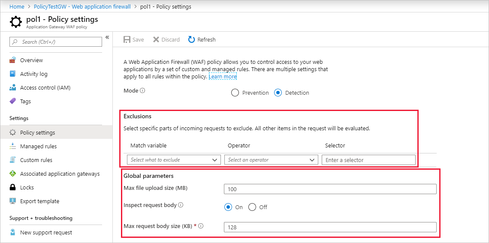

# Web Application Firewall request size limits and exclusion lists

The Azure Application Gateway Web Application Firewall (WAF) provides protection for web applications. This article describes WAF request size limits and exclusion lists configuration. These settings are located in the WAF Policy associated to your Application Gateway. To learn more about WAF Policies, see [Azure Web Application Firewall on Azure Application Gateway](ag-overview.md) and [Create Web Application Firewall policies for Application Gateway](create-waf-policy-ag.md)

## WAF exclusion lists



WAF exclusion lists allow you to omit certain request attributes from a WAF evaluation. A common example is Active Directory inserted tokens that are used for authentication or password fields. Such attributes are prone to contain special characters that may trigger a false positive from the WAF rules. Once an attribute is added to the WAF exclusion list, it isn't considered by any configured and active WAF rule. Exclusion lists are global in scope.

The following attributes can be added to exclusion lists by name. The values of the chosen field aren't evaluated against WAF rules, but their names still are (see Example 1 below, the value of the User-Agent header is excluded from WAF evaluation). The exclusion lists remove inspection of the field's value.

* Request Headers
* Request Cookies
* Request attribute name (args) can be added as an exclusion element, such as:

   * Form field name
   * JSON entity
   * URL query string args

You can specify an exact request header, body, cookie, or query string attribute match.  Or, you can optionally specify partial matches. Exclusion rules are global in scope, and apply to all pages and all rules.

The following are the supported match criteria operators:

- **Equals**:  This operator is used for an exact match. As an example, for selecting a header named **bearerToken**, use the equals operator with the selector set as **bearerToken**.
- **Starts with**: This operator matches all fields that start with the specified selector value.
- **Ends with**:  This operator matches all request fields that end with the specified selector value.
- **Contains**: This operator matches all request fields that contain the specified selector value.
- **Equals any**: This operator matches all request fields. * will be the selector value.

In all cases matching is case insensitive and regular expression aren't allowed as selectors.

> [!NOTE]
> For more information and troubleshooting help, see [WAF troubleshooting](web-application-firewall-troubleshoot.md).

### Examples

[!INCLUDE [updated-for-az](../../../includes/updated-for-az.md)]

The following examples demonstrate the use of exclusions.

#### Example 1

In this example, you want to exclude the user-agent header. The user-agent request header contains a characteristic string that allows the network protocol peers to identify the application type, operating system, software vendor, or software version of the requesting software user agent. For more information, see [User-Agent](https://developer.mozilla.org/en-US/docs/Web/HTTP/Headers/User-Agent).

There can be any number of reasons to disable evaluating this header. There could be a string that the WAF sees and assumes it’s malicious. For example, the classic SQL attack “x=x” in a string. In some cases, this can be legitimate traffic. So you might need to exclude this header from WAF evaluation.

The following Azure PowerShell cmdlet excludes the user-agent header from evaluation:

```azurepowershell
$exclusion1 = New-AzApplicationGatewayFirewallExclusionConfig `
   -MatchVariable "RequestHeaderNames" `
   -SelectorMatchOperator "Equals" `
   -Selector "User-Agent"
```
#### Example 2

This example excludes the value in the *user* parameter that is passed in the request via the URL. For example, say it’s common in your environment for the user field to contain a string that the WAF views as malicious content, so it blocks it.  You can exclude the user parameter in this case so that the WAF doesn't evaluate anything in the field.

The following Azure PowerShell cmdlet excludes the user parameter from evaluation:

```azurepowershell
$exclusion2 = New-AzApplicationGatewayFirewallExclusionConfig `
   -MatchVariable "RequestArgNames" `
   -SelectorMatchOperator "StartsWith" `
   -Selector "user"
```
So if the URL `http://www.contoso.com/?user%281%29=fdafdasfda` is passed to the WAF, it won't evaluate the string **fdafdasfda**, but it will still evaluate the parameter name **user%281%29**. 

## WAF request size limits


Web Application Firewall allows you to configure request size limits within lower and upper bounds. The following two size limits configurations are available:

- The maximum request body size field is specified in kilobytes and controls overall request size limit excluding any file uploads. This field can range from 1-KB minimum to 128-KB maximum value. The default value for request body size is 128 KB.
- The file upload limit field is specified in MB and it governs the maximum allowed file upload size. This field can have a minimum value of 1 MB and the following maximums:

   - 100 MB for v1 Medium WAF gateways
   - 500 MB for v1 Large WAF gateways
   - 750 MB for v2 WAF gateways 

 The default value for file upload limit is 100 MB.

WAF also offers a configurable knob to turn the request body inspection on or off. By default, the request body inspection is enabled. If the request body inspection is turned off, WAF doesn't evaluate the contents of HTTP message body. In such cases, WAF continues to enforce WAF rules on headers, cookies, and URI. If the request body inspection is turned off, then maximum request body size field isn't applicable and can't be set. Turning off the request body inspection allows for messages larger than 128 KB to be sent to WAF, but the message body isn't inspected for vulnerabilities.

## Next steps

After you configure your WAF settings, you can learn how to view your WAF logs. For more information, see [Application Gateway diagnostics](../../application-gateway/application-gateway-diagnostics.md#diagnostic-logging).
