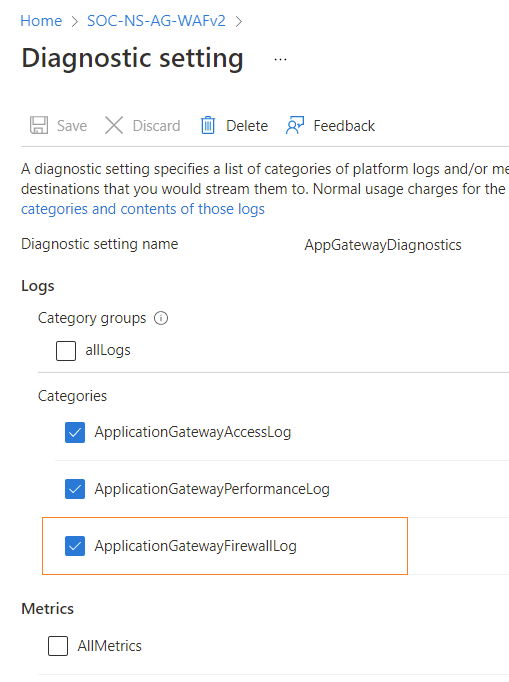

# Azure Web Application Firewall Monitoring and Logging

Azure Web Application Firewall (WAF) monitoring and logging are provided through logging and integration with Azure Monitor and Azure Monitor logs.

## Azure Monitor

WAF with Application Gateway log is integrated with [Azure Monitor](../../azure-monitor/overview.md). Azure Monitor allows you to track diagnostic information including WAF alerts and logs. You can configure WAF monitoring within the Application Gateway resource in the portal under the **Diagnostics** tab or through the Azure Monitor service directly.

## Logs and diagnostics

WAF with Application Gateway provides detailed reporting on each threat it detects. Logging is integrated with Azure Diagnostics logs and alerts are recorded in a json format. These logs can be integrated with [Azure Monitor logs](/previous-versions/azure/azure-monitor/insights/azure-networking-analytics).

For more information about diagnostics logs, see [Application Gateway WAF resource logs](../ag/web-application-firewall-logs.md).  If logging is enabled and a WAF rule is triggered, any matching patterns are logged in plain text to help you analyze and debug the WAF policy behavior. You can use exclusions to fine tune rules and exclude any data that you want to be excluded from the logs. For more information, see [Web application firewall exclusion lists in Azure Application Gateway](../ag/application-gateway-waf-configuration.md).

## Application Gateway WAF v2 Metrics  

New WAF metrics are only available for Core Rule Set 3.2 or greater, or with bot protection and geo-filtering. The metrics can be further filtered on the supported dimensions.
 
|**Metrics**|**Description**|**Dimension**|
| :------------------| :-------------------------------------| :-----------------|
|**WAF Total Requests**|Count of successful requests that WAF engine has served| Action, Country/Region, Method, Mode, Policy Name, Policy Scope|
|**WAF Managed Rule Matches**|Count of total managed rule matches| Action, Country/Region, Mode, Policy Name, Policy Scope, Rule Group, Rule ID, Rule Set Name|
|**WAF Custom Rule Matches**|Count of custom rule matches| Action, Country/Region, Mode, Policy Name, Policy Scope, Rule Name|
|**WAF Bot Protection Matches**1|Count of total bot protection rule matches that have been blocked or logged from malicious IP addresses. The IP addresses are sourced from the Microsoft Threat Intelligence feed.| Action, Country/Region, Bot Type, Mode, Policy Name, Policy Scope|

1 Only Bot Manager Rule Set 0.1 will be displayed under “WAF Bot Protection Matches”. Requests matching Bot Manager Rule Set 1.0 will increase “WAF Total Requests” metrics, not “WAF Bot Protection Matches”.

For metrics supported by Application Gateway V2 SKU, see [Application Gateway v2 metrics](../../application-gateway/application-gateway-metrics.md#metrics-supported-by-application-gateway-v2-sku)

## Application Gateway WAF v1 Metrics

|**Metrics**|**Description**|**Dimension**|
| :------------------| :-------------------------------------| :-----------------|
|**Web Application Firewall Blocked Requests Count**|Count of total requests that have been blocked by the WAF engine||
|**Web Application Firewall Blocked Requests Distribution**|Total number of rules hit distribution for the blocked requests by Rule Group and Rule ID|Rule Group, Rule ID|
|**Web Application Firewall Total Rule Distribution**|Count of total matched requests distribution by Rule Group and Rule ID |Rule Group, Rule ID|  

For metrics supported by Application Gateway V1 SKU, see [Application Gateway v1 metrics](../../application-gateway/application-gateway-metrics.md#metrics-supported-by-application-gateway-v1-sku)

 ## Access WAF Metrics in Azure portal

1. From the Azure portal menu, select **All Resources** >> **\<your-Application-Gateway-profile>**.

2. Under **Monitoring**, select **Metrics**:

3. In **Metrics**, select the metric to add:  
 
    :::image type="content" source="../media/waf-appgateway-metrics/appgw-waf-metrics-1.png" alt-text="Screenshot of waf metrics page." lightbox="../media/waf-appgateway-metrics/appgw-waf-metrics-1-expanded.png":::
 
4. Select Add filter to add a filter:

   :::image type="content" source="../media/waf-appgateway-metrics/appgw-waf-metrics-2.png" alt-text="Screenshot of adding filters to metrics." lightbox="../media/waf-appgateway-metrics/appgw-waf-metrics-2-expanded.png":::

 5. Select New chart to add a new chart
 
 ## Configure Alerts in Azure portal

1. Set up alerts on Azure Application Gateway by selecting **Monitoring** >> **Alerts**.

1. Select **New alert rule** for metrics listed in Metrics section.

Alert will be charged based on Azure Monitor. For more information about alerts, see [Azure Monitor alerts](../../azure-monitor/alerts/alerts-overview.md).

## Next steps

- Learn about [Web Application Firewall](../overview.md).
- Learn about [Web Application Firewall Logs](../ag/web-application-firewall-logs.md).
