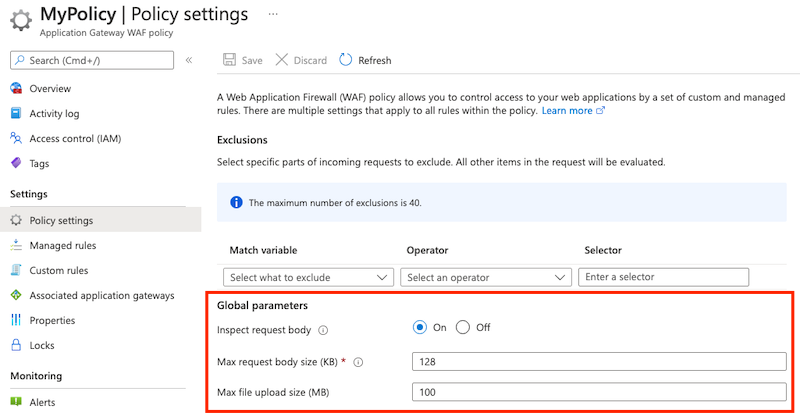

# Web Application Firewall request size limits

Web Application Firewall allows you to configure request size limits within lower and upper bounds.

Request size limits are global in scope.

## Limits

The following two size limits configurations are available:

- The maximum request body size field is specified in kilobytes and controls overall request size limit excluding any file uploads. This field has a minimum value of 8 KB and a maximum value of 128 KB. The default value for request body size is 128 KB.
- The file upload limit field is specified in MB and it governs the maximum allowed file upload size. This field can have a minimum value of 1 MB and the following maximums:

   - 100 MB for v1 Medium WAF gateways
   - 500 MB for v1 Large WAF gateways
   - 750 MB for v2 WAF gateways 

The default value for file upload limit is 100 MB.

For CRS 3.2 (on the WAF_v2 SKU) and newer, these limits are as follows when using a WAF policy for Appplication Gateway:
   
   - 2MB request body size limit
   - 4GB file upload limit 

To set request size limits in the Azure portal, configure **Global parameters** in the WAF policy resource's **Policy settings** page:

## Request body inspection

WAF also offers a configurable knob to turn the request body inspection on or off. By default, the request body inspection is enabled. If the request body inspection is turned off, WAF doesn't evaluate the contents of HTTP message body. In such cases, WAF continues to enforce WAF rules on headers, cookies, and URI. If the request body inspection is turned off, then maximum request body size field isn't applicable and can't be set.

Turning off the request body inspection allows for messages larger than 128 KB to be sent to WAF, but the message body isn't inspected for vulnerabilities.

## Next steps

After you configure your WAF settings, you can learn how to view your WAF logs. For more information, see [Application Gateway diagnostics](../../application-gateway/application-gateway-diagnostics.md#diagnostic-logging).
