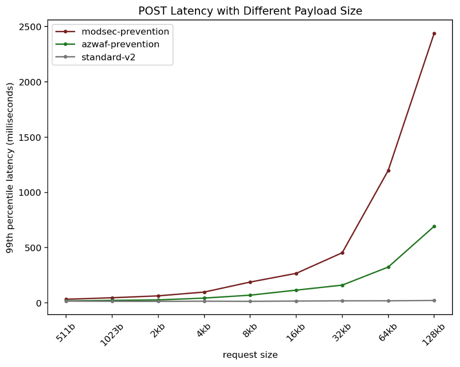
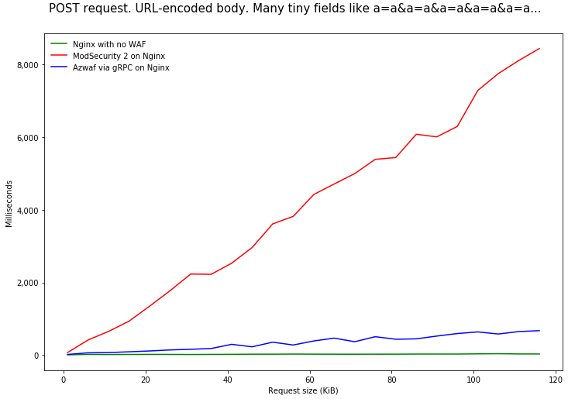
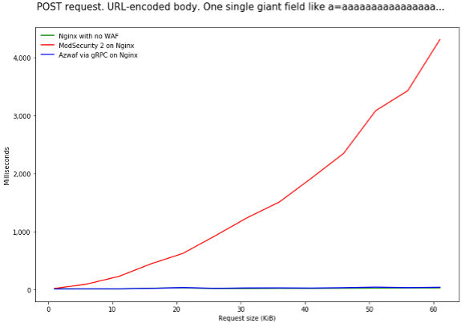
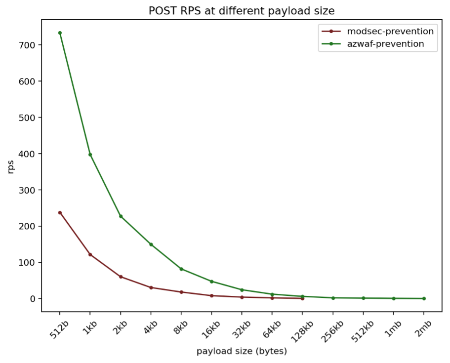

# Azure WAF engine on Azure Application Gateway

The Azure web application firewall (WAF) engine is the component that inspects traffic and determines whether a request includes a signature that represents a potential attack.

## ModSecurity and the Azure WAF engine

Previously, the WAF functionality in Azure Application Gateway was implemented by using [ModSecurity](https://github.com/SpiderLabs/ModSecurity). ModSecurity provides support for its [core ruleset (CRS)](https://github.com/SpiderLabs/owasp-modsecurity-crs), which is an industry standard that has been existent for the past two decades and is mandated for protecting against the top ten OWASP attacks by many organizations. However, ModSecurity has number of drawbacks including performance issues and platform instability.

The Azure WAF engine, released with CRS 3.2, provides significant improvements over ModSecurity:

- Improved WAF performance with significant reduction in WAF latency, ~5x improvement in the tail 99th percentile latencies
- Increased reliability with decoupling of WAF processing from Application Gateway data path

## Support for new features

There are many new features that are only supported in the Azure WAF engine. The features include:

- [CRS 3.2](application-gateway-crs-rulegroups-rules.md#owasp-crs-32)
  - Increased request body size limit to 2MB
  - Increased file upload limit to 4GB
- WAF v2 metrics
- Per-rule exclusions
- New exclusion match variables for key and values
- Any operator in custom rules

New WAF features will only be released on the Azure WAF engine.

## Request logging

There is a difference between how the ModSecurity engine and the Azure WAF engine log requests.

The ModSecurity engine uses the *Blocked* action type when it blocks a request in prevention mode. When running in detection mode, the ModSecurity engine logs the *Detected* action type to indicate the request has an attack detected.

The Azure WAF engine uses the *Blocked* action type when it blocks a request in prevention mode, and logs the action type *Log* when an attack is detected in detection mode.

## Performance

Below charts show some performance comparisons. Comparison is done between the Azure WAF engine (AzWAF), ModSecurity, and the standard SKU of Application Gateway without WAF. During the test, WAF was configured in Prevention Mode. Each gateway was configured with two instances.

### Latency

The following chart shows the latency for POST requests with different payload sizes.

The following two charts show how the existing WAF engine vs new WAF engine perform against ReDOS attacks.

### Requests per second

The following chart shows the number of POST requests per second that both the ModSecurity and Azure WAF engine can process, with different payload sizes.

## Next steps

Learn more about [WAF managed rules](application-gateway-crs-rulegroups-rules.md).
