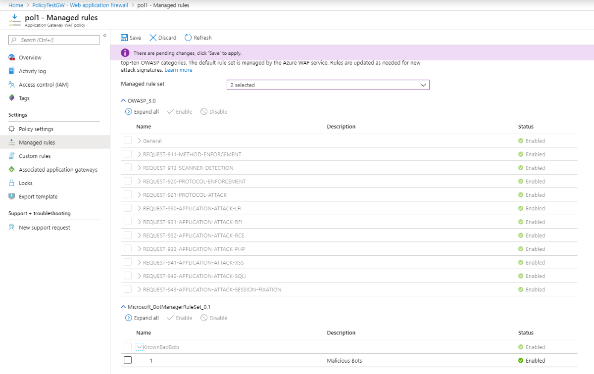

# Configure bot protection for Web Application Firewall on Azure Application Gateway (Preview)

This article shows you how to configure a bot protection rule in Azure Web Application Firewall (WAF) for Application Gateway  using the Azure portal. 

You can enable a managed bot protection rule set for your WAF to block or log requests from known malicious IP addresses. The IP addresses are sourced from the Microsoft Threat Intelligence feed. Intelligent Security Graph powers Microsoft threat intelligence and is used by multiple services including Azure Security Center.

> [!NOTE]
> The bot protection rule set is currently in public preview and is provided with a preview service level agreement. Certain features may not be supported or may have constrained capabilities. See the [Supplemental Terms of Use for Microsoft Azure Previews](https://azure.microsoft.com/support/legal/preview-supplemental-terms/) for details.

## Prerequisites

Create a basic WAF policy for Application Gateway by following the instructions described in [Create Web Application Firewall policies for Application Gateway](create-waf-policy-ag.md).

## Enable bot protection rule set

1. In the **Basic** policy page that you created previously, under **Settings**, select **Rules**.  

2. In the details page, under the **Manage rules** section, from the drop-down menu, select the check box for the bot Protection rule, and then select **Save**.

> [!div class="mx-imgBorder"]
> 

## Next steps

For more information about custom rules, see [Custom rules for Web Application Firewall v2 on Azure Application Gateway](custom-waf-rules-overview.md).