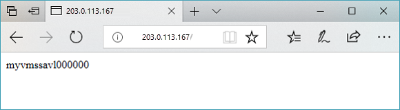

# Configure per-site WAF policies using Azure PowerShell

Web Application Firewall (WAF) settings are contained in WAF policies, and to change your WAF configuration you modify the WAF policy.

When associated with your Application Gateway, the policies and all the settings are reflected globally. So, if you have five sites behind your WAF, all five sites are protected by the same WAF Policy. This is great if you need the same security settings for every site. But you can also apply WAF policies to individual listeners to allow for site-specific WAF configuration.

By applying WAF policies to a listener, you can configure WAF settings for individual sites without the changes affecting every site. The most specific policy takes precedent. If there's a global policy, and a per-site policy (a WAF policy associated with a listener), then the per-site policy overrides the global WAF policy for that listener. Other listeners without their own policies will only be affected by the global WAF policy.

In this article, you learn how to:

* Set up the network
* Create a WAF policy
* Create an application gateway with WAF enabled
* Apply the WAF policy globally, per-site, and per-URI 
* Create a virtual machine scale set
* Create a storage account and configure diagnostics
* Test the application gateway


If you don't have an Azure subscription, create a [free account](https://azure.microsoft.com/free/?WT.mc_id=A261C142F) before you begin.

[!INCLUDE [updated-for-az](../../../includes/updated-for-az.md)]

[!INCLUDE [cloud-shell-try-it.md](../../../includes/cloud-shell-try-it.md)]

If you choose to install and use the PowerShell locally, this article requires the Azure PowerShell module version 1.0.0 or later. Run `Get-Module -ListAvailable Az` to find the version. If you need to upgrade, see [Install Azure PowerShell module](/powershell/azure/install-azure-powershell). If you're running PowerShell locally, you also need to run `Login-AzAccount` to create a connection with Azure.

## Create a resource group

A resource group is a logical container into which Azure resources are deployed and managed. Create an Azure resource group using [New-AzResourceGroup](/powershell/module/az.resources/new-azresourcegroup).  

```azurepowershell-interactive
$rgname = New-AzResourceGroup -Name myResourceGroupAG -Location eastus
```

## Create network resources 

Create the subnet configurations named *myBackendSubnet* and *myAGSubnet* using [New-AzVirtualNetworkSubnetConfig](/powershell/module/az.network/new-azvirtualnetworksubnetconfig). Create the virtual network named *myVNet* using [New-AzVirtualNetwork](/powershell/module/az.network/new-azvirtualnetwork) with the subnet configurations. And finally, create the public IP address named *myAGPublicIPAddress* using [New-AzPublicIpAddress](/powershell/module/az.network/new-azpublicipaddress). These resources are used to provide network connectivity to the application gateway and its associated resources.

```azurepowershell-interactive
$backendSubnetConfig = New-AzVirtualNetworkSubnetConfig `
  -Name myBackendSubnet `
  -AddressPrefix 10.0.1.0/24

$agSubnetConfig = New-AzVirtualNetworkSubnetConfig `
  -Name myAGSubnet `
  -AddressPrefix 10.0.2.0/24

$vnet = New-AzVirtualNetwork `
  -ResourceGroupName myResourceGroupAG `
  -Location eastus `
  -Name myVNet `
  -AddressPrefix 10.0.0.0/16 `
  -Subnet $backendSubnetConfig, $agSubnetConfig

$pip = New-AzPublicIpAddress `
  -ResourceGroupName myResourceGroupAG `
  -Location eastus `
  -Name myAGPublicIPAddress `
  -AllocationMethod Static `
  -Sku Standard
```

## Create an application gateway

In this section, you create resources that support the application gateway, and then finally create it and a WAF. The resources that you create include:

- *IP configurations and frontend port* - Associates the subnet that you previously created to the application gateway and assigns a port to use to access it.
- *Default pool* - All application gateways must have at least one backend pool of servers.
- *Default listener and rule* - The default listener listens for traffic on the port that was assigned and the default rule sends traffic to the default pool.

### Create the IP configurations and frontend port

Associate *myAGSubnet* that you previously created to the application gateway using [New-AzApplicationGatewayIPConfiguration](/powershell/module/az.network/new-azapplicationgatewayipconfiguration). Assign *myAGPublicIPAddress* to the application gateway using [New-AzApplicationGatewayFrontendIPConfig](/powershell/module/az.network/new-azapplicationgatewayfrontendipconfig).

```azurepowershell-interactive
$vnet = Get-AzVirtualNetwork `
  -ResourceGroupName myResourceGroupAG `
  -Name myVNet

$subnet=$vnet.Subnets[1]

$gipconfig = New-AzApplicationGatewayIPConfiguration `
  -Name myAGIPConfig `
  -Subnet $subnet

$fipconfig = New-AzApplicationGatewayFrontendIPConfig `
  -Name myAGFrontendIPConfig `
  -PublicIPAddress $pip

$frontendport80 = New-AzApplicationGatewayFrontendPort `
  -Name myFrontendPort `
  -Port 80
  
$frontendport8080 = New-AzApplicationGatewayFrontendPort `
  -Name myFrontendPort `
  -Port 8080
```

### Create the backend pool and settings

Create the backend pool named *appGatewayBackendPool* for the application gateway using [New-AzApplicationGatewayBackendAddressPool](/powershell/module/az.network/new-azapplicationgatewaybackendaddresspool). Configure the settings for the backend address pools using [New-AzApplicationGatewayBackendHttpSettings](/powershell/module/az.network/new-azapplicationgatewaybackendhttpsetting).

```azurepowershell-interactive
$defaultPool = New-AzApplicationGatewayBackendAddressPool `
  -Name appGatewayBackendPool 

$poolSettings = New-AzApplicationGatewayBackendHttpSettings `
  -Name myPoolSettings `
  -Port 80 `
  -Protocol Http `
  -CookieBasedAffinity Enabled `
  -RequestTimeout 120
```

### Create two WAF policies

Create two WAF policies, one global and one per-site, and add custom rules. 

The per-site policy restricts the file upload limit to 5 MB. Everything else is the same.

```azurepowershell-interactive
$variable = New-AzApplicationGatewayFirewallMatchVariable -VariableName RequestUri
$condition = New-AzApplicationGatewayFirewallCondition -MatchVariable $variable -Operator Contains -MatchValue "globalAllow" 
$rule = New-AzApplicationGatewayFirewallCustomRule -Name globalAllow -Priority 5 -RuleType MatchRule -MatchCondition $condition -Action Allow

$variable1 = New-AzApplicationGatewayFirewallMatchVariable -VariableName RequestUri
$condition1 = New-AzApplicationGatewayFirewallCondition -MatchVariable $variable1 -Operator Contains -MatchValue "globalBlock" 
$rule1 = New-AzApplicationGatewayFirewallCustomRule -Name globalBlock -Priority 10 -RuleType MatchRule -MatchCondition $condition1 -Action Block

$variable2 = New-AzApplicationGatewayFirewallMatchVariable -VariableName RequestUri
$condition2 = New-AzApplicationGatewayFirewallCondition -MatchVariable $variable2 -Operator Contains -MatchValue "siteAllow" 
$rule2 = New-AzApplicationGatewayFirewallCustomRule -Name siteAllow -Priority 5 -RuleType MatchRule -MatchCondition $condition2 -Action Allow

$variable3 = New-AzApplicationGatewayFirewallMatchVariable -VariableName RequestUri
$condition3 = New-AzApplicationGatewayFirewallCondition -MatchVariable $variable3 -Operator Contains -MatchValue "siteBlock" 
$rule3 = New-AzApplicationGatewayFirewallCustomRule -Name siteBlock -Priority 10 -RuleType MatchRule -MatchCondition $condition3 -Action Block

$variable4 = New-AzApplicationGatewayFirewallMatchVariable -VariableName RequestUri
$condition4 = New-AzApplicationGatewayFirewallCondition -MatchVariable $variable4 -Operator Contains -MatchValue "URIAllow" 
$rule4 = New-AzApplicationGatewayFirewallCustomRule -Name URIAllow -Priority 5 -RuleType MatchRule -MatchCondition $condition4 -Action Allow

$variable5 = New-AzApplicationGatewayFirewallMatchVariable -VariableName RequestUri
$condition5 = New-AzApplicationGatewayFirewallCondition -MatchVariable $variable5 -Operator Contains -MatchValue "URIBlock" 
$rule5 = New-AzApplicationGatewayFirewallCustomRule -Name URIBlock -Priority 10 -RuleType MatchRule -MatchCondition $condition5 -Action Block

$policySettingGlobal = New-AzApplicationGatewayFirewallPolicySetting `
  -Mode Prevention `
  -State Enabled `
  -MaxRequestBodySizeInKb 100 `
  -MaxFileUploadInMb 256

$wafPolicyGlobal = New-AzApplicationGatewayFirewallPolicy `
  -Name wafpolicyGlobal `
  -ResourceGroup myResourceGroupAG `
  -Location eastus `
  -PolicySetting $PolicySettingGlobal `
  -CustomRule $rule, $rule1

$policySettingSite = New-AzApplicationGatewayFirewallPolicySetting `
  -Mode Prevention `
  -State Enabled `
  -MaxRequestBodySizeInKb 100 `
  -MaxFileUploadInMb 5

$wafPolicySite = New-AzApplicationGatewayFirewallPolicy `
  -Name wafpolicySite `
  -ResourceGroup myResourceGroupAG `
  -Location eastus `
  -PolicySetting $PolicySettingSite `
  -CustomRule $rule2, $rule3
```

### Create the default listener and rule

A listener is required to enable the application gateway to route traffic appropriately to the backend address pools. In this example, you create a basic listener that listens for traffic at the root URL. 

Create a listener named *mydefaultListener* using [New-AzApplicationGatewayHttpListener](/powershell/module/az.network/new-azapplicationgatewayhttplistener) with the frontend configuration and frontend port that you previously created. A rule is required for the listener to know which backend pool to use for incoming traffic. Create a basic rule named *rule1* using [New-AzApplicationGatewayRequestRoutingRule](/powershell/module/az.network/new-azapplicationgatewayrequestroutingrule).

```azurepowershell-interactive
$globalListener = New-AzApplicationGatewayHttpListener `
  -Name mydefaultListener `
  -Protocol Http `
  -FrontendIPConfiguration $fipconfig `
  -FrontendPort $frontendport80

$frontendRule = New-AzApplicationGatewayRequestRoutingRule `
  -Name rule1 `
  -RuleType Basic `
  -HttpListener $globallistener `
  -BackendAddressPool $defaultPool `
  -BackendHttpSettings $poolSettings
  
$siteListener = New-AzApplicationGatewayHttpListener `
  -Name mydefaultListener `
  -Protocol Http `
  -FrontendIPConfiguration $fipconfig `
  -FrontendPort $frontendport8080 `
  -FirewallPolicy $wafPolicySite
  
$frontendRuleSite = New-AzApplicationGatewayRequestRoutingRule `
  -Name rule2 `
  -RuleType Basic `
  -HttpListener $siteListener `
  -BackendAddressPool $defaultPool `
  -BackendHttpSettings $poolSettings
```

### Create the application gateway with the WAF

Now that you created the necessary supporting resources, specify parameters for the application gateway using [New-AzApplicationGatewaySku](/powershell/module/az.network/new-azapplicationgatewaysku). Specify the Firewall Policy using [New-AzApplicationGatewayFirewallPolicy](/powershell/module/az.network/new-azapplicationgatewayfirewallpolicy). And then create the application gateway named *myAppGateway* using [New-AzApplicationGateway](/powershell/module/az.network/new-azapplicationgateway).

```azurepowershell-interactive
$sku = New-AzApplicationGatewaySku `
  -Name WAF_v2 `
  -Tier WAF_v2 `
  -Capacity 2

$appgw = New-AzApplicationGateway `
  -Name myAppGateway `
  -ResourceGroupName myResourceGroupAG `
  -Location eastus `
  -BackendAddressPools $defaultPool `
  -BackendHttpSettingsCollection $poolSettings `
  -FrontendIpConfigurations $fipconfig `
  -GatewayIpConfigurations $gipconfig `
  -FrontendPorts $frontendport80 `
  -HttpListeners $globallistener `
  -RequestRoutingRules $frontendRule `
  -Sku $sku `
  -FirewallPolicy $wafPolicyGlobal
```

### Apply a per-URI policy

To apply a per-URI policy, simply create a new policy and apply it to the path rule config. 

```azurepowershell-interactive
$policySettingURI = New-AzApplicationGatewayFirewallPolicySetting `
  -Mode Prevention `
  -State Enabled `
  -MaxRequestBodySizeInKb 100 `
  -MaxFileUploadInMb 5

$wafPolicyURI = New-AzApplicationGatewayFirewallPolicy `
  -Name wafpolicySite `
  -ResourceGroup myResourceGroupAG `
  -Location eastus `
  -PolicySetting $PolicySettingURI `
  -CustomRule $rule4, $rule5

$appgw = Get-AzApplicationGateway `
  -ResourceGroupName myResourceGroupAG `
  -Name myAppGateway

$PathRuleConfig = New-AzApplicationGatewayPathRuleConfig -Name "base" `
  -Paths "/base" `
  -BackendAddressPool $defaultPool `
  -BackendHttpSettings $poolSettings `
  -FirewallPolicy $wafPolicyURI

$PathRuleConfig1 = New-AzApplicationGatewayPathRuleConfig `
  -Name "base" -Paths "/test" `
  -BackendAddressPool $defaultPool `
  -BackendHttpSettings $poolSettings

$URLPathMap = New-AzApplicationGatewayUrlPathMapConfig -Name "PathMap" `
  -PathRules $PathRuleConfig, $PathRuleConfig1 `
  -DefaultBackendAddressPoolId $defaultPool.Id `
  -DefaultBackendHttpSettingsId $poolSettings.Id

Add-AzApplicationGatewayRequestRoutingRule -ApplicationGateway $appgw `
  -Name "RequestRoutingRule" `
  -RuleType PathBasedRouting `
  -HttpListener $siteListener `
  -UrlPathMap $URLPathMap
```

## Create a virtual machine scale set

In this example, you create a virtual machine scale set to provide servers for the backend pool in the application gateway. You assign the scale set to the backend pool when you configure the IP settings.

Replace your own values for `-AdminUsername` and `-AdminPassword`.

```azurepowershell-interactive
$vnet = Get-AzVirtualNetwork `
  -ResourceGroupName myResourceGroupAG `
  -Name myVNet

$appgw = Get-AzApplicationGateway `
  -ResourceGroupName myResourceGroupAG `
  -Name myAppGateway

$backendPool = Get-AzApplicationGatewayBackendAddressPool `
  -Name appGatewayBackendPool `
  -ApplicationGateway $appgw

$ipConfig = New-AzVmssIpConfig `
  -Name myVmssIPConfig `
  -SubnetId $vnet.Subnets[0].Id `
  -ApplicationGatewayBackendAddressPoolsId $backendPool.Id

$vmssConfig = New-AzVmssConfig `
  -Location eastus `
  -SkuCapacity 2 `
  -SkuName Standard_DS2 `
  -UpgradePolicyMode Automatic

Set-AzVmssStorageProfile $vmssConfig `
  -ImageReferencePublisher MicrosoftWindowsServer `
  -ImageReferenceOffer WindowsServer `
  -ImageReferenceSku 2016-Datacenter `
  -ImageReferenceVersion latest `
  -OsDiskCreateOption FromImage

Set-AzVmssOsProfile $vmssConfig `
  -AdminUsername <username> `
  -AdminPassword <password> `
  -ComputerNamePrefix myvmss

Add-AzVmssNetworkInterfaceConfiguration `
  -VirtualMachineScaleSet $vmssConfig `
  -Name myVmssNetConfig `
  -Primary $true `
  -IPConfiguration $ipConfig

New-AzVmss `
  -ResourceGroupName myResourceGroupAG `
  -Name myvmss `
  -VirtualMachineScaleSet $vmssConfig
```

### Install IIS

```azurepowershell-interactive
$publicSettings = @{ "fileUris" = (,"https://raw.githubusercontent.com/Azure/azure-docs-powershell-samples/master/application-gateway/iis/appgatewayurl.ps1"); 
  "commandToExecute" = "powershell -ExecutionPolicy Unrestricted -File appgatewayurl.ps1" }

$vmss = Get-AzVmss -ResourceGroupName myResourceGroupAG -VMScaleSetName myvmss

Add-AzVmssExtension -VirtualMachineScaleSet $vmss `
  -Name "customScript" `
  -Publisher "Microsoft.Compute" `
  -Type "CustomScriptExtension" `
  -TypeHandlerVersion 1.8 `
  -Setting $publicSettings

Update-AzVmss `
  -ResourceGroupName myResourceGroupAG `
  -Name myvmss `
  -VirtualMachineScaleSet $vmss
```

## Create a storage account and configure diagnostics

In this article, the application gateway uses a storage account to store data for detection and prevention purposes. You could also use Azure Monitor logs or Event Hub to record data.

### Create the storage account

Create a storage account named *myagstore1* using [New-AzStorageAccount](/powershell/module/az.storage/new-azstorageaccount).

```azurepowershell-interactive
$storageAccount = New-AzStorageAccount `
  -ResourceGroupName myResourceGroupAG `
  -Name myagstore1 `
  -Location eastus `
  -SkuName "Standard_LRS"
```

### Configure diagnostics

Configure diagnostics to record data into the ApplicationGatewayAccessLog, ApplicationGatewayPerformanceLog, and ApplicationGatewayFirewallLog logs using [Set-AzDiagnosticSetting](/powershell/module/az.monitor/set-azdiagnosticsetting).

```azurepowershell-interactive
$appgw = Get-AzApplicationGateway `
  -ResourceGroupName myResourceGroupAG `
  -Name myAppGateway

$store = Get-AzStorageAccount `
  -ResourceGroupName myResourceGroupAG `
  -Name myagstore1

Set-AzDiagnosticSetting `
  -ResourceId $appgw.Id `
  -StorageAccountId $store.Id `
  -Category ApplicationGatewayAccessLog, ApplicationGatewayPerformanceLog, ApplicationGatewayFirewallLog `
  -Enabled $true `
  -RetentionEnabled $true `
  -RetentionInDays 30
```

## Test the application gateway

You can use [Get-AzPublicIPAddress](/powershell/module/az.network/get-azpublicipaddress) to get the public IP address of the application gateway. Then use this IP address to curl against (replace the 1.1.1.1 shown below). 

```azurepowershell-interactive
Get-AzPublicIPAddress -ResourceGroupName myResourceGroupAG -Name myAGPublicIPAddress

#should be blocked
curl 1.1.1.1/globalBlock
curl 1.1.1.1/?1=1

#should be allowed
curl 1.1.1.1/globalAllow?1=1

#should be blocked
curl 1.1.1.1:8080/siteBlock
curl 1.1.1.1/?1=1

#should be allowed
curl 1.1.1.1:8080/siteAllow?1=1

#should be blocked
curl 1.1.1.1/URIBlock
curl 1.1.1.1/?1=1

#should be allowed
curl 1.1.1.1/URIAllow?1=1
```



## Clean up resources

When no longer needed, remove the resource group, application gateway, and all related resources using [Remove-AzResourceGroup](/powershell/module/az.resources/remove-azresourcegroup).

```azurepowershell-interactive
Remove-AzResourceGroup -Name myResourceGroupAG
```

## Next steps

[Customize web application firewall rules](application-gateway-customize-waf-rules-portal.md)
