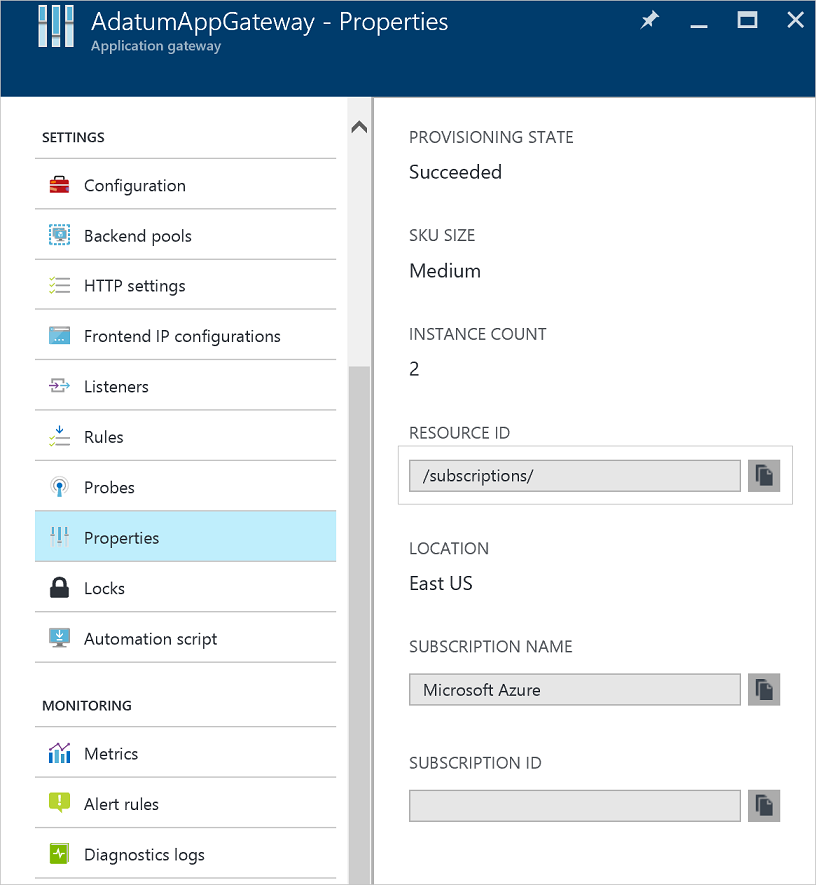

# Resource logs for Azure Web Application Firewall

You can monitor Web Application Firewall resources using logs. You can save performance, access, and other data or consume it from a resource for monitoring purposes.

[!INCLUDE [updated-for-az](../../../includes/updated-for-az.md)]

## Diagnostic logs

You can use different types of logs in Azure to manage and troubleshoot application gateways. You can access some of these logs through the portal. All logs can be extracted from Azure Blob storage and viewed in different tools, such as [Azure Monitor logs](/previous-versions/azure/azure-monitor/insights/azure-networking-analytics), Excel, and Power BI. You can learn more about the different types of logs from the following list:

* **Activity log**: You can use [Azure activity logs](../../azure-monitor/essentials/activity-log.md) to view all operations that are submitted to your Azure subscription, and their status. Activity log entries are collected by default, and you can view them in the Azure portal.
* **Access Resource log**: You can use this log to view Application Gateway access patterns and analyze important information. This includes the caller's IP, requested URL, response latency, return code, and bytes in and out. This log contains individual records for each request and associates that request to the unique Application Gateway that processed the request. Unique Application Gateway instances can be identified by the property instanceId.
* **Performance Resource log**: You can use this log to view how Application Gateway instances are performing. This log captures performance information for each instance, including total requests served, throughput in bytes, total requests served, failed request count, and healthy and unhealthy back-end instance count. A performance log is collected every 60 seconds. The Performance log is available only for the v1 SKU. For the v2 SKU, use [Metrics](../../application-gateway/application-gateway-metrics.md) for performance data.
* **Firewall Resource log**: You can use this log to view the requests that are logged through either detection or prevention mode of an application gateway that is configured with the web application firewall.

> [!NOTE]
> Logs are available only for resources deployed in the Azure Resource Manager deployment model. You cannot use logs for resources in the classic deployment model. For a better understanding of the two models, see the [Understanding Resource Manager deployment and classic deployment](../../azure-resource-manager/management/deployment-models.md) article.

You have three options for storing your logs:

* **Storage account**: Storage accounts are best used for logs when logs are stored for a longer duration and reviewed when needed.
* **Event hubs**: Event hubs are a great option for integrating with other security information and event management (SIEM) tools to get alerts on your resources.
* **Azure Monitor logs**: Azure Monitor logs is best used for general real-time monitoring of your application or looking at trends.

### Enable logging through PowerShell

Activity logging is automatically enabled for every Resource Manager resource. You must enable access and performance logging to start collecting the data available through those logs. To enable logging, use the following steps:

1. Note your storage account's resource ID, where the log data is stored. This value is of the form: /subscriptions/\<subscriptionId\>/resourceGroups/\<resource group name\>/providers/Microsoft.Storage/storageAccounts/\<storage account name\>. You can use any storage account in your subscription. You can use the Azure portal to find this information.

    

2. Note your application gateway's resource ID for which logging is enabled. This value is of the form: /subscriptions/\<subscriptionId\>/resourceGroups/\<resource group name\>/providers/Microsoft.Network/applicationGateways/\<application gateway name\>. You can use the portal to find this information.

    

3. Enable resource logging by using the following PowerShell cmdlet:

    ```powershell
    Set-AzDiagnosticSetting  -ResourceId /subscriptions/<subscriptionId>/resourceGroups/<resource group name>/providers/Microsoft.Network/applicationGateways/<application gateway name> -StorageAccountId /subscriptions/<subscriptionId>/resourceGroups/<resource group name>/providers/Microsoft.Storage/storageAccounts/<storage account name> -Enabled $true     
    ```

> [!TIP]
>Activity logs do not *require* a separate storage account. The use of storage for access and performance logging incurs service charges.

### Enable logging through the Azure portal

1. In the Azure portal, find your resource and select **Diagnostic settings**.

   For Application Gateway, three logs are available:

   * Access log
   * Performance log
   * Firewall log

2. Select **Add diagnostic setting**.


3. The **Diagnostic setting** page provides the settings for the resource logs. In this example, Log Analytics stores the logs. You can also use an event hub, a storage account, or a partner solution to save the resource logs.

   :::image type="content" source="../media/web-application-firewall-logs/figure2.png" alt-text="Screenshot showing Diagnostic settings.":::

5. Type a name for the settings, confirm the settings, and select **Save**.

## Activity log

Azure generates the activity log by default. The logs are preserved for 90 days in the Azure event logs store. Learn more about these logs by reading the [View events and activity log](../../azure-monitor/essentials/activity-log.md) article.

## Access log

The access log is generated only if you've enabled it on each Application Gateway instance, as detailed in the preceding steps. The data is stored in the storage account that you specified when you enabled the logging. Each access of Application Gateway is logged in JSON format, as shown in the following example for v1:

|Value  |Description  |
|---------|---------|
|instanceId     | Application Gateway instance that served the request.        |
|clientIP     | Originating IP for the request.        |
|clientPort     | Originating port for the request.       |
|httpMethod     | HTTP method used by the request.       |
|requestUri     | URI of the received request.        |
|RequestQuery     | **Server-Routed**: Back-end pool instance that was sent the request.</br>**X-AzureApplicationGateway-LOG-ID**: Correlation ID used for the request. It can be used to troubleshoot traffic issues on the back-end servers. </br>**SERVER-STATUS**: HTTP response code that Application Gateway received from the back end.       |
|UserAgent     | User agent from the HTTP request header.        |
|httpStatus     | HTTP status code returned to the client from Application Gateway.       |
|httpVersion     | HTTP version of the request.        |
|receivedBytes     | Size of packet received, in bytes.        |
|sentBytes| Size of packet sent, in bytes.|
|timeTaken| Length of time (in milliseconds) that it takes for a request to be processed and its response to be sent. This is calculated as the interval from the time when Application Gateway receives the first byte of an HTTP request to the time when the response send operation finishes. It's important to note that the Time-Taken field usually includes the time that the request and response packets are traveling over the network. |
|sslEnabled| Whether communication to the back-end pools used TLS/SSL. Valid values are on and off.|
|host| The hostname with which the request has been sent to the backend server. If backend hostname is being overridden, this name will reflect that.|
|originalHost| The hostname with which the request was received by the Application Gateway from the client.|
```json
{
    "resourceId": "/SUBSCRIPTIONS/{subscriptionId}/RESOURCEGROUPS/PEERINGTEST/PROVIDERS/MICROSOFT.NETWORK/APPLICATIONGATEWAYS/{applicationGatewayName}",
    "operationName": "ApplicationGatewayAccess",
    "timestamp": "2017-04-26T19:27:38Z",
    "category": "ApplicationGatewayAccessLog",
    "properties": {
        "instanceId": "ApplicationGatewayRole_IN_0",
        "clientIP": "191.96.249.97",
        "clientPort": 46886,
        "httpMethod": "GET",
        "requestUri": "/phpmyadmin/scripts/setup.php",
        "requestQuery": "X-AzureApplicationGateway-CACHE-HIT=0&SERVER-ROUTED=10.4.0.4&X-AzureApplicationGateway-LOG-ID=874f1f0f-6807-41c9-b7bc-f3cfa74aa0b1&SERVER-STATUS=404",
        "userAgent": "-",
        "httpStatus": 404,
        "httpVersion": "HTTP/1.0",
        "receivedBytes": 65,
        "sentBytes": 553,
        "timeTaken": 205,
        "sslEnabled": "off",
        "host": "www.contoso.com",
        "originalHost": "www.contoso.com"
    }
}
```
For Application Gateway and WAF v2, the logs show a little more information:

|Value  |Description  |
|---------|---------|
|instanceId     | Application Gateway instance that served the request.        |
|clientIP     | Originating IP for the request.        |
|clientPort     | Originating port for the request.       |
|httpMethod     | HTTP method used by the request.       |
|requestUri     | URI of the received request.        |
|UserAgent     | User agent from the HTTP request header.        |
|httpStatus     | HTTP status code returned to the client from Application Gateway.       |
|httpVersion     | HTTP version of the request.        |
|receivedBytes     | Size of packet received, in bytes.        |
|sentBytes| Size of packet sent, in bytes.|
|timeTaken| Length of time (in milliseconds) that it takes for a request to be processed and its response to be sent. This is calculated as the interval from the time when Application Gateway receives the first byte of an HTTP request to the time when the response send operation finishes. It's important to note that the Time-Taken field usually includes the time that the request and response packets are traveling over the network. |
|sslEnabled| Whether communication to the back-end pools used TLS. Valid values are on and off.|
|sslCipher| Cipher suite being used for TLS communication (if TLS is enabled).|
|sslProtocol| TLS protocol being used (if TLS is enabled).|
|serverRouted| The backend server that application gateway routes the request to.|
|serverStatus| HTTP status code of the backend server.|
|serverResponseLatency| Latency of the response from the backend server.|
|host| Address listed in the host header of the request.|
```json
{
    "resourceId": "/SUBSCRIPTIONS/{subscriptionId}/RESOURCEGROUPS/PEERINGTEST/PROVIDERS/MICROSOFT.NETWORK/APPLICATIONGATEWAYS/{applicationGatewayName}",
    "operationName": "ApplicationGatewayAccess",
    "time": "2017-04-26T19:27:38Z",
    "category": "ApplicationGatewayAccessLog",
    "properties": {
        "instanceId": "appgw_1",
        "clientIP": "191.96.249.97",
        "clientPort": 46886,
        "httpMethod": "GET",
        "requestUri": "/phpmyadmin/scripts/setup.php",
        "userAgent": "-",
        "httpStatus": 404,
        "httpVersion": "HTTP/1.0",
        "receivedBytes": 65,
        "sentBytes": 553,
        "timeTaken": 205,
        "sslEnabled": "off",
        "sslCipher": "",
        "sslProtocol": "",
        "serverRouted": "104.41.114.59:80",
        "serverStatus": "200",
        "serverResponseLatency": "0.023",
        "host": "www.contoso.com",
    }
}
```

## Performance log

The performance log is generated only if you have enabled it on each Application Gateway instance, as detailed in the preceding steps. The data is stored in the storage account that you specified when you enabled the logging. The performance log data is generated in 1-minute intervals. It is available only for the v1 SKU. For the v2 SKU, use [Metrics](../../application-gateway/application-gateway-metrics.md) for performance data. The following data is logged:


|Value  |Description  |
|---------|---------|
|instanceId     |  Application Gateway instance for which performance data is being generated. For a multiple-instance application gateway, there is one row per instance.        |
|healthyHostCount     | Number of healthy hosts in the back-end pool.        |
|unHealthyHostCount     | Number of unhealthy hosts in the back-end pool.        |
|requestCount     | Number of requests served.        |
|latency | Average latency (in milliseconds) of requests from the instance to the back end that serves the requests. |
|failedRequestCount| Number of failed requests.|
|throughput| Average throughput since the last log, measured in bytes per second.|

```json
{
    "resourceId": "/SUBSCRIPTIONS/{subscriptionId}/RESOURCEGROUPS/{resourceGroupName}/PROVIDERS/MICROSOFT.NETWORK/APPLICATIONGATEWAYS/{applicationGatewayName}",
    "operationName": "ApplicationGatewayPerformance",
    "time": "2016-04-09T00:00:00Z",
    "category": "ApplicationGatewayPerformanceLog",
    "properties":
    {
        "instanceId":"ApplicationGatewayRole_IN_1",
        "healthyHostCount":"4",
        "unHealthyHostCount":"0",
        "requestCount":"185",
        "latency":"0",
        "failedRequestCount":"0",
        "throughput":"119427"
    }
}
```

> [!NOTE]
> Latency is calculated from the time when the first byte of the HTTP request is received to the time when the last byte of the HTTP response is sent. It's the sum of the Application Gateway processing time plus the network cost to the back end, plus the time that the back end takes to process the request.

## Firewall log

The firewall log is generated only if you have enabled it for each application gateway, as detailed in the preceding steps. This log also requires that the web application firewall is configured on an application gateway. The data is stored in the destination that you specified when you enabled the logging. The following data is logged:


|Value  |Description  |
|---------|---------|
|instanceId     | Application Gateway instance for which firewall data is being generated. For a multiple-instance application gateway, there is one row per instance.         |
|clientIp     |   Originating IP for the request.      |
|clientPort     |  Originating port for the request.       |
|requestUri     | URL of the received request.       |
|ruleSetType     | Rule set type. The available value is OWASP.        |
|ruleSetVersion     | Rule set version used. Available values are 2.2.9 and 3.0.     |
|ruleId     | Rule ID of the triggering event.        |
|message     | User-friendly message for the triggering event. More details are provided in the details section.        |
|action     |  **Policy Mode:** Detection</br>   - **Detected** - This is the only action for the WAF when in detection mode. All the conditions for a given rule were matched and the request was logged then passed to the backend.</br></br>**Policy Mode:** Prevention</br>   - **Allowed** - All conditions were matched for a given rule and the request was passed to the backend.</br>   - **Blocked** - All of the conditions were matched for a given rule and the request was blocked.</br>   - **Matched** - One/more conditions were matched for a given rule, but the decision to block or pass the request will need further evaluation and will be evaluated based on the final anomaly scoring rule.      |
|site     | Site for which the log was generated. Currently, only Global is listed because rules are global.|
|details     | Details of the triggering event.        |
|details.message     | Description of the rule.        |
|details.data     | Specific data found in request that matched the rule.         |
|details.file     | Configuration file that contained the rule.        |
|details.line     | Line number in the configuration file that triggered the event.       |
|hostname   | Hostname or IP address of the Application Gateway.    |
|transactionId  | Unique ID for a given transaction which helps group multiple rule violations that occurred within the same request.   |
|policyId   | Unique ID of the Firewall Policy associated with the Application Gateway, Listener, or Path.   |
|policyScope    | The location of the policy - values can be "Global", "Listener", or "Location".   |
|policyScopeName   | The name of the object where the policy is applied.    |

```json
{
  "resourceId": "/SUBSCRIPTIONS/{subscriptionId}/RESOURCEGROUPS/{resourceGroupName}/PROVIDERS/MICROSOFT.NETWORK/APPLICATIONGATEWAYS/{applicationGatewayName}",
  "operationName": "ApplicationGatewayFirewall",
  "time": "2017-03-20T15:52:09.1494499Z",
  "category": "ApplicationGatewayFirewallLog",
  "properties": {
      "instanceId": "ApplicationGatewayRole_IN_0",
      "clientIp": "52.161.109.147",
      "clientPort": "0",
      "requestUri": "/",
      "ruleSetType": "OWASP",
      "ruleSetVersion": "3.0",
      "ruleId": "920350",
      "ruleGroup": "920-PROTOCOL-ENFORCEMENT",
      "message": "Host header is a numeric IP address",
      "action": "Matched",
      "site": "Global",
      "details": {
        "message": "Warning. Pattern match \"^[\\\\d.:]+$\" at REQUEST_HEADERS:Host ....",
        "data": "127.0.0.1",
        "file": "rules/REQUEST-920-PROTOCOL-ENFORCEMENT.conf",
        "line": "791"
      },
      "hostname": "127.0.0.1",
      "transactionId": "16861477007022634343",
      "policyId": "/subscriptions/1496a758-b2ff-43ef-b738-8e9eb5161a86/resourceGroups/drewRG/providers/Microsoft.Network/ApplicationGatewayWebApplicationFirewallPolicies/perListener",
      "policyScope": "Listener",
      "policyScopeName": "httpListener1"
    }
  }
}

```

## View and analyze the activity log

You can view and analyze activity log data by using any of the following methods:

* **Azure tools**: Retrieve information from the activity log through Azure PowerShell, the Azure CLI, the Azure REST API, or the Azure portal. Step-by-step instructions for each method are detailed in the [Activity operations with Resource Manager](../../azure-monitor/essentials/activity-log.md) article.
* **Power BI**: If you don't already have a [Power BI](https://powerbi.microsoft.com/pricing) account, you can try it for free. By using the [Power BI template apps](/power-bi/service-template-apps-overview), you can analyze your data.

## View and analyze the access, performance, and firewall logs

[Azure Monitor logs](/previous-versions/azure/azure-monitor/insights/azure-networking-analytics) can collect the counter and event log files from your Blob storage account. It includes visualizations and powerful search capabilities to analyze your logs.

You can also connect to your storage account and retrieve the JSON log entries for access and performance logs. After you download the JSON files, you can convert them to CSV and view them in Excel, Power BI, or any other data-visualization tool.

> [!TIP]
> If you are familiar with Visual Studio and basic concepts of changing values for constants and variables in C#, you can use the [log converter tools](https://github.com/Azure-Samples/networking-dotnet-log-converter) available from GitHub.
>
>

#### Analyzing Access logs through GoAccess

We have published a Resource Manager template that installs and runs the popular [GoAccess](https://goaccess.io/) log analyzer for Application Gateway Access Logs. GoAccess provides valuable HTTP traffic statistics such as Unique Visitors, Requested Files, Hosts, Operating Systems, Browsers, HTTP Status codes and more. For more details, please see the [Readme file in the Resource Manager template folder in GitHub](https://github.com/Azure/azure-quickstart-templates/tree/master/demos/application-gateway-logviewer-goaccess).

## Next steps

* Visualize counter and event logs by using [Azure Monitor logs](/previous-versions/azure/azure-monitor/insights/azure-networking-analytics).
* [Visualize your Azure activity log with Power BI](https://powerbi.microsoft.com/blog/monitor-azure-audit-logs-with-power-bi/) blog post.
* [View and analyze Azure activity logs in Power BI and more](https://azure.microsoft.com/blog/analyze-azure-audit-logs-in-powerbi-more/) blog post.

