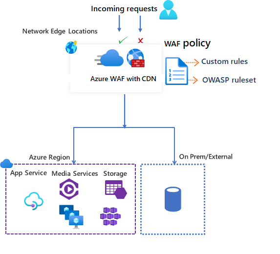

# Azure Web Application Firewall on Azure Content Delivery Network from Microsoft

Azure Web Application Firewall (WAF) on Azure Content Delivery Network (CDN) from Microsoft provides centralized protection for your web content. WAF defends your web services against common exploits and vulnerabilities. It keeps your service highly available for your users and helps you meet compliance requirements.

> [!IMPORTANT]
> Azure WAF on Azure CDN from Microsoft preview is no longer accepting new customers. Customers are encouraged to use the [Azure WAF on Azure Front Door](../afds/afds-overview.md) instead. Existing CDN WAF customers are provided with a preview service level agreement. Certain features may not be supported or may have constrained capabilities.  See the [Supplemental Terms of Use for Microsoft Azure Previews](https://azure.microsoft.com/support/legal/preview-supplemental-terms/) for details.

WAF on Azure CDN is a global and centralized solution. It's deployed on Azure network edge locations around the globe. WAF stops malicious attacks close to the attack sources, before they reach your origin. You get global protection at scale without sacrificing performance. 

A WAF policy easily links to any CDN endpoint in your subscription. New rules can be deployed within minutes, so you can respond quickly to changing threat patterns.

## WAF policy and rules

You can configure a WAF policy and associate that policy to one or more CDN endpoints for protection. A WAF policy consists of two types of security rules:

- custom rules that you can create.

- managed rule sets that are a collection of Azure-managed pre-configured rules.

When both are present, custom rules are processed before processing the rules in a managed rule set. A rule is made of a match condition, a priority, and an action. Action types supported are: *ALLOW*, *BLOCK*, *LOG*, and *REDIRECT*. You can create a fully customized policy that meets your specific application protection requirements by combining managed and custom rules.

Rules within a policy are processed in a priority order. Priority is a unique number that defines the order of rules to process. Smaller numbers are a higher priority and those rules are evaluated before rules with a larger value. Once a rule is matched, the corresponding action that was defined in the rule is applied to the request. Once such a match is processed, rules with lower priorities aren't processed further.

A web application hosted on Azure CDN can have only one WAF policy associated with it at a time. However, you can have a CDN endpoint without any WAF policies associated with it. If a WAF policy is present, it's replicated to all of our edge locations to ensure consistent security policies across the world.

## WAF modes

WAF policy can be configured to run in the following two modes:

- *Detection mode*: When run in detection mode, WAF doesn't take any other actions other than monitors and logs the request and its matched WAF rule to WAF logs. You can turn on logging diagnostics for CDN. When you use the portal, go to the **Diagnostics** section.

- *Prevention mode*: In prevention mode, WAF takes the specified action if a request matches a rule. If a match is found, no further rules with a lower priority are evaluated. Any matched requests are also logged in the WAF logs.

## WAF actions

You can choose one of the following actions when a request matches a rule's conditions:

- *Allow*: The request passes through the WAF and is forwarded to back-end. No further lower priority rules can block this request.
- *Block*: The request is blocked and WAF sends a response to the client without forwarding the request to the back-end.
- *Log*:  The request is logged in the WAF logs and WAF continues evaluating lower priority rules.
- *Redirect*: WAF redirects the request to the specified URI. The URI specified is a policy level setting. Once configured, all requests that match the *Redirect* action are sent to that URI.

## WAF rules

A WAF policy can consist of two types of security rules:

- *custom rules*: rules that you can create yourself. 
- *managed rule sets*: Azure managed pre-configured set of rules that you can enable.

### Custom rules

Custom rules can have match rules and rate control rules.

You can configure the following custom match rules:

- *IP allowlist and blocklist*: You can control access to your web applications based on a list of client IP addresses or IP address ranges. Both IPv4 and IPv6 address types are supported.  IP list rules use the RemoteAddress IP contained in the X-Forwarded-For request header and not the SocketAddress that the WAF sees. IP lists can be configured to either block or allow requests where the RemoteAddress IP matches an IP in the list. If you have a requirement to block request on the source IP address that WAF sees, for example the proxy server address if the user is behind a proxy, you should use the Azure Front Door standard or premium tiers. For more information, see [Configure an IP restriction rule with a Web Application Firewall for Azure Front Door](../afds/waf-front-door-configure-ip-restriction.md) for details.

- *Geographic based access control*: You can control access to your web applications based on the country code that's associated with a client's IP address.

- *HTTP parameters-based access control*: You can base rules on string matches in HTTP/HTTPS request parameters.  For example, query strings, POST args, Request URI, Request Header, and Request Body.

- *Request method-based access control*: You base rules on the HTTP request method of the request. For example, GET, PUT, or HEAD.

- *Size constraint*: You can base rules on the lengths of specific parts of a request such as query string, Uri, or request body.

A rate control rule limits abnormally high traffic from any client IP address.

- *Rate limiting rules*: You can configure a threshold on the number of web requests allowed from a client IP address during a one-minute duration. This rule is distinct from an IP list-based allow/block custom rule that either allows all or blocks all request from a client IP address. Rate limits can be combined with more match conditions such as HTTP(S) parameter matches for granular rate control.

### Azure-managed rule sets

Azure-managed rule sets provide an easy way to deploy protection against a common set of security threats. Since these rulesets are managed by Azure, the rules are updated as needed to protect against new attack signatures. The Azure managed Default Rule Set includes rules against the following threat categories:

- Cross-site scripting
- Java attacks
- Local file inclusion
- PHP injection attacks
- Remote command execution
- Remote file inclusion
- Session fixation
- SQL injection protection
- Protocol attackers

The version number of the Default Rule Set increments when new attack signatures are added to the rule set.
The Default Rule Set is enabled by default in *Detection* mode in your WAF policies. You can disable or enable individual rules within the Default Rule Set to meet your application requirements. You can also set specific actions (ALLOW/BLOCK/REDIRECT/LOG) per rule. The default action for the managed Default Rule Set is *Block*.

Custom rules are always applied before rules in the Default Rule Set are evaluated. If a request matches a custom rule, the corresponding rule action is applied. The request is either blocked or passed through to the back-end. No other custom rules or the rules in the Default Rule Set are processed. You can also remove the Default Rule Set from your WAF policies.

## Configuration

You can configure and deploy all WAF rule types using the Azure portal, REST APIs, Azure Resource Manager templates, and Azure PowerShell.

## Monitoring

Monitoring for WAF with CDN is integrated with Azure Monitor to track alerts and easily monitor traffic trends.

## Next steps

- [Azure CLI for CDN WAF](/cli/azure/cdn/waf)
