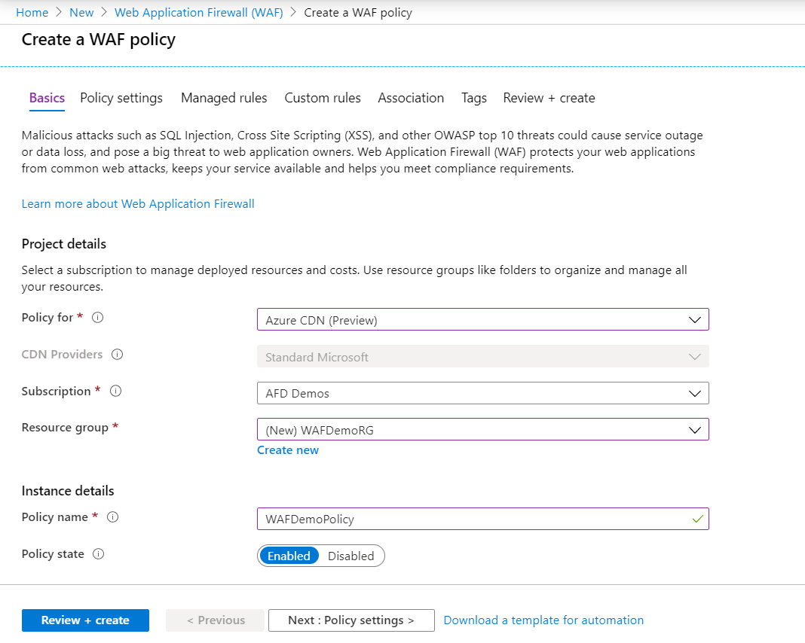
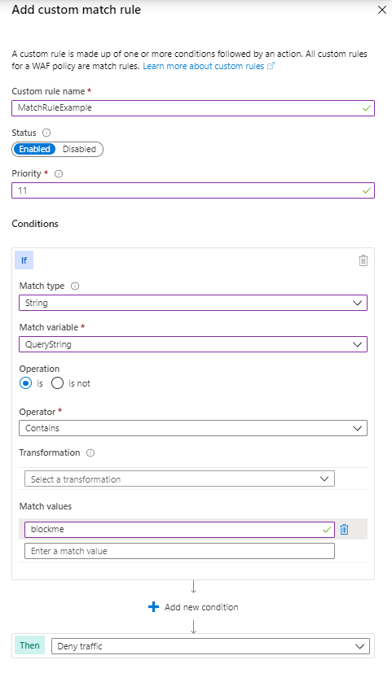
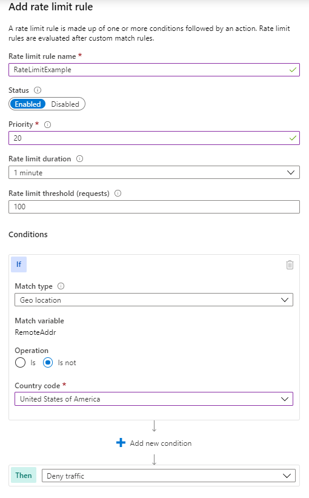

# Tutorial: Create a WAF policy on Azure CDN using the Azure portal

This tutorial shows you how to create a basic Azure Web Application Firewall (WAF) policy and apply it to an endpoint on Azure Content Delivery Network (CDN).

In this tutorial, you learn how to:

> [!div class="checklist"]
> * Create a WAF policy
> * Associate it with a CDN endpoint. You can associate a WAF policy only with endpoints that are hosted on the **Azure CDN Standard from Microsoft** SKU.
> * Configure WAF rules

## Prerequisites

Create an Azure CDN profile and endpoint by following the instructions in [Quickstart: Create an Azure CDN profile and endpoint](../../cdn/cdn-create-new-endpoint.md). 

## Create a Web Application Firewall policy

First, create a basic WAF policy with a managed Default Rule Set (DRS) using the portal.

1. On the top left-hand side of the screen, select **Create a resource**>search for **WAF**>select **Web application firewall** > select **Create**.
2. In the **Basics** tab of the **Create a WAF policy** page, enter or select the following information, accept the defaults for the remaining settings, and then select **Review + create**:

    | Setting                 | Value                                              |
    | ---                     | ---                                                |
    | Policy For            |Select Azure CDN (Preview).|
    | Subscription            |Select your Front Door subscription name.|
    | Resource group          |Select your Front Door resource group name.|
    | Policy name             |Enter a unique name for your WAF policy.|

   

3. In the **Association** tab of the **Create a WAF policy** page, select **Add CDN Endpoint**, enter the following settings, and then select **Add**:

    | Setting                 | Value                                              |
    | ---                     | ---                                                |
    | CDN Profile              | Select your CDN profile name.|
    | Endpoint           | Select the name of your endpoint, then select **Add**.|
    
    > [!NOTE]
    > If the endpoint is associated with a WAF policy, it is shown grayed out. You must first remove the Endpoint from the associated policy, and then re-associate the endpoint to a new WAF policy.
1. Select **Review + create**, then select **Create**.

## Configure Web Application Firewall policy (optional)

### Change mode

By default WAF policy is in *Detection* mode when you create a WAF policy. In *Detection* mode, WAF doesn't block any requests. Instead, requests matching the WAF rules are logged at WAF logs.

To see WAF in action, you can change the mode settings from *Detection* to *Prevention*. In *Prevention* mode, requests that match rules that are defined in Default Rule Set (DRS) are blocked and logged at WAF logs.

 

### Custom rules

To create a custom rule, select **Add custom rule** under the **Custom rules** section. This opens the custom rule configuration page. There are two types of custom rules: **match rule** and **rate limit** rule.

The following screenshot shows a custom match rule to block a request if the query string contains the value **blockme**.

Rate limit rules require two additional fields: **Rate limit duration** and **Rate limit threshold (requests)** as shown in the following example:

### Default Rule Set (DRS)

The Azure managed Default Rule Set is enabled by default. To disable an individual rule within a rule group, expand the rules within that rule group,  select the check box in front of the rule number, and select **Disable** on the tab above. To change actions types for individual rules within the rule set, select the check box in front of the rule number, and then select the **Change action** tab above.

 

## Next steps

> [!div class="nextstepaction"]
> [Learn about Azure Web Application Firewall](../overview.md)
