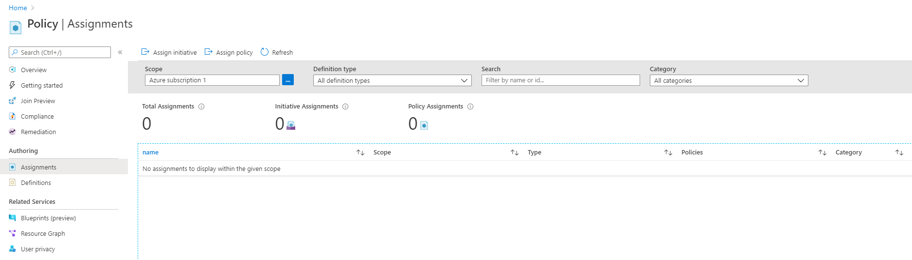
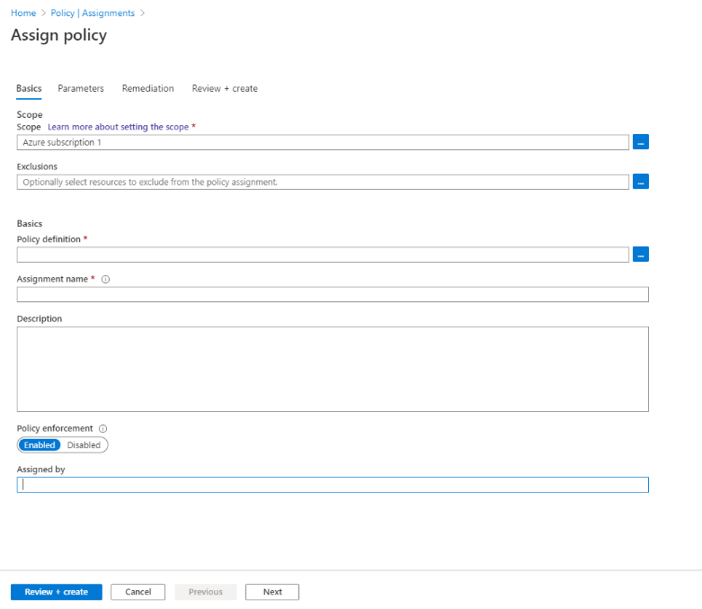
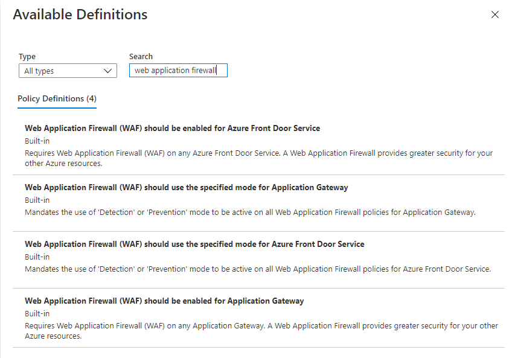

# Azure Web Application Firewall and Azure Policy

Azure Web Application Firewall (WAF) combined with Azure Policy can help enforce organizational standards and assess compliance at-scale for WAF resources. Azure policy is a governance tool that provides an aggregated view to evaluate the overall state of the environment, with the ability to drill down to the per-resource, per-policy granularity. Azure policy also helps to bring your resources to compliance through bulk remediation for existing resources and automatic remediation for new resources.

## Azure Policies for Web Application Firewall

There are several built-in Azure Policies to manage WAF resources. A breakdown of the policies and their functionalities are as follows:

1. **Web Application Firewall (WAF) should be enabled for Azure Front Door Service**: Azure Front Door Services are evaluated on if there is a WAF present on resource creation. The policy has three effects: Audit, Deny, and Disable. Audit tracks when an Azure Front Door Service does not have a WAF and lets users see what Azure Front Door Service does not comply. Deny prevents any Azure Front Door Service from being created if a WAF is not attached. Disabled turns off this policy.

2. **Web Application Firewall (WAF) should be enabled for Application Gateway**: Application Gateways are evaluated on if there is a WAF present on resource creation. The policy has three effects: Audit, Deny, and Disable. Audit tracks when an Application Gateway does not have a WAF and lets users see what Application Gateway does not comply. Deny prevents any Application Gateway from being created if a WAF is not attached. Disabled turns off this policy.

3. **Web Application Firewall (WAF) should use the specified mode for Azure Front Door Service**: Mandates the use of 'Detection' or 'Prevention' mode to be active on all Web Application Firewall policies for Azure Front Door Service. The policy has three effects: Audit, Deny, and Disable. Audit tracks when a WAF does not fit the specified mode. Deny prevents any WAF from being created if it is not in the correct mode. Disabled turns off this policy.

4. **Web Application Firewall (WAF) should use the specified mode for Application Gateway**: Mandates the use of 'Detection' or 'Prevention' mode to be active on all Web Application Firewall policies for Application Gateway. The policy has three effects: Audit, Deny, and Disable. Audit tracks when a WAF does not fit the specified mode. Deny prevents any WAF from being created if it is not in the correct mode. Disabled turns off this policy.

## Launch an Azure Policy

1.	On the Azure home page, type Policy in the search bar and click the Azure Policy icon

2.	On the Azure policy service, under **Authoring**, select **Assignments**.

[!div class="mx-imgBorder"]

3.	On the Assignments page, select the **Assign policy** icon at the top.

[!div class="mx-imgBorder"]

4.	On the Assign Policy page basics tab, update the following fields:
    1.	**Scope**: Select what Azure subscriptions and resource groups should be impacted by the Azure Policy.
    2.	**Exclusions**: Select any resources from the scope to exclude from the policy 
    3.	**Policy Definition**: Select the Azure Policy to apply to the scope with exclusions. Type “Web Application Firewall” in the search bar to choose the relevant Web Application Firewall Azure Policy.

[!div class="mx-imgBorder"]

5.	Select the **Parameters** tab and update the policies parameters. To further clarify what the parameter does, hover over the info icon next to the parameter name for further clarification.

6.	Select **Review + create** to finalize your Azure policy. The Azure policy will take approximately 15 minutes until it will be active for new resources.
