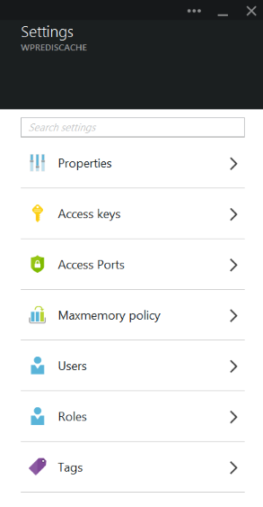
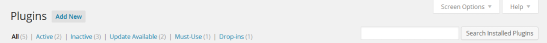
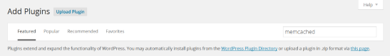
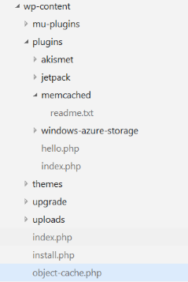

<properties 
   pageTitle="Connect a web app in Azure App Service to Redis Cache via the Memcache protocol" 
   description="Connect a web app in Azure App service to Redis Cache using the Memcache protocol" 
   services="app-service\web" 
   documentationCenter="php" 
   authors="SyntaxC4" 
   manager="wpickett" 
   editor="riande"/>
   
<tags
   ms.service="app-service-web"
   ms.devlang="php"
   ms.topic="article"
   ms.tgt_pltfrm="windows"
   ms.workload="web" 
   ms.date="03/31/2015"
   ms.author="cfowler"/>

# Connect a web app in Azure App Service to Redis Cache via the Memcache protocol

In this article, you will learn how to connect a WordPress web app in [Azure App Service](http://go.microsoft.com/fwlink/?LinkId=529714) to [Azure Redis Cache][12] using the [Memcache][13] protocol. If you have an existing web app that uses a Memcached server for in-memory caching, You can migrate it to Azure App Service and use the first-party caching solution in Microsoft Azure with little or no change to your application code. Furthermore, you can leverage your existing Memcache expertise to create highly scalable, distributed apps in Azure App Service with Azure Redis Cache for in-memory caching, while using popular application frameworks such as .NET, PHP, Node.js, Java, and Python.  

App Service Web Apps enables this application scenario with the Web Apps Memcache shim, which is a local Memcached server that acts as a Memcache proxy for caching calls to Azure Redis Cache. This enables any app that communicates using the Memcache protocol to cache data with Redis Cache. This Memcache shim works at the protocol level, so it can be used by any application or application framework as long as it communicates using the Memcache protocol.

## Prerequisites

The Web Apps Memcache shim can be used with any application provided it communicates using the Memcache protocol. For this particular example, the reference application is a Scalable WordPress site which can be provisioned from the Azure Marketplace. 

Follow the steps outlined in these posts:

* [Provision an instance of the Azure Redis Cache Service][1]
* [Deploy a Scalable WordPress site in Azure][0]

Once you have the Scalable WordPress site deployed and a Redis Cache instance provisioned you will be ready to proceed with enabling the Memcache shim in Azure App Service Web Apps.

## Enable the Web Apps Memcache shim

In order to configure Memcache shim, you must create three app settings. This can be done using a variety of methods including the [Azure Portal](http://go.microsoft.com/fwlink/?LinkId=529715), the [Old Portal][3], the [Azure PowerShell Cmdlets][5] or the [Azure Cross Platform Command-Line tools][5]. For the purposes of this post, I’m going to use the [Azure Portal][4] to set the app settings. The following values can be retrieved from **Settings** blade of your Redis Cache instance.



### Add REDIS_HOST app setting

The first app setting you need to create is the **REDIS\_HOST** app setting. This setting sets the destination to which the shim forwards the cache information. The value required for the REDIS_HOST app setting can be retrieved from the **Properties** blade of your Redis Cache instance.


Set the key of the app setting to **REDIS\_HOST** and the value of the app setting to the **hostname** of the Redis Cache instance.


### Add REDIS_KEY app setting

The second app setting you need to create is the **REDIS\_KEY** app setting. This setting provides the authentication token required to securely access the Redis Cache instance. The value required for the REDIS_KEY app setting can be retrieved from the **Access keys** blade of the Redis Cache instance.


Set the key of the app setting to **REDIS\_KEY** and the value of the app setting to the **Primary Key** of the Redis Cache instance.


### Add MEMCACHESHIM_REDIS_ENABLE app setting

The last app setting is used to enable the Memcache Shim in Web Apps, which will use the REDIS_HOST and REDIS_KEY to connect to the Azure Redis Cache and forward the cache calls. Set the key of the app setting to **MEMCACHESHIM\_REDIS\_ENABLE** and the value to **true**.


Once you are done adding the three (3) app settings, click **Save**.

## Enable Memcache extension for PHP

In order for the application to speak the Memcache protocol, it is necessary to install the Memcache extension to PHP, (the language framework for your WordPress site).

### Download the php_memcache Extension

Browse to [PECL][6], under the caching category, click on [memcache][7]. Under the downloads column click on the DLL link.


Download the Non-Thread Safe (NTS) x86 link for the version of PHP enabled in Web Apps. (Default is PHP 5.4)


### Enable the php_memcache extension

After downloading the file, unzip and upload the **php\_memcache.dll** into the **d:\\home\\site\\wwwroot\\bin\\ext\\** directory. After the php_memcache.dll has been uploaded into the web app, the extension needs to be enabled to the PHP Runtime. To enable the Memcache extension in the Azure Portal, open the **Application Settings** blade for the web app, then add a new app setting with the key of **PHP\_EXTENSIONS** and the value **bin\\ext\\php_memcache.dll**.


> If the web app needs to load multiple PHP extensions, the value of PHP_EXTENSIONS should be a comma delimited list of relative paths to DLL files.


Once finished, click **Save**.

## Install Memcache WordPress plugin

On the WordPress plugins page, click the **Add New** button.



In the search box, type **memcached** and press the **Enter** key.



Find **Memcached Object Cache** in the list, then click on the **Install Now** button.


### Enable the Memcache WordPress plugin

>[AZURE.NOTE] Follow the instructions in this blog on [How to enable a Site Extension in Web Apps][8] to install Visual Studio Online.

In the `wp-config.php` file, add the following code snippet above the stop editing comment near the end of the file.

```php
$memcached_servers = array(
	'default' => array('localhost:' . getenv("MEMCACHESHIM_PORT"))
);
```

Once this code snippet has been pasted, monaco will automatically save the document.

The next step is to enable the object-cache plugin. This is done by dragging and dropping **object-cache.php** from **wp-content/memcached** folder to the **wp-content** folder to enable the Memcache Object Cache functionality.


Now that the **object-cache.php** file is in the **wp-content** folder, the Memcached Object Cache is now enabled.



## Verifying the Memcache Object Cache plugin is functioning

All of the steps to enable the Web Apps Memcache shim are now complete. The only thing left is to verify that the data is populating your Redis Cache instance.

### Enable the non-SSL port support in Azure Redis Cache

>[AZURE.NOTE] At the time of writing this document, the Redis CLI does not support SSL connectivity, thus the following steps are necessary.

In the Azure Protal, browse to the Redis Cache instance that you created for this web app. Once the cache's blade is open, click on the **Settings** icon.


Select **Access Ports** from the list.


Click **No** for **Allow access only via SSL**.


You will see that the NON-SSL port is now set. Click **Save**.


### Connect to Azure Redis Cache from redis-cli

>[AZURE.NOTE] This step assumes that redis is installed locally on your development machine. [Install Redis locally using these instructions][9].

Open your command-line console of choice and type the following command:

```shell
redis-cli –h <hostname-for-redis-cache> –a <primary-key-for-redis-cache> –p 6379
```

Replace the **<hostname-for-redis-cache>** with the actual xxxxx.redis.cache.windows.net hostname and the **<primary-key-for-redis-cache>** with the access key for the cache, then press **Enter**. Once the CLI has connected to the Redis Cache instance, issue any redis command. In the screenshot below, I’ve chosen to list the keys.


The call to list the keys should return a value. If not, try navigating to the web app and trying again.

## Conclusion

Congratulations! The WordPress app now has a centralized in-memory cache to aid in increasing throughput. Remember, the Web Apps Memcache Shim can be used with any Memcache client regardless of programming language or application framework. To provide feedback or to ask questions about the Web Apps Memcache shim, post to [MSDN Forums][10] or [Stackoverflow][11].

>[AZURE.NOTE] If you want to get started with Azure App Service before signing up for an Azure account, go to [Try App Service](http://go.microsoft.com/fwlink/?LinkId=523751), where you can immediately create a short-lived starter web app in App Service. No credit cards required; no commitments.

## What's changed
* For a guide to the change from Websites to App Service see: [Azure App Service and Its Impact on Existing Azure Services](http://go.microsoft.com/fwlink/?LinkId=529714)
* For a guide to the change of the old portal to the new portal see: [Reference for navigating the preview portal](http://go.microsoft.com/fwlink/?LinkId=529715)


[0]: http://bit.ly/1F0m3tw
[1]: http://bit.ly/1t0KxBQ
[2]: http://manage.windowsazure.com
[3]: http://portal.azure.com
[4]: powershell-install-configure.md
[5]: /downloads
[6]: http://pecl.php.net
[7]: http://pecl.php.net/package/memcache
[8]: http://blog.syntaxc4.net/post/2015/02/05/how-to-enable-a-site-extension-in-azure-websites.aspx
[9]: http://redis.io/download#installation
[10]: https://social.msdn.microsoft.com/Forums/home?forum=windowsazurewebsitespreview
[11]: http://stackoverflow.com/questions/tagged/azure-web-sites
[12]: /services/cache/
[13]: http://memcached.org
