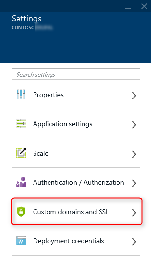
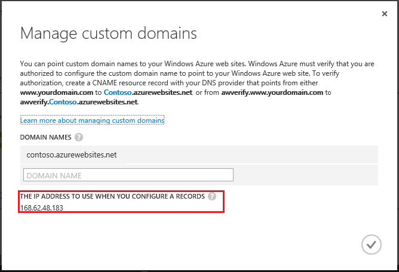

<properties pageTitle="Configure a custom domain name for an Azure website" description="" services="web-sites" documentationCenter="" authors="blackmist" manager="wpickett" editor=""/>

<tags ms.service="web-sites" ms.workload="web" ms.tgt_pltfrm="na" ms.devlang="na" ms.topic="article" ms.date="09/17/2014" ms.author="larryfr, jroth, mwasson"/>

#Configuring a custom domain name for an Azure Website

<a href="/en-us/documentation/articles/web-sites-custom-domain-name" title="Custom Domain" class="current">Custom Domain</a><a href="/en-us/documentation/articles/web-sites-godaddy-custom-domain-name" title="GoDaddy">GoDaddy</a><a href="/en-us/documentation/articles/web-sites-network-solutions-custom-domain-name" title="Network Solutions">Network Solutions</a><a href="/en-us/documentation/articles/web-sites-registerdotcom-custom-domain-name" title="Register.com">Register.com</a><a href="/en-us/documentation/articles/web-sites-enom-custom-domain-name" title="Enom">Enom</a><a href="/en-us/documentation/articles/web-sites-moniker-custom-domain-name" title="Moniker">Moniker</a><a href="/en-us/documentation/articles/web-sites-dotster-custom-domain-name" title="Dotster">Dotster</a><a href="/en-us/documentation/articles/web-sites-domaindiscover-custom-domain-name" title="DomainDiscover">DomainDiscover</a><a href="/en-us/documentation/articles/web-sites-directnic-custom-domain-name" title="Directnic">Directnic</a>

<a href="/en-us/documentation/articles/web-sites-custom-domain-name/" title="Websites" class="current">Website</a> | <a href="/en-us/documentation/articles/web-sites-traffic-manager-custom-domain-name/" title="Website using Traffic Manager">Website using Traffic Manager</a>

[WACOM.INCLUDE [websites-cloud-services-css-guided-walkthrough](../includes/websites-cloud-services-css-guided-walkthrough.md)]

When you create a website, Azure assigns it to a subdomain of azurewebsites.net. For example, if your website is named **contoso**, the URL is **contoso.azurewebsites.net**. Azure also assigns a virtual IP address.

![contoso.azurewebsites.net subdomain][subdomain]

For a production website, you probably want users to see a custom domain name. This article explains how to configure a custom domain with Azure Websites. (This article provides generic instructions for any domain registrar. The tabs at the top of this article link to some articles for specific registrars.)

[WACOM.INCLUDE [introfooter](../includes/custom-dns-web-site-intro-notes.md)]

In this article:

-   [Overview]
-   [DNS record types]
-   [Find the virtual IP address]
-   [Create the DNS records]
-   [Create an “awverify” record (A records only)](#awverify)
-   [Enable the domain name on your website]

## Overview

Here are the general steps to configure a custom domain name:

1. Reserve your domain name. This article does not cover that process. There are many domain registrars to choose from. When you sign up, their site will walk you through the process.
1. Create DNS records that map the domain to your Azure website. 
1. Add the domain name inside the Azure Management Portal. 

Within this basic outline, there are specific cases to consider:

- Mapping your root domain. The root domain is the domain that you reserved with the domain registrar. For example, **contoso.com**.
- Mapping a subdomain. For example, **blogs.contoso.com**.  You can map different subdomains to different websites.
- Mapping a wildcard. For example, ***.contoso.com**. A wildcard entry applies to all subdomains of your domain. 
 
[WACOM.INCLUDE [modes](../includes/custom-dns-web-site-modes.md)]

## DNS record types

The Domain Name System (DNS) uses data records to map domain names into IP addresses. There are several types of DNS records. For websites, you’ll create either an *A* record or a *CNAME* record.

- An A **(Address)** record maps a domain name to an IP address. 
- A **CNAME (Canonical Name)** record maps a domain name to another domain name. DNS uses the second name to look up the address. Users still see the first domain name in their browser. For example, you could map contoso.com to *&lt;yoursite&gt;*.azurewebsites.net. 

If the IP address changes, a CNAME entry is still valid, whereas an A record must be updated. However, some domain registrars do not allow CNAME records for the root domain or for wildcard domains. In that case, you must use an A record. 

> [AZURE.NOTE] The IP address may change if you delete and recreate your website, or change the website mode back to free.

## Find the virtual IP address 

Skip this step if you are creating a CNAME record. To create an A record, you need the virtual IP address of your website. To get the IP address:

1.	In your browser, open the [Azure Management Portal](https://manage.windowsazure.com).
2.	In the **Websites** tab, click the name of your site and select **Dashboard**.
3.	Select **Manage Domains** from the bottom of the page. (If this option is disabled, make sure you are using Shared, Basic, or Standard mode. For more information, see [How to scale websites](http://www.windowsazure.com/en-us/documentation/articles/web-sites-scale/).) 

	

4.	The IP address is listed toward the bottom of the dialog.

	

## Create the DNS records

Log in to your domain registrar and use their tool to add an A record or CNAME record. Every registrar’s website is slightly different, but here are some general guidelines. 

1.	Find the page for managing DNS records. Look for links or areas of the site labeled **Domain Name**, **DNS**, or **Name Server Management**. Often the link can be found be viewing your account information, and then looking for a link such as **My domains**.
2.	When you find the management page, look for a link that lets you add or edit DNS records. This might be listed as a **Zone file**, **DNS Records**, or as an **Advanced** configuration link.

The page might list A records and CNAME records separately, or else provide a drop-down to select the record type. Also, it might use other names for the record types, such as **IP Address record** instead of A record, or **Alias Record** instead of CNAME record.  Usually the registrar creates some records for you, so there may already be records for the root domain or common subdomains, such as **www**.

When you create or edit a record, the fields will let you map your domain name to an IP address (for A records) or another domain (for CNAME records). For a CNAME record, you will map *from* your custom domain *to* your azurewebsites.net subdomain. 

In many registrar tools, you will just type the subdomain portion of your domain, not the entire domain name. Also, many tools use ‘@’ to mean the root domain. For example:

<table cellspacing="0" border="1">
<tr>
	<th>Host</th>
	<th>Record type</th>
	<th>IP Address or URL</th>
</tr>
<tr>
	<td>@</td>
	<td>A (address)</td>
	<td>127.0.0.1</td>
</tr>
<tr>
	<td>www</td>
	<td>CNAME (alias)</td>
	<td>contoso.azurewebsites.net</td>
</tr>
</table>

Assuming the custom domain name is ‘contoso.com’, this would create the following records:

- **contoso.com** mapped to 127.0.0.1.
- **www.contoso.com** mapped to **contoso.azurewebsites.net**.

<h2 id="awverify">Create an “awverify” record (A records only)</h2>

If you create an A record, Azure websites also requires a special CNAME record, which is used to verify that you own the domain you are attempting to use. This CNAME record must have the following form. 

- *If the A record maps the root domain or a wildcard domain:* Create a CNAME record that maps from **awverify.&lt;yourdomain&gt;** to **awverify.&lt;yourwebsitename&gt;.azurewebsites.net**.  For example, if the A record is for **contoso.com**, create a CNAME record for **awverify.contoso.com**.
- *If the A record maps a specific subdomain:* Create a CNAME record that maps from **awverify.&lt;subdomain&gt;** to **awverify.&lt;yourwebsitename&gt;.azurewebsites.net**. For example, if the A record is for **blogs.contoso.com**, create a CNAME record for **awverify.blogs.contoso.com**.

Visitors to your site will not see the awverify subdomain; it’s only for Azure to verify your domain.

## Enable the domain name on your website

[WACOM.INCLUDE [modes](../includes/custom-dns-web-site-enable-on-web-site.md)]

<!-- Anchors. -->
[Overview]: #overview
[DNS record types]: #dns-record-types
[Find the virtual IP address]: #find-the-virtual-ip-address
[Create the DNS records]: #create-the-dns-records
[Enable the domain name on your website]: #enable-the-domain-name-on-your-website

<!-- Images -->
[subdomain]: media/web-sites-custom-domain-name/azurewebsites-subdomain.png