<properties 
	pageTitle="Create and deploy a secure ASP.NET Web Forms app with Membership, OAuth, and SQL Database to Azure App Service" 
	description="This tutorial shows you how to build a secure ASP.NET 4.5 Web Forms web app that incorporates a SQL Database and deploy the application to Azure." 
	services="web-sites" 
	documentationCenter=".net" 
	authors="Erikre" 
	manager="wpickett" 
	editor="mollybos"/>

<tags 
	ms.service="web-sites" 
	ms.workload="web" 
	ms.tgt_pltfrm="na" 
	ms.devlang="dotnet" 
	ms.topic="article" 
	ms.date="02/09/2015" 
	ms.author="erikre"/>

# Create and deploy a secure ASP.NET Web Forms app with Membership, OAuth, and SQL Database to Azure App Service

##Overview
This tutorial shows you how to build a secure ASP.NET 4.5 Web Forms web app that incorporates a SQL Database and deploy the application to Azure. 

>[AZURE.NOTE] 
For an MVC version of this tutorial, see [Create an ASP.NET MVC app with auth and SQL DB and deploy to Azure App Service](web-sites-dotnet-deploy-aspnet-mvc-app-membership-oauth-sql-database.md).

You can open an Azure account for free, and if you don't already have Visual Studio 2013, the SDK automatically installs Visual Studio 2013 for Web Express. You can start developing for Azure for free.

This tutorial assumes that you have no prior experience using Microsoft Azure. Once completing this tutorial, you'll have a web application up and running in the cloud that uses a cloud database.

You'll learn:

- How to create an ASP.NET 4.5 Web Forms project and publish it to Azure App Service.
- How to use OAuth and the ASP.NET membership to secure your application.
- How to use a single database for both membership and application data.
- How to use Web Forms Scaffolding to create web pages that allow you to modify data.
- How to use the new membership API to add users and roles.
- How to use a SQL database to store data in Azure.

You'll build a simple contact list web application that is built on ASP.NET 4.5 Web Forms and uses the Entity Framework for database access. The following image shows the Web Forms page that allows read and write access to the database:

>[AZURE.NOTE] 
To complete this tutorial, you need an Azure account. If you don't have an account, you can <a href="/pricing/member-offers/msdn-benefits-details/?WT.mc_id=A261C142F" target="_blank">activate your MSDN subscriber benefits</a> or <a href="/pricing/free-trial/?WT.mc_id=A261C142F" target="_blank">sign up for a free trial</a>. If you want to get started with Azure before signing up for an account, go to <a href="https://trywebsites.azurewebsites.net/">https://trywebsites.azurewebsites.net</a>, where you can immediately create a short-lived ASP.NET starter site in Azure for free. No credit card required, no commitments.

##Set up the Development Environment 
To start, set up your development environment by installing the Visual Studio 2013 and the Azure SDK for .NET.

1. Install [Visual Studio 2013](http://go.microsoft.com/fwlink/?LinkId=306566), if you don't already have it installed.  
2. Install [Azure SDK for Visual Studio 2013](http://go.microsoft.com/fwlink/?linkid=324322&clcid=0x409). This tutorial requires Visual Studio 2013 before installing the Azure SDK for Visual Studio 2013.  

	>[AZURE.NOTE]  
	Depending on how many of the SDK dependencies you already have on your machine, installing the SDK could take a long time, from several minutes to a half hour or more.  

3. If you are prompted to run or save the installation executable, click **Run**.
4. In the **Web Platform Installer** window, click **Install** and proceed with the installation.  
	  

	>[AZURE.NOTE]  
	If you already have the SDK installed, there will be 0 items to be installed. The number of items to install will be noted at the lower left of the **Web Platform Installer** window.  

5. If you don't already have **Visual Studio Update 2**, download and install **[Visual Studio 2013 Update 2](http://www.microsoft.com/download/details.aspx?id=42666)** or higher.  

	>[AZURE.NOTE]  
	You must install Visual Studio 2013 Update 2 or higher to use Goggle OAuth 2.0 and to use SSL locally without warnings. Also, you need Update 2 to use Web Forms Scaffolding.  

When the installation is complete, you have everything necessary to start developing.

##Set up the Azure Environment
In this section you'll set up the Azure environment by creating an Azure and a SQL database in Azure.

###Create a Web App and a SQL Database in Azure 
In this tutorial your web app will run in a shared hosting environment, which means it runs on virtual machines (VMs) that are shared with other web apps in Azure App Service. A shared hosting environment is a low-cost way to get started in the cloud. Later, if your web traffic increases, the application can scale to meet the need by running on dedicated VMs. If you need a more complex architecture, you can migrate to an Azure Cloud Service. Cloud services run on dedicated VMs that you can configure according to your needs. 

Azure SQL Database is a cloud-based relational database service that is built on SQL Server technologies. The tools and applications that work with SQL Server also work with SQL Database.

1. In the [Azure Management Portal](https://manage.windowsazure.com/), click **Web Apps** in the left tab, and then click **New**.  
	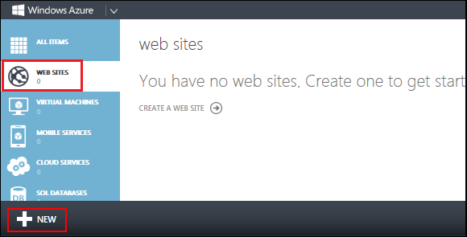
2. Click **Web App**, and then click **Custom Create**.  
	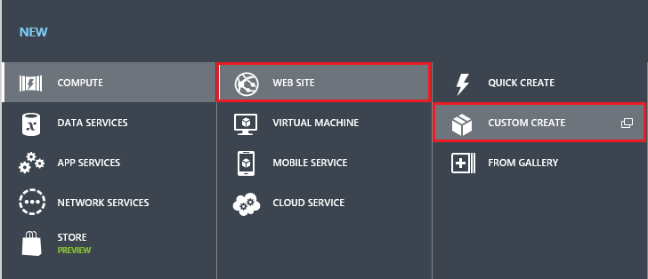  
	The **New Web App - Custom Create** wizard opens.  

3. In the **Create Web App** step of the wizard, enter a string in the **URL** box to use as the unique URL for your application. The complete URL will consist of what you enter here plus the suffix that you see next to the text box. The illustration shows a URL that is probably taken so **you must choose a different URL**.  
	  
4. In the Web Hosting Plan drop-down list, choose a region that is closest to your location. This setting specifies which data center where your VM will run.
5. In the **Database** drop-down list, choose **Create a free 20 MB SQL database**.
6. In the **DB Connection String Name** box, leave the default value of *DefaultConnection*.
7. Click the arrow at the bottom of the box. 
The wizard advances to the **Specify database settings** step.
8. In the **Name** box, enter *`ContactDB`*.  
	  
9. In the **Server** box, select **New SQL Database** server.
Alternatively, if you previously created a SQL Server database, you can select that SQL Server from the dropdown control.
10. Set the **Region** to the same area you created the web app.
11. Enter an administrator **Login Name** and **Password**. 
If you selected **New SQL Database server** you aren't entering an existing name and password here, you're entering a new name and password that you're defining now to use later when you access the database. If you selected a SQL Server you've created previously, you'll be prompted for the password to the previous SQL Server account name you created. For this tutorial, you won't check the **Advanced** box.
12. Click the check mark at the bottom right of the box to indicate you're finished.

The **Azure Management Portal** returns to the **Web Apps** page, and the **Status** column shows that the site is being created. Shortly after (typically less than a minute), the **Status** column shows that the site was successfully created. In the navigation bar at the left, the number of sites you have in your account appears next to the **Web App** icon, and the number of databases appears next to the **SQL Databases** icon.
##Create an ASP.NET Web Forms Application 
You have created a web app, but there is no content in it yet. Your next step is to create the Visual Studio web app that you'll publish to Azure.
###Create the Project 
1. Select **New Project** from the **File** menu in Visual Studio.  
	  
2. Select the **Templates** -> **Visual C#** -> **Web** templates group on the left. 
3. Choose the **ASP.NET Web Application** template in the center column.
4. Name your project *ContactManager* and click **OK**.  
	  

	>[AZURE.NOTE]  
	The name of the project in this tutorial series is **ContactManager**. It is recommended that you use this exact project name so that the code provided throughout the tutorial series functions as expected.  

5. In the **New ASP.NET Project** dialog box, select the **Web Forms** template. Uncheck the **Host in the cloud** check box if it is selected and click **OK**.  
	  
	The Web Forms application will be created.
###Update the Master Page
In ASP.NET Web Forms, master pages allow you to create a consistent layout for the pages in your application. A single master page defines the look and feel and standard behavior that you want for all of the pages (or a group of pages) in your application. You can then create individual content pages that contain the content you want to display. When users request the content pages, ASP.NET merges them with the master page to produce output that combines the layout of the master page with the content from the content page.
The new site needs the application name and a link updated. The link will point to a page that will display contact details. To make these changes you will modify the HTML on the master page. 

1. In **Solution Explorer**, find and open the *Site.Master* page. 
2. If the page is in **Design** view, switch to **Source** view.
3. Update the master page by modifying or adding the markup highlighted in yellow:

<pre class="prettyprint">
&lt;%@ Master Language=&quot;C#&quot; AutoEventWireup=&quot;true&quot; CodeBehind=&quot;Site.master.cs&quot; Inherits=&quot;ContactManager.SiteMaster&quot; %&gt;

&lt;!DOCTYPE html&gt;

&lt;html lang=&quot;en&quot;&gt;
&lt;head runat=&quot;server&quot;&gt;
    &lt;meta charset=&quot;utf-8&quot; /&gt;
    &lt;meta name=&quot;viewport&quot; content=&quot;width=device-width, initial-scale=1.0&quot; /&gt;
    &lt;title&gt;&lt;%: Page.Title %&gt; - <mark>Contact Manager</mark>&lt;/title&gt;

    &lt;asp:PlaceHolder runat=&quot;server&quot;&gt;
        &lt;%: Scripts.Render(&quot;~/bundles/modernizr&quot;) %&gt;
    &lt;/asp:PlaceHolder&gt;
    &lt;webopt:bundlereference runat=&quot;server&quot; path=&quot;~/Content/css&quot; /&gt;
    &lt;link href=&quot;~/favicon.ico&quot; rel=&quot;shortcut icon&quot; type=&quot;image/x-icon&quot; /&gt;

&lt;/head&gt;
&lt;body&gt;
    &lt;form runat=&quot;server&quot;&gt;
        &lt;asp:ScriptManager runat=&quot;server&quot;&gt;
            &lt;Scripts&gt;
                &lt;%--To learn more about bundling scripts in ScriptManager see http://go.microsoft.com/fwlink/?LinkID=301884 --%&gt;
                &lt;%--Framework Scripts--%&gt;
                &lt;asp:ScriptReference Name=&quot;MsAjaxBundle&quot; /&gt;
                &lt;asp:ScriptReference Name=&quot;jquery&quot; /&gt;
                &lt;asp:ScriptReference Name=&quot;bootstrap&quot; /&gt;
                &lt;asp:ScriptReference Name=&quot;respond&quot; /&gt;
                &lt;asp:ScriptReference Name=&quot;WebForms.js&quot; Assembly=&quot;System.Web&quot; Path=&quot;~/Scripts/WebForms/WebForms.js&quot; /&gt;
                &lt;asp:ScriptReference Name=&quot;WebUIValidation.js&quot; Assembly=&quot;System.Web&quot; Path=&quot;~/Scripts/WebForms/WebUIValidation.js&quot; /&gt;
                &lt;asp:ScriptReference Name=&quot;MenuStandards.js&quot; Assembly=&quot;System.Web&quot; Path=&quot;~/Scripts/WebForms/MenuStandards.js&quot; /&gt;
                &lt;asp:ScriptReference Name=&quot;GridView.js&quot; Assembly=&quot;System.Web&quot; Path=&quot;~/Scripts/WebForms/GridView.js&quot; /&gt;
                &lt;asp:ScriptReference Name=&quot;DetailsView.js&quot; Assembly=&quot;System.Web&quot; Path=&quot;~/Scripts/WebForms/DetailsView.js&quot; /&gt;
                &lt;asp:ScriptReference Name=&quot;TreeView.js&quot; Assembly=&quot;System.Web&quot; Path=&quot;~/Scripts/WebForms/TreeView.js&quot; /&gt;
                &lt;asp:ScriptReference Name=&quot;WebParts.js&quot; Assembly=&quot;System.Web&quot; Path=&quot;~/Scripts/WebForms/WebParts.js&quot; /&gt;
                &lt;asp:ScriptReference Name=&quot;Focus.js&quot; Assembly=&quot;System.Web&quot; Path=&quot;~/Scripts/WebForms/Focus.js&quot; /&gt;
                &lt;asp:ScriptReference Name=&quot;WebFormsBundle&quot; /&gt;
                &lt;%--Site Scripts--%&gt;
            &lt;/Scripts&gt;
        &lt;/asp:ScriptManager&gt;

        &lt;div class=&quot;navbar navbar-inverse navbar-fixed-top&quot;&gt;
            &lt;div class=&quot;container&quot;&gt;
                &lt;div class=&quot;navbar-header&quot;&gt;
                    &lt;button type=&quot;button&quot; class=&quot;navbar-toggle&quot; data-toggle=&quot;collapse&quot; data-target=&quot;.navbar-collapse&quot;&gt;
                        &lt;span class=&quot;icon-bar&quot;&gt;&lt;/span&gt;
                        &lt;span class=&quot;icon-bar&quot;&gt;&lt;/span&gt;
                        &lt;span class=&quot;icon-bar&quot;&gt;&lt;/span&gt;
                    &lt;/button&gt;
                    &lt;a class=&quot;navbar-brand&quot; runat=&quot;server&quot; <mark>id=&quot;ContactDemoLink&quot;</mark> href=&quot;~/<mark>Contacts/Default.aspx</mark>&quot;&gt;<mark>Contact Demo</mark>&lt;/a&gt;
                &lt;/div&gt;
                &lt;div class=&quot;navbar-collapse collapse&quot;&gt;
                    &lt;ul class=&quot;nav navbar-nav&quot;&gt;
                        &lt;li&gt;&lt;a runat=&quot;server&quot; href=&quot;~/&quot;&gt;Home&lt;/a&gt;&lt;/li&gt;
                        &lt;li&gt;&lt;a runat=&quot;server&quot; href=&quot;~/About&quot;&gt;About&lt;/a&gt;&lt;/li&gt;
                        &lt;li&gt;&lt;a runat=&quot;server&quot; href=&quot;~/Contact&quot;&gt;Contact&lt;/a&gt;&lt;/li&gt;
                    &lt;/ul&gt;
                    &lt;asp:LoginView runat=&quot;server&quot; ViewStateMode=&quot;Disabled&quot;&gt;
                        &lt;AnonymousTemplate&gt;
                            &lt;ul class=&quot;nav navbar-nav navbar-right&quot;&gt;
                                &lt;li&gt;&lt;a runat=&quot;server&quot; href=&quot;~/Account/Register&quot;&gt;Register&lt;/a&gt;&lt;/li&gt;
                                &lt;li&gt;&lt;a runat=&quot;server&quot; href=&quot;~/Account/Login&quot;&gt;Log in&lt;/a&gt;&lt;/li&gt;
                            &lt;/ul&gt;
                        &lt;/AnonymousTemplate&gt;
                        &lt;LoggedInTemplate&gt;
                            &lt;ul class=&quot;nav navbar-nav navbar-right&quot;&gt;
                                &lt;li&gt;&lt;a runat=&quot;server&quot; href=&quot;~/Account/Manage&quot; title=&quot;Manage your account&quot;&gt;Hello, &lt;%: Context.User.Identity.GetUserName()  %&gt; !&lt;/a&gt;&lt;/li&gt;
                                &lt;li&gt;
                                    &lt;asp:LoginStatus runat=&quot;server&quot; LogoutAction=&quot;Redirect&quot; LogoutText=&quot;Log off&quot; LogoutPageUrl=&quot;~/&quot; OnLoggingOut=&quot;Unnamed_LoggingOut&quot; /&gt;
                                &lt;/li&gt;
                            &lt;/ul&gt;
                        &lt;/LoggedInTemplate&gt;
                    &lt;/asp:LoginView&gt;
                &lt;/div&gt;
            &lt;/div&gt;
        &lt;/div&gt;
        &lt;div class=&quot;container body-content&quot;&gt;
            &lt;asp:ContentPlaceHolder ID=&quot;MainContent&quot; runat=&quot;server&quot;&gt;
            &lt;/asp:ContentPlaceHolder&gt;
            &lt;hr /&gt;
            &lt;footer&gt;
                &lt;p&gt;&amp;copy; &lt;%: DateTime.Now.Year %&gt; - <mark>Contact Manager</mark>&lt;/p&gt;
            &lt;/footer&gt;
        &lt;/div&gt;
    &lt;/form&gt;
&lt;/body&gt;
&lt;/html&gt;
</pre>  

Later in this tutorial you will add Web Forms scaffolding. Scaffolding will create the page that the above “Contact Demo” link references.
###Run the Application Locally 
1. In **Solution Explorer**, right-click the *Default.aspx* page and select **Set As Start Page**. 
2. Next, press **CTRL+F5** to run the application.  
	The application default page appears in the default browser window.
	  

This is all you need to do for now to create the application that you'll deploy to Azure. Later, you'll add database functionality, as well as the necessary pages to display and edit contact data.
###Deploy the Application to Azure
Now that you have created and ran your application locally, it is time to deploy the application to Azure.

1. In Visual Studio, right-click the project in **Solution Explorer** and select **Publish** from the context menu.  
	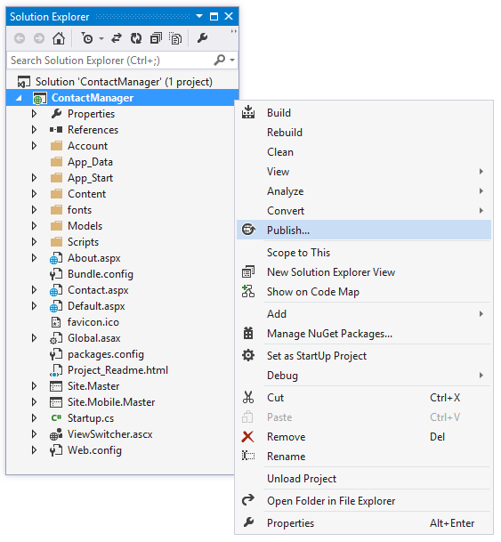  
	The **Publish Web** dialog box is displayed.  

2. In the **Profile** tab of the **Publish Web** dialog box, click **Azure Web App**.  
	  
3. If you are not already signed in, click the **Sign In** button in the **Select Existing Web App** dialog box. Once you've finished signing in, select the web app you created in the first part of this tutorial. Click **OK** to continue.  
	  
Visual Studio will download your publishing settings.
4. In the **Publish Web** dialog box, click **Publish**.  
	  
You will see the overall publishing status in the **Web Publish Activity** window within Visual Studio:  
	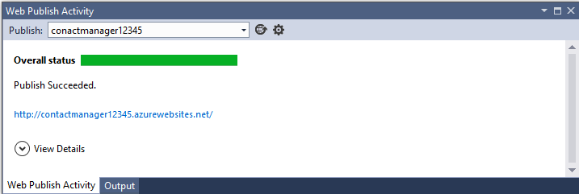  

The application you created is now running in the cloud. The next time you deploy the application from Visual Studio, only the changed (or new) files will be deployed.  
	  

>[AZURE.NOTE] 
If you run into an error while publishing to an already established web app, you can clear the location before adding your new files.  
Publish your application again, however in the **Publish Web** dialog box, select the **Settings** tab. Then, set the configuration to **Debug** and select the option to **Remove additional files at destination**. Select **Publish** to deploy your application again.  
	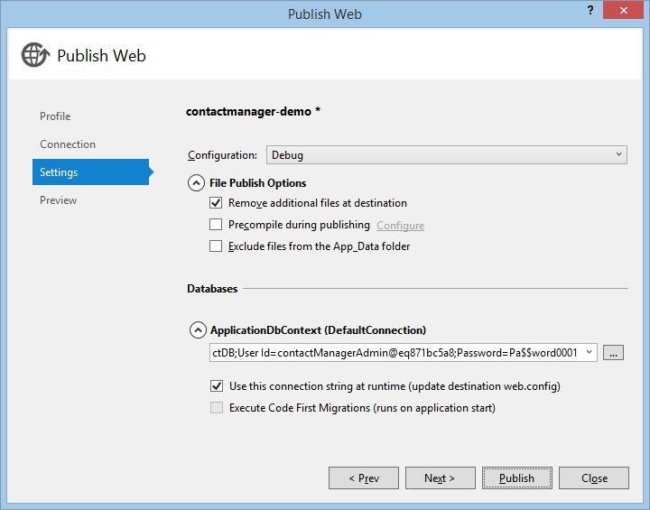  

##Add a Database to the Application 
Next, you'll update the Web Forms application to add the capability to display and update contacts, as well as store the data in the default database. When you created the Web Forms project, the database was also created by default. The application will use Entity Framework to access the database and to read and update data in the database.
###Add a Data Model Class 
You begin by creating a simple data model using code. This data model will be contained in a class called `Contacts`. The `Contacts` class name was chosen to avoid a class name conflict with the `Contact` class contained in the Contact.aspx.cs file created by the Web Forms template.  

1. In **Solution Explorer**, right-click the *Models* folder and then select **Add** -> **Class**.  
	  
	The **Add New Item** dialog box is displayed.  

2. Name this new class *Contacts.cs*.  
	  
3. Replace the default code with the following code:  
	<pre class="prettyprint">
	using System.ComponentModel.DataAnnotations;
	using System.Globalization;
	
	namespace ContactManager.Models
	{
	    public class Contacts
	    {
	        [ScaffoldColumn(false)]
	        [Key]
	        public int ContactId { get; set; }
	        public string Name { get; set; }
	        public string Address { get; set; }
	        public string City { get; set; }
	        public string State { get; set; }
	        public string Zip { get; set; }
	        [DataType(DataType.EmailAddress)]
	        public string Email { get; set; }
	    }
	}
	</pre>

The **Contacts** class defines the data that you will store for each contact, plus a primary key (`ContactID`) that is needed by the database. The **Contacts** class represents the contact data that will be displayed. Each instance of a Contacts object will correspond to a row within a relational database table, and each property of the Contacts class will map to a column in the relational database table. Later in this tutorial, you'll review the contact data contained in the database.

###Web Forms Scaffolding 
You've created the **Contacts** model class above. Now, you can use the Web Forms Scaffolder to generate *List*, *Insert*, *Edit* and *Delete* pages that are used when working with this data. The Web Forms Scaffolder uses Entity Framework, Bootstrap, and Dynamic Data. By default, the Web Forms Scaffolder is installed as an extension to your project as part of the project template when using Visual Studio 2013.

The following steps will allow you to use the Web Forms Scaffolder.

1. In Visual Studio, from the menu bar select **Tools** -> **Extensions and Updates**.  
	The **Extensions and Updates** dialog box is displayed.
2. From the left pane of the dialog box, select **Online** -> **Visual Studio Gallery** -> **Tools** -> **Scaffolding**.
3. If you don't see 'Web Forms Scaffolding' in the list, enter 'Web Forms Scaffolding' in the search box on the right of the dialog box.  
4. If the Web Forms Scaffolder is not already installed, select **Download** to download and install 'Web Forms Scaffolding'. Restart Visual Studio if needed. Be sure to save your changes to the project when requested.  
	  
5. Build the project (**Ctrl+Shift+B**).  
	You must build the project before using the scaffolding mechanism.  
6. In **Solution Explorer**, right-click the *project* and then select **Add** -> **New Scaffolded Item**.  
	The **Add Scaffold** dialog box is displayed.
7. Select **Web Forms** from the left pane and select **Web Forms Pages using Entity Framework** from the center pane. Then click **Add**.  
	  
	The **Add Web Forms Pages** dialog box is displayed.  

8. In the **Add Web Forms Pages** dialog box, set the **Model class** to `Contact (ContactManager.Models)`. Set the **Data context class** to `ApplicationDbContext (ContactManager.Models)`. Then click **Add**. 
	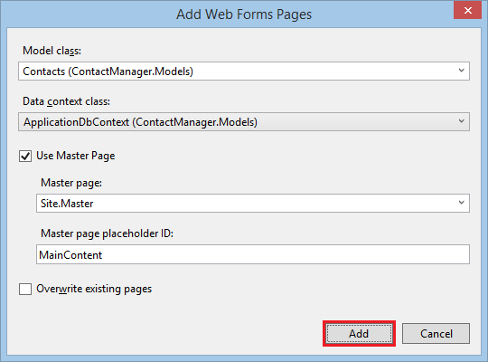  

The Web Forms Scaffolder adds a new folder that contains *Default.aspx*, *Delete.aspx*, *Edit.aspx*, and *Insert.aspx* pages. The Web Forms Scaffolder also creates a *DynamicData* folder that contains an *EntityTemplates* folder and a *FieldTemplates* folder. The `ApplicationDbContext` will be used for both the membership database and the contact data.

###Configure the Application to Use the Data Model 
The next task is to enable the Code First Migrations feature in order to create the database based on the data model you created. Also, you will add sample data and a data initializer.  

1. In the **Tools** menu, select **NuGet Package Manager** and then **Package Manager Console**.  
	  
2. In the Package Manager Console window, enter the following command:  
	<pre class="prettyprint">
	enable-migrations
	</pre>  
	The enable-migrations command creates a *Migrations* folder, and it puts in that folder a *Configuration.cs* file that you can edit to seed the database and configure data migrations.  
3. In the **Package Manager Console** window, enter the following command:  
	<pre class="prettyprint">
	add-migration Initial
	</pre>  
	The `add-migration Initial` command generates a file named <date_stamp>Initial in the *Migrations* folder that creates the database. The first parameter ( Initial ) is arbitrary and is used to create the name of the file. You can see the new class files in **Solution Explorer**. In the `Initial` class, the `Up` method creates the `Contact` table, and the `Down` method (used when you want to return to the previous state) drops it.  
4. Open the *Migrations\Configuration.cs* file. 
5. Add the following namespace:  
	<pre class="prettyprint">
	using ContactManager.Models;
	</pre>  
6. Replace the `Seed` method with the following code:  
	<pre class="prettyprint">
	protected override void Seed(ContactManager.Models.ApplicationDbContext context)
	{
	    context.Contacts.AddOrUpdate(p => p.Name,
	       new Contacts
	       {
	           ContactId = 1,
	           Name = "Ivan Irons",
	           Address = "One Microsoft Way",
	           City = "Redmond",
	           State = "WA",
	           Zip = "10999",
	           Email = "ivani@wideworldimporters.com",
	       },
	       new Contacts
	        {
	            ContactId = 2,
	            Name = "Brent Scholl",
	            Address = "5678 1st Ave W",
	            City = "Redmond",
	            State = "WA",
	            Zip = "10999",
	            Email = "brents@wideworldimporters.com",
	        },
	        new Contacts
	        {
	            ContactId = 3,
	            Name = "Terrell Bettis",
	            Address = "9012 State St",
	            City = "Redmond",
	            State = "WA",
	            Zip = "10999",
	            Email = "terrellb@wideworldimporters.com",
	        },
	        new Contacts
	        {
	            ContactId = 4,
	            Name = "Jo Cooper",
	            Address = "3456 Maple St",
	            City = "Redmond",
	            State = "WA",
	            Zip = "10999",
	            Email = "joc@wideworldimporters.com",
	        },
	        new Contacts
	        {
	            ContactId = 5,
	            Name = "Ines Burnett",
	            Address = "7890 2nd Ave E",
	            City = "Redmond",
	            State = "WA",
	            Zip = "10999",
	            Email = "inesb@wideworldimporters.com",
	        }
	        );
	}
	</pre>
This code initializes (seeds) the database with the contact information. For more information on seeding the database, see [Seeding and Debugging Entity Framework (EF) DBs](http://blogs.msdn.com/b/rickandy/archive/2013/02/12/seeding-and-debugging-entity-framework-ef-dbs.aspx).  
7. In the **Package Manager Console** enter the command:  
	<pre class="prettyprint">
	update-database
	</pre>  
The `update-database` runs the first migration which creates the database. By default, the database is created as a SQL Server Express LocalDB database.  
	  

###Run the Application Locally and Display the Data 
Run the application now to see how you can view the contacts.

1. First, build the project (**Ctrl+Shift+B**).  
2. Press **Ctrl+F5** to run the application.  
	The browser will open and show the *Default.aspx* page.
3. Select the **Contact Demo** link at the top of the page to display the *Contact List* page.  
	  

##Enable SSL for the Project 
Secure Sockets Layer (SSL) is a protocol defined to allow Web servers and Web clients to communicate more securely through the use of encryption. When SSL is not used, data sent between the client and server is open to packet sniffing by anyone with physical access to the network. Additionally, several common authentication schemes are not secure over plain HTTP. In particular, Basic authentication and forms authentication send unencrypted credentials. To be secure, these authentication schemes must use SSL.

1. In **Solution Explorer**, click the **ContactManager** project, then press **F4** to display the **Properties** window. 
2. Change **SSL Enabled** to `true`. 
3. Copy the **SSL URL** so you can use it later.  
	The SSL URL will be `https://localhost:44300/` unless you've previously created SSL web app (as shown below).
	  
4. In **Solution Explorer**, right click the **Contact Manager** project and click **Properties**.
5. In the left tab, click **Web**.
6. Change the **Project Url** to use the **SSL URL** that you saved earlier.  
	  
7. Save the page by pressing **CTRL+S**.
8. Press **Ctrl+F5** to run the application.  
Visual Studio will display an option to allow you to avoid SSL warnings.  
9. Click **Yes** to trust the IIS Express SSL certificate and continue.  
	  
	A Security Warning is displayed.  

10. Click **Yes** to install the certificate to your localhost.  
	  
	The browser window will be displayed.  

You can easily test your Web application locally using SSL.

##Add an OAuth 2.0 Provider 
ASP.NET Web Forms provides enhanced options for membership and authentication. These enhancements include OAuth. OAuth is an open protocol that allows secure authorization in a simple and standard method from web, mobile, and desktop applications. The ASP.NET MVC internet template uses OAuth to expose Facebook, Twitter, Google and Microsoft as authentication providers. Although this tutorial uses only Google as the authentication provider, you can easily modify the code to use any of the providers. The steps to implement other providers are very similar to the steps you will see in this tutorial. 

In addition to authentication, the tutorial will also use roles to implement authorization. Only those users you add to the `canEdit` role will be able to change data (create, edit, or delete contacts). 

The following steps will allow you to add a Google authentication provider.

1. Open the *App_Start\Startup.Auth.cs* file. 
2. Remove the comment characters from the `app.UseGoogleAuthentication()` method so that the method appears as follows:  
	<pre class="prettyprint">
	            app.UseGoogleAuthentication(new GoogleOAuth2AuthenticationOptions()
	            {
	                ClientId = "",
	                ClientSecret = ""
	            });
	</pre>
3. Navigate to the [Google Developers Console](https://console.developers.google.com/). You will also need to sign-in with your Google developer email account (gmail.com). If you do not have a Google account, select the **Create an account** link.  
	Next, you'll see the **Google Developers Console**.
	  

4. Click the **Create Project** button and enter a project name and ID (you can use the default values). Then, click the **agreement checkbox** and the **Create** button.  
	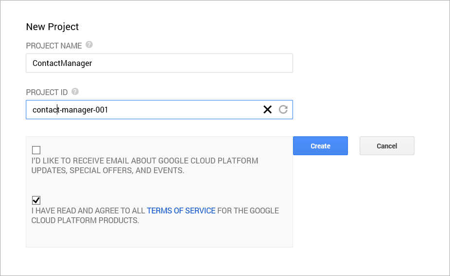  
	In a few seconds the new project will be created and your browser will display the new projects page.
5. In the left tab, click **APIs & auth**, and then click **Credentials**.
6. Click the **Create New Client ID** under **OAuth**.  
	The **Create Client ID** dialog will be displayed.
	  
7. In the **Create Client ID** dialog, keep the default **Web application** for the application type.  
8. Set the **Authorized JavaScript Origins** to the SSL URL you used earlier in this tutorial (**https://localhost:44300/** unless you've created other SSL projects).  
	This URL is the origin for your application. For this sample, you will only enter the localhost test URL. However, you can enter multiple URL to account for localhost and production.  

9. Set the **Authorized Redirect URI** to the following:  
	<pre class="prettyprint">  
	https://localhost:44300/signin-google  
	</pre>  
	This value is the URI that ASP.NET OAuth users to communicate with the google OAuth server. Remember to the SSL URL you used above (**https://localhost:44300/** unless you've created other SSL projects).  
10. Click the **Create Client ID** button.
11. In Visual Studio, update the `UseGoogleAuthentication` method of the *Startup.Auth.cs* page by copying and pasting the **AppId** and **App Secret** into the method. The **AppId** and **App Secret** values shown below are samples and will not work.  
	<pre class="prettyprint">  
	using System;
	using Microsoft.AspNet.Identity;
	using Microsoft.AspNet.Identity.EntityFramework;
	using Microsoft.AspNet.Identity.Owin;
	using Microsoft.Owin;
	using Microsoft.Owin.Security.Cookies;
	using Microsoft.Owin.Security.DataProtection;
	using Microsoft.Owin.Security.Google;
	using Owin;
	using ContactManager.Models;
	
	namespace ContactManager
	{
	    public partial class Startup {
	
	        // For more information on configuring authentication, please visit http://go.microsoft.com/fwlink/?LinkId=301883
	        public void ConfigureAuth(IAppBuilder app)
	        {
	            // Configure the db context and user manager to use a single instance per request
	            app.CreatePerOwinContext(ApplicationDbContext.Create);
	            app.CreatePerOwinContext<ApplicationUserManager>(ApplicationUserManager.Create);
	
	            // Enable the application to use a cookie to store information for the signed in user
	            // and to use a cookie to temporarily store information about a user logging in with a third party login provider
	            // Configure the sign in cookie
	            app.UseCookieAuthentication(new CookieAuthenticationOptions
	            {
	                AuthenticationType = DefaultAuthenticationTypes.ApplicationCookie,
	                LoginPath = new PathString("/Account/Login"),
	                Provider = new CookieAuthenticationProvider
	                {
	                    OnValidateIdentity = SecurityStampValidator.OnValidateIdentity<ApplicationUserManager, ApplicationUser>(
	                        validateInterval: TimeSpan.FromMinutes(20),
	                        regenerateIdentity: (manager, user) => user.GenerateUserIdentityAsync(manager))
	                }
	            });
	            // Use a cookie to temporarily store information about a user logging in with a third party login provider
	            app.UseExternalSignInCookie(DefaultAuthenticationTypes.ExternalCookie);
	
	            // Uncomment the following lines to enable logging in with third party login providers
	            //app.UseMicrosoftAccountAuthentication(
	            //    clientId: "",
	            //    clientSecret: "");
	
	            //app.UseTwitterAuthentication(
	            //   consumerKey: "",
	            //   consumerSecret: "");
	
	            //app.UseFacebookAuthentication(
	            //   appId: "",
	            //   appSecret: "");
	
	            app.UseGoogleAuthentication(new GoogleOAuth2AuthenticationOptions()
	            {
	                ClientId = "<mark>000000000000.apps.googleusercontent.com</mark>",
	                ClientSecret = "<mark>00000000000</mark>"
	            });
	        }
	    }
	}
	</pre>  
12. Press **CTRL+F5** to build and run the application. Click the **Log in** link.
13. Under **Use another service to log in**, click **Google**.  
	  
14. If you need to enter your credentials, you will be redirected to the google site where you will enter your credentials.  
	  
15. After you enter your credentials, you will be prompted to give permissions to the web application you just created:  
	  
16. Click **Accept**. You will now be redirected back to the **Register** page of the **ContactManager** application where you can register your Google account.
	  
17. You have the option of changing the local email registration name used for your Gmail account, but you generally want to keep the default email alias (that is, the one you used for authentication). Click **Log in**.

##Use the Membership API to Restrict Access 
ASP.NET Identity is the membership system used for authentication when building an ASP.NET web application. It makes it easy to integrate user-specific profile data with application data. Also, ASP.NET Identity allows you to choose the persistence model for user profiles in your application. You can store the data in a SQL Server database or another data store, including *NoSQL* data stores such as Azure Storage Tables.

By using the default ASP.NET Web Forms template, you have built-in membership functionality that you can immediately use when the application runs. You will use ASP.NET Identity to add an administrator role and assign a user to that role. Then, you will learn how to restrict access to the administration folder and the pages in that folder that are used to modify the contact data.

###Add an Administrator 
Using ASP.NET Identity, you can add an administrator role and assign a user to that role using code. 

1. In **Solution Explorer**, open the *Configuration.cs* file in the *Migrations* folder.
2. Add the following `using` statements within the `ContactManger.Migrations` namespace:  
	<pre class="prettyprint">
	using Microsoft.AspNet.Identity;
	using Microsoft.AspNet.Identity.EntityFramework;
	</pre>
3. Add the following `AddUserAndRole` method to the `Configuration` class after the `Seed` method:  
	<pre class="prettyprint">
        public void AddUserAndRole(ContactManager.Models.ApplicationDbContext context)
        {
            IdentityResult IdRoleResult;
            IdentityResult IdUserResult;

            var roleStore = new RoleStore&lt;IdentityRole&gt;(context);
            var roleMgr = new RoleManager&lt;IdentityRole&gt;(roleStore);

            if (!roleMgr.RoleExists(&quot;canEdit&quot;))
            {
                IdRoleResult = roleMgr.Create(new IdentityRole { Name = &quot;canEdit&quot; });
            }

            //var userStore = new UserStore&lt;ApplicationUser&gt;(context);
            //var userMgr = new UserManager&lt;ApplicationUser&gt;(userStore);
            var userMgr = new UserManager&lt;ApplicationUser&gt;(new UserStore&lt;ApplicationUser&gt;(context));

            var appUser = new ApplicationUser
            {
                UserName = &quot;canEditUser@wideworldimporters.com&quot;,
                Email = &quot;canEditUser@wideworldimporters.com&quot;
            };
            IdUserResult = userMgr.Create(appUser, &quot;Pa$$word1&quot;);

            if (!userMgr.IsInRole(userMgr.FindByEmail(&quot;canEditUser@wideworldimporters.com&quot;).Id, &quot;canEdit&quot;))
            {
              //  IdUserResult = userMgr.AddToRole(appUser.Id, &quot;canEdit&quot;);
                IdUserResult = userMgr.AddToRole(userMgr.FindByEmail(&quot;canEditUser@wideworldimporters.com&quot;).Id, &quot;canEdit&quot;);
            }
        }
	</pre>
4. Add a call to the `AddUserAndRole` method from within the beginning of the `Seed` method. Note that only the beginning of the `Seed` method is being shown.  
	<pre class="prettyprint">
        protected override void Seed(ContactManager.Models.ApplicationDbContext context)
        {
            <mark>AddUserAndRole(context);</mark>
	</pre>  
5. After saving all your changes, in the **Package Manager Console** run the following command:  
	<pre class="prettyprint">
	Update-Database
	</pre>
	This code creates a new role called `canEdit` and creates a new local user with the email of canEditUser@wideworldimporters.com. Then, the code adds canEditUser@wideworldimporters.com to the `canEdit` role. For more information, see the [ASP.NET Identity](http://www.asp.net/identity) resource page.  

###Restrict Access to the Administration Folder 
The **ContactManager** sample application allows both anonymous users and logged-in users to view contacts. However, after you complete this section, the logged-in users that are assigned to the "canEdit" role will be the only users able to modify the contacts.

You will create a folder named *Admin* where only users that are assigned to the "canEdit" role can access.

1. In **Solution Explorer**, add a sub-folder to the *Contacts* folder and name the new sub-folder *Admin*.
2. Move the following files from the *Contacts* folder to the *Contacts/Admin* folder:  
	- *Delete.aspx *and* Delete.aspx.cs*
	- *Edit.aspx *and* Edit.aspx.cs*
	- *Insert.aspx *and* Insert.aspx.cs*
3. Update the link references in *Contacts/Default.aspx* by adding "Admin/" before the pages references that link to *Insert.aspx*, *Edit.aspx*, and *Delete.aspx*:  
	<pre class="prettyprint">
	&lt;%@ Page Title=&quot;ContactsList&quot; Language=&quot;C#&quot; MasterPageFile=&quot;~/Site.Master&quot; CodeBehind=&quot;Default.aspx.cs&quot; Inherits=&quot;ContactManager.Contacts.Default&quot; ViewStateMode=&quot;Disabled&quot; %&gt;
	&lt;%@ Register TagPrefix=&quot;FriendlyUrls&quot; Namespace=&quot;Microsoft.AspNet.FriendlyUrls&quot; %&gt;
	
	&lt;asp:Content runat=&quot;server&quot; ContentPlaceHolderID=&quot;MainContent&quot;&gt;
	    &lt;h2&gt;Contacts List&lt;/h2&gt;
	    &lt;p&gt;
	        &lt;asp:HyperLink runat=&quot;server&quot; NavigateUrl=&quot;<mark>Admin/</mark>Insert.aspx&quot; Text=&quot;Create new&quot; /&gt;
	    &lt;/p&gt;
	    &lt;div&gt;
	        &lt;asp:ListView runat=&quot;server&quot;
	            DataKeyNames=&quot;ContactId&quot; ItemType=&quot;ContactManager.Models.Contacts&quot;
	            AutoGenerateColumns=&quot;false&quot;
	            AllowPaging=&quot;true&quot; AllowSorting=&quot;true&quot;
	            SelectMethod=&quot;GetData&quot;&gt;
	            &lt;EmptyDataTemplate&gt;
	                There are no entries found for Contacts
	            &lt;/EmptyDataTemplate&gt;
	            &lt;LayoutTemplate&gt;
	                &lt;table class=&quot;table&quot;&gt;
	                    &lt;thead&gt;
	                        &lt;tr&gt;
	                            &lt;th&gt;Name&lt;/th&gt;
	                            &lt;th&gt;Address&lt;/th&gt;
	                            &lt;th&gt;City&lt;/th&gt;
	                            &lt;th&gt;State&lt;/th&gt;
	                            &lt;th&gt;Zip&lt;/th&gt;
	                            &lt;th&gt;Email&lt;/th&gt;
	                            &lt;th&gt;&amp;nbsp;&lt;/th&gt;
	                        &lt;/tr&gt;
	                    &lt;/thead&gt;
	                    &lt;tbody&gt;
	                        &lt;tr runat=&quot;server&quot; id=&quot;itemPlaceholder&quot; /&gt;
	                    &lt;/tbody&gt;
	                &lt;/table&gt;
	            &lt;/LayoutTemplate&gt;
	            &lt;ItemTemplate&gt;
	                &lt;tr&gt;
	                    &lt;td&gt;
	                        &lt;asp:DynamicControl runat=&quot;server&quot; DataField=&quot;Name&quot; ID=&quot;Name&quot; Mode=&quot;ReadOnly&quot; /&gt;
	                    &lt;/td&gt;
	                    &lt;td&gt;
	                        &lt;asp:DynamicControl runat=&quot;server&quot; DataField=&quot;Address&quot; ID=&quot;Address&quot; Mode=&quot;ReadOnly&quot; /&gt;
	                    &lt;/td&gt;
	                    &lt;td&gt;
	                        &lt;asp:DynamicControl runat=&quot;server&quot; DataField=&quot;City&quot; ID=&quot;City&quot; Mode=&quot;ReadOnly&quot; /&gt;
	                    &lt;/td&gt;
	                    &lt;td&gt;
	                        &lt;asp:DynamicControl runat=&quot;server&quot; DataField=&quot;State&quot; ID=&quot;State&quot; Mode=&quot;ReadOnly&quot; /&gt;
	                    &lt;/td&gt;
	                    &lt;td&gt;
	                        &lt;asp:DynamicControl runat=&quot;server&quot; DataField=&quot;Zip&quot; ID=&quot;Zip&quot; Mode=&quot;ReadOnly&quot; /&gt;
	                    &lt;/td&gt;
	                    &lt;td&gt;
	                        &lt;asp:DynamicControl runat=&quot;server&quot; DataField=&quot;Email&quot; ID=&quot;Email&quot; Mode=&quot;ReadOnly&quot; /&gt;
	                    &lt;/td&gt;
	                    &lt;td&gt;
	                        &lt;a href=&quot;<mark>Admin/</mark>Edit.aspx?ContactId=&lt;%#: Item.ContactId%&gt;&quot;&gt;Edit&lt;/a&gt; | 
	                        &lt;a href=&quot;<mark>Admin/</mark>Delete.aspx?ContactId=&lt;%#: Item.ContactId%&gt;&quot;&gt;Delete&lt;/a&gt;
	                    &lt;/td&gt;
	                &lt;/tr&gt;
	            &lt;/ItemTemplate&gt;
	        &lt;/asp:ListView&gt;
	    &lt;/div&gt;
	&lt;/asp:Content&gt;
	</pre>
4. Update the six references of the `Response.Redirect("Default.aspx")` code to `Response.Redirect("~/Contacts/Default.aspx")` for the following three files:  
	- *Delete.aspx.cs*
	- *Edit.aspx.cs*
	- *Insert.aspx.cs*  

	Now the links will all work correctly when you display and update the contact data.
5. To restrict access to the *Admin* folder, from the **Solution Explorer** right-click the *Admin* folder and select **Add New Item**.
6. From the list of Visual C# Web templates, select **Web Configuration File** from the middle list, accept the default name of *Web.config*, and then select **Add**.
7. Replace the existing XML content in the *Web.config* file with the following:
	<pre class="prettyprint">
	&lt;?xml version=&quot;1.0&quot;?&gt;
	&lt;configuration&gt;
	  &lt;system.web&gt;
	    &lt;authorization&gt;
	      &lt;allow roles=&quot;canEdit&quot;/&gt;
	      &lt;deny users=&quot;*&quot;/&gt;
	    &lt;/authorization&gt;
	  &lt;/system.web&gt;
	&lt;/configuration&gt;
	</pre>
8. Save the *Web.config* file. 
	The *Web.config* file specifies that only users assigned to the "canEdit" role can access the pages contained in the *Admin* folder. 

When a user that is not part of the "canEdit" role attempts to modify the data, they will be redirected to the *Log in* page.

##Deploy the Application with the Database to Azure 
Now that the web application is complete, you can publish it to Azure.

###Publish the Application 
1. In Visual Studio, build the project (**Ctrl+Shift+B**).
2. Right-click the project in **Solution Explorer** and select **Publish**.  
	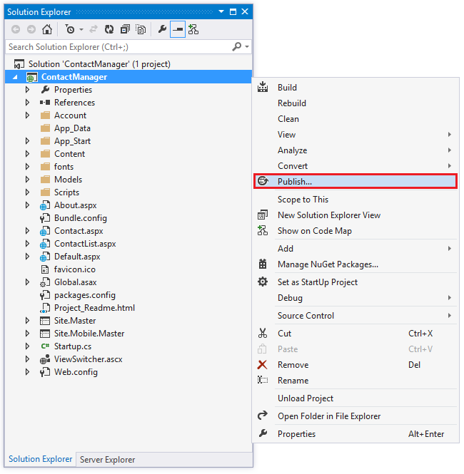  
	The **Publish Web** dialog box is displayed.  
	  
3. From the **Profile** tab, select **Azure Web App** as the publish target if it is not already selected.  
	  
4. Click **Sign In** if you are not already signed in.
5. Select the existing web app that you created earlier in this tutorial from the **Existing Web Apps** dropdown box and click the **OK** button.  
	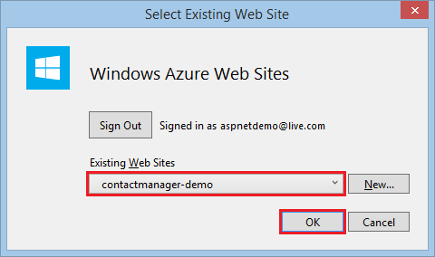  
	If you are asked to save changes make to the profile, select **Yes**.
6. Click the **Settings** tab.  
	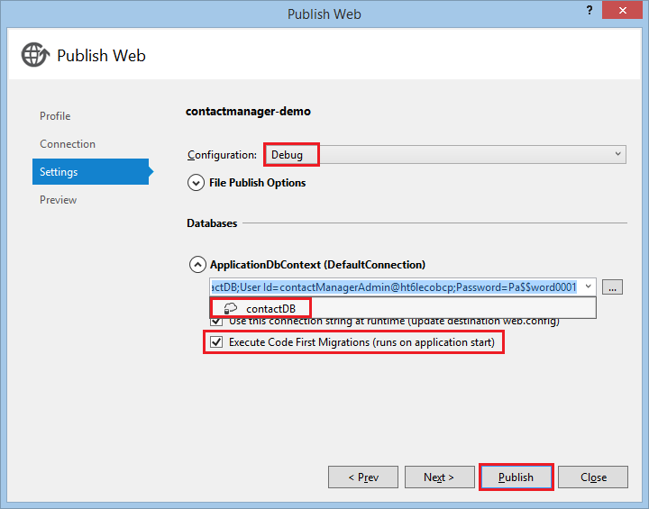  
7. Set the **Configuration** dropdown box to **Debug**.
8. Click the **down arrow** icon next to **ApplicationDbContext** and set it to **ContactDB**.
9. Check the **Execute Code First Migrations** checkbox.  

	>[AZURE.NOTE]  
	In this example, you should select this checkbox only the first time you publish the application. This way, the *Seed* method in the *Configuration.cs* file will only be called once.  

10. Then, click **Publish**.  
	Your application will be published to Azure.

>[AZURE.NOTE]  
If you closed and re-opened Visual Studio after you created the publish profile, you might not see the connection string in the drop-down list. In that case, instead of editing the publish profile that you created earlier, create a new one the same way you did earlier, and then follow these steps on the **Settings** tab.)  

###Review the Application in Azure 
1. In the browser, click the **Contact Demo** link.  
	The Contacts List is displayed.
	  

2. Select **Create new** on the **Contacts List** page.  
	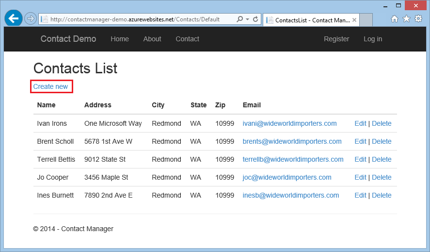  
	You are redirected to the **Login** page because you have not logged in with an account that can modify contacts.  
3. After you enter the below email and password, click the **Log in** button.  
	**Email**: `canEditUser@wideworldimporters.com`  
	**Password**: `Pa$$word1`  
	  

4. Enter new data for each field and then press the **Insert** button.  
	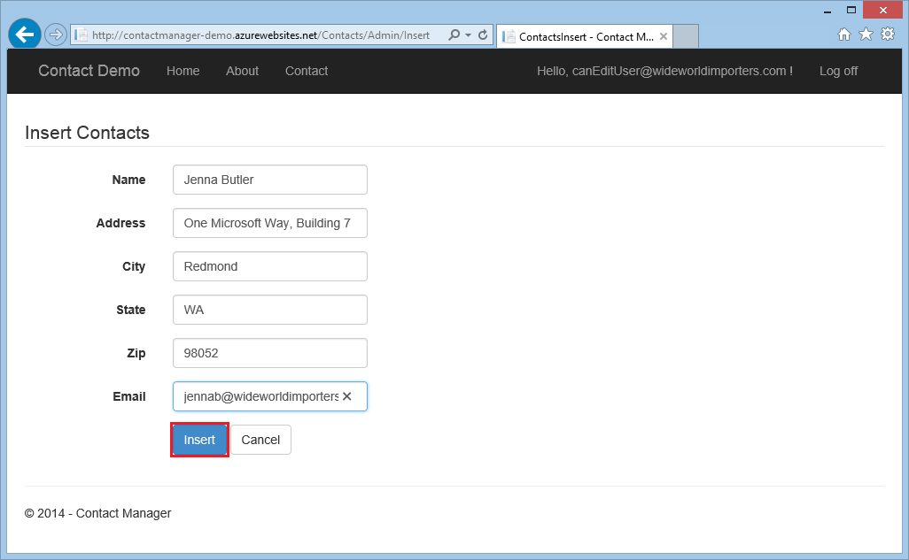  
	The *EditContactList.aspx* page is displayed with the new record.  
	  

5. Select the **Log off** link.

###Stop the Application 
In order to prevent other people from registering and using your sample application, you will stop the web app.

1. In Visual Studio from the **View Menu**, select **Server Explorer**. 
2. In **Server Explorer**, navigate to **Web App**.
3. Right click on each web app instance and select **Stop Web App**.  
	  

	Alternatively, from the Microsoft Azure management portal, you can select the web app, then click the **stop** icon at the bottom of the page.  
	  

##Review the Database 
It is important to know how to view and modify the database directly. Knowing how to work directly with the database allows you to confirm data in the database and also understand how the data is stored in each table.

###Examine the SQL Azure DB 
1. In Visual Studio, open **Server Explorer** and navigate to **ContactDB**.
2. Right-click on **ContactDB** and select **Open in SQL Server Object Explorer**.  
	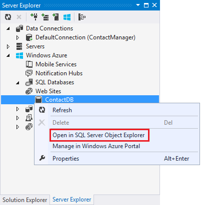  
3. If the **Add Firewall Rule** dialog box is displayed, select **Add Firewall Rule**.  

	>[AZURE.NOTE]  
	If you can't expand **SQL Databases** and can't see **ContactDB** from Visual Studio, you can follow the instructions to open a firewall port or a range of ports. To do this, follow the instructions under **Set up Azure firewall rules** near the end of the [MVC tutorial](web-sites-dotnet-deploy-aspnet-mvc-app-membership-oauth-sql-database.md). As an alternative, you can also review the data of the local database by building, running, and adding data to the application locally (**CTRL+F5** from Visual Studio).  

4. If the **Connect to Server** dialog box is displayed, enter the **password** you created at the beginning of this tutorial and press the **Connect** button.  

	>[AZURE.NOTE]  
	If you don't recall the password, you can find it in your local project file. In **Solution Explorer**, expand the *Properties* folder and then expand the *PublishProfiles* folder. Open the *contactmanager.pubxml* file (your file may be named differently). Search the file for your publishing password.
5. Expand the **contactDB** database and then expand **Tables**.
6. Right-click the **dbo.AspNetUsers** table and select **View Data**.  
	  
	You can view the data associated with the canEditUser@contoso.com user.  
	  

###Add a User to the Admin Role by Editing the Database 
Earlier in the tutorial you used code to add users to the canEdit role. An alternative method is to directly manipulate the data in the membership tables. The following steps show how to use this alternate method to add a user to a role.

1. In **SQL Server Object Explorer**, right click on **dbo.AspNetUserRoles** and select **View Data**.
	  
2. Copy the *RoleId* and paste it into the empty (new) row.  
	  
3. In the **dbo.AspNetUsers** table, find the user you want to put in the role, and copy the user's *Id*.
4. Paste the copied *Id* into the **UserId** field of the new row in the **AspNetUserRoles** table.  

>[AZURE.NOTE]  
We are working on a tool that will make managing users and roles much easier.  

##Next steps
For more information about ASP.NET Web Forms, see [Learn About ASP.NET Web Forms](http://www.asp.net/web-forms) on the ASP.NET web app and [Microsoft Azure Tutorials and Guides](http://azure.microsoft.com/documentation/services/web-sites/#net).

This tutorial was based on the MVC tutorial [Create an ASP.NET MVC app with auth and SQL DB and deploy to Azure App Service](web-sites-dotnet-deploy-aspnet-mvc-app-membership-oauth-sql-database.md) written by Rick Anderson (Twitter [@RickAndMSFT](https://twitter.com/RickAndMSFT)) with assistance from Tom Dykstra and Barry Dorrans (Twitter [@blowdart](https://twitter.com/blowdart)). 

Please leave feedback about what you liked and what you would like to see improved, not only about the tutorial itself but also about the products that it demonstrates. Your feedback will help us prioritize improvements. You can also request and vote on new topics at [Show Me How With Code](http://aspnet.uservoice.com/forums/228522-show-me-how-with-code).

