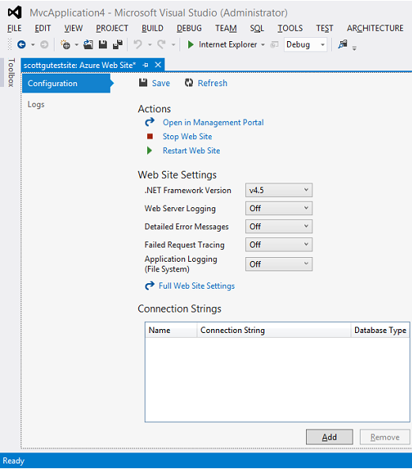

<properties linkid="" urlDisplayName="" pageTitle="" metaKeywords="" description="" metaCanonical="" services="" documentationCenter="" title="Get started with Azure Web Sites and ASP.NET" authors="tdykstra" solutions="" manager="wpickett" editor="mollybos" />

# Get started with Azure Web Sites and ASP.NET

<a href="/en-us/develop/net/tutorials/get-started/" title="Visual Studio 2013">Visual Studio 2013</a><a href="/en-us/develop/net/tutorials/get-started-vs2012/" title="Visual Studio 2012" class="current">Visual Studio 2012</a>

<strong>Note</strong>
A <a href="/en-us/develop/net/tutorials/get-started/">newer version of this tutorial</a> is available. You can still follow this version if you want to use Visual Studio 2012, but it does not show all of the latest Azure SDK features.

This tutorial shows how to deploy an ASP.NET web application to an Azure Web Site by using the Publish Web wizard in Visual Studio 2012 or Visual Studio 2012 for Web Express. If you prefer, you can follow the tutorial steps by using Visual Studio 2010 or Visual Web Developer Express 2010.

You can open an Azure account for free, and if you don't already have Visual Studio 2012, the SDK automatically installs Visual Studio 2012 for Web Express. So you can start developing for Azure entirely for free.

This tutorial assumes that you have no prior experience using Azure. On completing this tutorial, you'll have a simple web application up and running in the cloud.
 
You'll learn:

* How to enable your machine for Azure development by installing the Azure SDK.
* How to create a Visual Studio ASP.NET MVC 4 project and publish it to an Azure Web Site.

The following illustration shows the completed application:

![Web site example][DeployedWebSite]

<strong>Note</strong> To complete this tutorial, you need an Azure account. If you don't have an account, you can <a href="/en-us/pricing/member-offers/msdn-benefits-details/?WT.mc_id=A261C142F" target="_blank">activate your MSDN subscriber benefits</a> or <a href="/en-us/pricing/free-trial/?WT.mc_id=A261C142F" target="_blank">sign up for a free trial</a>.

 
### Tutorial segments

1. [Set up the development environment][]
2. [Create a web site in Azure][]
3. [Create an ASP.NET MVC 4 application][]
4. [Deploy the application to Azure][]
5. [Next steps][]

[WACOM.INCLUDE [install-sdk-2012-only](../includes/install-sdk-2012-only.md)]

<h2>Create siteCreate a web site</h2>

The next step is to create the Azure web site.

1. In the [Azure Management Portal][PreviewPortal], click **Web Sites**, and then click **New**.

![New web site][WebSiteNew]

2. Click **Quick Create**.
	
	![Quick create][ClickQuickCreate]

3. In the **Create Web Site** step of the wizard, enter a string in the **URL** box to use as the unique URL for your application.The complete URL will consist of what you enter here plus the suffix that you see next to the text box. The illustration shows **example1**, but if someone has already taken that string for a URL, you need to enter a different value.

4. In the **Region** drop-down list, choose the region that is closest to you.
This setting specifies which data center your web site will run in. 

5. Click the **Create Web Site** arrow.

	

	The Management Portal returns to the Web Sites page, and the **Status** column shows that the site is being created. After a while (typically less than a minute), the **Status** column shows that the site was successfully created. In the navigation bar at the left, the number of sites you have in your account appears next to the **Web Sites** icon.
	
	![Web Sites page of Management Portal, web site created][WebSiteStatusRunning]

<h2>Create the appCreate an ASP.NET MVC 4 application</h2>

You have created an Azure Web Site, but there is no content in it yet. Your next step is to create the Visual Studio web application project that you'll publish to Azure.

### Create the project

1. Start Visual Studio 2012 or Visual Studio 2012 for Web Express.

2. From the **File** menu, click **New**, and then click **Project**.

![New Project in File menu][NewVSProject]

3. In the **New Project** dialog box, expand **C#** and select **Web** under **Installed Templates**, and then select **ASP.NET MVC 4 Web Application**. 

3. Ensure that **.NET Framework 4.5** is selected as the target framework.

4. Name the application **MyExample** and click **OK**.
	
![New Project dialog box][NewMVC4WebApp]

5. In the **New ASP.NET MVC 4 Project** dialog box, select the **Internet Application** template and click **OK**.

![New ASP.NET MVC 4 Project dialog box][InternetAppTemplate]

### Run the application locally

1. Press **CTRL**+**F5** to run the application. The application home page appears in the default browser.

![Web site running locally][AppRunningLocally]

This is all you need to do to create a simple application that you'll deploy to Azure.

<h2>Deploy the appDeploy the application to Azure</h2>

1. In Visual Studio, right-click the project in **Solution Explorer** and select **Publish** from the context menu.

	![Publish in project context menu][PublishVSSolution]

The **Publish Web** wizard opens.

2. In the **Profile** tab of the **Publish Web** wizard, click **Import**.

	![Import publish settings][ImportPublishSettings]

The **Import Publish Profile** dialog box appears.

3. If you have not previously added your Azure subscription in Visual Studio, perform the following steps. In these steps you add your subscription so that the drop-down list under **Import from an Azure web site** will include your web site.
    
	- In the **Import Publish Profile** dialog box, click **Import from an Azure web site**, and then click **Add Azure subscription**. 
    
	
    
	- In the **Import Azure Subscriptions** dialog box, click **Download subscription file**.
    
	
    
	- In your browser window, save the *.publishsettings* file.
    
	

	- In the **Import Azure Subscriptions** dialog box, click **Browse** and navigate to the *.publishsettings* file.

	

	- Click **Import**.
    
	

	> [WACOM.NOTE]
	> The .publishsettings file contains your  credentials (unencoded) that are used to administer your Azure subscriptions and services. The security best practice for this file is to store it temporarily outside your source directories (for example in the Libraries\Documents folder), and then  delete it once the import has completed. A malicious user who gains access to the .publishsettings file can edit, create, and delete your Azure services.

4. In the **Import Publish Profile** dialog box, select **Import from an Azure web site**, select your web site from the drop-down list, and then click **OK**.

	![Import Publish Profile][ImportPublishProfile]

5. In the **Connection** tab, click **Validate Connection** to make sure that the settings are correct.

	![Validate connection][ValidateConnection]

6. When the connection has been validated, a green check mark is shown next to the **Validate Connection** button. Click **Next**.

	![Successfully validated connection][ValidateConnectionSuccess]

7. In the **Settings** tab, uncheck **Use this connection string at runtime** option, since this application is not using a database. You can accept the default settings for the remaining items on this page.  You are deploying a Release build configuration and you don't need to delete files at the destination server, precompile the application, or exclude files in the App_Data folder.
Click **Next**.

	![Settings tab][PublishWebSettingsTab]

8. In the **Preview** tab, click **Start Preview**.

	![StartPreview button in the Preview tab][PublishWebStartPreview]

	The tab displays a list of the files that will be copied to the server. Displaying the preview isn't required to publish the application but is a useful function to be aware of. In this case, you don't need to do anything with the list of files that is displayed. 

	![StartPreview file output][PublishWebStartPreviewOutput]

9. Click **Publish**. Visual Studio begins the process of copying the files to the Azure server.

10. The **Output** window shows what deployment actions were taken and reports successful completion of the deployment.

	![Output window reporting successful deployment][PublishOutput]

11. Upon successful deployment, the default browser automatically opens to the URL of the deployed web site.
The application you created is now running in the cloud.

	![Web site running in Azure][DeployedWebSite]

<h2>Next stepsNext steps</h2>

In this tutorial, you've seen how to deploy a simple web application to an Azure Web Site. Other resources are available to show you how to manage, scale, and troubleshoot the site, how to add database, authentication, and authorization functionality, and  how to decide if your application should run in an Azure Cloud Service instead of an Azure Web Site.

<h3>How to manage a web site</h3>
When you're done with the site, you can delete it, and at times you might want to take it offline temporarily or change site settings. You can do some of these functions right from **Server Explorer** in Visual Studio.

To delete your web site, you can use the Azure Management Portal. The following screen shot shows **Stop**, **Restart**, and **Delete** buttons in the **Dashboard** tab of the management portal.

You can change site settings on the **Configure** tab. For more information, see [How to Manage Web Sites](/en-us/manage/services/web-sites/how-to-manage-websites/).

<h3>How to scale a web site</h3>
When your site is public and it starts to get more traffic, response times might slow down. To remedy that, you can easily add server resources in the **Scale** tab of the management portal.

For more information, see [How to Scale a Web Site](/en-us/manage/services/web-sites/how-to-scale-websites/). (Adding server resources to scale a web site is not free.)

<h3>How to troubleshoot a web site</h3>
You might want to look at trace or log output for help with troubleshooting. Visual Studio provides built-in tooling to make it easy to view Azure logs as they are generated in real time.

For more information, see [Troubleshooting Azure Web Sites in Visual Studio](/en-us/develop/net/tutorials/troubleshoot-web-sites-in-visual-studio/).

<h3>How to add database and authorization functionality</h3>
Most production web sites use a database and restrict some site functions to certain authorized users. For a tutorial that shows how to get started with database access, authentication, and authorization, see [Deploy a Secure ASP.NET MVC app with Membership, OAuth, and SQL Database to an Azure Web Site][WebWithSQL].

<h3>How to decide if your application should run in a Cloud Service</h3>
In some scenarios you might want to run your application in an Azure Cloud Service instead of an Azure Web Site. For more information, see [Azure Execution Models](/en-us/develop/net/fundamentals/compute/) and [Azure Web Sites, Cloud Services and Virtual Machines comparison](http://azure.microsoft.com/en-us/documentation/articles/choose-web-site-cloud-service-vm/). For a tutorial series that shows how to create a multi-tier ASP.NET web application and deploy it to a Cloud Service, see [.NET Multi-Tier Application Using Storage Tables, Queues, and Blobs](/en-us/develop/net/tutorials/multi-tier-web-site/1-overview/).

[Set Up the development environment]: #setupdevenv
[Create a web site in Azure]: #setupwindowsazure
[Create an ASP.NET MVC 4 application]: #createmvc4app
[Deploy the application to Azure]: #deploytowindowsazure
[Next steps]: #nextsteps
[PreviewPortal]: http://manage.windowsazure.com

[WebWithSQL]: /en-us/develop/net/tutorials/web-site-with-sql-database/

[AppRunningLocally]: ./media/web-sites-dotnet-get-started-vs2012/AppRunningLocally.png
[ClickQuickCreate]: ./media/web-sites-dotnet-get-started-vs2012/ClickQuickCreate.png
[DeployedWebSite]: ./media/web-sites-dotnet-get-started-vs2012/DeployedWebSite.png

[ImportPublishSettings]: ./media/web-sites-dotnet-get-started-vs2012/ImportPublishSettings.png
[ImportPublishProfile]: ./media/web-sites-dotnet-get-started-vs2012/ImportPublishProfile.png
[InternetAppTemplate]: ./media/web-sites-dotnet-get-started-vs2012/InternetAppTemplate.png
[NewMVC4WebApp]: ./media/web-sites-dotnet-get-started-vs2012/NewMVC4WebApp.png
[NewVSProject]: ./media/web-sites-dotnet-get-started-vs2012/NewVSProject.png
[PublishOutput]: ./media/web-sites-dotnet-get-started-vs2012/PublishOutput.png
[PublishVSSolution]: ./media/web-sites-dotnet-get-started-vs2012/PublishVSSolution.png
[PublishWebSettingsTab]: ./media/web-sites-dotnet-get-started-vs2012/PublishWebSettingsTab.png
[PublishWebStartPreview]: ./media/web-sites-dotnet-get-started-vs2012/PublishWebStartPreview.png
[PublishWebStartPreviewOutput]: ./media/web-sites-dotnet-get-started-vs2012/PublishWebStartPreviewOutput.png

[ValidateConnection]: ./media/web-sites-dotnet-get-started-vs2012/ValidateConnection.png
[ValidateConnectionSuccess]: ./media/web-sites-dotnet-get-started-vs2012/ValidateConnectionSuccess.png

[WebSiteNew]: ./media/web-sites-dotnet-get-started-vs2012/WebSiteNew.png
[WebSiteStatusRunning]: ./media/web-sites-dotnet-get-started-vs2012/WebSiteStatusRunning.png
