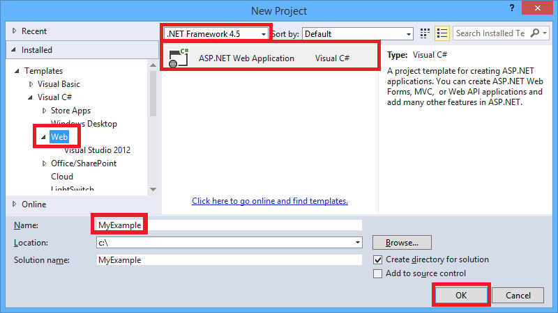
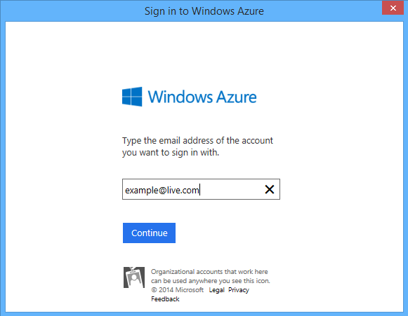
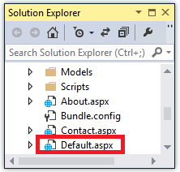
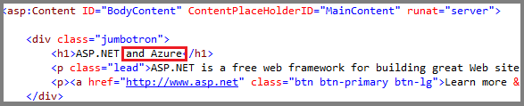

<properties linkid="develop-net-tutorials-get-started-vs2013" urlDisplayName="Get started with Azure for ASP.NET" pageTitle="Get started with Azure for ASP.NET" metaKeywords="" description="This tutorial shows you how to create an ASP.NET web project in Visual Studio 2013 and deploy it to an Azure Web Site. In less than 15 minutes you'll have an app up and running in the cloud." metaCanonical="" services="web-sites" documentationCenter=".NET" title="Get started with Azure and ASP.NET" authors="tdykstra"  solutions="" manager="wpickett" editor="mollybos"  />

# Get started with Azure and ASP.NET

<a href="/en-us/develop/net/tutorials/get-started/" title="Visual Studio 2013" class="current">Visual Studio 2013</a><a href="/en-us/develop/net/tutorials/get-started-vs2012/" title="Visual Studio 2012">Visual Studio 2012</a>

This tutorial shows how to create an ASP.NET web application and deploy it to an Azure Web Site by using Visual Studio 2013 or Visual Studio 2013 for Web Express. The tutorial assumes that you have no prior experience using Azure or ASP.NET. On completing the tutorial, you'll have a simple web application up and running in the cloud.

You can open an Azure account for free, and if you don't already have Visual Studio 2013, the SDK automatically installs Visual Studio 2013 for Web Express. So you can start developing for Azure entirely for free.
 
You'll learn:

* How to enable your machine for Azure development by installing the Azure SDK.
* How to create a Visual Studio ASP.NET web project and deploy it to an Azure Web Site.
* How to make a change to the project and redeploy.

The following illustration shows the completed application:

>[WACOM.NOTE] To complete this tutorial, you need an Azure account. If you don't have an account, you can <a href="/en-us/pricing/member-offers/msdn-benefits-details/?WT.mc_id=A261C142F" target="_blank">activate your MSDN subscriber benefits</a> or <a href="/en-us/pricing/free-trial/?WT.mc_id=A261C142F" target="_blank">sign up for a free trial</a>.
 
### Tutorial segments

* [Set up the development environment](#set-up-the-development-environment)
* [Create an ASP.NET web project in Visual Studio](#create-an-asp.net-web-project)
* [Deploy the application to Azure](#deploy-the-application-to-azure)
* [Make a change and redeploy](#make-a-change-and-redeploy)
* [Next steps](#next-steps)

[WACOM.INCLUDE [install-sdk-2013-only](../includes/install-sdk-2013-only.md)]

## Create an ASP.NET web application

Your first step is to create a web application project. Visual Studio will automatically create the Azure Web Site that you'll deploy your project to later. 

1. Open Visual Studio 2013 or Visual Studio 2013 Express for Web.

2. From the **File** menu, click **New Project**.

	

3. In the **New Project** dialog box, expand **C#** or **Visual Basic** and select **Web** under **Installed Templates**, and then select **ASP.NET Web Application**.

3. Make sure that **.NET Framework 4.5** is selected as the target framework.

4. Name the application **MyExample** and click **OK**.

	

5. In the **New ASP.NET Project** dialog box, select the **MVC** or the **Web Forms** template, and then click **Change Authentication**.

	[MVC and Web Forms](http://www.asp.net/get-started/websites) are ASP.NET frameworks for creating web sites. If you have no preference and plan to do other Azure tutorials, MVC is a good choice because there are more Azure tutorials that use MVC.

	

6. In the **Change Authentication** dialog box, click **No Authentication**, and then click **OK**.

	

	The sample application you're creating won't have features that require users to log in. The [Next Steps](#next-steps) section at the end of the tutorial links to a tutorial that implements authentication and authorization.

5. Under **Azure** in the dialog box, leave **Create remote resources** selected and leave the drop-down box set to **Web Site**.

	These settings specify that Visual Studio will create an Azure Web Site for your web project. You'll deploy the web project to the newly created web site. (As an alternative you can have Visual Studio create an Azure Virtual Machine running IIS, but this tutorial doesn't detail the steps for that option.)

5. In the **New ASP.NET Project** dialog box, click **OK**.

	

	The screenshot shows the MVC template selected; if you chose Web Forms, **Web Forms** is selected. 

5. If you haven't already signed in to Azure, Visual Studio prompts you to do so. Click **Sign In**.

	

6. Enter the ID and password of the account that you use to manage your Azure subscription.

	

	When you're signed in, the **Configure Azure Site Settings** dialog box asks you what resources you want to create.

	

3. Visual Studio provides a default **Site name**, which Azure will use as the prefix for your application's URL. If you prefer, enter a different site name.

	The complete URL will consist of what you enter here plus the domain that you see next to the text box. For example, if the site name is `MyExample6442`, the URL will be `MyExample6442.azurewebsites.net`. If someone else has already used the URL you entered, you'll see a red exclamation mark to the right instead of a green check mark, and you'll need to enter a different value.

4. In the **Region** drop-down list, choose the location that is closest to you.

	This setting specifies which Azure data center your web site will run in. 

5. Leave the database fields unchanged.

	For this tutorial you aren't using a database. The [Next Steps](#next-steps) section at the end of the tutorial links to a tutorial that shows you how to use a database.

6. Click **OK**.

	In a few seconds, Visual Studio creates the web project in the folder you specified, and it creates the web site in the Azure region you specified.  

	The **Solution Explorer** window shows the files and folders in the new project. (The screenshot is for a Web Forms project; an MVC project has different folders and files.)

	

	The **Web Publish Activity** window shows that the site has been created.

	

## Deploy the application to Azure

7. In the **Web Publish Activity** window, click **Publish MyExample to this site now**.

	

	In a few seconds the **Publish Web** wizard appears. The wizard creates a new *publish profile* that contains settings such as the web site URL that Visual Studio needs in order to deploy your project to Azure. The profile is automatically saved so that later when you make changes to the project you can easily redeploy the project to the same site.

8. In the **Connection** tab of the **Publish Web** wizard, click **Validate Connection** to make sure that Visual Studio can connect to Azure in order to deploy the web project.

	

	When the connection has been validated, a green check mark is shown next to the **Validate Connection** button. 

9. Click **Next**.

	

10. In the **Settings** tab, click **Next**.

	

	You can accept the default settings on this tab.  You're deploying a Release build and you don't need to delete files at the destination server, precompile the application, or exclude files in the App_Data folder.   The [Next Steps](#next-steps) section at the end of the tutorial links to a tutorial that deploys a Debug build and shows how to run Visual Studio in debug mode remotely.

11. In the **Preview** tab, click **Start Preview**.

	

	The tab displays a list of the files that will be copied to the server. Displaying the preview isn't required to publish the application but is a useful function to be aware of.

12. Click **Publish**.

	

	Visual Studio begins the process of copying the files to the Azure server.

	The **Output** and **Web Publish Activity** windows show what deployment actions were taken and report successful completion of the deployment.

	

	Upon successful deployment, the default browser automatically opens to the URL of the deployed web site, and
	the application that you created is now running in the cloud. The URL in the browser address bar shows that the site is being loaded from the Internet.

	

13. Close the browser.

## Make a change and redeploy

In this optional section of the tutorial, you change the web project, run the project locally on your development computer to verify the change, and then deploy the change to Azure.

2. If you created an MVC project, open the *Views/Home/Index.cshtml* or *.vbhtml* file in **Solution Explorer**, change the **h1** heading from "ASP.NET" to "ASP.NET and Azure", and save the file. 

	

	

1. If you created a Web Forms project, open the *Default.aspx* file in **Solution Explorer**, change the **h1** heading from "ASP.NET" to "ASP.NET and Azure", and save the file.

	

	

1. Press CTRL+F5 to test your change by running the site on your local computer.

	

	The `http://localhost` URL shows that it's running on your local computer. By default it's running in IIS Express, which is a lightweight version of IIS designed for use during web application development.

1. Close the browser.

1. In **Solution Explorer**, right-click the project, and choose **Publish**.

	

	The Preview tab of the **Publish Web** wizard appears. If you needed to change any publish settings you could choose a different tab, but now all you want to do is redeploy with the same settings.

2. In the **Publish Web** wizard, click **Publish**.

	

	Visual Studio deploys the project to Azure and opens the site in the default browser.

	

An even quicker way to redeploy when you don't need to change publish settings is to use the **Web One Click Publish** tool bar.

The toolbar is not enabled by default; you enable it in the **View - Toolbars** menu. You can use it to select a profile, click a button to publish, or click a button to open the **Publish Web** wizard. 

## Next steps

In this tutorial you've seen how to create a simple web application and deploy it to an Azure Web Site. Here are some related topics and resources for learning more about them:

* Other ways to deploy a web project
* How to manage, scale, and troubleshoot a site
* How to add database and authorization functionality
* How to choose between Web Sites, Cloud Services, and VMs for web applications

### Other ways to deploy a web project

In this tutorial you saw the quickest way to create a site and deploy it all in one operation. For an overview of other ways to deploy, by using Visual Studio or by [automating deployment](http://www.asp.net/aspnet/overview/developing-apps-with-windows-azure/building-real-world-cloud-apps-with-windows-azure/continuous-integration-and-continuous-delivery) from a [source control system](http://www.asp.net/aspnet/overview/developing-apps-with-windows-azure/building-real-world-cloud-apps-with-windows-azure/source-control), see [How to Deploy an Azure Web Site](/en-us/documentation/articles/web-sites-deploy/"). 

One way to automate deployment is to do it by using Windows PowerShell scripts. Visual Studio and Azure simplify that task by generating PowerShell scripts that you can use to perform the same deployment operations that you do in Visual Studio. For more information, see [Automate Everything (Building Real-World Cloud Apps with Azure)](http://www.asp.net/aspnet/overview/developing-apps-with-windows-azure/building-real-world-cloud-apps-with-windows-azure/automate-everything).

### How to manage a web site

The [Azure Management Portal](en-us/services/management-portal/) is a web interface that enables you to manage and monitor your Azure services, such as web sites, cloud services, virtual machines, databases, and more. To see what you can do in the portal, go to [https://manage.windowsazure.com](), and sign in with the user name and password for your account that has administration rights to your Azure subscription. For more information, see [How to Manage Web Sites](/en-us/manage/services/web-sites/how-to-manage-websites/).

You can also do some web site management functions right from **Server Explorer** in Visual Studio. For information about what you can do in **Server Explorer**, see [Troubleshooting Azure Web Sites in Visual Studio](/en-us/develop/net/tutorials/troubleshoot-web-sites-in-visual-studio/).

### How to scale a web site

When your site is public and it starts to get more traffic, response times might slow down. To remedy that, you can easily add server resources in the **Scale** tab of the management portal. For more information, see [How to Scale a Web Site](/en-us/manage/services/web-sites/how-to-scale-websites/). (Adding server resources to scale a web site is not free.)

### How to troubleshoot a web site

You might want to look at trace or log output for help with troubleshooting. Visual Studio provides built-in tooling to make it easy to view Azure logs as they are generated in real time. You can also run in debug mode remotely in Azure. For more information, see [Troubleshooting Azure Web Sites in Visual Studio](/en-us/develop/net/tutorials/troubleshoot-web-sites-in-visual-studio/).

### How to add database and authorization functionality

Most production web sites use a database and restrict some site functions to certain authorized users. For a tutorial that shows how to get started with database access, authentication, and authorization, see [Deploy a Secure ASP.NET MVC app with Membership, OAuth, and SQL Database to an Azure Web Site](/en-us/develop/net/tutorials/web-site-with-sql-database/).

### How to decide if your application should run in a Cloud Service

In Azure you can run web applications in Web Sites as shown in this tutorial, or in Cloud Services or Virtual Machines. For more information, see [Azure Execution Models](/en-us/develop/net/fundamentals/compute/) and [Azure Web Sites, Cloud Services, and VMs: When to use which?](/en-us/manage/services/web-sites/choose-web-app-service/).
