<properties pageTitle="Get started with Azure Websites for ASP.NET" metaKeywords="" description="This tutorial shows you how to create an ASP.NET web project in Visual Studio 2013 and deploy it to an Azure Website. In less than 15 minutes you'll have an app up and running in the cloud." metaCanonical="" services="web-sites" documentationCenter=".NET" title="Get started with Azure Websites and ASP.NET" authors="tdykstra"  solutions="" manager="wpickett" editor="mollybos"  />

<tags ms.service="web-sites" ms.workload="web" ms.tgt_pltfrm="na" ms.devlang="dotnet" ms.topic="hero-article" ms.date="11/12/2014" ms.author="tdykstra" />

# Get started with Azure Websites and ASP.NET

This tutorial shows how to create an ASP.NET web application and deploy it to an Azure Website by using Visual Studio 2013 or Visual Studio 2013 for Web Express. The tutorial assumes that you have no prior experience using Azure or ASP.NET. On completing the tutorial, you'll have a simple web application up and running in the cloud.

You'll learn:

* How to enable your machine for Azure development by installing the Azure SDK.
* How to create a Visual Studio ASP.NET web project and deploy it to an Azure Website.
* How to make a change to the web project and redeploy the application.
* How to use the Azure Management Portal to monitor and manage your website.

You need an Azure account to complete this tutorial:

* You can [open an Azure account for free](/en-us/pricing/free-trial/?WT.mc_id=A261C142F) - You get credits you can use to try out paid Azure services, and even after they're used up you can keep the account and use free Azure services, such as Websites.
* You can [activate MSDN subscriber benefits](/en-us/pricing/member-offers/msdn-benefits-details/?WT.mc_id=A261C142F) - Your MSDN subscription gives you credits every month that you can use for paid Azure services.</li>

> [WACOM.NOTE]
> If you want to get started with Azure Websites before signing up for an account, go to <a href="https://trywebsites.azurewebsites.net">https://trywebsites.azurewebsites.net</a>, where you can immediately create a short-lived ASP.NET starter site in Azure Websites for free. No credit card required, no commitments.

The following illustration shows the completed application:

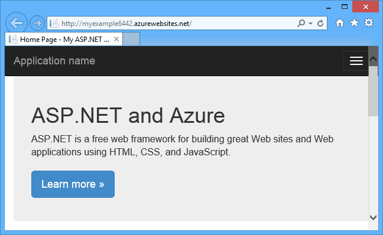

### Tutorial segments

* [Sign up for Microsoft Azure (Video)](#video)
* [Set up the development environment](#set-up-the-development-environment)
* [Create an ASP.NET web application in Visual Studio](#create-an-aspnet-web-application)
* [Deploy the application to Azure](#deploy-the-application-to-azure)
* [Make a change and redeploy](#make-a-change-and-redeploy)
* [Monitor and manage the site in the management portal](#monitor-and-manage-the-site-in-the-management-portal)
* [Next steps](#next-steps)

##Sign up for Microsoft Azure (Video)

In this video, Scott Hanselman presents how easy it is to sign-up for a free trial of Microsoft Azure. (Duration: 1:58)

> [AZURE.VIDEO sign-up-for-microsoft-azure]

[WACOM.INCLUDE [install-sdk-2013-only](../includes/install-sdk-2013-only.md)]

## Create an ASP.NET web application

Your first step is to create a web application project. Visual Studio will automatically create the Azure Website that you'll deploy your project to later. The following diagram illustrates what's happening in these two steps.

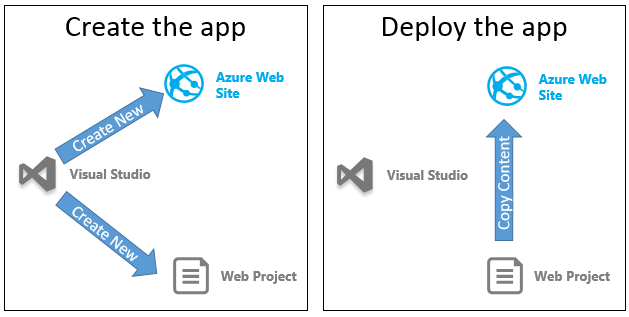

1. Open Visual Studio 2013 or Visual Studio 2013 Express for Web.

2. From the **File** menu, click **New Project**.

3. In the **New Project** dialog box, click **C#** > **Web** > **ASP.NET Web Application**. If you prefer, you can choose **Visual Basic**.

3. Make sure that **.NET Framework 4.5** is selected as the target framework.

4. Name the application **MyExample** and click **OK**.

	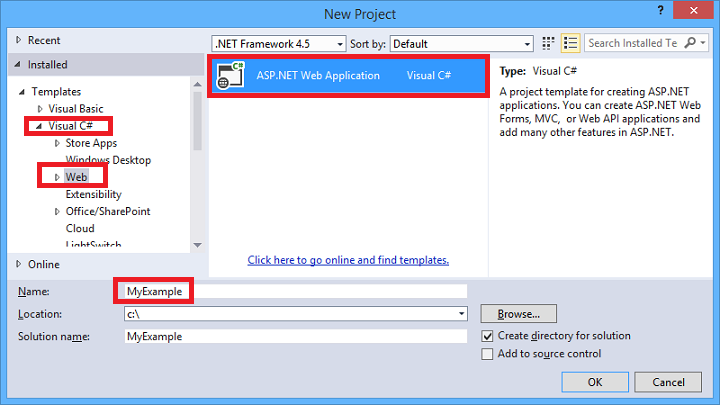

5. In the **New ASP.NET Project** dialog box, select the **MVC** template. If you prefer to work with ASP.NET Web Forms, you can select the **Web Forms** template. 

	[MVC and Web Forms](http://www.asp.net/get-started/websites) are ASP.NET frameworks for developing websites. For this tutorial you can choose either one, but if you choose Web Forms, you'll have to edit *Default.aspx* later where the tutorial instructs you to edit *Index.cshtml*.

7. Click **Change Authentication**. 

	

6. In the **Change Authentication** dialog box, click **No Authentication**, and then click **OK**.

	

	The sample application you're creating won't enable users to log in. The [Next Steps](#next-steps) section links to a tutorial that implements authentication and authorization.

5. In the **New ASP.NET Project** dialog box, leave the settings under **Azure** unchanged, and then click **OK**. 

	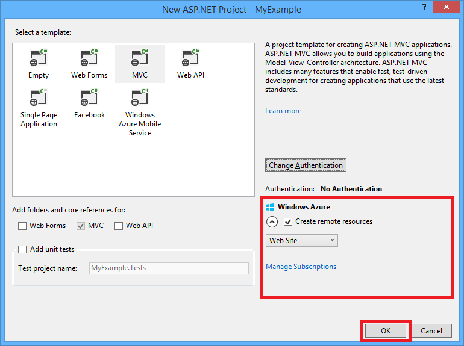

	The default settings specify that Visual Studio will create an Azure Website for your web project. In the next section of the tutorial you'll deploy the web project to the newly created website.

	(The check box caption might be **Host in the cloud** or **Create remote resources**. In either case the effect is the same.)
	
5. If you haven't already signed in to Azure, Visual Studio prompts you to do so. Click **Sign In**.

	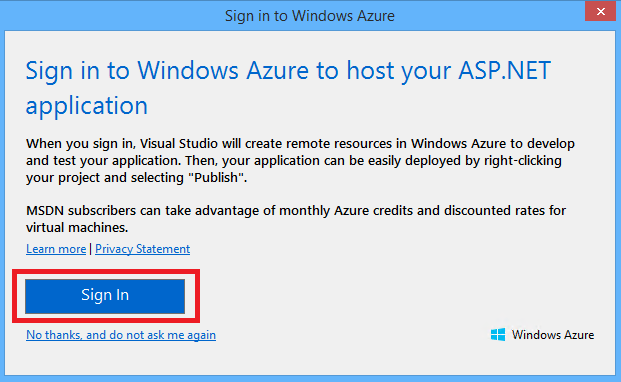

6. In the **Sign in to Azure** dialog box, enter the ID and password of the account that you use to manage your Azure subscription.
	
	When you're signed in, the **Configure Azure Site Settings** dialog box asks you what resources you want to create.

	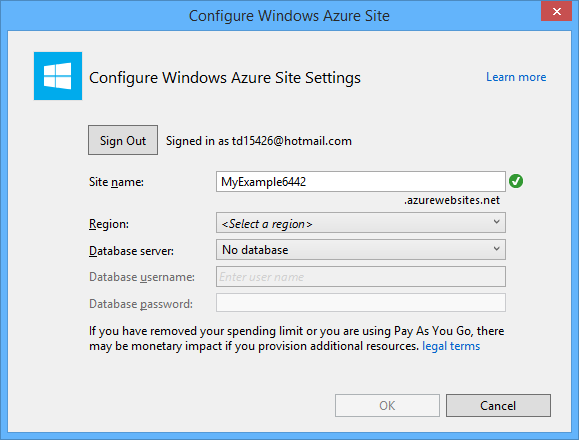

3. Visual Studio provides a default **Site name**, which Azure will use as the prefix for your application's URL. If you prefer, enter a different site name.

	The complete URL will consist of what you enter here plus *.azurewebsites.net* (as shown next to the **Site name** text box). For example, if the site name is `MyExample6442`, the URL will be `MyExample6442.azurewebsites.net`. The URL has to be unique. If someone else has already used the one you entered, you'll see a red exclamation mark to the right instead of a green check mark, and you'll need to enter a different site name.

4. In the **Region** drop-down list, choose the location that is closest to you.

	This setting specifies which Azure data center your website will run in. For this tutorial you can select any region and it won't make a noticeable difference, but for a production site you want your web server to be as close as possible to the browsers accessing your site in order to minimize [latency](http://www.bing.com/search?q=web%20latency%20introduction&qs=n&form=QBRE&pq=web%20latency%20introduction&sc=1-24&sp=-1&sk=&cvid=eefff99dfc864d25a75a83740f1e0090).

5. Leave the database fields unchanged.

	For this tutorial you aren't using a database. The [Next Steps](#next-steps) section at the end of the tutorial links to a tutorial that shows you how to use a database.

6. Click **OK**.

	In a few seconds, Visual Studio creates the web project in the folder you specified, and it creates the website in the Azure region you specified.  

	The **Solution Explorer** window shows the files and folders in the new project.

	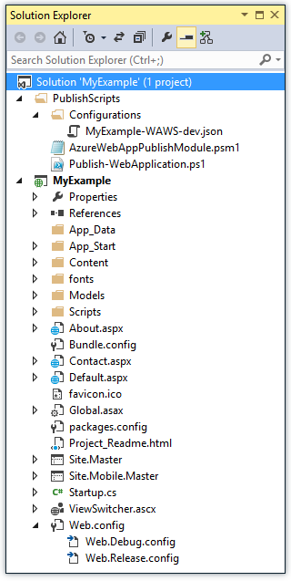

	The **Web Publish Activity** window shows that the site has been created.

	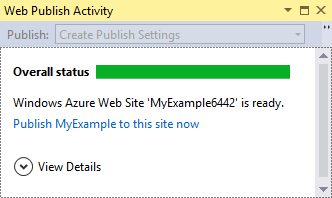

	And you can see the site in Server Explorer.

	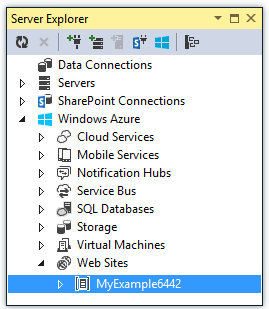

## Deploy the application to Azure

7. In the **Web Publish Activity** window, click **Publish MyExample to this site now**.

	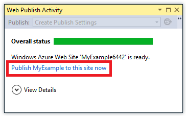

	In a few seconds the **Publish Web** wizard appears. 

	Settings that Visual Studio needs to deploy your project to Azure have been saved in a *publish profile*. The wizard enables you to review and change those settings.

8. In the **Connection** tab of the **Publish Web** wizard, click **Validate Connection** to make sure that Visual Studio can connect to Azure in order to deploy the web project.

	

	When the connection has been validated, a green check mark is shown next to the **Validate Connection** button. 

9. Click **Next**.

	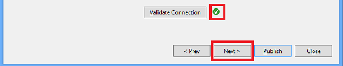

10. In the **Settings** tab, click **Next**.

	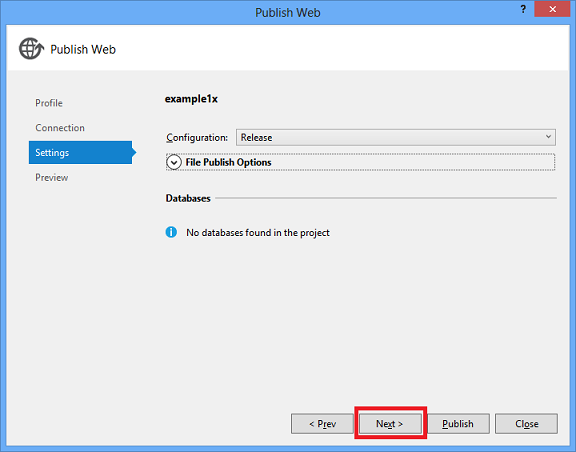

	You can accept the default values for **Configuration** and **File Publish Options**.

	The **Configuration** drop-down enables you to deploy a Debug build for remote debugging. The [Next Steps](#next-steps) section links to a tutorial that shows how to run Visual Studio in debug mode remotely.

	If you expand **File Publish Options** you'll see several settings that enable you to handle scenarios that don't apply to this tutorial:
 
	* Remove additional files at destination.
	  
		Deletes any files at the server that aren't in your project. You might need this if you were deploying a project to a site that you had deployed a different project to earlier.

	* Precompile during publishing. 
	 
		Can reduce first-request warm up times for large sites.

	* Exclude files from the App_Data folder. 
	 
		For testing you sometimes have a SQL Server database file in App_Data which you don't want to deploy to production.
	
11. In the **Preview** tab, click **Start Preview**.

	

	The tab displays a list of the files that will be copied to the server. Displaying the preview isn't required to publish the application but is a useful function to be aware of.

12. Click **Publish**.

	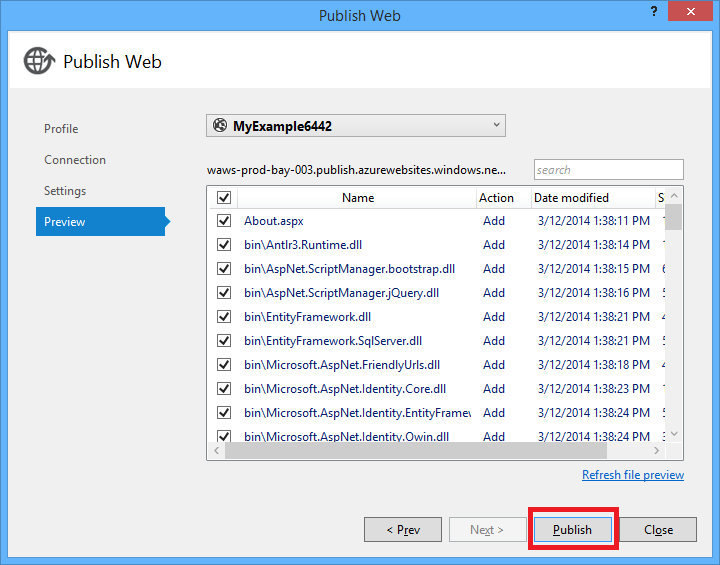

	Visual Studio begins the process of copying the files to the Azure server.

	The **Output** and **Web Publish Activity** windows show what deployment actions were taken and report successful completion of the deployment.

	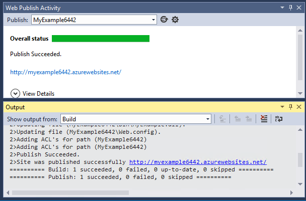

	Upon successful deployment, the default browser automatically opens to the URL of the deployed website, and
	the application that you created is now running in the cloud. The URL in the browser address bar shows that the site is being loaded from the Internet.

	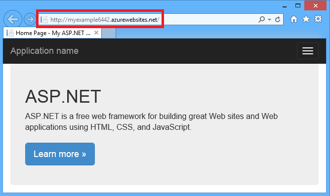

13. Close the browser.

## Make a change and redeploy

In this section of the tutorial, you change the **h1** heading of the home page, run the project locally on your development computer to verify the change, and then deploy the change to Azure.

2. Open the *Views/Home/Index.cshtml* or *.vbhtml* file in **Solution Explorer**, change the **h1** heading from "ASP.NET" to "ASP.NET and Azure", and save the file. 

	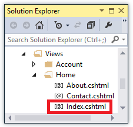

	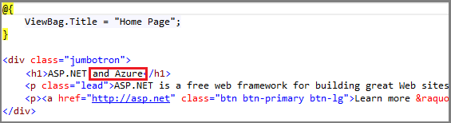

1. Press CTRL+F5 to see the updated heading by running the site on your local computer.

	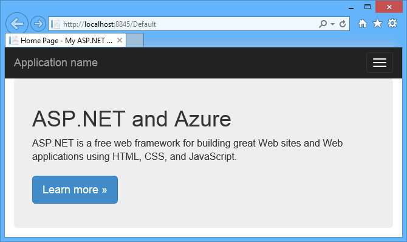

	The `http://localhost` URL shows that it's running on your local computer. By default it's running in IIS Express, which is a lightweight version of IIS designed for use during web application development.

1. Close the browser.

1. In **Solution Explorer**, right-click the project, and choose **Publish**.

	

	The Preview tab of the **Publish Web** wizard appears. If you needed to change any publish settings you could choose a different tab, but now all you want to do is redeploy with the same settings.

2. In the **Publish Web** wizard, click **Publish**.

	

	Visual Studio deploys the project to Azure and opens the site in the default browser.

	

**Tip:** You can enable the **Web One Click Publish** toolbar for even quicker deployment. Click **View** > **Toolbars**, and then select **Web One Click Publish**. The toolbar enables you to select a profile, click a button to publish, or click a button to open the **Publish Web** wizard. 

## Monitor and manage the site in the management portal

The [Azure Management Portal](/en-us/services/management-portal/) is a web interface that enables you to manage and monitor your Azure services, such as the website you just created. In this section of the tutorial you look at some of what you can do in the portal.

1. In your browser, go to [http://manage.windowsazure.com](), and sign in with your Azure credentials.

	The portal displays a list of your Azure services.

2. Click the name of your website.

	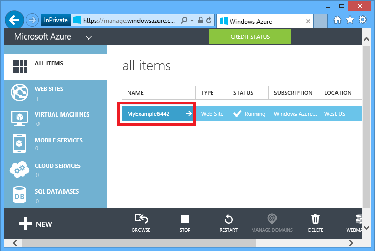
  
3. Click the **Dashboard** tab.

	The **Dashboard** tab displays an overview of usage statistics and link for a number of commonly used site management functions. Under **Quick Glance** you'll also find a link to your application's home page.

	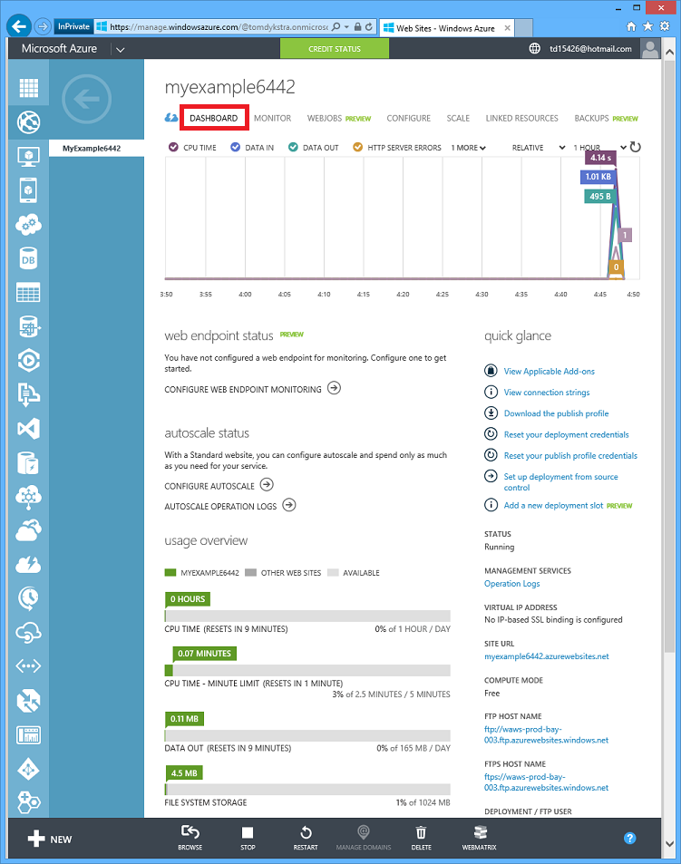
  
	At this point your site hasn't had much traffic and may not show anything in the graph. If you browse to your application, refresh the page a few times, and then refresh the portal **Dashboard** page, you'll see some statistics show up. You can click the **Monitor** tab for more details.

4. Click the **Configure** tab.

	The [Configure](/en-us/documentation/articles/web-sites-configure//) tab enables you to control the .NET version used for the site, enable features such as [WebSockets](/blog/2013/11/14/introduction-to-websockets-on-windows-azure-web-sites/) and [diagnostic logging](/en-us/documentation/articles/web-sites-enable-diagnostic-log/), set [connection string values](/blog/2013/07/17/windows-azure-web-sites-how-application-strings-and-connection-strings-work/), and more. 

	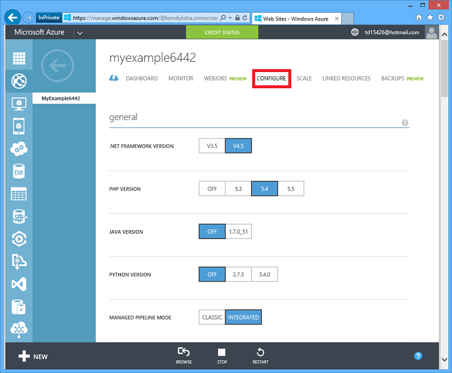
  
5. Click the **Scale** tab.

	For the paid tiers of the Websites service, the [Scale](/en-us/documentation/articles/web-sites-scale/) tab enables you to control the size and number of machines that service your web application in order to handle variations in traffic.

	You can scale manually or configure criteria or schedules for automatic scaling.

	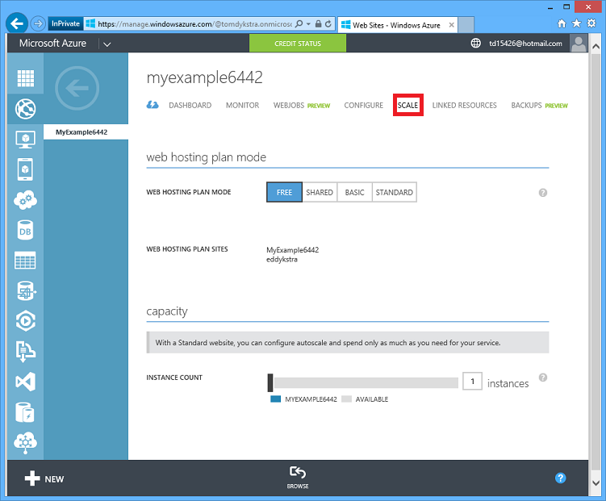

These are just a few of the management portal's features. You can also create new websites, delete existing sites, stop and restart sites, and manage other kinds of Azure services, such as databases and virtual machines.  

**Tip:** There is a new management portal in preview which will eventually replace the one you've been using. For more information, see [Azure Preview Portal](/en-us/overview/preview-portal/).

## Next steps

In this tutorial you've seen how to create a simple web application and deploy it to an Azure Website. Here are some related topics and resources for learning more about them.

* Other ways to deploy a web project

	In this tutorial you saw the quickest way to create a site and deploy it all in one operation. For an overview of other ways to deploy, by using Visual Studio or by [automating deployment](http://www.asp.net/aspnet/overview/developing-apps-with-windows-azure/building-real-world-cloud-apps-with-windows-azure/continuous-integration-and-continuous-delivery) from a [source control system](http://www.asp.net/aspnet/overview/developing-apps-with-windows-azure/building-real-world-cloud-apps-with-windows-azure/source-control), see [How to Deploy an Azure Website](/en-us/documentation/articles/web-sites-deploy/"). 

	Visual Studio can also generate Windows PowerShell scripts that enable you to automate deployment. For more information, see [Automate Everything (Building Real-World Cloud Apps with Azure)](http://www.asp.net/aspnet/overview/developing-apps-with-windows-azure/building-real-world-cloud-apps-with-windows-azure/automate-everything).

* How to manage a website in Visual Studio

	For information about site management functions that you can do in **Server Explorer**, see [Troubleshooting Azure Websites in Visual Studio](/en-us/develop/net/tutorials/troubleshoot-web-sites-in-visual-studio/).

* How to troubleshoot a website

	Visual Studio provides features that make it easy to view Azure logs as they are generated in real time. You can also run in debug mode remotely in Azure. For more information, see [Troubleshooting Azure Websites in Visual Studio](/en-us/develop/net/tutorials/troubleshoot-web-sites-in-visual-studio/).

* How to add database and authorization functionality

	For a tutorial that shows how to access a database and restrict some site functions to authorized users, see [Deploy a Secure ASP.NET MVC app with Membership, OAuth, and SQL Database to an Azure Website](/en-us/develop/net/tutorials/web-site-with-sql-database/).

* How to add a custom domain name and SSL

	For information about how to use SSL and your own domain (for example www.contoso.com instead of contoso.azurewebsites.net), see the following resources:

	* [Configuring a custom domain name for an Azure Website](/en-us/documentation/articles/web-sites-custom-domain-name/). 
	* [Enable HTTPS for an Azure website](http://azure.microsoft.com/en-us/documentation/articles/web-sites-configure-ssl-certificate/)

* How to avoid wake-up wait time after idle time-outs 

	By default, websites are unloaded if they have been idle for some period of time. The first request after that has to wait for the site to be reloaded. To avoid that wait time you can  enable the AlwaysOn feature. For more information, see configuration options in [How to Configure Websites](http://azure.microsoft.com/en-us/documentation/articles/web-sites-configure/).

* How to add real-time features such as chat

	If your website will include real-time features (such as a chat service, a game, a stock ticker, and so forth), you can get the best performance by using [ASP.NET SignalR](http://www.asp.net/signalr) with the [WebSockets](/blog/2013/11/14/introduction-to-websockets-on-windows-azure-web-sites/) transport method. For more information, see [Using SignalR with Windows Azure Websites](http://www.asp.net/signalr/overview/signalr-20/getting-started-with-signalr-20/using-signalr-with-windows-azure-web-sites). 

* How to choose between Azure Websites, Cloud Services, and VMs for web applications

	In Azure you can run web applications in Websites as shown in this tutorial, or in Cloud Services or in Virtual Machines. For more information, see [Azure Execution Models](/en-us/develop/net/fundamentals/compute/) and [Azure Websites, Cloud Services, and VMs: When to use which?](/en-us/manage/services/web-sites/choose-web-app-service/).
