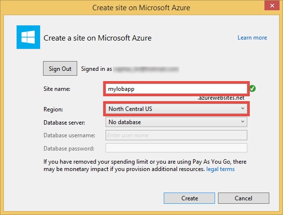
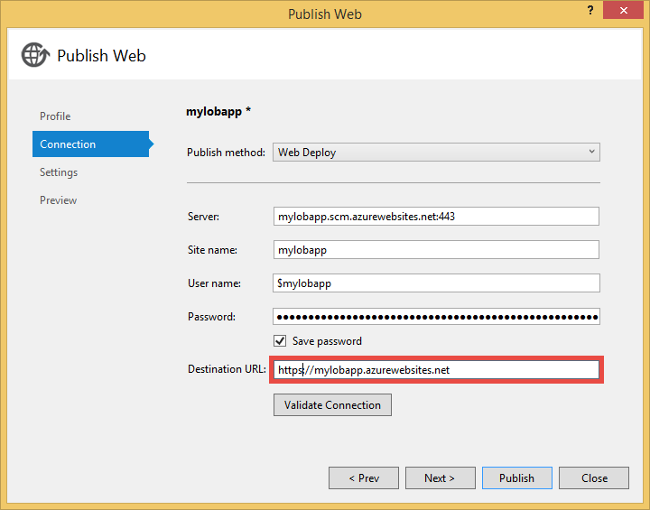
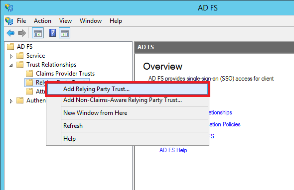
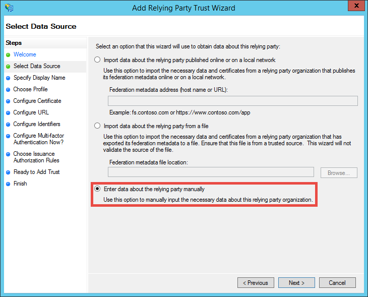
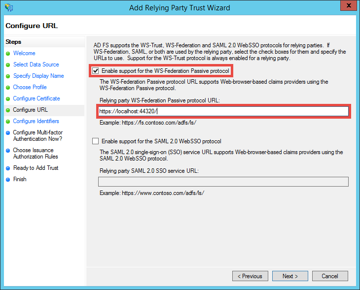
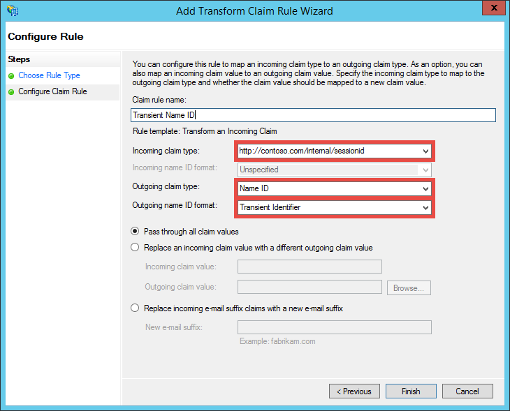
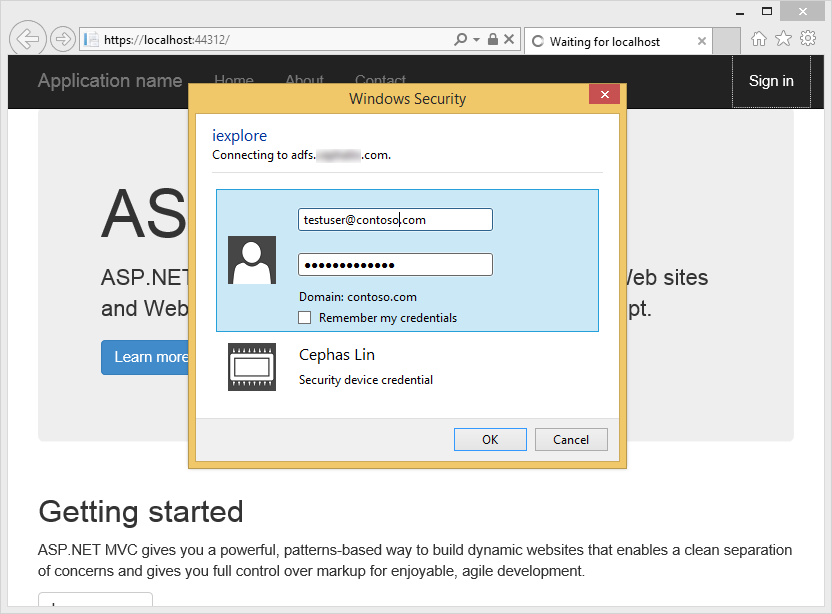

<properties 
	pageTitle="Create a .NET MVC web app in Azure App Service with AD FS authentication" 
	description="Learn how to create an ASP.NET MVC line-of-business application in Azure App Service Web Apps that authenticates with on-premise STS. This tutorial targets AD FS as the on-premise STS." 
	services="app-service\web" 
	documentationCenter=".net" 
	authors="cephalin" 
	manager="wpickett" 
	editor=""/>

<tags 
	ms.service="app-service-web" 
	ms.devlang="dotnet" 
	ms.topic="article" 
	ms.tgt_pltfrm="na" 
	ms.workload="web" 
	ms.date="04/09/2015" 
	ms.author="cephalin"/>

# Create a .NET MVC web app in Azure App Service with AD FS authentication

In this article, you will learn how to create an ASP.NET MVC line-of-business application in [Azure App Service Web Apps](http://go.microsoft.com/fwlink/?LinkId=529714) using an on-premises [Active Directory Federation Services](http://technet.microsoft.com/library/hh831502.aspx) as the identity provider. This scenario can work when you want to create line-of-business applications in Azure App Service Web Apps but your organization requires all data to be stored on-site.

>[AZURE.NOTE] For an overview of the different enterprise authentication and authorization options for Azure App Service Web Apps, see [Use Active Directory for authentication in Azure App Service](web-sites-authentication-authorization.md).

## What you will build ##

You will build a basic ASP.NET application in Azure App Service Web Apps with the following features:

- Authenticates users against AD FS
- Uses `[Authorize]` to authorize users for different actions
- Static configuration for both debugging in Visual Studio and publishing to App Service Web Apps (configure once, debug and publish anytime)  

## What you will need ##

[AZURE.INCLUDE [free-trial-note](../includes/free-trial-note.md)]

>[AZURE.NOTE] If you want to get started with Azure App Service before signing up for an Azure account, go to [Try App Service](http://go.microsoft.com/fwlink/?LinkId=523751), where you can immediately create a short-lived starter web app in App Service. No credit cards required; no commitments.

You need the following to complete this tutorial:

- An on-premises AD FS deployment (for an end-to-end walkthrough of the test lab that I use, see [Test Lab: Standalone STS with AD FS in Azure VM (for test only)](TODO))
- Permissions to create relying party trusts in AD FS Management
- Visual Studio 2013
- [Azure SDK 2.5.1](http://go.microsoft.com/fwlink/p/?linkid=323510&clcid=0x409) or later

## Use sample application for line-of-business template ##

The sample application in this tutorial, [WebApp-WSFederation-DotNet)](https://github.com/AzureADSamples/WebApp-WSFederation-DotNet), is created by the Azure Active Directory team. Since AD FS supports WS-Federation, you can is it as a template to create new line-of-business applications with ease. It has the following features:

- Uses [WS-Federation](http://msdn.microsoft.com/library/bb498017.aspx) to authenticate with an on-premises AD FS deployment
- Sign-in and sign-out functionality
- Uses [Microsoft.Owin](http://www.asp.net/aspnet/overview/owin-and-katana/an-overview-of-project-katana) (instead of Windows Identity Foundation, i.e. WIF), which is the future of ASP.NET and much simpler to set up for authentication and authorization than WIF

## Set up the sample application ##

2.	Clone or download the sample solution at [WebApp-WSFederation-DotNet](https://github.com/AzureADSamples/WebApp-WSFederation-DotNet) to your local directory.

	> [AZURE.NOTE] The instructions at [README.md](https://github.com/AzureADSamples/WebApp-WSFederation-DotNet/blob/master/README.md) shows you how to set up the application with Azure Active Directory, but in this tutorial you will set it up with AD FS, so follow the steps here instead.

3.	Open the solution, and then open Controllers\AccountController.cs in the **Solution Explorer**.

	You will see that the code simply issues an authentication challenge to authenticate the user using WS-Federation. All authentication is configured in App_Start\Startup.Auth.cs.

4.  Open App_Start\Startup.Auth.cs. In the `ConfigureAuth` method, note the line:

        app.UseWsFederationAuthentication(
            new WsFederationAuthenticationOptions
            {
                Wtrealm = realm,
                MetadataAddress = metadata                                      
            });

	In the OWIN world, this is really the bare minimum you need to configure WS-Federation authentication. This is must simpler and more elegant than WIF, where Web.config is injected with XML all over the place. The only information you need is the relying party's (RP) identifier and the URL of your AD FS service's metadata file. Here's an example:

	-	RP identifier: `https://contoso.com/MyLOBApp`
	-	Metadata address: `http://adfs.contoso.com/FederationMetadata/2007-06/FederationMetadata.xml`

5.	In App_Start\Startup.Auth.cs, change the static string definitions as highlighted below:  
	<pre class="prettyprint">
	private static string realm = ConfigurationManager.AppSettings["ida:<mark>RPIdentifier</mark>"];
    <mark><del>private static string aadInstance = ConfigurationManager.AppSettings["ida:AADInstance"];</del></mark>
    <mark><del>private static string tenant = ConfigurationManager.AppSettings["ida:Tenant"];</del></mark>
    <mark><del>private static string metadata = string.Format("{0}/{1}/federationmetadata/2007-06/federationmetadata.xml", aadInstance, tenant);</del></mark>
    <mark>private static string metadata = string.Format("https://{0}/federationmetadata/2007-06/federationmetadata.xml", ConfigurationManager.AppSettings["ida:ADFS"]);</mark>

    <mark><del>string authority = String.Format(CultureInfo.InvariantCulture, aadInstance, tenant);</del></mark>
    </pre>

6.	You will now make the corresponding changes in Web.config. Open the Web.config and modify the app settings as highlighted below:  
	<pre class="prettyprint">
	&lt;appSettings&gt;
	  &lt;add key="webpages:Version" value="3.0.0.0" /&gt;
	  &lt;add key="webpages:Enabled" value="false" /&gt;
	  &lt;add key="ClientValidationEnabled" value="true" /&gt;
	  &lt;add key="UnobtrusiveJavaScriptEnabled" value="true" /&gt;
	  <mark><del>&lt;add key="ida:Wtrealm" value="[Enter the App ID URI of WebApp-WSFederation-DotNet https://contoso.onmicrosoft.com/WebApp-WSFederation-DotNet]" /&gt;</del></mark>
	  <mark><del>&lt;add key="ida:AADInstance" value="https://login.windows.net" /&gt;</del></mark>
	  <mark><del>&lt;add key="ida:Tenant" value="[Enter tenant name, e.g. contoso.onmicrosoft.com]" /&gt;</del></mark>
	  <mark>&lt;add key="ida:RPIdentifier" value="[Enter the relying party identifier as configured in AD FS, e.g. https://localhost:44320/]" /&gt;</mark>
	  <mark>&lt;add key="ida:ADFS" value="[Enter the FQDN of AD FS service, e.g. adfs.contoso.com]" /&gt;</mark>

	&lt;/appSettings&gt;
	</pre>

	Fill in the key values based on your respective environment.

7.	Build the application to make sure there are no errors.

That's it. Now the sample application is ready to work with AD FS. You will still need to configure an RP trust with this application in AD FS later.

## Deploy the sample application to Azure App Service Web Apps

Here, you will publish the application to a web app in App Service Web Apps while preserving the debug environment. Note that you're going to publish the application before it has an RP trust with AD FS, so authentication still doesn't work yet. However, if you do it now you can have the web app URL that you will also use to configure the RP trust later.

1. Right-click your project and select **Publish**.

	

2. Select **Microsoft Azure Web Apps**.
3. If you haven't signed in to Azure, click **Sign In** and use the Microsoft account for your Azure subscription to sign in.
4. Once signed in, click **New** to create a new web app.
5. Fill in all required fields. You are going to connect to on-premise data later, so you won't create a database for this web app.

	

6. Click **Create**. Once the web app is created, the Publish Web dialog is opened.
7. In **Destination URL**, change **http** to **https**. Copy the entire URL to a text editor. You will use it later. Then, click **Publish**.

	

11. In Visual Studio, open **Web.Release.config** in your project. Insert the following XML into the `<configuration>` tag, and replace the key value with your publish web app's URL.  
	<pre class="prettyprint">
&lt;appSettings&gt;
   &lt;add key="ida:RPIdentifier" value="<mark>[e.g. https://mylobapp.azurewebsites.net/]</mark>" xdt:Transform="SetAttributes" xdt:Locator="Match(key)" /&gt;
&lt;/appSettings&gt;</pre>

When you're done, you have two RP identifiers configured in your project, one for your debug environment in Visual Studio, and one for the published web app in Azure. You will set up an RP trust for each of the two environments in AD FS. During debugging, the app settings in Web.config is used to make your **Debug** configuration work with AD FS, and when it's published (by default, the **Release** configuration is published), a transformed Web.config is uploaded that incorporates the app setting changes in Web.Release.config.

If you want to attach the published web app in Azure to the debugger (i.e. you must upload debug symbols of your code in the published web app), you can create a clone of the Debug configuration for Azure debugging, but with its own custom Web.config transform (e.g. Web.AzureDebug.config) that uses the app settings from Web.Release.config. This allows you to maintain a static configuration across the different environments.

## Configure relying party trusts in AD FS Management ##

Now you need to configure a RP trust in AD FS Mangement before you can your sample application can actually authenticate with AD FS. You will need to set up two separate RP trusts, one for your debug environment and one for your published web app.

> [AZURE.NOTE] Make sure that you repeat the steps below for both of your environments.

4.	On your AD FS server, log in with credentials that have management rights to AD FS.
5.	Open AD FS Management. Right-click **AD FS\Trusted Relationships\Relying Party Trusts** and select **Add Relying Party Trust**.

	

5.	In the **Select Data Source** page, select **Enter data about the relying party manually**. 

	

6.	In the **Specify Display Name** page, type a display name for the application and click **Next**.
7.	In the **Choose Protocol** page, click **Next**.
8.	In the **Configure Certificate** page, click **Next**.

	> [AZURE.NOTE] Since you should be using HTTPS already, encrypted tokens are optional. If you really want to encrypt tokens from AD FS on this page, you must also add token-decrypting logic in your code. For more information, see [Manually configuring OWIN WS-Federation middleware and accepting encrypted tokens](http://chris.59north.com/post/2014/08/21/Manually-configuring-OWIN-WS-Federation-middleware-and-accepting-encrypted-tokens.aspx).
  
5.	Before you move onto the next step, you need one piece of information from your Visual Studio project. In the project properties, note the **SSL URL** of the application. 

	

6.	Back in AD FS Management, in the **Configure URL** page of the **Add Relying Party Trust Wizard**, select **Enable support for the WS-Federation Passive protocol** and type in the SSL URL of your Visual Studio project that you noted in the previous step. Then, click **Next**.

	

	> [AZURE.NOTE] URL specifies where to send the client after authentication succeeds. For the debug environment, it should be <code>https://localhost:&lt;port&gt;/</code>. For the published web app, it should be the web app URL.

7.	In the **Configure Identifiers** page, verify that your project SSL URL is already listed and click **Next**. Click **Next** all the way to the end of the wizard with default selections.

	> [AZURE.NOTE] In App_Start\Startup.Auth.cs of your Visual Studio project, this identifier is matched against the value of <code>WsFederationAuthenticationOptions.Wtrealm</code> during federated authentication. By default, the application's URL from the previous step is added as an RP identifier.

8.	You have now finished configuring the RP application for your project in AD FS. Next, you will configure this application to send the claims needed by your application. The **Edit Claim Rules** dialog is opened by default for you at the end of the wizard so you can start immediately. Let's configure at least the following claims (with schemas in parentheses):

	-	Name (http://schemas.xmlsoap.org/ws/2005/05/identity/claims/name) - used by ASP.NET to hydrate `User.Identity.Name`.
	-	User principal name (http://schemas.xmlsoap.org/ws/2005/05/identity/claims/upn) - used to uniquely identify users in the organization.
	-	Group memberships as roles (http://schemas.microsoft.com/ws/2008/06/identity/claims/role) - can be used with `[Authorize(Roles="role1, role2,...")]` decoration to authorize controllers/actions. In reality, this may not be the most performant approach for role authorization, especially if your AD users regularly belong to hundreds of security groups, which translates to hundreds of role claims in the SAML token. An alternative approach is to send a single role claim conditionally depending on the user's membership in a particular group. However, we'll keep it simple for this tutorial.
	-	Name ID (http://schemas.xmlsoap.org/ws/2005/05/identity/claims/nameidentifier) - can be used for anti-forgery validation. For more information on how to make it work with anti-forgery validation, see the **Add line-of-business functionality to the sample application** section of [Create a .NET MVC web app in Azure App Service with Azure Active Directory authentication](web-sites-dotnet-lob-application-azure-ad.md#bkmk_crud).

	> [AZURE.NOTE] The claim types you need to configure for your application is determined by your application's needs. For the list of claims supported by Azure Active Directory applications (i.e. RP trusts), for example, see [Supported Token and Claim Types](http://msdn.microsoft.com/library/azure/dn195587.aspx).

8.	In the Edit Claim Rules dialog, click **Add Rule**.
9.	Configure the name, UPN, and role claims as shown below and click **Finish**.

	

	Next, you will create a transient name ID claim using the steps demonstrated in [Name Identifiers in SAML assertions](http://blogs.msdn.com/b/card/archive/2010/02/17/name-identifiers-in-saml-assertions.aspx).

9.	Click **Add Rule** again.
10.	Select **Send Claims Using a Custom Rule** and click **Next**.
11.	Paste the following rule language into the **Custom rule** box, name the rule **Per Session Identifier** and click **Finish**.  
	<pre class="prettyprint">
	c1:[Type == "http://schemas.microsoft.com/ws/2008/06/identity/claims/windowsaccountname"] &amp;&amp;
	c2:[Type == "http://schemas.microsoft.com/ws/2008/06/identity/claims/authenticationinstant"]
		add(
			store = "_OpaqueIdStore",
			types = ("<mark>http://contoso.com/internal/sessionid</mark>"),
			query = "{0};{1};{2};{3};{4}",
			param = "useEntropy",
			param = c1.Value,
			param = c1.OriginalIssuer,
			param = "",
			param = c2.Value);
	</pre>

	Your custom rule should look like this:

	

9.	Click **Add Rule** again.
10.	Select **Transform an Incoming Claim** and click **Next**.
11.	Configure the rule as shown below (using the claim type you created in the custom rule) and click **Finish**.

	

	For detailed information on the steps for the transient Name ID claim above, see [Name Identifiers in SAML assertions](http://blogs.msdn.com/b/card/archive/2010/02/17/name-identifiers-in-saml-assertions.aspx).

12.	Click **Apply** in the **Edit Claim Rules** dialog. It should now look like the screenshot below:

	

	> [AZURE.NOTE] Again, make sure that you repeat these steps for both your debug environment and published web app.

## Test federated authentication for your application

You are ready to test your application's authentication logic against AD FS. In my AD FS lab environment, I have a test user that belongs to a test group in Active Directory (AD).

To test authentication in the debugger, all you need to do now is type `F5`. If you want to test authentication in the published web app, navigate to the URL.

After the web application loads, click **Sign In**. You should now get either a login dialog or the login page served by AD FS, depending on the authentication method chosen by AD FS. Here's what I get in Internet Explorer 11.

Once you log in with a user in the AD domain of the AD FS deployment, you should now see the homepage again with **Hello, <User Name>!** in the corner. Here's what I get.

So far, you've succeeded in the following ways:

- Your application has successfully reached AD FS and a matching RP identifier is found in the AD FS database
- AD FS has successfully authenticated an AD user and redirect you back to the application's homepage
- AD FS as successfully sent the name claim (http://schemas.xmlsoap.org/ws/2005/05/identity/claims/name) to your application, as indicated by the fact that the user name is displayed in the corner. 

If the name claim is missing, you would have seen **Hello, !**. If you take a look at Views\Shared\_LoginPartial.cshtml, you will find that it uses `User.Identity.Name` to display the user name. As mentioned previously, ASP.NET hydrates this property with the name claim of the authenticated user, if it is available in the SAML token. To see all the claims that are sent by AD FS, put a breakpoint in Controllers\HomeController.cs, in the Index action method. After the user is authenticated, inspect the `System.Security.Claims.Current.Claims` collection.

 

## Authorize users for specific controllers or actions

Since you have included group memberships as role claims in your RP trust configuration, you can now use these directly in the `[Authorize(Roles="...")]` decoration for controllers and actions. In a line-of-business application with the Create-Read-Update-Delete (CRUD) pattern, you can authorize specific roles to access each action. For now, you will just try out this feature on the existing Home controller.

1. Open Controllers\HomeController.cs.
2. Decorate the `About` and `Contact` action methods similar to below, using security group memberships that your authenticated user has.  
	<pre class="prettyprint">
    <mark>[Authorize(Roles="Test Group")]</mark>
    public ActionResult About()
    {
        ViewBag.Message = "Your application description page.";

        return View();
    }

    <mark>[Authorize(Roles="Domain Admins")]</mark>
    public ActionResult Contact()
    {
        ViewBag.Message = "Your contact page.";

        return View();
    }
	</pre>

	Since I added **Test User** to **Test Group** in my AD FS lab environment, I'll use Test Group to test authorization on `About`. For `Contact`, I'll test the negative case of **Domain Admins**, to which **Test User** doesn't belong.

3. Start the debugger by typing `F5` and sign in, then click **About**. You should now be viewing the `~/About/Index` page successfully, if your authenticated user is authorized for that action.
4. Now click **Contact**, which in my case should not authorize **Test User** for the action. However, the browser is redirected to AD FS, which eventually shows this message:

	

	If you investigate this error in Event Viewer on the AD FS server, you will see this exception message:  
	<pre class="prettyprint">
	Microsoft.IdentityServer.Web.InvalidRequestException: MSIS7042: <mark>The same client browser session has made '6' requests in the last '11' seconds.</mark> Contact your administrator for details.
	   at Microsoft.IdentityServer.Web.Protocols.PassiveProtocolHandler.UpdateLoopDetectionCookie(WrappedHttpListenerContext context)
	   at Microsoft.IdentityServer.Web.Protocols.WSFederation.WSFederationProtocolHandler.SendSignInResponse(WSFederationContext context, MSISSignInResponse response)
	   at Microsoft.IdentityServer.Web.PassiveProtocolListener.ProcessProtocolRequest(ProtocolContext protocolContext, PassiveProtocolHandler protocolHandler)
	   at Microsoft.IdentityServer.Web.PassiveProtocolListener.OnGetContext(WrappedHttpListenerContext context)
	</pre>

	The reason this happens is that by default, MVC returns a 401 Unauthorized when a user's roles are not authorized. This triggers a reauthentication request to your identity provider (AD FS). Since the user is already authenticated, AD FS returns to the same page, which then issues another 401, creating a redirect loop. You will override AuthorizeAttribute's `HandleUnauthorizedRequest` method with simple logic to show something that makes sense instead of continuing the redirect loop.

5. Create a file in the project called AuthorizeAttribute.cs, and paste the code below into it.

		using System;
		using System.Web.Mvc;
		using System.Web.Routing;
		
		namespace WebApp_WSFederation_DotNet
		{
		    [AttributeUsage(AttributeTargets.Class | AttributeTargets.Method, Inherited = true, AllowMultiple = true)]
		    public class AuthorizeAttribute : System.Web.Mvc.AuthorizeAttribute
		    {
		        protected override void HandleUnauthorizedRequest(AuthorizationContext filterContext)
		        {
		            if (filterContext.HttpContext.Request.IsAuthenticated)
		            {
		                filterContext.Result = new System.Web.Mvc.HttpStatusCodeResult((int)System.Net.HttpStatusCode.Forbidden);
		            }
		            else
		            {
		                base.HandleUnauthorizedRequest(filterContext);
		            }
		        }
		    }
		}

	The override code sends an HTTP 403 (Forbidden) instead of HTTP 401 (Unauthorized) in  authenticated-but-unauthorized cases.

6. Run the debugger again with `F5`. Clicking **Contact** now shows a more informative (albeit unattractive) error message:

	

7. Publish the application to Azure App Service Web Apps again, and test the behavior of the live application.

## Connect to on-premises data

A reason that you would want to implement your line-of-business application with AD FS instead of Azure Active Directory is compliance issues with keeping organization data off-premise. This may also mean that your web app in Azure must access on-premise databases, since you are not allowed to use [SQL Database](/services/sql-database/) as the data tier for your web apps.

Azure App Service Web Apps supports accessing on-premise databases with two approaches: [Hybrid Connections](integration-hybrid-connection-overview.md) and [Virtual Networks](web-sites-integrate-with-vnet.md). For more information, see [Using VNET integration and Hybrid connections with Azure App Service Web Apps](http://azure.microsoft.com/blog/2014/10/30/using-vnet-or-hybrid-conn-with-websites/).

## Further resources

- [Protect the Application with SSL and the Authorize Attribute](web-sites-dotnet-deploy-aspnet-mvc-app-membership-oauth-sql-database.md#protect-the-application-with-ssl-and-the-authorize-attribute)
- [Use Active Directory for authentication in Azure App Service](web-sites-authentication-authorization.md)
- [Create a .NET MVC web app in Azure App Service with Azure Active Directory authentication](web-sites-dotnet-lob-application-azure-ad.md)
- [Use the On-Premises Organizational Authentication Option (ADFS) With ASP.NET in Visual Studio 2013](http://www.cloudidentity.com/blog/2014/02/12/use-the-on-premises-organizational-authentication-option-adfs-with-asp-net-in-visual-studio-2013/)
- [Vittorio Bertocci's blog](http://blogs.msdn.com/b/vbertocci/)
- [Migrate a VS2013 Web Project From WIF to Katana](http://www.cloudidentity.com/blog/2014/09/15/MIGRATE-A-VS2013-WEB-PROJECT-FROM-WIF-TO-KATANA/)
- [Active Directory Federation Services Overview](http://technet.microsoft.com/library/hh831502.aspx)
- [WS-Federation 1.1 specification](http://download.boulder.ibm.com/ibmdl/pub/software/dw/specs/ws-fed/WS-Federation-V1-1B.pdf?S_TACT=105AGX04&S_CMP=LP)

[AZURE.INCLUDE [app-service-web-whats-changed](../includes/app-service-web-whats-changed.md)]
 
