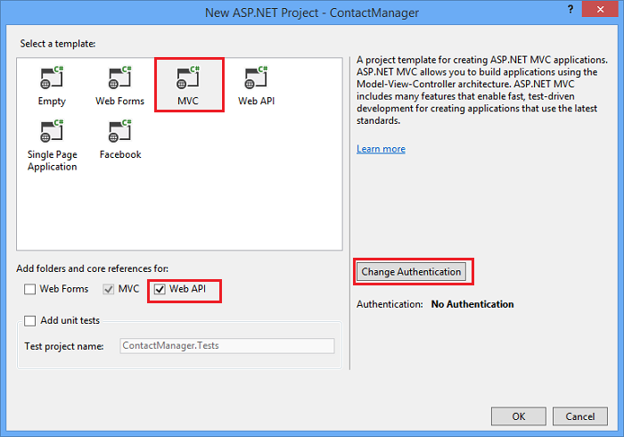
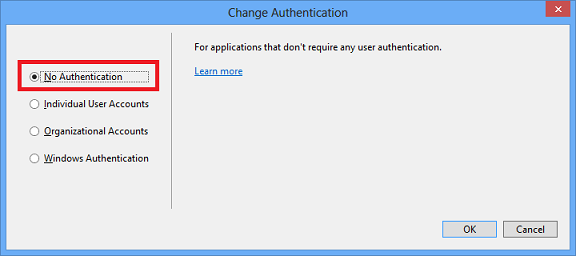
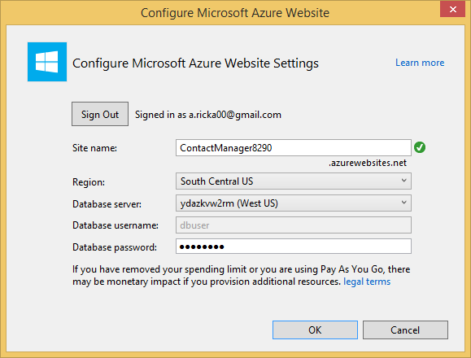
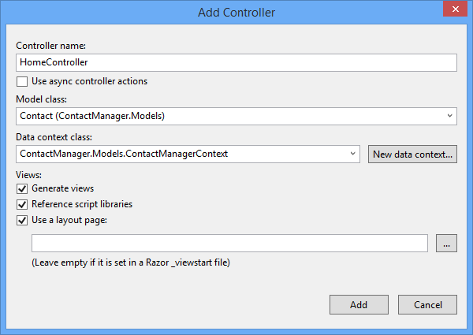

<properties 
	pageTitle="Create a REST service using ASP.NET Web API and SQL Database in Azure App Service" 
	description="A tutorial that teaches you how to deploy an app that uses the ASP.NET Web API to an Azure web app by using Visual Studio." 
	services="app-service\web" 
	documentationCenter=".net" 
	authors="Rick-Anderson" 
	writer="Rick-Anderson" 
	manager="wpickett" 
	editor=""/>

<tags 
	ms.service="app-service-web" 
	ms.workload="web" 
	ms.tgt_pltfrm="na" 
	ms.devlang="dotnet" 
	ms.topic="article" 
	ms.date="03/24/2015" 
	ms.author="riande"/>

# Create a REST service using ASP.NET Web API and SQL Database in Azure App Service

This tutorial shows how to deploy an ASP.NET web app to an [Azure App Service](http://go.microsoft.com/fwlink/?LinkId=529714) by using the Publish Web wizard in Visual Studio 2013 or Visual Studio 2013 for Web Express. 

You can open an Azure account for free, and if you don't already have Visual Studio 2013, the SDK automatically installs Visual Studio 2013 for Web Express. So you can start developing for Azure entirely for free.

This tutorial assumes that you have no prior experience using Azure. On completing this tutorial, you'll have a simple web app up and running in the cloud.
 
You'll learn:

* How to enable your machine for Azure development by installing the Azure SDK.
* How to create a Visual Studio ASP.NET MVC 5 project and publish it to an Azure app.
* How to use the ASP.NET Web API to enable Restful API calls.
* How to use a SQL database to store data in Azure.
* How to publish application updates to Azure.

You'll build a simple contact list web application that is built on ASP.NET MVC 5 and uses the ADO.NET Entity Framework for database access. The following illustration shows the completed application:

![screenshot of web site][intro001]

<!-- the next line produces the "Set up the development environment" section as see at http://azure.microsoft.com/documentation/articles/web-sites-dotnet-get-started/ -->
[AZURE.INCLUDE [create-account-and-websites-note](../includes/create-account-and-websites-note.md)]

### Create the project

1. Start Visual Studio 2013.
1. From the **File** menu click **New Project**.
3. In the **New Project** dialog box, expand **Visual C#** and select **Web**  and then select **ASP.NET MVC 5 Web Application**. Name the application **ContactManager** and click **OK**.

	]

1. In the **New ASP.NET Project** dialog box, select the **MVC** template, check **Web API** and then click **Change Authentication**.

	

1. In the **Change Authentication** dialog box, click **No Authentication**, and then click **OK**.

	

	The sample application you're creating won't have features that require users to log in. For information about how to implement authentication and authorization features, see the [Next Steps](#nextsteps) section at the end of this tutorial. 

1. In the **New ASP.NET Project** dialog box, click **OK**.

	

If you have not previously signed in to Azure, you will be prompted to sign in.

1. The configuration wizard will suggest a unique name based on *ContactManager* (see the image below). Select a region near you. You can use [azurespeed.com](http://www.azurespeed.com/ "AzureSpeed.com") to find the lowest latency data center. 
2. If you haven't created a database server before, select **Create new server**, enter a database user name and password.

	

If you have a database server, use that to create a new database. Database servers are a precious resource, and you generally want to create multiple databases on the same server for testing and development rather than creating a database server per database. Make sure your web site and database are in the same region.

### Set the page header and footer

1. In **Solution Explorer**, expand the *Views\Shared* folder and open the *_Layout.cshtml* file.

	![_Layout.cshtml in Solution Explorer][newapp004]

1. Replace the contents of the *Views\Shared_Layout.cshtml* file with the following code:

		<!DOCTYPE html>
		<html lang="en">
		<head>
		    <meta charset="utf-8" />
		    <title>@ViewBag.Title - Contact Manager</title>
		    <link href="~/favicon.ico" rel="shortcut icon" type="image/x-icon" />
		    <meta name="viewport" content="width=device-width" />
		    @Styles.Render("~/Content/css")
		    @Scripts.Render("~/bundles/modernizr")
		</head>
		<body>
		    <header>
		        

		            

		                
@Html.ActionLink("Contact Manager", "Index", "Home")

		            

		        

		    </header>
		    

		        @RenderSection("featured", required: false)
		        <section class="content-wrapper main-content clear-fix">
		            @RenderBody()
		        </section>
		    

		    <footer>
		        

		            

		                
&copy; @DateTime.Now.Year - Contact Manager

		            

		        

		    </footer>
		    @Scripts.Render("~/bundles/jquery")
		    @RenderSection("scripts", required: false)
		</body>
		</html>
			
The markup above changes the app name from "My ASP.NET App" to "Contact Manager", and it removes the links to **Home**, **About** and **Contact**.

### Run the application locally

1. Press CTRL+F5 to run the application.
The application home page appears in the default browser.
	

This is all you need to do for now to create the application that you'll deploy to Azure. Later you'll add database functionality.

<h2>Deploy the application to Azure</h2>

1. In Visual Studio, right-click the project in **Solution Explorer** and select **Publish** from the context menu.

	![Publish in project context menu][PublishVSSolution]

	The **Publish Web** wizard opens.

12. Click **Publish**.

Visual Studio begins the process of copying the files to the Azure server. The **Output** window shows what deployment actions were taken and reports successful completion of the deployment.

14. The default browser automatically opens to the URL of the deployed site.

	The application you created is now running in the cloud.
	
	![To Do List home page running in Azure][rxz2]

<h2>Add a database to the application</h2>

Next, you'll update the MVC application to add the ability to display and update contacts and store the data in a database. The application will use the Entity Framework to create the database and to read and update data in the database.

### Add data model classes for the contacts

You begin by creating a simple data model in code.

1. In **Solution Explorer**, right-click the Models folder, click **Add**, and then **Class**.

	![Add Class in Models folder context menu][adddb001]

2. In the **Add New Item** dialog box, name the new class file *Contact.cs*, and then click **Add**.

	![Add New Item dialog box][adddb002]

3. Replace the contents of the Contacts.cs file with the following code.

		using System.Globalization;
		namespace ContactManager.Models
		{
    		public class Contact
   			{
        		public int ContactId { get; set; }
				public string Name { get; set; }
				public string Address { get; set; }
	        	public string City { get; set; }
				public string State { get; set; }
				public string Zip { get; set; }
				public string Email { get; set; }
				public string Twitter { get; set; }
				public string Self
        		{
            		get { return string.Format(CultureInfo.CurrentCulture,
				         "api/contacts/{0}", this.ContactId); }
            		set { }
        		}
    		}
		}

The **Contacts** class defines the data that you will store for each contact, plus a primary key, ContactID, that is needed by the database. You can get more information about data models in the [Next Steps](#nextsteps) section at the end of this tutorial.

### Create web pages that enable app users to work with the contacts

The ASP.NET MVC the scaffolding feature can automatically generate code that performs create, read, update, and delete (CRUD) actions.

<h2>Add a Controller and a view for the data</h2>

1. In **Solution Explorer**, expand the Controllers folder.

3. Build the project **(Ctrl+Shift+B)**. (You must build the project before using scaffolding mechanism.) 

4. Right-click the Controllers folder and click **Add**, and then click **Controller**.

	![Add Controller in Controllers folder context menu][addcode001]

1. In the **Add Scaffold** dialog box, select **MVC Controller with views, using Entity Framework** and click **Add**.

 

6. Set the controller name to **HomeController**. Select **Contact** as your model class. Click the **New data context** button and accept the default "ContactManager.Models.ContactManagerContext" for the **New data context type**. Click **Add**.

	

	A dialog box will prompt you: "A file with the name HomeController already exits. Do you want to replace it?". Click **Yes**. We are overwriting the Home Controller that was created with the new project. We will use the new Home Controller for our contact list.

	Visual Studio creates a controller methods and views for CRUD database operations for **Contact** objects.

## Enable Migrations, create the database, add sample data and a data initializer ##

The next task is to enable the [Code First Migrations](http://curah.microsoft.com/55220) feature in order to create the database based on the data model you created.

1. In the **Tools** menu, select **Library Package Manager** and then **Package Manager Console**.

	![Package Manager Console in Tools menu][addcode008]

2. In the **Package Manager Console** window, enter the following command:

		enable-migrations 
  
	The **enable-migrations** command creates a *Migrations* folder and it puts in that folder a *Configuration.cs* file that you can edit to configure Migrations. 

2. In the **Package Manager Console** window, enter the following command:

		add-migration Initial

	The **add-migration Initial** command generates a class named **&lt;date_stamp&gt;Initial** that creates the database. The first parameter ( *Initial* ) is arbitrary and used to create the name of the file. You can see the new class files in **Solution Explorer**.

	In the **Initial** class, the **Up** method creates the Contacts table, and the **Down** method (used when you want to return to the previous state) drops it.

3. Open the *Migrations\Configuration.cs* file. 

4. Add the following namespaces. 

    	 using ContactManager.Models;

5. Replace the *Seed* method with the following code:
		
        protected override void Seed(ContactManager.Models.ContactManagerContext context)
        {
            context.Contacts.AddOrUpdate(p => p.Name,
               new Contact
               {
                   Name = "Debra Garcia",
                   Address = "1234 Main St",
                   City = "Redmond",
                   State = "WA",
                   Zip = "10999",
                   Email = "debra@example.com",
                   Twitter = "debra_example"
               },
                new Contact
                {
                    Name = "Thorsten Weinrich",
                    Address = "5678 1st Ave W",
                    City = "Redmond",
                    State = "WA",
                    Zip = "10999",
                    Email = "thorsten@example.com",
                    Twitter = "thorsten_example"
                },
                new Contact
                {
                    Name = "Yuhong Li",
                    Address = "9012 State st",
                    City = "Redmond",
                    State = "WA",
                    Zip = "10999",
                    Email = "yuhong@example.com",
                    Twitter = "yuhong_example"
                },
                new Contact
                {
                    Name = "Jon Orton",
                    Address = "3456 Maple St",
                    City = "Redmond",
                    State = "WA",
                    Zip = "10999",
                    Email = "jon@example.com",
                    Twitter = "jon_example"
                },
                new Contact
                {
                    Name = "Diliana Alexieva-Bosseva",
                    Address = "7890 2nd Ave E",
                    City = "Redmond",
                    State = "WA",
                    Zip = "10999",
                    Email = "diliana@example.com",
                    Twitter = "diliana_example"
                }
                );
        }

	This code above will initialize the database with the contact information. For more information on seeding the database, see [Debugging Entity Framework (EF) DBs](http://blogs.msdn.com/b/rickandy/archive/2013/02/12/seeding-and-debugging-entity-framework-ef-dbs.aspx).

1. In the **Package Manager Console** enter the command:

		update-database

	![Package Manager Console commands][addcode009]

	The **update-database** runs the first migration which creates the database. By default, the database is created as a SQL Server Express LocalDB database.

1. Press CTRL+F5 to run the application. 

The application shows the seed data and provides edit, details and delete links.

![MVC view of data][rxz3]

<h2>Edit the View</h2>

1. Open the *Views\Home\Index.cshtml* file. In the next step, we will replace the generated markup with code that uses [jQuery](http://jquery.com/) and [Knockout.js](http://knockoutjs.com/). This new code retrieves the list of contacts from using web API and JSON and then binds the contact data to the UI using knockout.js. For more information, see the [Next Steps](#nextsteps) section at the end of this tutorial. 

2. Replace the contents of the file with the following code.

		@model IEnumerable<ContactManager.Models.Contact>
		@{
		    ViewBag.Title = "Home";
		}
		@section Scripts {
		    @Scripts.Render("~/bundles/knockout")
		    
		}
		<ul id="contacts" data-bind="foreach: contacts">
		    <li class="ui-widget-content ui-corner-all">
		        <h1 data-bind="text: Name" class="ui-widget-header"></h1>
		        

		        

		            ,
		            
		            
		        

		        

		        
Email?

		        

		        
Twitter?

		        
<a data-bind="attr: { href: Self }, click: $root.removeContact" class="removeContact ui-state-default ui-corner-all">Remove</a>

		    </li>
		</ul>
		<form id="addContact" data-bind="submit: addContact">
		    <fieldset>
		        <legend>Add New Contact</legend>
		        <ol>
		            <li>
		                <label for="Name">Name</label>
		                <input type="text" name="Name" />
		            </li>
		            <li>
		                <label for="Address">Address</label>
		                <input type="text" name="Address" >
		            </li>
		            <li>
		                <label for="City">City</label>
		                <input type="text" name="City" />
		            </li>
		            <li>
		                <label for="State">State</label>
		                <input type="text" name="State" />
		            </li>
		            <li>
		                <label for="Zip">Zip</label>
		                <input type="text" name="Zip" />
		            </li>
		            <li>
		                <label for="Email">E-mail</label>
		                <input type="text" name="Email" />
		            </li>
		            <li>
		                <label for="Twitter">Twitter</label>
		                <input type="text" name="Twitter" />
		            </li>
		        </ol>
		        <input type="submit" value="Add" />
		    </fieldset>
		</form>

3. Right-click the Content folder and click **Add**, and then click **New Item...**.

	![Add style sheet in Content folder context menu][addcode005]

4. In the **Add New Item** dialog box, enter **Style** in the upper right search box and then select **Style Sheet**.
	![Add New Item dialog box][rxStyle]

5. Name the file *Contacts.css* and click **Add**. Replace the contents of the file with the following code.
    
        .column {
            float: left;
            width: 50%;
            padding: 0;
            margin: 5px 0;
        }
        form ol {
            list-style-type: none;
            padding: 0;
            margin: 0;
        }
        form li {
            padding: 1px;
            margin: 3px;
        }
        form input[type="text"] {
            width: 100%;
        }
        #addContact {
            width: 300px;
            float: left;
            width:30%;
        }
        #contacts {
            list-style-type: none;
            margin: 0;
            padding: 0;
            float:left;
            width: 70%;
        }
        #contacts li {
            margin: 3px 3px 3px 0;
            padding: 1px;
            float: left;
            width: 300px;
            text-align: center;
            background-image: none;
            background-color: #F5F5F5;
        }
        #contacts li h1
        {
            padding: 0;
            margin: 0;
            background-image: none;
            background-color: Orange;
            color: White;
            font-family: Trebuchet MS, Tahoma, Verdana, Arial, sans-serif;
        }
        .removeContact, .viewImage
        {
            padding: 3px;
            text-decoration: none;
        }

	We will use this style sheet for the layout, colors and styles used in the contact manager app.

6. Open the *App_Start\BundleConfig.cs* file.

7. Add the following code to register the [Knockout](http://knockoutjs.com/index.html "KO") plugin.

		bundles.Add(new ScriptBundle("~/bundles/knockout").Include(
		            "~/Scripts/knockout-{version}.js"));
	This sample using knockout to simplify dynamic JavaScript code that handles the screen templates.

8. Modify the contents/css entry to register the *contacts.css* style sheet. Change the following line:

                 bundles.Add(new StyleBundle("~/Content/css").Include(
                   "~/Content/bootstrap.css",
                   "~/Content/site.css"));
To:

        bundles.Add(new StyleBundle("~/Content/css").Include(
                   "~/Content/bootstrap.css",
                   "~/Content/contacts.css",
                   "~/Content/site.css"));

1. In the Package Manager Console, run the following command to install Knockout.

	Install-Package knockoutjs

<h2>Add a controller for the Web API Restful interface</h2>

1. In **Solution Explorer**, right-click Controllers and click **Add** and then **Controller....** 

1. In the **Add Scaffold** dialog box, enter **Web API 2 Controller with actions, using Entity Framework** and then click **Add**.

	

4. In the **Add Controller** dialog box, enter "ContactsController" as your controller name. Select "Contact (ContactManager.Models)" for the **Model class**.  Keep the default value for the **Data context class**. 

6. Click **Add**.

### Run the application locally

1. Press CTRL+F5 to run the application.

	![Index page][intro001]

2. Enter a contact and click **Add**. The app returns to the home page and displays the contact you entered.

	![Index page with to-do list items][addwebapi004]

3. In the browser, append **/api/contacts** to the URL.

	The resulting URL will resemble http://localhost:1234/api/contacts. The RESTful web API you added returns the stored contacts. Firefox and Chrome will display the data in XML format.

	![Index page with to-do list items][rxFFchrome]
	

	IE will prompt you to open or save the contacts.

	![Web API save dialog][addwebapi006]
	
	
	You can open the returned contacts in notepad or a browser.
	
	This output can be consumed by another application such as mobile web page or application.

	![Web API save dialog][addwebapi007]

	**Security Warning**: At this point, your application is insecure and vulnerable to CSRF attack. Later in the tutorial we will remove this vulnerability. For more information see [Preventing Cross-Site Request Forgery (CSRF) Attacks][prevent-csrf-attacks].

<h2>Add XSRF Protection</h2>

Cross-site request forgery (also known as XSRF or CSRF) is an attack against web-hosted applications whereby a malicious website can influence the interaction between a client browser and a website trusted by that browser. These attacks are made possible because web browsers will send authentication tokens automatically with every request to a website. The canonical example is an authentication cookie, such as ASP.NET's Forms Authentication ticket. However, websites which use any persistent authentication mechanism (such as Windows Authentication, Basic, and so forth) can be targeted by these attacks.

An XSRF attack is distinct from a phishing attack. Phishing attacks require interaction from the victim. In a phishing attack, a malicious website will mimic the target website, and the victim is fooled into providing sensitive information to the attacker. In an XSRF attack, there is often no interaction necessary from the victim. Rather, the attacker is relying on the browser automatically sending all relevant cookies to the destination website.

For more information, see the [Open Web Application Security Project](https://www.owasp.org/index.php/Main_Page) (OWASP) [XSRF](https://www.owasp.org/index.php/Cross-Site_Request_Forgery_(CSRF)).

1. In **Solution Explorer**, right **ContactManager** project and click **Add** and then click **Class**.

2. Name the file *ValidateHttpAntiForgeryTokenAttribute.cs* and add the following code:

        using System;
        using System.Collections.Generic;
        using System.Linq;
        using System.Net;
        using System.Net.Http;
        using System.Web.Helpers;
        using System.Web.Http.Controllers;
        using System.Web.Http.Filters;
        using System.Web.Mvc;
        namespace ContactManager.Filters
        {
            public class ValidateHttpAntiForgeryTokenAttribute : AuthorizationFilterAttribute
            {
                public override void OnAuthorization(HttpActionContext actionContext)
                {
                    HttpRequestMessage request = actionContext.ControllerContext.Request;
                    try
                    {
                        if (IsAjaxRequest(request))
                        {
                            ValidateRequestHeader(request);
                        }
                        else
                        {
                            AntiForgery.Validate();
                        }
                    }
                    catch (HttpAntiForgeryException e)
                    {
                        actionContext.Response = request.CreateErrorResponse(HttpStatusCode.Forbidden, e);
                    }
                }
                private bool IsAjaxRequest(HttpRequestMessage request)
                {
                    IEnumerable<string> xRequestedWithHeaders;
                    if (request.Headers.TryGetValues("X-Requested-With", out xRequestedWithHeaders))
                    {
                        string headerValue = xRequestedWithHeaders.FirstOrDefault();
                        if (!String.IsNullOrEmpty(headerValue))
                        {
                            return String.Equals(headerValue, "XMLHttpRequest", StringComparison.OrdinalIgnoreCase);
                        }
                    }
                    return false;
                }
                private void ValidateRequestHeader(HttpRequestMessage request)
                {
                    string cookieToken = String.Empty;
                    string formToken = String.Empty;
					IEnumerable<string> tokenHeaders;
                    if (request.Headers.TryGetValues("RequestVerificationToken", out tokenHeaders))
                    {
                        string tokenValue = tokenHeaders.FirstOrDefault();
                        if (!String.IsNullOrEmpty(tokenValue))
                        {
                            string[] tokens = tokenValue.Split(':');
                            if (tokens.Length == 2)
                            {
                                cookieToken = tokens[0].Trim();
                                formToken = tokens[1].Trim();
                            }
                        }
                    }
                    AntiForgery.Validate(cookieToken, formToken);
                }
            }
        }

1. Add the following *using* statement to the contracts controller so you have access to the **[ValidateHttpAntiForgeryToken]** attribute.

	using ContactManager.Filters;

1. Add the **[ValidateHttpAntiForgeryToken]** attribute to the Post methods of the **ContactsController** to protect it from XSRF threats. You will add it to the "PutContact",  "PostContact" and **DeleteContact** action methods.

	[ValidateHttpAntiForgeryToken]
        public IHttpActionResult PutContact(int id, Contact contact)
        {

1. Update the *Scripts* section of the *Views\Home\Index.cshtml* file to include code to get the XSRF tokens.

         @section Scripts {
            @Scripts.Render("~/bundles/knockout")
            

<h2>Publish the application update to Azure and SQL Database</h2>

To publish the application, you repeat the procedure you followed earlier.

1. In **Solution Explorer**, right click the project and select **Publish**.

	![Publish][rxP]

5. Click the **Settings** tab.
	

1. Under **ContactsManagerContext(ContactsManagerContext)**, click the **v** icon to change *Remote connection string* to the connection string for the contact database. Click **ContactDB**.

	

7. Check the box for **Execute Code First Migrations (runs on application start)**.

1. Click **Next** and then click **Preview**. Visual Studio displays a list of the files that will be added or updated.

8. Click **Publish**.
After the deployment completes, the browser opens to the home page of the application.

	![Index page with no contacts][intro001]

	The Visual Studio publish process automatically configured the connection string in the deployed *Web.config* file to point to the SQL database. It also configured Code First Migrations to automatically upgrade the database to the latest version the first time the application accesses the database after deployment.

	As a result of this configuration, Code First created the database by running the code in the **Initial** class that you created earlier. It did this the first time the application tried to access the database after deployment.

9. Enter a contact as you did when you ran the app locally, to verify that database deployment succeeded.

When you see that the item you enter is saved and appears on the contact manager page, you know that it has been stored in the database.

![Index page with contacts][addwebapi004]

The application is now running in the cloud, using SQL Database to store its data. After you finish testing the application in Azure, delete it. The application is public and doesn't have a mechanism to limit access.

>[AZURE.NOTE] If you want to get started with Azure App Service before signing up for an Azure account, go to [Try App Service](http://go.microsoft.com/fwlink/?LinkId=523751), where you can immediately create a short-lived starter web app in App Service. No credit cards required; no commitments.

<h2>Next Steps</h2>

A real application would require authentication and authorization, and you would use the membership database for that purpose. The tutorial [Deploy a Secure ASP.NET MVC application with OAuth, Membership and SQL Database](web-sites-dotnet-deploy-aspnet-mvc-app-membership-oauth-sql-database.md) is based on this tutorial and shows how to deploy a web application with the membership database.

Another way to store data in an Azure application is to use Azure storage, which provide non-relational data storage in the form of blobs and tables. The following links provide more information on Web API, ASP.NET MVC and Window Azure.
 

* [Getting Started with Entity Framework using MVC][EFCodeFirstMVCTutorial]
* [Intro to ASP.NET MVC 5](http://www.asp.net/mvc/tutorials/mvc-5/introduction/getting-started)
* [Your First ASP.NET Web API](http://www.asp.net/web-api/overview/getting-started-with-aspnet-web-api/tutorial-your-first-web-api)
* [Debugging WAWS](web-sites-dotnet-troubleshoot-visual-studio.md)

This tutorial and the sample application was written by [Rick Anderson](http://blogs.msdn.com/b/rickandy/) (Twitter [@RickAndMSFT](https://twitter.com/RickAndMSFT)) with assistance from Tom Dykstra and Barry Dorrans (Twitter [@blowdart](https://twitter.com/blowdart)). 

Please leave feedback on what you liked or what you would like to see improved, not only about the tutorial itself but also about the products that it demonstrates. Your feedback will help us prioritize improvements. We are especially interested in finding out how much interest there is in more automation for the process of configuring and deploying the membership database. 

## What's changed
* For a guide to the change from Websites to App Service see: [Azure App Service and Its Impact on Existing Azure Services](http://go.microsoft.com/fwlink/?LinkId=529714)
* For a guide to the change of the old portal to the new portal see: [Reference for navigating the preview portal](http://go.microsoft.com/fwlink/?LinkId=529715)

<!-- bookmarks -->
[Add an OAuth Provider]: #addOauth
[Add Roles to the Membership Database]:#mbrDB
[Create a Data Deployment Script]:#ppd
[Update the Membership Database]:#ppd2
[setupdbenv]: #bkmk_setupdevenv
[setupwindowsazureenv]: #bkmk_setupwindowsazure
[createapplication]: #bkmk_createmvc4app
[deployapp1]: #bkmk_deploytowindowsazure1
[adddb]: #bkmk_addadatabase
[addcontroller]: #bkmk_addcontroller
[addwebapi]: #bkmk_addwebapi
[deploy2]: #bkmk_deploydatabaseupdate

<!-- links -->
[EFCodeFirstMVCTutorial]: http://www.asp.net/mvc/tutorials/getting-started-with-ef-using-mvc/creating-an-entity-framework-data-model-for-an-asp-net-mvc-application
[dbcontext-link]: http://msdn.microsoft.com/library/system.data.entity.dbcontext(v=VS.103).aspx

<!-- images-->
[rxE]: ./media/web-sites-dotnet-rest-service-aspnet-api-sql-database/rxE.png
[rxP]: ./media/web-sites-dotnet-rest-service-aspnet-api-sql-database/rxP.png
[rx22]: ./media/web-sites-dotnet-rest-service-aspnet-api-sql-database/
[rxb2]: ./media/web-sites-dotnet-rest-service-aspnet-api-sql-database/rxb2.png
[rxz]: ./media/web-sites-dotnet-rest-service-aspnet-api-sql-database/rxz.png
[rxzz]: ./media/web-sites-dotnet-rest-service-aspnet-api-sql-database/rxzz.png
[rxz2]: ./media/web-sites-dotnet-rest-service-aspnet-api-sql-database/rxz2.png
[rxz3]: ./media/web-sites-dotnet-rest-service-aspnet-api-sql-database/rxz3.png
[rxStyle]: ./media/web-sites-dotnet-rest-service-aspnet-api-sql-database/rxStyle.png
[rxz4]: ./media/web-sites-dotnet-rest-service-aspnet-api-sql-database/rxz4.png
[rxz44]: ./media/web-sites-dotnet-rest-service-aspnet-api-sql-database/rxz44.png
[rxNewCtx]: ./media/web-sites-dotnet-rest-service-aspnet-api-sql-database/rxNewCtx.png
[rxPrevDB]: ./media/web-sites-dotnet-rest-service-aspnet-api-sql-database/rxPrevDB.png
[rxOverwrite]: ./media/web-sites-dotnet-rest-service-aspnet-api-sql-database/rxOverwrite.png
[rxPWS]: ./media/web-sites-dotnet-rest-service-aspnet-api-sql-database/rxPWS.png
[rxNewCtx]: ./media/web-sites-dotnet-rest-service-aspnet-api-sql-database/rxNewCtx.png
[rxAddApiController]: ./media/web-sites-dotnet-rest-service-aspnet-api-sql-database/rxAddApiController.png
[rxFFchrome]: ./media/web-sites-dotnet-rest-service-aspnet-api-sql-database/rxFFchrome.png
[intro001]: ./media/web-sites-dotnet-rest-service-aspnet-api-sql-database/dntutmobil-intro-finished-web-app.png
[rxCreateWSwithDB]: ./media/web-sites-dotnet-rest-service-aspnet-api-sql-database/rxCreateWSwithDB.png
[setup007]: ./media/web-sites-dotnet-rest-service-aspnet-api-sql-database/dntutmobile-setup-azure-site-004.png
[setup009]: ../Media/dntutmobile-setup-azure-site-006.png
[newapp002]: ./media/web-sites-dotnet-rest-service-aspnet-api-sql-database/dntutmobile-createapp-002.png
[newapp004]: ./media/web-sites-dotnet-rest-service-aspnet-api-sql-database/dntutmobile-createapp-004.png
[firsdeploy007]: ./media/web-sites-dotnet-rest-service-aspnet-api-sql-database/dntutmobile-deploy1-publish-005.png
[firsdeploy009]: ./media/web-sites-dotnet-rest-service-aspnet-api-sql-database/dntutmobile-deploy1-publish-007.png
[adddb001]: ./media/web-sites-dotnet-rest-service-aspnet-api-sql-database/dntutmobile-adddatabase-001.png
[adddb002]: ./media/web-sites-dotnet-rest-service-aspnet-api-sql-database/dntutmobile-adddatabase-002.png
[addcode001]: ./media/web-sites-dotnet-rest-service-aspnet-api-sql-database/dntutmobile-controller-add-context-menu.png
[addcode002]: ./media/web-sites-dotnet-rest-service-aspnet-api-sql-database/dntutmobile-controller-add-controller-dialog.png
[addcode004]: ./media/web-sites-dotnet-rest-service-aspnet-api-sql-database/dntutmobile-controller-modify-index-context.png
[addcode005]: ./media/web-sites-dotnet-rest-service-aspnet-api-sql-database/dntutmobile-controller-add-contents-context-menu.png
[addcode007]: ./media/web-sites-dotnet-rest-service-aspnet-api-sql-database/dntutmobile-controller-modify-bundleconfig-context.png
[addcode008]: ./media/web-sites-dotnet-rest-service-aspnet-api-sql-database/dntutmobile-migrations-package-manager-menu.png
[addcode009]: ./media/web-sites-dotnet-rest-service-aspnet-api-sql-database/dntutmobile-migrations-package-manager-console.png
[addwebapi004]: ./media/web-sites-dotnet-rest-service-aspnet-api-sql-database/dntutmobile-webapi-added-contact.png
[addwebapi006]: ./media/web-sites-dotnet-rest-service-aspnet-api-sql-database/dntutmobile-webapi-save-returned-contacts.png
[addwebapi007]: ./media/web-sites-dotnet-rest-service-aspnet-api-sql-database/dntutmobile-webapi-contacts-in-notepad.png
[Add XSRF Protection]: #xsrf
[WebPIAzureSdk20NetVS12]: ./media/web-sites-dotnet-rest-service-aspnet-api-sql-database/WebPIAzureSdk20NetVS12.png
[Add XSRF Protection]: #xsrf
[ImportPublishSettings]: ./media/web-sites-dotnet-rest-service-aspnet-api-sql-database/ImportPublishSettings.png
[ImportPublishProfile]: ./media/web-sites-dotnet-rest-service-aspnet-api-sql-database/ImportPublishProfile.png
[PublishVSSolution]: ./media/web-sites-dotnet-rest-service-aspnet-api-sql-database/PublishVSSolution.png
[ValidateConnection]: ./media/web-sites-dotnet-rest-service-aspnet-api-sql-database/ValidateConnection.png
[WebPIAzureSdk20NetVS12]: ./media/web-sites-dotnet-rest-service-aspnet-api-sql-database/WebPIAzureSdk20NetVS12.png
[prevent-csrf-attacks]: http://www.asp.net/web-api/overview/security/preventing-cross-site-request-forgery-(csrf)-attacks
