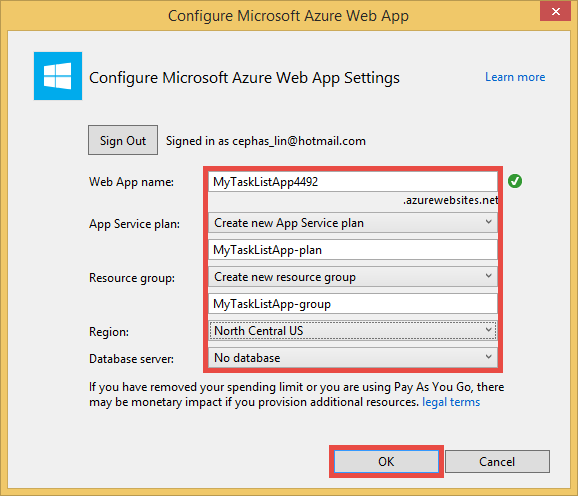

<properties 
	pageTitle="Create a web app in Azure that connects to MongoDB running on a virtual machine" 
	description="A tutorial that teaches you how to use Git to deploy an ASP.NET app to Azure App Service, connected to MongoDB on an Azure Virtual Machine."
	tags="azure-portal" 
	services="app-service\web, virtual-machines" 
	documentationCenter=".net" 
	authors="cephalin" 
	manager="wpickett" 
	editor=""/>

<tags 
	ms.service="app-service-web" 
	ms.workload="web" 
	ms.tgt_pltfrm="na" 
	ms.devlang="dotnet" 
	ms.topic="article" 
	ms.date="04/21/2015" 
	ms.author="cephalin"/>

# Create a web app in Azure that connects to MongoDB running on a virtual machine

Using Git, you can deploy an ASP.NET application to Azure App Service Web Apps. In this tutorial, you will build a simple front-end ASP.NET MVC task list application that connects to a MongoDB database running on a virtual machine in Azure.  [MongoDB][MongoDB] is a popular open source, high performance NoSQL database. After running and testing the ASP.NET application on your development computer, you will upload the application to App Service Web Apps using Git.

>[AZURE.NOTE] If you want to get started with Azure App Service before signing up for an Azure account, go to [Try App Service](http://go.microsoft.com/fwlink/?LinkId=523751), where you can immediately create a short-lived starter web app in App Service. No credit cards required; no commitments.

## Background knowledge ##

Knowledge of the following is useful for this tutorial, though not required:

* The C# driver for MongoDB. For more information on developing C# applications against MongoDB, see the MongoDB [CSharp Language Center][MongoC#LangCenter]. 
* The ASP .NET web application framework. You can learn all about it at the [ASP.net website][ASP.NET].
* The ASP .NET MVC web application framework. You can learn all about it at the [ASP.NET MVC website][MVCWebSite].
* Azure. You can get started reading at [Azure][WindowsAzure].

## Prerequisites ##

- [Visual Studio Express 2013 for Web] [VSEWeb] or [Visual Studio 2013] [VSUlt]
- [Azure SDK for .NET](http://go.microsoft.com/fwlink/p/?linkid=323510&clcid=0x409)
- An active Microsoft Azure subscription

[AZURE.INCLUDE [create-account-and-websites-note](../includes/create-account-and-websites-note.md)]

 
## Create a virtual machine and install MongoDB ##

This tutorial assumes you have created a virtual machine in Azure. After creating the virtual machine you need to install MongoDB on the virtual machine:

* To create a Windows virtual machine and install MongoDB, see [Install MongoDB on a virtual machine running Windows Server in Azure][InstallMongoOnWindowsVM].
* Alternatively, to create a Linux virtual machine and install MongoDB, see [Install MongoDB on a virtual machine running CentOS Linux in Azure][InstallMongoOnCentOSLinuxVM].

After you have created the virtual machine in Azure and installed MongoDB, be sure to remember the DNS name of the virtual machine ("testlinuxvm.cloudapp.net", for example) and the external port for MongoDB that you specified in the endpoint.  You will need this information later in the tutorial.

## Create the application ##

In this section you will create an ASP.NET application called "My Task List" by using Visual Studio and perform an initial deployment to Azure App Service Web Apps. You will run the application locally, but it will connect to your virtual machine on Azure and use the MongoDB instance that you created there.

1. In Visual Studio, click **New Project**.

	![Start Page New Project][StartPageNewProject]

1. In the **New Project** window, in the left pane, select **Visual C#**, and then select **Web**. In the middle pane, select **ASP.NET  Web Application**. At the bottom, name your project "MyTaskListApp," and then click **OK**.

	![New Project Dialog][NewProjectMyTaskListApp]

1. In the **New ASP.NET Project** dialog box, select **MVC**, and then click **OK**.

	![Select MVC Template][VS2013SelectMVCTemplate]

1. If you aren't already signed into Microsoft Azure, you will be prompted to sign in. Follow the prompts to sign into Azure.
2. Once you are signed in, you can start configuring your App Service web app. Specify the **Web App name**, **App Service plan**, **Resource group**, and **Region**, then click **OK**.

	

1. After the project creation completes, wait for the web app to be created in Azure App Service as indicated in the **Azure App Service Activity** window. Then, click **Publish MyTaskListApp to this Web App now**.

1. Click **Publish**.

	

	Once your default ASP.NET application is published to Azure App Service Web Apps, it will be launched in the browser.

## Install the MongoDB C# driver

MongoDB offers client-side support for C# applications through a driver, which you need to install on your local development computer. The C# driver is available through NuGet.

To install the MongoDB C# driver:

1. In **Solution Explorer**, right-click the **MyTaskListApp** project and select **Manage NuGetPackages**.

	![Manage NuGet Packages][VS2013ManageNuGetPackages]

2. In the **Manage NuGet Packages** window, in the left pane, click **Online**. In the **Search Online** box on the right, type "mongocsharpdriver".  Click **Install** to install the driver.

	![Search for MongoDB C# Driver][SearchforMongoDBCSharpDriver]

3. Click **I Accept** to accept the 10gen, Inc. license terms.

4. Click **Close** after the driver has installed.
	![MongoDB C# Driver Installed][MongoDBCsharpDriverInstalled]

The MongoDB C# driver is now installed.  References to the **MongoDB.Driver.dll** and **MongoDB.Bson.dll** libraries have been added to the project.

![MongoDB C# Driver References][MongoDBCSharpDriverReferences]

## Add a model ##
In **Solution Explorer**, right-click the *Models* folder and **Add** a new **Class** and name it *TaskModel.cs*.  In *TaskModel.cs*, replace the existing code with the following code:

	using System;
	using System.Collections.Generic;
	using System.Linq;
	using System.Web;
	using MongoDB.Bson.Serialization.Attributes;
	using MongoDB.Bson.Serialization.IdGenerators;
	using MongoDB.Bson;
	
	namespace MyTaskListApp.Models
	{
	    public class MyTask
	    {
	        [BsonId(IdGenerator = typeof(CombGuidGenerator))]
	        public Guid Id { get; set; }
	
	        [BsonElement("Name")]
	        public string Name { get; set; }
	
	        [BsonElement("Category")]
	        public string Category { get; set; }
	
	        [BsonElement("Date")]
	        public DateTime Date { get; set; }
	
	        [BsonElement("CreatedDate")]
	        public DateTime CreatedDate { get; set; }
	
	    }
	}

## Add the data access layer ##
In **Solution Explorer**, right-click the *MyTaskListApp* project and **Add** a **New Folder** named *DAL*.  Right-click the *DAL* folder and **Add** a new **Class**. Name the class file *Dal.cs*.  In *Dal.cs*, replace the existing code with the following code:

	using System;
	using System.Collections.Generic;
	using System.Linq;
	using System.Web;
	using MyTaskListApp.Models;
	using MongoDB.Driver;
	using System.Configuration;
	
	namespace MyTaskListApp
	{
	    public class Dal : IDisposable
	    {
	        private MongoServer mongoServer = null;
	        private bool disposed = false;
	
	        // To do: update the connection string with the DNS name
			// or IP address of your server. 
			//For example, "mongodb://testlinux.cloudapp.net"
	        private string connectionString = "mongodb://<vm-dns-name>";
	
	        // This sample uses a database named "Tasks" and a 
			//collection named "TasksList".  The database and collection 
			//will be automatically created if they don't already exist.
	        private string dbName = "Tasks";
	        private string collectionName = "TasksList";
	
	        // Default constructor.        
	        public Dal()
	        {
	        }        
	
	        // Gets all Task items from the MongoDB server.        
	        public List<MyTask> GetAllTasks()
	        {
	            try
	            {
	                MongoCollection<MyTask> collection = GetTasksCollection();
	                return collection.FindAll().ToList<MyTask>();
	            }
	            catch (MongoConnectionException)
	            {
	                return new List<MyTask >();
	            }
	        }
	
	        // Creates a Task and inserts it into the collection in MongoDB.
	        public void CreateTask(MyTask task)
	        {
	            MongoCollection<MyTask> collection = GetTasksCollectionForEdit();
	            try
	            {
	                collection.Insert(task, SafeMode.True);
	            }
	            catch (MongoCommandException ex)
	            {
	                string msg = ex.Message;
	            }
	        }
	
	        private MongoCollection<MyTask> GetTasksCollection()
	        {
	            MongoServer server = MongoServer.Create(connectionString);
	            MongoDatabase database = server[dbName];
	            MongoCollection<MyTask> todoTaskCollection = database.GetCollection<MyTask>(collectionName);
	            return todoTaskCollection;
	        }
	
	        private MongoCollection<MyTask> GetTasksCollectionForEdit()
	        {
	            MongoServer server = MongoServer.Create(connectionString);
	            MongoDatabase database = server[dbName];
	            MongoCollection<MyTask> todoTaskCollection = database.GetCollection<MyTask>(collectionName);
	            return todoTaskCollection;
	        }
	
	        # region IDisposable
	
	        public void Dispose()
	        {
	            this.Dispose(true);
	            GC.SuppressFinalize(this);
	        }
	
	        protected virtual void Dispose(bool disposing)
	        {
	            if (!this.disposed)
	            {
	                if (disposing)
	                {
	                    if (mongoServer != null)
	                    {
	                        this.mongoServer.Disconnect();
	                    }
	                }
	            }
	
	            this.disposed = true;
	        }
	
	        # endregion
	    }
	}

## Add a controller ##
Open the *Controllers\HomeController.cs* file in **Solution Explorer** and replace the existing code with the following:

	using System;
	using System.Collections.Generic;
	using System.Linq;
	using System.Web;
	using System.Web.Mvc;
	using MyTaskListApp.Models;
	using System.Configuration;
	
	namespace MyTaskListApp.Controllers
	{
	    public class HomeController : Controller, IDisposable
	    {
	        private Dal dal = new Dal();
	        private bool disposed = false;
	        //
	        // GET: /MyTask/
	
	        public ActionResult Index()
	        {
	            return View(dal.GetAllTasks());
	        }
	
	        //
	        // GET: /MyTask/Create
	
	        public ActionResult Create()
	        {
	            return View();
	        }
	
	        //
	        // POST: /MyTask/Create
	
	        [HttpPost]
	        public ActionResult Create(MyTask task)
	        {
	            try
	            {
	                dal.CreateTask(task);
	                return RedirectToAction("Index");
	            }
	            catch
	            {
	                return View();
	            }
	        }
	
	        public ActionResult About()
	        {
	            return View();
	        }
	
	        # region IDisposable
	
	        new protected void Dispose()
	        {
	            this.Dispose(true);
	            GC.SuppressFinalize(this);
	        }
	
	        new protected virtual void Dispose(bool disposing)
	        {
	            if (!this.disposed)
	            {
	                if (disposing)
	                {
	                    this.dal.Dispose();
	                }
	            }
	
	            this.disposed = true;
	        }
	
	        # endregion
	
	    }
	}

## Set up the styles ##
To change the title at the top of the page, open the *Views\Shared\\_Layout.cshtml* file in **Solution Explorer** and replace "Application name" in the navbar header with "My Task List Application" so that it looks like this:

 	@Html.ActionLink("My Task List Application", "Index", "Home", null, new { @class = "navbar-brand" })

In order to set up the Task List menu, open the *\Views\Home\Index.cshtml* file and replace the existing code with the following code:
	
	@model IEnumerable<MyTaskListApp.Models.MyTask>
	
	@{
	    ViewBag.Title = "My Task List";
	}
	
	<h2>My Task List</h2>
	
	<table border="1">
	    <tr>
	        <th>Task</th>
	        <th>Category</th>
	        <th>Date</th>
	        
	    </tr>
	
	@foreach (var item in Model) {
	    <tr>
	        <td>
	            @Html.DisplayFor(modelItem => item.Name)
	        </td>
	        <td>
	            @Html.DisplayFor(modelItem => item.Category)
	        </td>
	        <td>
	            @Html.DisplayFor(modelItem => item.Date)
	        </td>
	        
	    </tr>
	}
	
	</table>
	
  @Html.Partial("Create", new MyTaskListApp.Models.MyTask())

To add the ability to create a new task, right-click the *Views\Home\\* folder and **Add** a **View**.  Name the view *Create*. Replace the code with the following:

	@model MyTaskListApp.Models.MyTask
	
	
	
	
	
	@using (Html.BeginForm("Create", "Home")) {
	    @Html.ValidationSummary(true)
	    <fieldset>
	        <legend>New Task</legend>
	
	        

	            @Html.LabelFor(model => model.Name)
	        

	        

	            @Html.EditorFor(model => model.Name)
	            @Html.ValidationMessageFor(model => model.Name)
	        

	
	        

	            @Html.LabelFor(model => model.Category)
	        

	        

	            @Html.EditorFor(model => model.Category)
	            @Html.ValidationMessageFor(model => model.Category)
	        

	
	        

	            @Html.LabelFor(model => model.Date)
	        

	        

	            @Html.EditorFor(model => model.Date)
	            @Html.ValidationMessageFor(model => model.Date)
	        

	
	        

	            <input type="submit" value="Create" />
	        

	    </fieldset>
	}

**Solution Explorer** should look like this:

![Solution Explorer][SolutionExplorerMyTaskListApp]

## Set the MongoDB connection string ##
In **Solution Explorer**, open the *DAL/Dal.cs* file. Find the following line of code:

	private string connectionString = "mongodb://<vm-dns-name>";

Replace `<vm-dns-name>` with the DNS name of the virtual machine running MongoDB you created in the [Create a virtual machine and install MongoDB][] step of this tutorial.  To find the DNS name of your virtual machine, go to the Azure portal, select **Virtual Machines**, and find **DNS Name**.

If the DNS name of the virtual machine is "testlinuxvm.cloudapp.net" and MongoDB is listening on the default port 27017, the connection string line of code will look like:

	private string connectionString = "mongodb://testlinuxvm.cloudapp.net";

If the virtual machine endpoint specifies a different external port for MongoDB, you can specifiy the port in the connection string:

 	private string connectionString = "mongodb://testlinuxvm.cloudapp.net:12345";

For more information on MongoDB connection strings, see [Connections][MongoConnectionStrings].

## Test the local deployment ##

To run your application on your development computer, select **Start Debugging** from the **Debug** menu or hit **F5**. IIS Express starts and a browser opens and launches the application's home page.  You can add a new task, which will be added to the MongoDB database running on your virtual machine in Azure.

![My Task List Application][TaskListAppBlank]

## Publish to Azure App Service Web Apps

In this section you will publish your changes to Azure App Service Web Apps.

1. In Solution Explorer, right-click **MyTaskListApp** again and click **Publish**.
2. Click **Publish**.

	You should now see your web app running in Azure App Service and accessing the MongoDB database in Azure Virtual Machines.

## Summary ##

You have now successfully deployed your ASP.NET application to Azure App Service Web Apps. To view the web app:

1. Log into the Azure portal.
2. Click **Web apps**. 
3. Select your web app in the **Web Apps** list.

For more information on developing C# applications against MongoDB, see [CSharp Language Center][MongoC#LangCenter]. 

[AZURE.INCLUDE [app-service-web-whats-changed](../includes/app-service-web-whats-changed.md)]
 

<!-- HYPERLINKS -->

[AzurePortal]: http://manage.windowsazure.com
[WindowsAzure]: http://www.windowsazure.com
[MongoC#LangCenter]: http://docs.mongodb.org/ecosystem/drivers/csharp/
[MVCWebSite]: http://www.asp.net/mvc
[ASP.NET]: http://www.asp.net/
[MongoConnectionStrings]: http://www.mongodb.org/display/DOCS/Connections
[MongoDB]: http://www.mongodb.org
[InstallMongoOnCentOSLinuxVM]: /manage/linux/common-tasks/mongodb-on-a-linux-vm/
[InstallMongoOnWindowsVM]: /manage/windows/common-tasks/install-mongodb/
[VSEWeb]: http://www.microsoft.com/visualstudio/eng/2013-downloads#d-2013-express
[VSUlt]: http://www.microsoft.com/visualstudio/eng/2013-downloads

<!-- IMAGES -->

[StartPageNewProject]: ./media/web-sites-dotnet-store-data-mongodb-vm/NewProject.png
[NewProjectMyTaskListApp]: ./media/web-sites-dotnet-store-data-mongodb-vm/NewProjectMyTaskListApp.png
[VS2013SelectMVCTemplate]: ./media/web-sites-dotnet-store-data-mongodb-vm/VS2013SelectMVCTemplate.png
[VS2013DefaultMVCApplication]: ./media/web-sites-dotnet-store-data-mongodb-vm/VS2013DefaultMVCApplication.png
[VS2013ManageNuGetPackages]: ./media/web-sites-dotnet-store-data-mongodb-vm/VS2013ManageNuGetPackages.png
[SearchforMongoDBCSharpDriver]: ./media/web-sites-dotnet-store-data-mongodb-vm/SearchforMongoDBCSharpDriver.png
[MongoDBCsharpDriverInstalled]: ./media/web-sites-dotnet-store-data-mongodb-vm/MongoDBCsharpDriverInstalled.png
[MongoDBCSharpDriverReferences]: ./media/web-sites-dotnet-store-data-mongodb-vm/MongoDBCSharpDriverReferences.png
[SolutionExplorerMyTaskListApp]: ./media/web-sites-dotnet-store-data-mongodb-vm/SolutionExplorerMyTaskListApp.png
[TaskListAppBlank]: ./media/web-sites-dotnet-store-data-mongodb-vm/TaskListAppBlank.png
[WAWSCreateWebSite]: ./media/web-sites-dotnet-store-data-mongodb-vm/WAWSCreateWebSite.png
[WAWSDashboardMyTaskListApp]: ./media/web-sites-dotnet-store-data-mongodb-vm/WAWSDashboardMyTaskListApp.png
[Image9]: ./media/web-sites-dotnet-store-data-mongodb-vm/RepoReady.png
[Image10]: ./media/web-sites-dotnet-store-data-mongodb-vm/GitInstructions.png
[Image11]: ./media/web-sites-dotnet-store-data-mongodb-vm/GitDeploymentComplete.png

<!-- TOC BOOKMARKS -->
[Create a virtual machine and install MongoDB]: #virtualmachine
[Create and run the My Task List ASP.NET application on your development computer]: #createapp
[Create an Azure web site]: #createwebsite
[Deploy the ASP.NET application to the web site using Git]: #deployapp
