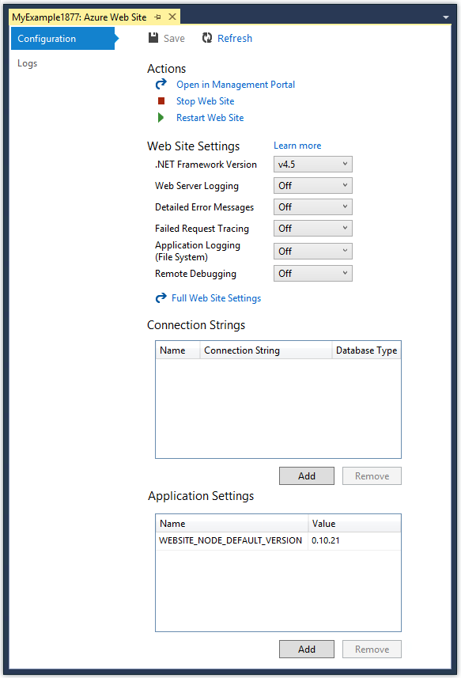
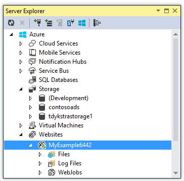
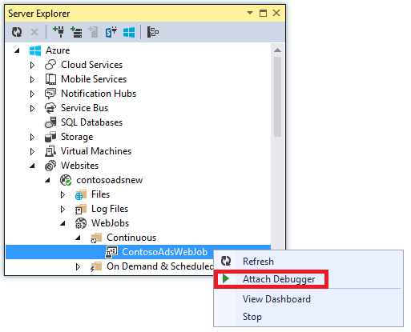
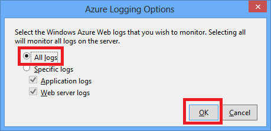
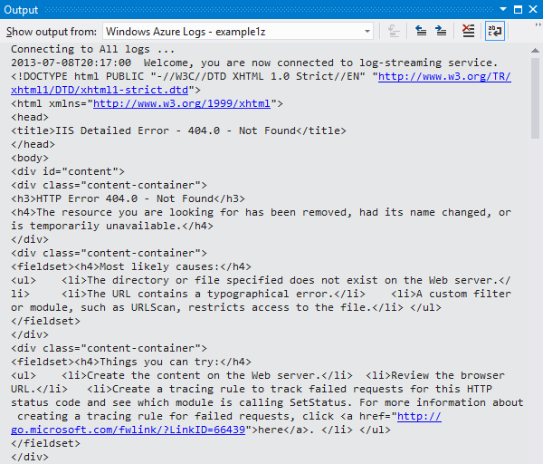
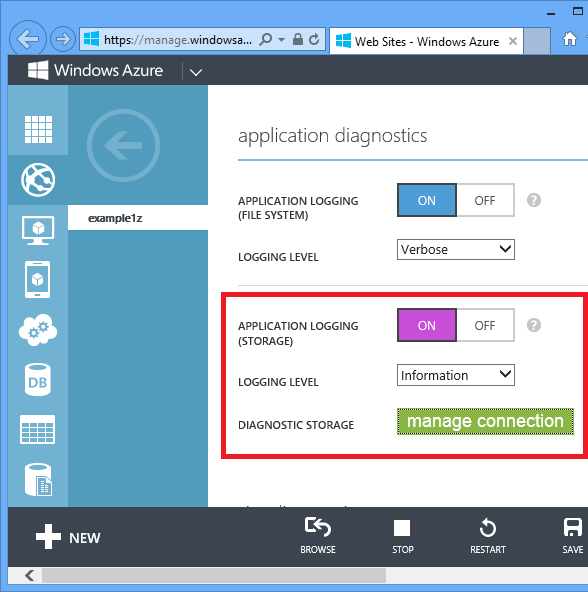

<properties pageTitle="Troubleshooting Azure Websites in Visual Studio" description="Learn how to troubleshoot an Azure Website by using remote debugging, tracing, and logging tools that are built in to Visual Studio 2013." services="web-sites" documentationCenter=".net" authors="tdykstra" manager="wpickett" editor=""/>

<tags ms.service="web-sites" ms.workload="web" ms.tgt_pltfrm="na" ms.devlang="dotnet" ms.topic="article" ms.date="11/13/2014" ms.author="tdykstra"/>

# Troubleshooting Azure Websites in Visual Studio

This tutorial shows how to use Visual Studio tools that help debug an application while it runs in an Azure Website, by running in [debug mode](http://www.visualstudio.com/en-us/get-started/debug-your-app-vs.aspx) remotely or by viewing application logs and web server logs.

You'll learn:

* Which Azure site management functions are available in Visual Studio.
* How to use Visual Studio remote view to make quick changes in a remote website.
* How to run debug mode remotely while a project is running in Azure.
* How to create application trace logs and view them while the application is creating them.
* How to view web server logs, including detailed error messages and failed request tracing.
* How to send diagnostic logs to an Azure Storage account and view them there.

If you have Visual Studio Ultimate, you can also use [IntelliTrace](http://msdn.microsoft.com/library/vstudio/dd264915.aspx) for debugging. IntelliTrace is not covered in this tutorial.

### Tutorial segments

- [Prerequisites](#prerequisites)
- [Site configuration and management](#sitemanagement)
- [Access website files in Server Explorer](#remoteview)
- [Remote debugging](#remotedebug)
	- Remote debugging websites
	- Remote debugging WebJobs
	- Notes about remote debugging 
- [Diagnostic logs overview](#logsoverview)
- [Create and view application trace logs](#apptracelogs)
- [View web server logs](#webserverlogs)
- [View detailed error message logs](#detailederrorlogs)
- [Download file system logs](#downloadlogs)
- [View storage logs](#storagelogs)
- [View failed request logs](#failedrequestlogs)
- [Next steps](#nextsteps)

<h2>Prerequisites</h2>

This tutorial works with the development environment, web project, and Azure Website that you set up in [Get started with Azure and ASP.NET][GetStarted]. For the WebJobs sections, you'll need the application that you create in [Get Started with the Azure WebJobs SDK][GetStartedWJ].

The code samples shown in this tutorial are for a C# MVC web application, but the troubleshooting procedures are the same for Visual Basic and Web Forms applications.

Remote debugging requires Visual Studio 2013 or Visual Studio 2012 with Update 4. The remote debugging and **Server Explorer** features for WebJobs require [Visual Studio 2013 Update 4](http://go.microsoft.com/fwlink/?LinkID=510314) or later. The other features shown in the tutorial also work in Visual Studio 2013 Express for Web, and Visual Studio 2012 Express for Web. 

The streaming logs feature only works for applications that target .NET Framework 4 or later.

<h2>Site configuration and management</h2>

Visual Studio provides access to a subset of the site management functions and configuration settings available in the management portal. In this section you'll see what's available.

1. If you aren't already signed in to Azure in Visual Studio, click the **Connect to Azure** button in **Server Explorer**.

	An alternative is to install a management certificate that enables access to your account. The management certificate gives **Server Explorer** access to additional Azure services (SQL Database and Mobile Services). If you choose to install a certificate, right-click the **Azure** node in **Server Explorer**, and then click **Manage Subscriptions** in the context menu. In the **Manage Azure Subscriptions** dialog box, click the **Certificates** tab, and then click **Import**. Follow the directions to download and then import a subscription file (also called a *.publishsettings* file) for your Azure account.

	> [AZURE.NOTE]
	> If you download a subscription file, save it to a folder outside your source code directories (for example, in the Downloads folder), and then delete it once the import has completed. A malicious user who gains access to the subscription file can edit, create, and delete your Azure services.

	For more information about connecting to Azure resources from Visual Studio, see [Manage Accounts, Subscriptions, and Administrative Roles](http://go.microsoft.com/fwlink/?LinkId=324796#BKMK_AccountVCert).

2. In **Server Explorer**, expand **Azure**, and then expand **Websites**.

3. Right-click the node for the website that you created in [Getting started with Azure and ASP.NET][GetStarted], and then click **View Settings**.

	

	The **Azure Website** tab appears, and you can see there the site management and configuration tasks that are available in Visual Studio.

	

	In this tutorial you'll be using the logging and tracing drop-downs.	You'll also use remote debugging but you'll use a different method to enable it.
   
	For information about the App Settings and Connection Strings boxes in this window, see [Azure Web Sites: How Application Strings and Connection Strings Work](http://blogs.msdn.com/b/windowsazure/archive/2013/07/17/windows-azure-web-sites-how-application-strings-and-connection-strings-work.aspx).

	If you want to perform a site management task that can't be done in this window, you can click **Full Website Settings** to open a browser window to the management portal. For more information, see [How to Configure Web Sites](/en-us/manage/services/web-sites/how-to-configure-websites/#howtochangeconfig).

<h2>Access website files in Server Explorer</h2>

You typically deploy a site with the `customErrors` flag in the Web.config file set to `On` or `RemoteOnly`, which means you don't get a helpful error message when something goes wrong. For many errors all you get is a page like one of the following ones.

**Server Error in '/' Application:**

**An error occurred:**

**The website cannot display the page**

Frequently the easiest way to find the cause of the error is to enable detailed error messages, which the first of the preceding screenshots explains how to do. That requires a change in the deployed Web.config file. You could edit the *Web.config* file in the project and redeploy the project, or create a [Web.config transform](http://www.asp.net/mvc/tutorials/deployment/visual-studio-web-deployment/web-config-transformations) and deploy a debug build, but there's a quicker way: in **Solution Explorer** you can directly view and edit files on the remote site by using the *remote view* feature.

1. In **Server Explorer**, expand **Azure**, expand **Websites**, and expand the node for the website you're deploying to.

	You see nodes that give you access to the website's content files and log files.

	

2. Expand the **Files** node, and double-click the *Web.config* file.

	

	Visual Studio opens the Web.config file from the remote site and shows [Remote] next to the file name in the title bar.

3. Add the following line to the `system.web` element:

	`<customErrors mode="off"></customErrors>`

	

4. Refresh the browser that is showing the unhelpful error message, and now you get a detailed error message, such as the following example:

	

	(The error shown was created by adding the line shown in red to *Views\Home\Index.cshtml*.)

Editing the Web.config file is only one example of scenarios in which the ability to read and edit files on your Azure website make troubleshooting easier.

<h2>Remote debugging</h2>

If the detailed error message doesn't provide enough information, and you can't re-create the error locally, another way to troubleshoot is to run in debug mode remotely. You can set breakpoints, manipulate memory directly, step through code, and even change the code path. 

Remote debugging does not work in Express editions of Visual Studio.

### Remote debugging websites

This section shows how to debug remotely using the project you create in [Getting started with Azure and ASP.NET][GetStarted].

1. Open the web project that you created in [Getting started with Azure and ASP.NET][GetStarted].

1. Open *Controllers\HomeController.cs*.

2. Delete the `About()` method and insert the following code in its place.

        public ActionResult About()
        {
            string currentTime = DateTime.Now.ToLongTimeString();
            ViewBag.Message = "The current time is " + currentTime;
            return View();
        }

2. [Set a breakpoint](http://www.visualstudio.com/en-us/get-started/debug-your-app-vs.aspx) on the `ViewBag.Message` line.

1. In **Solution Explorer**, right-click the project, and click **Publish**.

2. In the **Profile** drop-down list, select the same profile that you used in [Getting started with Azure and ASP.NET][GetStarted].

3. Click the **Settings** tab, and change **Configuration** to **Debug**, and then click **Publish**.

	

4. After deployment finishes and your browser opens to the Azure URL of your site, close the browser.

5. For Visual Studio 2013: In **Server Explorer** expand **Azure**, expand **Websites**, right-click your website, and click **Attach Debugger**. 

	

	The browser automatically opens to your home page running in Azure. You might have to wait 20 seconds or so while Azure sets up the server for debugging. This delay only happens the first time you run in debug mode on a website. Subsequent times within the next 48 hours when you start debugging again there won't be a delay.

6. For Visual Studio 2012 with Update 4:

	* In the Azure Management Portal, go to the **Configure** tab for your website, and then scroll down to the **Site Diagnostics** section.

	* Set **Remote Debugging** to **On**, and set **Remote Debugging Visual Studio Version** to **2012**.

	
   
	* In the Visual Studio **Debug** menu, click **Attach to Process**.

	* In the **Qualifier** box, enter the URL for your website, without the `http://` prefix. 

	* Select **Show processes from all users**.

	* When you're prompted for credentials, enter the user name and password that has permissions to publish the website. To get these credentials, go to the Dashboard tab for your website in the management portal and click **Download the publish profile**. Open the file in a text editor, and you'll find the user name and password after the first occurrences of **userName=** and **userPWD=**. 

	* When the processes appear in the **Available Processes** table, select **w3wp.exe**, and then click **Attach**.

	* Open a browser to your site URL.

	You might have to wait 20 seconds or so while Azure sets up the server for debugging. This delay only happens the first time you run in debug mode on a website. Subsequent times within the next 48 hours when you start debugging again there won't be a delay.

6. Click **About** in the menu.

	Visual Studio stops on the breakpoint, and the code is running in Azure, not on your local computer.

7. Hover over the `currentTime` variable to see the time value.

	

	The time you see is the Azure server time, which may be in a different time zone than your local computer.

8. Enter a new value for the `currentTime` variable, such as "Now running in Azure".

5. Press F5 to continue running.

	The About page running in Azure displays the new value that you entered into the currentTime variable.

	

###  Remote debugging WebJobs

This section shows how to debug remotely using the project and website you create in [Get Started with the Azure WebJobs SDK](../websites-dotnet-webjobs-sdk). The features shown on in this section are available only in Visual Studio 2013 with Update 4.

1. Open the web project that you created in [Get Started with the Azure WebJobs SDK][GetStartedWJ].

1. In the ContosoAdsWebJob project, open *Functions.cs*.

2. [Set a breakpoint](http://www.visualstudio.com/en-us/get-started/debug-your-app-vs.aspx) on the first statement in the `GnerateThumbnail` method.

	

1. In **Solution Explorer**, right-click the web project (not the WebJob project), and click **Publish**.

2. In the **Profile** drop-down list, select the same profile that you used in [Get Started with the Azure WebJobs SDK](../websites-dotnet-webjobs-sdk).

3. Click the **Settings** tab, and change **Configuration** to **Debug**, and then click **Publish**.

	Visual Studio deploys the web and WebJob projects, and your browser opens to the Azure URL of your site.

5. In **Server Explorer** expand **Azure** > **Websites** > your website > **WebJobs** > **Continuous**, and then right-click **ContosoAdsWebJob**.

7. Click **Attach Debugger**. 

	

	The browser automatically opens to your home page running in Azure. You might have to wait 20 seconds or so while Azure sets up the server for debugging. This delay only happens the first time you run in debug mode on a website. The next time you attach the debugger there won't be a delay, if you do it within 48 hours.

6. In the web browser that is opened to the Contoso Ads home page, create a new ad. 

	Creating an ad causes a queue message to be created, which will be picked up by the WebJob and processed. When the WebJobs SDK calls the function to process the queue message, the code will hit your breakpoint.

7. When the debugger breaks at your breakpoint, you can examine and change variable values while the program is running the cloud. In the following illustration the debugger shows the contents of the blobInfo object that was passed to the GenerateThumbnail method.

	
 
5. Press F5 to continue running.

	The GenerateThumbnail method finishes creating the thumbnail.

6. In the browser, refresh the Index page and you see the thumbnail.

6. In Visual Studio, press SHIFT+F5 to stop debugging.

7. In **Server Explorer**, right-click the ContosoAdsWebJob node and click **View Dashboard**.

8. Sign in with your Azure credentials, and then click the WebJob name to go to the page for your WebJob. 

	

	The Dashboard shows that the GenerateThumbnail function executed recently.

	(The next time you click **View Dashboard**, you don't have to sign in, and the browser goes directly to the page for your WebJob.)

9. Click the function name to see details about the function execution.

	

If your function [wrote logs](../websites-dotnet-webjobs-sdk-storage-queues-how-to/#logs), you could click **ToggleOutput** to see them.

### Notes about remote debugging

* Running in debug mode in production is not recommended. If your production site is not scaled out to multiple server instances, debugging will prevent the web server from responding to other requests. If you do have multiple web server instances, when you attach to the debugger you'll get a random instance, and you have no way to ensure that subsequent browser requests will go to that instance. Also, you typically don't deploy a debug build to production, and compiler optimizations for release builds might make it impossible to show what is happening line by line in your source code. For troubleshooting production problems, your best resource is application tracing and web server logs.

* Avoid long stops at breakpoints when remote debugging. Azure treats a process that is stopped for longer than a few minutes as an unresponsive process, and shuts it down.

* While you're debugging, the server is sending data to Visual Studio, which could affect bandwidth charges. For information about bandwidth rates, see [Azure Pricing](/en-us/pricing/calculator/).

* Make sure that the `debug` attribute of the `compilation` element in the *Web.config* file is set to true. It is set to true by default when you publish a debug build configuration.

        <system.web>
          <compilation debug="true" targetFramework="4.5" />
          <httpRuntime targetFramework="4.5" />
        </system.web>

* If you find that the debugger won't step into code that you want to debug, you might have to change the Just My Code setting.  For more information, see [Restrict stepping to Just My Code](http://msdn.microsoft.com/en-us/library/vstudio/y740d9d3.aspx#BKMK_Restrict_stepping_to_Just_My_Code).

* A timer starts on the server when you enable the remote debugging feature, and after 48 hours the feature is automatically turned off. This 48 hour limit is done for security and performance reasons. You can easily turn the feature back on as many times as you like. We recommend leaving it disabled when you are not actively debugging.

* You can manually attach the debugger to any process, not only the website process (w3wp.exe). For more information about how to use debug mode in Visual Studio, see [Debugging in Visual Studio](http://msdn.microsoft.com/en-us/library/vstudio/sc65sadd.aspx).

<h2>Diagnostic logs overview</h2>

An ASP.NET application that runs in an Azure Website can create the following kinds of logs:

* **Application tracing logs** 
  The application creates these logs by calling methods of the [System.Diagnostics.Trace](http://msdn.microsoft.com/en-us/library/system.diagnostics.trace.aspx) class.
* **Web server logs** 
  The web server creates a log entry for every HTTP request to the site.
* **Detailed error message logs** 
  The web server creates an HTML page with some additional information for failed HTTP requests (those that result in status code 400 or greater). 
* **Failed request tracing logs** 
  The web server creates an XML file with detailed tracing information for failed HTTP requests. The web server also provides an XSL file to format the XML in a browser.
  
Logging affects site performance, so Azure gives you the ability to enable or disable each type of log as needed. For application logs, you can specify that only logs above a certain severity level should be written. When you create a new website, by default all logging is disabled.

Logs are written to files in a *LogFiles* folder in the file system of your website and are accessible via FTP. Web server logs and application logs can also be written to an Azure Storage account. You can retain a greater volume of logs in a storage account than is possible in the file system. You're limited to a maximum of 100 megabytes of logs when you use the file system. (File system logs are only for short-term retention. Azure deletes old log files to make room for new ones after the limit is reached.)  

<h2>Create and view application trace logs</h2>

In this section you'll do the following tasks:

* Add tracing statements to the web project that you created in [Get started with Azure and ASP.NET][GetStarted].
* View the logs when you run the project locally.
* View the logs as they are generated by the application running in Azure. 

For information about how to create application logs in WebJobs, see [How to work with Azure queue storage using the WebJobs SDK - How to write logs](../websites-dotnet-webjobs-sdk-storage-queues-how-to/#logs). The following instructions for viewing logs and controlling how they're stored in Azure apply also to application logs created by WebJobs. 

### Add tracing statements to the application

1. Open *Controllers\HomeController.cs*, and replace the file contents with the following code in order to add `Trace` statements and a `using` statement for `System.Diagnostics`:

		using System;
		using System.Collections.Generic;
		using System.Configuration;
		using System.Diagnostics;
		using System.Linq;
		using System.Web;
		using System.Web.Configuration;
		using System.Web.Mvc;
		namespace MyExample.Controllers
		{
		    public class HomeController : Controller
		    {
		        public ActionResult Index()
		        {
		            Trace.WriteLine("Entering Index method");
		            ViewBag.Message = "Modify this template to jump-start your ASP.NET MVC application.";
		            Trace.TraceInformation("Displaying the Index page at " + DateTime.Now.ToLongTimeString());
		            Trace.WriteLine("Leaving Index method");
		            return View();
		        }
		
		        public ActionResult About()
		        {
		            Trace.WriteLine("Entering About method");
		            ViewBag.Message = "Your app description page.";
		            Trace.TraceWarning("Transient error on the About page at " + DateTime.Now.ToShortTimeString());
		            Trace.WriteLine("Leaving About method");
		            return View();
		        }
		
		        public ActionResult Contact()
		        {
		            Trace.WriteLine("Entering Contact method");
		            ViewBag.Message = "Your contact page.";
		            Trace.TraceError("Fatal error on the Contact page at " + DateTime.Now.ToLongTimeString());
		            Trace.WriteLine("Leaving Contact method");
		            return View();
		        }
		    }
		}
		
				
### View the tracing output locally

3. Press F5 to run the application in debug mode.

	The default trace listener writes all trace output to the **Output** window, along with other Debug output. The following illustration shows the output from the trace statements that you added to the `Index` method.

	

	The following steps show how to view trace output in a web page, without compiling in debug mode.

2. Open the application Web.config file (the one located in the project folder) and add a `<system.diagnostics>` element at the end of the file just before the closing `</configuration>` element:

  		<system.diagnostics>
		    <trace>
		      <listeners>
		        <add name="WebPageTraceListener"
                    type="System.Web.WebPageTraceListener, 
                    System.Web, 
                    Version=4.0.0.0, 
                    Culture=neutral,
                    PublicKeyToken=b03f5f7f11d50a3a" />
		      </listeners>
		    </trace>
		  </system.diagnostics>

	The `WebPageTraceListener` lets you view trace output by browsing to `/trace.axd`.

3. Add a <a href="http://msdn.microsoft.com/en-us/library/vstudio/6915t83k(v=vs.100).aspx">trace element</a> under `<system.web>` in the Web.config file, such as the following example:

		<trace enabled="true" writeToDiagnosticsTrace="true" mostRecent="true" pageOutput="false" />

3. Press CTRL+F5 to run the application.

4. In the address bar of the browser window, add *trace.axd* to the URL, and then press Enter (the URL will be similar to http://localhost:53370/trace.axd).

5. On the **Application Trace** page, click **View Details** on the first line (not the BrowserLink line).

	

	The **Request Details** page appears, and in the **Trace Information** section you see the output from the trace statements that you added to the `Index` method.

	

	By default, `trace.axd` is only available locally. If you wanted to make it available from a remote site, you could add `localOnly="false"` to the `trace` element in the *Web.config* file, as shown in the following example:

		<trace enabled="true" writeToDiagnosticsTrace="true" localOnly="false" mostRecent="true" pageOutput="false" />

	However, enabling `trace.axd` in a production site is generally not recommended for security reasons, and in the following sections you'll see an easier way to read tracing logs in an Azure Website.

### View the tracing output in Azure

1. In **Solution Explorer**, right-click the web project and click **Publish**.

2. In the **Publish Web** dialog box, click **Publish**.

	After Visual Studio publishes your update, it opens a browser window to your home page (assuming you didn't clear **Destination URL** on the **Connection** tab).

3. In **Server Explorer**, right-click your website and select **View Streaming Logs**. 

	

	The **Output** window shows that you are connected to the log-streaming service, and adds a notification line each minute that goes by without a log to display.

	

4. In the browser window that shows your application home page, click **Contact**.

	Within a few seconds the output from the error-level trace you added to the `Contact` method appears in the **Output** window.

	

	Visual Studio is only showing error-level traces because that is the default setting when you enable the log monitoring service. When you create a new Azure Website, all logging is disabled by default, as you saw when you opened the site settings page earlier:

	

	However, when you selected **View Streaming Logs**, Visual Studio automatically changed **Application Logging(File System)** to **Error**, which means error-level logs get reported. In order to see all of your tracing logs, you can change this setting to **Verbose**. When you select a severity level lower than error, all logs for higher severity levels are also reported. So when you select verbose, you also see information, warning, and error logs.  

4. In **Server Explorer**, right-click the website, and then click **View Settings** as you did earlier.

5. Change **Application Logging (File System)** to **Verbose**, and then click **Save**.
 
	

6. In the browser window that is now showing your **Contact** page, click **Home**, then click **About**, and then click **Contact**.

	Within a few seconds, the **Output** window shows all of your tracing output.

	

	In this section you enabled and disabled logging by using Azure Website settings. You can also enable and disable trace listeners by modifying the Web.config file. However, modifying the Web.config file causes the app domain to recycle, while enabling logging via the website doesn't do that. If the problem takes a long time to reproduce, or is intermittent, recycling the app domain might "fix" it and force you to wait until it happens again. Enabling diagnostics in Azure doesn't do this, so you can start capturing error information immediately.

### Output window features

The **Azure Logs** tab of the **Output** Window has several buttons and a text box:

These perform the following functions:

* Clear the **Output** window.
* Enable or disable word wrap.
* Start or stop monitoring logs.
* Specify which logs to monitor.
* Download logs.
* Filter logs based on a search string or a regular expression.
* Close the **Output** window.

If you enter a search string or regular expression, Visual Studio filters logging information at the client. That means you can enter the criteria after the logs are displayed in the **Output** window and you can change filtering criteria without having to regenerate the logs.

<h2>View web server logs</h2>

Web server logs record all HTTP activity on the site. In order to see them in the **Output** window you have to enable them on the site and tell Visual Studio that you want to monitor them. 

1. In the **Azure Website Configuration** tab that you opened from **Server Explorer**, change Web Server Logging to **On**, and then click **Save**.

	

2. In the **Output** Window, click the **Specify which Azure logs to monitor** button.
	
	

3. In the **Azure Logging Options** dialog box, select **Web server logs**, and then click **OK**.

	

4. In the browser window that shows the website, click **Home**, then click **About**, and then click **Contact**.

	The application logs generally appear first, followed by the web server logs. You might have to wait a while for the logs to appear. 

	

By default, when you first enable web server logs by using Visual Studio, Azure writes the logs to the file system. As an alternative, you can use the management portal to specify that web server logs should be written to a blob container in a storage account. For more information, see the **site diagnostics** section in [How to Configure Web Sites](/en-us/manage/services/web-sites/how-to-configure-websites/#howtochangeconfig). 

If you use the management portal to enable web server logging to an Azure storage account, and then disable logging in Visual Studio, when you re-enable logging in Visual Studio your storage account settings are restored. 

<h2>View detailed error message logs</h2>

Detailed error logs provide some additional information about HTTP requests that result in error response codes (400 or above). In order to see them in the **Output** window, you have to enable them on the site and tell Visual Studio that you want to monitor them.

1. In the **Azure Website Configuration** tab that you opened from **Server Explorer**, change **Detailed Error Messages** to **On**, and then click **Save**.

	

2. In the **Output** Window, click the **Specify which Azure logs to monitor** button.

3. In the **Azure Logging Options** dialog box, click **All logs**, and then click **OK**.

	

4. In the address bar of the browser window, add an extra character to the URL to cause a 404 error (for example, `http://localhost:53370/Home/Contactx`), and press Enter.

	After several seconds the detailed error log appears in the Visual Studio **Output** window.

	

	Control+click the link to see the log output formatted in a browser:

	

<h2>Download file system logs</h2>

Any logs that you can monitor in the **Output** window can also be downloaded as a *.zip* file. 

1. In the **Output** window, click **Download Streaming Logs**.

	

	File Explorer opens to your *Downloads* folder with the downloaded file selected.

	

2. Extract the *.zip* file, and you see the following folder structure:

	

	* Application tracing logs are in *.txt* files in the *LogFiles\Application* folder.
	* Web server logs are in *.log* files in the *LogFiles\http\RawLogs* folder. You can use a tool such as [Log Parser](http://www.microsoft.com/en-us/download/details.aspx?displaylang=en&id=24659) to view and manipulate these files.
	* Detailed error message logs are in *.html* files in the *LogFiles\DetailedErrors* folder.

	(The *deployments* folder is for files created by source control publishing; it doesn't have anything related to Visual Studio publishing. The *Git* folder is for traces related to source control publishing and the log file streaming service.)  

<h2>View storage logs</h2>

Application tracing logs can also be sent to an Azure storage account, and you can view them in Visual Studio. To do that you'll create a storage account, enable storage logs in the management portal, and view them in the **Logs** tab of the **Azure Website** window.

You can send logs to any or all of three destinations:

* The file system.
* Storage account tables.
* Storage account blobs.

You can specify a different severity level for each destination. 

Tables make it easy to view details of logs online, and they support streaming; you can query logs in tables and see new logs as they are being created. Blobs make it easy to download logs in files and to analyze them using HDInsight, because HDInsight knows how to work with blob storage. For more information, see **Hadoop and MapReduce** in [Data Storage Options (Building Real-World Cloud Apps with Azure)](http://www.asp.net/aspnet/overview/developing-apps-with-windows-azure/building-real-world-cloud-apps-with-windows-azure/data-storage-options).

You currently have file system logs set to verbose level; the following steps walk you through setting up information level logs to go to storage account tables. Information level means all logs created by calling `Trace.TraceInformation`, `Trace.TraceWarning`, and `Trace.TraceError` will be displayed, but not logs created by calling `Trace.WriteLine`.

Storage accounts offer more storage and longer-lasting retention for logs compared to the file system. Another advantage of sending application tracing logs to storage is that you get some additional information with each log that you don't get from file system logs.

5. Right-click **Storage** under the Azure node, and then click **Create Storage Account**.

3. In the **Create Storage Account** dialog, enter a name for the storage account. 

	The name must be must be unique (no other Azure storage account can have the same name). If the name you enter is already in use you'll get a chance to change it.

	The URL to access your storage account will be *{name}*.core.windows.net. 

5. Set the **Region or Affinity Group** drop-down list to the region closest to you.

	This setting specifies which Azure datacenter will host your storage account. For this tutorial your choice won't make a noticeable difference, but for a production site you want your web server and your storage account to be in the same region to minimize latency and data egress charges. The website (which you'll create later) should be as close as possible to the browsers accessing your site in order to minimize latency.

6. Set the **Replication** drop-down list to **Locally redundant**. 

	When geo-replication is enabled for a storage account, the stored content is replicated to a secondary datacenter to enable failover to that location in case of a major disaster in the primary location. Geo-replication can incur additional costs. For test and development accounts, you generally don't want to pay for geo-replication. For more information, see [Create, manage, or delete a storage account](../storage-create-storage-account/#replication-options).

5. Click **Create**. 

		

1. In the Visual Studio **Azure Website** window, click the **Logs** tab, and then click **Configure Logging in Management Portal**.

	

	This opens the **Configure** tab in the management portal for your website. Another way to get here is to click the **Websites** tab, click your website, and then click the **Configure** tab.

2. In the management portal **Configure** tab, scroll down to the application diagnostics section, and then change **Application Logging (Table Storage)** to **On**.

3. Change **Logging Level** to **Information**.

4. Click **Manage Table Storage**.

	

	In the **Manage table storage for application diagnostics** box, you can choose your storage account if you have more than one. You can create a new table or use an existing one.

	

6. In the **Manage table storage for application diagnostics** box click the check mark to close the box.

6. In the management portal **Configure** tab, click **Save**.

7. In the browser window that displays the application website, click **Home**, then click **About**, and then click **Contact**.

	The logging information produced by browsing these web pages will be written to the storage account.

8. In the **Logs** tab of the **Azure Website** window in Visual Studio, click **Refresh** under **Diagnostic Summary**.

	

	The **Diagnostic Summary** section shows logs for the last 15 minutes by default. You can change the period to see more logs. 

	(If you get a "table not found" error, verify that you browsed to the pages that do the tracing after you enabled **Application Logging (Storage)** and after you clicked **Save**.)

	

	Notice that in this view you see **Process ID** and **Thread ID** for each log, which you don't get in the file system logs. You can see additional fields by viewing the Azure storage table directly.

8. Click **View all application logs**.

	The trace log table appears in the Azure storage table viewer.
   
	(If you get a "sequence contains no elements" error, open **Server Explorer**, expand the node for your storage account under the **Azure** node, and then right-click **Tables** and click **Refresh**.)

	

	

	This view shows additional fields you don't see in any other views. This view also enables you to filter logs by using special Query Builder UI for constructing a query. For more information, see Working with Table Resources - Filtering Entities in [Browsing Storage Resources with Server Explorer](http://msdn.microsoft.com/en-us/library/windowsazure/ff683677.aspx).

7. To look at the details for a single row, double-click one of the rows.

	

<h2>View failed request tracing logs</h2>

Failed request tracing logs are useful when you need to understand the details of how IIS is handling an HTTP request, in scenarios such as URL rewriting or authentication problems. 

Azure Websites use the same failed request tracing functionality that has been available with IIS 7.0 and later. You don't have access to the IIS settings that configure which errors get logged, however. When you enable failed request tracing, all errors are captured. 

You can enable failed request tracing by using Visual Studio, but you can't view them in Visual Studio. These logs are XML files. The streaming log service only monitors files that are deemed readable in plain text mode:  *.txt*, *.html*, and *.log* files.

You can view failed request tracing logs in a browser directly via FTP or locally after using an FTP tool to download them to your local computer. In this section you'll view them in a browser directly.

1. In the **Configuration** tab of the **Azure Website** window that you opened from **Server Explorer**, change **Failed Request Tracing** to **On**, and then click **Save**.

	

4. In the address bar of the browser window that shows the website, add an extra character to the URL and click Enter to cause a 404 error.

	This causes a failed request tracing log to be created, and the following steps show how to view or download the log.

2. In Visual Studio, in the **Configuration** tab of the **Azure Website** window, click **Open in Management Portal**.

3. In the management portal, click **Dashboard**, and then click **Reset your deployment credentials** in the **Quick Glance** section.

	

4. Enter a new user name and password.

	

5. In the management portal **Dashboard** tab press F5 to refresh the page, and then scroll down to where you see **Deployment / FTP User**. Notice that the user name has the site name prefixed to it. **When you log in, you have to use this full user name with the site name prefixed to it as shown here.**

5. In a new browser window, go to the URL that is shown under **FTP Host Name** in the **Dashboard** tab of the management portal page for your website. **FTP Host Name** is located near **Deployment / FTP User** in the **Quick Glance** section.

6. Log in using the FTP credentials that you created earlier (including the site name prefix for the user name).

	The browser shows the root folder of the site.

6. Open the *LogFiles* folder.

	

7. Open the folder that is named W3SVC plus a numeric value.

	

	The folder contains XML files for any errors that have been logged after you enabled failed request tracing, and an XSL file that a browser can use to format the XML.

	

8. Click the XML file for the failed request that you want to see tracing information for.

	The following illustration shows part of the tracing information for a sample error.

	

<h2>Next Steps</h2>

You've seen how Visual Studio makes it easy to view logs created by an Azure Website. The following sections provide links to more resources on related topics:

* Azure Website troubleshooting
* Debugging in Visual Studio 
* Remote debugging in Azure
* Tracing in ASP.NET applications
* Analyzing web server logs
* Analyzing failed request tracing logs
* Debugging Cloud Services

### Azure Website troubleshooting

For more information about troubleshooting Azure Websites (WAWS), see the following resources:

* [How to Monitor Web Sites](/en-us/manage/services/web-sites/how-to-monitor-websites/)
* [Investigating Memory Leaks in Azure Web Sites with Visual Studio 2013](http://blogs.msdn.com/b/visualstudioalm/archive/2013/12/20/investigating-memory-leaks-in-azure-web-sites-with-visual-studio-2013.aspx). Microsoft ALM blog post about Visual Studio features for analyzing managed memory issues.
* [Windows Azure Websites online tools you should know about](/blog/2014/03/28/windows-azure-websites-online-tools-you-should-know-about-2/). Blog post by Amit Apple.

For help with a specific troubleshooting question, start a thread in one of the following forums:

* [The Azure forum on the ASP.NET site](http://forums.asp.net/1247.aspx/1?Azure+and+ASP+NET).
* [The Azure forum on MSDN](http://social.msdn.microsoft.com/Forums/windowsazure/).
* [StackOverflow.com](http://www.stackoverflow.com).

### Debugging in Visual Studio 

For more information about how to use debug mode in Visual Studio, see the [Debugging in Visual Studio](http://msdn.microsoft.com/en-us/library/vstudio/sc65sadd.aspx) MSDN topic and [Debugging Tips with Visual Studio 2010](http://weblogs.asp.net/scottgu/archive/2010/08/18/debugging-tips-with-visual-studio-2010.aspx).

### Remote debugging in Azure

For more information about remote debugging for Azure Websites and WebJobs, see the following resources:

* [Introduction to Remote Debugging on Azure Web Sites](/blog/2014/05/06/introduction-to-remote-debugging-on-azure-web-sites/).
* [Introduction to Remote Debugging Azure Web Sites part 2 - Inside Remote debugging](/blog/2014/05/07/introduction-to-remote-debugging-azure-web-sites-part-2-inside-remote-debugging/)
* [Introduction to Remote Debugging on Azure Web Sites part 3 - Multi-Instance environment and GIT](/blog/2014/05/08/introduction-to-remote-debugging-on-azure-web-sites-part-3-multi-instance-environment-and-git/)
* [WebJobs Debugging (video)](https://www.youtube.com/watch?v=ncQm9q5ZFZs&list=UU_SjTh-ZltPmTYzAybypB-g&index=1)

If your website uses an Azure Web API or Mobile Services back-end and you need to debug that, see [Debugging .NET Backend in Visual Studio](http://blogs.msdn.com/b/azuremobile/archive/2014/03/14/debugging-net-backend-in-visual-studio.aspx).

### Tracing in ASP.NET applications

There are no thorough and up-to-date introductions to ASP.NET tracing available on the Internet. The best you can do is get started with old introductory materials written for Web Forms because MVC didn't exist yet, and supplement that with newer blog posts that focus on specific issues. Some good places to start are the following resources:

* [Monitoring and Telemetry (Building Real-World Cloud Apps with Azure)](http://www.asp.net/aspnet/overview/developing-apps-with-windows-azure/building-real-world-cloud-apps-with-windows-azure/monitoring-and-telemetry).  
  E-book chapter with recommendations for tracing in Azure cloud applications.
* [ASP.NET Tracing](http://msdn.microsoft.com/en-us/library/ms972204.aspx) 
  Old but still a good resource for a basic introduction to the subject.
* [Trace Listeners](http://msdn.microsoft.com/en-us/library/4y5y10s7.aspx) 
  Information about trace listeners but doesn't mention the [WebPageTraceListener](http://msdn.microsoft.com/en-us/library/system.web.webpagetracelistener.aspx).
* [Walkthrough: Integrating ASP.NET Tracing with System.Diagnostics Tracing](http://msdn.microsoft.com/en-us/library/b0ectfxd.aspx) 
  This too is old, but includes some additional information that the introductory article doesn't cover.
* [Tracing in ASP.NET MVC Razor Views](http://blogs.msdn.com/b/webdev/archive/2013/07/16/tracing-in-asp-net-mvc-razor-views.aspx) 
  Besides tracing in Razor views, the post also explains how to create an error filter in order to log all unhandled exceptions in an MVC application. For information about how to log all unhandled exceptions in a Web Forms application, see the Global.asax example in [Complete Example for Error Handlers](http://msdn.microsoft.com/en-us/library/bb397417.aspx) on MSDN. In either MVC or Web Forms, if you want to log certain exceptions but let the default framework handling take effect for them, you can catch and rethrow as in the following example:

        try
        {
           // Your code that might cause an exception to be thrown.
        }
        catch (Exception ex)
        {
            Trace.TraceError("Exception: " + ex.ToString());
            throw;
        } 

* [Streaming Diagnostics Trace Logging from the Azure Command Line (plus Glimpse!)](http://www.hanselman.com/blog/StreamingDiagnosticsTraceLoggingFromTheAzureCommandLinePlusGlimpse.aspx) 
  How to use the command line to do what this tutorial shows how to do in Visual Studio. [Glimpse](http://www.hanselman.com/blog/IfYoureNotUsingGlimpseWithASPNETForDebuggingAndProfilingYoureMissingOut.aspx) is a tool for debugging ASP.NET applications. 
* [Using Azure Web Site Logging and Diagnostics - with David Ebbo](http://www.windowsazure.com/en-us/documentation/videos/azure-web-site-logging-and-diagnostics/) and [Streaming Logs from Azure Web Sites - with David Ebbo](http://www.windowsazure.com/en-us/documentation/videos/log-streaming-with-azure-web-sites/) 
  Videos by Scott Hanselman and David Ebbo.

For error logging, an alternative to writing your own tracing code is to use an open-source logging framework such as [ELMAH](http://nuget.org/packages/elmah/). For more information, see [Scott Hanselman's blog posts about ELMAH](http://www.hanselman.com/blog/NuGetPackageOfTheWeek7ELMAHErrorLoggingModulesAndHandlersWithSQLServerCompact.aspx).

Also, note that you don't have to use ASP.NET or System.Diagnostics tracing if you want to get streaming logs from Azure. The Azure Website streaming log service will stream any *.txt*, *.html*, or *.log* file that it finds in the *LogFiles* folder. Therefore, you could create your own logging system that writes to the file system of the website, and your file will be automatically streamed and downloaded. All you have to do is write application code that creates files in the *d:\home\logfiles* folder. 

### Analyzing web server logs

For more information about analyzing web server logs, see the following resources:

* [LogParser](http://www.microsoft.com/en-us/download/details.aspx?id=24659) 
  A tool for viewing data in web server logs (*.log* files).
* [Troubleshooting IIS Performance Issues or Application Errors using LogParser ](http://www.iis.net/learn/troubleshoot/performance-issues/troubleshooting-iis-performance-issues-or-application-errors-using-logparser) 
  An introduction to the Log Parser tool that you can use to analyze web server logs.
* [Blog posts by Robert McMurray on using LogParser](http://blogs.msdn.com/b/robert_mcmurray/archive/tags/logparser/) 
* [The HTTP status code in IIS 7.0, IIS 7.5, and IIS 8.0](http://support.microsoft.com/kb/943891)

### Analyzing failed request tracing logs

The Microsoft TechNet website includes a [Using Failed Request Tracing](http://www.iis.net/learn/troubleshoot/using-failed-request-tracing) section which may be helpful for understanding how to use these logs. However, this documentation focuses mainly on configuring failed request tracing in IIS, which you can't do in Azure Websites.

### Debugging Cloud Services

If you want to debug an Azure Cloud Service rather than a Website, see [Debugging Cloud Services](http://msdn.microsoft.com/en-us/library/windowsazure/ee405479.aspx).

[GetStarted]: ../web-sites-dotnet-get-started/
[GetStartedWJ]: ../websites-dotnet-webjobs-sdk/

