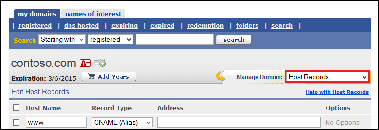
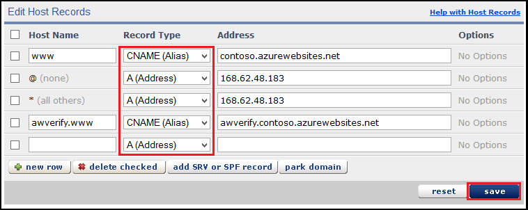

<properties pageTitle="Configure an eNom domain name for an Azure website" description="" services="web-sites" documentationCenter="" authors="blackmist" manager="wpickett" editor=""/>

<tags ms.service="web-sites" ms.workload="web" ms.tgt_pltfrm="na" ms.devlang="na" ms.topic="article" ms.date="09/17/2014" ms.author="larryfr, jroth"/>

#Configuring a custom domain name for an Azure Website (eNom)

<a href="/en-us/documentation/articles/web-sites-custom-domain-name" title="Custom Domain">Custom Domain</a><a href="/en-us/documentation/articles/web-sites-godaddy-custom-domain-name" title="GoDaddy">GoDaddy</a><a href="/en-us/documentation/articles/web-sites-network-solutions-custom-domain-name" title="Network Solutions">Network Solutions</a><a href="/en-us/documentation/articles/web-sites-registerdotcom-custom-domain-name" title="Register.com">Register.com</a><a href="/en-us/documentation/articles/web-sites-enom-custom-domain-name" title="Enom" class="current">Enom</a><a href="/en-us/documentation/articles/web-sites-moniker-custom-domain-name" title="Moniker">Moniker</a><a href="/en-us/documentation/articles/web-sites-dotster-custom-domain-name" title="Dotster">Dotster</a><a href="/en-us/documentation/articles/web-sites-domaindiscover-custom-domain-name" title="DomainDiscover">DomainDiscover</a><a href="/en-us/documentation/articles/web-sites-directnic-custom-domain-name" title="Directnic">Directnic</a>

<a href="/en-us/documentation/articles/web-sites-enom-custom-domain-name/" title="Websites" class="current">Website</a> | <a href="/en-us/documentation/articles/web-sites-enom-traffic-manager-custom-domain-name/" title="Website using Traffic Manager">Website using Traffic Manager</a>

[WACOM.INCLUDE [websites-cloud-services-css-guided-walkthrough](../includes/websites-cloud-services-css-guided-walkthrough.md)]

[WACOM.INCLUDE [intro](../includes/custom-dns-web-site-intro.md)]

This article provides instructions on using a custom domain name purchased from [eNom](https://enom.com) with Azure Websites.

[WACOM.INCLUDE [introfooter](../includes/custom-dns-web-site-intro-notes.md)]

In this article:

-   [Understanding DNS records](#understanding-records)
-   [Configure your web sites for basic, shared or standard mode](#bkmk_configsharedmode)
-   [Add a DNS record for your custom domain](#bkmk_configurecname)
-   [Enable the domain on your web site](#enabledomain)

<h2>Understanding DNS records</h2>

[WACOM.INCLUDE [understandingdns](../includes/custom-dns-web-site-understanding-dns-raw.md)]

<h2>Configure your websites for basic, shared or standard mode</h2>

[WACOM.INCLUDE [modes](../includes/custom-dns-web-site-modes.md)]

<h2>Add a DNS record for your custom domain</h2>

To associate your custom domain with an Azure Website, you must add a new entry in the DNS table for your custom domain by using tools provided by eNom. Use the following steps to locate the DNS tools for enom.com

1. Log on to your account with eNom, and select **Domains** and then **My Domains**. This will display your domain names.

2. From the **My Domains** page, use the **Manage Domain** field to select **Host Records**. This will display the host records fields.

	

4. The Host Records editor allows you to select the specific record type using the **Record Type** field. For Azure Websites, you should only use the **CNAME (Alias)** or **A (Address)** selection.

	

	> [AZURE.NOTE] Before adding entries to the zone file, note that eNom has already created DNS records for the root domain ('@') and a wildcard for sub-domains ('\*'). If you wish to redirect the root domain to your website, or use a wildcard A record, you should modify these entries instead of creating new ones.

	* When adding a CNAME record, you must set the **Host Name** field to the sub-domain you wish to use. For example, **www**. You must set the **Address** field to the **.azurewebsites.net** domain name of your Azure Website. For example, **contoso.azurwebsites.net**.

		> [AZURE.NOTE] If you will be using an A record, you must also add a CNAME record with one of the following configurations:
		> 
		> * An **Alias** value of **www** with an **Other host** value of **&lt;yourwebsitename&gt;.azurewebsites.net**.
		> 
		> OR
		> 
		> * An **Alias** value of **awverify.www** with an **Other host** value of **awverify.&lt;yourwebsitename&gt;.azurewebsites.net**.
		> 
		> This CNAME record is used by Azure to validate that you own the domain described by the A record.

	* When adding an A record, you must set the **Host Name** field to either **@** (this represents root domain name, such as **contoso.com**,) * (a wildcard for matching multiple sub-domains,) or the specific sub-domain you wish to use (for example, **www**.) You must set the **Address** field to the IP address of your Azure Website.

		> [AZURE.NOTE] When adding an A record, you must also add a CNAME record with a host of **awverify**, and a **Points to** of **awverify.&lt;yourwebsitename&gt;.azurewebsites.net.

5. When you have finished adding or modifying records, click **Save** to save the changes.

<h2>Enable the domain name on your website</h2>

[WACOM.INCLUDE [modes](../includes/custom-dns-web-site-enable-on-web-site.md)]
