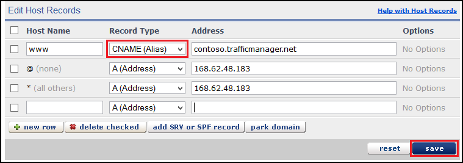

<properties title="Learn how to configure an Azure web site that uses Traffic Manager to use a domain name registered with eNom" pageTitle="Configure an eNom domain name for an Azure web site that uses Traffic Manager" metaKeywords="Windows Azure, Windows Azure Web Sites, domain name" description="" services="web-sites" documentationCenter="" authors="larryfr, jroth" />

#Configuring a custom domain name for an Azure Web Site using Traffic Manager (eNom)

<a href="/en-us/documentation/articles/web-sites-custom-domain-name" title="Custom Domain">Custom Domain</a><a href="/en-us/documentation/articles/web-sites-godaddy-custom-domain-name" title="GoDaddy">GoDaddy</a><a href="/en-us/documentation/articles/web-sites-network-solutions-custom-domain-name" title="Network Solutions">Network Solutions</a><a href="/en-us/documentation/articles/web-sites-registerdotcom-custom-domain-name" title="Register.com">Register.com</a><a href="/en-us/documentation/articles/web-sites-enom-custom-domain-name" title="Enom" class="current">Enom</a><a href="/en-us/documentation/articles/web-sites-moniker-custom-domain-name" title="Moniker">Moniker</a><a href="/en-us/documentation/articles/web-sites-dotster-custom-domain-name" title="Dotster">Dotster</a><a href="/en-us/documentation/articles/web-sites-domaindiscover-custom-domain-name" title="DomainDiscover">DomainDiscover</a><a href="/en-us/documentation/articles/web-sites-directnic-custom-domain-name" title="Directnic">Directnic</a>

<a href="/en-us/documentation/articles/web-sites-enom-custom-domain-name/" title="Web Sites">Web Site</a> | <a href="/en-us/documentation/articles/web-sites-enom-traffic-manager-custom-domain-name/" title="Web Site using Traffic Manager" class="current">Web Site using Traffic Manager</a>

[WACOM.INCLUDE [intro](../includes/custom-dns-web-site-intro-traffic-manager.md)]

This article provides instructions on using a custom domain name purchased from [eNom](https://enom.com) with Azure Web Sites.

[WACOM.INCLUDE [tmwebsitefooter](../includes/custom-dns-web-site-traffic-manager-notes.md)]

[WACOM.INCLUDE [introfooter](../includes/custom-dns-web-site-intro-notes.md)]

In this article:

-   [Understanding DNS records](#understanding-records)
-   [Configure your web sites for standard mode](#bkmk_configsharedmode)
-   [Add a DNS record for your custom domain](#bkmk_configurecname)
-   [Enable Traffic Manager for your web site](#enabledomain)

<h2>Understanding DNS records</h2>

[WACOM.INCLUDE [understandingdns](../includes/custom-dns-web-site-understanding-dns-traffic-manager.md)]

<h2>Configure your web sites for standard mode</h2>

[WACOM.INCLUDE [modes](../includes/custom-dns-web-site-modes-traffic-manager.md)]

<h2>Add a DNS record for your custom domain</h2>

To associate your custom domain with an Azure Web Site, you must add a new entry in the DNS table for your custom domain by using tools provided by eNom. Use the following steps to locate the DNS tools for enom.com

1. Log on to your account with eNom, and select **Domains** and then **My Domains**. This will display your domain names.

2. From the **My Domains** page, use the **Manage Domain** field to select **Host Records**. This will display the host records fields.

	

4. The Host Records editor allows you to select the specific record type using the **Record Type** field. For Azure Web Sites that use Traffic Manager, you should only use the **CNAME (Alias)** selection, as Traffic Manager only works with CNAME records.

	

	* When adding a CNAME record, you must set the **Host Name** field to the sub-domain you wish to use. For example, **www**. You must set the **Address** field to the **.trafficmanager.net** domain name of the Traffic Manager profile used with your Azure Web Site. For example, **contoso.trafficmanager.net**.

5. When you have finished adding or modifying records, click **Save** to save the changes.

<h2>Enable Traffic Manager web site</h2>

[WACOM.INCLUDE [modes](../includes/custom-dns-web-site-enable-on-traffic-manager.md)]
