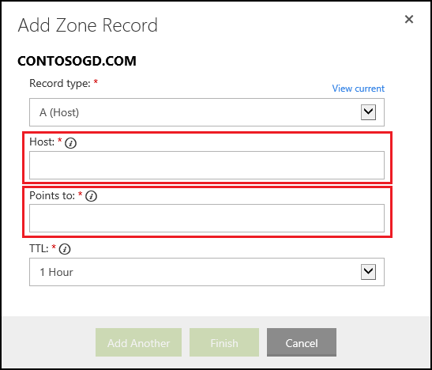

<properties title="" pageTitle="Configure a GoDaddy domain name for an Azure website" metaKeywords="Azure, Azure Web Sites, domain name" description="" services="web-sites" documentationCenter="" authors="blackmist" manager="wpickett" editor=""/>

<tags ms.service="web-sites" ms.workload="web" ms.tgt_pltfrm="na" ms.devlang="na" ms.topic="article" ms.date="09/17/2014" ms.author="larryfr, jroth" />

#Configuring a custom domain name for an Azure Website (GoDaddy)

<a href="/en-us/documentation/articles/web-sites-custom-domain-name" title="Custom Domain">Custom Domain</a><a href="/en-us/documentation/articles/web-sites-godaddy-custom-domain-name" title="GoDaddy" class="current">GoDaddy</a><a href="/en-us/documentation/articles/web-sites-network-solutions-custom-domain-name" title="Network Solutions">Network Solutions</a><a href="/en-us/documentation/articles/web-sites-registerdotcom-custom-domain-name" title="Register.com">Register.com</a><a href="/en-us/documentation/articles/web-sites-enom-custom-domain-name" title="Enom">Enom</a><a href="/en-us/documentation/articles/web-sites-moniker-custom-domain-name" title="Moniker">Moniker</a><a href="/en-us/documentation/articles/web-sites-dotster-custom-domain-name" title="Dotster">Dotster</a><a href="/en-us/documentation/articles/web-sites-domaindiscover-custom-domain-name" title="DomainDiscover">DomainDiscover</a><a href="/en-us/documentation/articles/web-sites-directnic-custom-domain-name" title="Directnic">Directnic</a>

<a href="/en-us/documentation/articles/web-sites-godaddy-custom-domain-name/" title="Websites" class="current">Website</a> | <a href="/en-us/documentation/articles/web-sites-godaddy-traffic-manager-custom-domain-name/" title="Website using Traffic Manager">Website using Traffic Manager</a>

[WACOM.INCLUDE [websites-cloud-services-css-guided-walkthrough](../includes/websites-cloud-services-css-guided-walkthrough.md)]

[WACOM.INCLUDE [intro](../includes/custom-dns-web-site-intro.md)]

This article provides instructions on using a custom domain name purchased from [Go Daddy](https://godaddy.com) with Azure Websites.

[WACOM.INCLUDE [introfooter](../includes/custom-dns-web-site-intro-notes.md)]

In this article:

-   [Understanding DNS records](#understanding-records)
-   [Add a DNS record for your custom domain](#bkmk_configurecname)
-   [Enable the domain on your web site](#enabledomain)

<h2>Understanding DNS records</h2>

[WACOM.INCLUDE [understandingdns](../includes/custom-dns-web-site-understanding-dns-raw.md)]

<h2>Add a DNS record for your custom domain</h2>

To associate your custom domain with an Azure Website, you must add a new entry in the DNS table for your custom domain by using tools provided by GoDaddy. Use the following steps to locate the DNS tools for GoDaddy.com

1. Log on to your account with GoDaddy.com, and select **My Account** and then **Manage my domains**. Finally, select the drop-down menu for the domain name that you wish to use with your Azure Website and select **Manage DNS**.

	

2. From the **Domain details** page, scroll to the **DNS Zone File** tab. This is the section used for adding and modifying DNS records for your domain name. 

	

	Select **Add Record** to add an existing record.

	To **edit** an existing record, select the pen & paper icon beside the record.

	> [AZURE.NOTE] Before adding new records, note that GoDaddy has already created DNS records for popular sub-domains (called **Host** in editor,) such as **email**, **files**, **mail**, and others. If the name you wish to use already exists, modify the existing record instead of creating a new one.

4. When adding a record, you must first select the record type.

	

	Next, you must provide the **Host** (the custom domain or sub-domain) and what it **Points to**.

	

	* When adding an **A (host) record** - you must set the **Host** field to either **@** (this represents root domain name, such as **contoso.com**,) * (a wildcard for matching multiple sub-domains,) or the sub-domain you wish to use (for example, **www**.) You must set the **Points to** field to the IP address of your Azure Website.
	
		> [AZURE.NOTE] When using A (host) records, you must also add a CNAME record with the following configuration:
		> 
		> * A **Host** value of **awverify** that **Points to** a value of **awverify.&lt;yourwebsitename&gt;.azurewebsites.net**.
		> 
		> This CNAME record is used by Azure to validate that you own the domain described by the A record

	* When adding a **CNAME (alias) record** - you must set the **Host** field to the sub-domain you wish to use. For example, **www**. You must set the **Points to** field to the **.azurewebsites.net** domain name of your Azure Website. For example, **contoso.azurwebsites.net**.

5. When you have finished adding or modifying records, click **Finish** to save changes.

<h2>Enable the domain name on your website</h2>

[WACOM.INCLUDE [modes](../includes/custom-dns-web-site-enable-on-web-site.md)]

