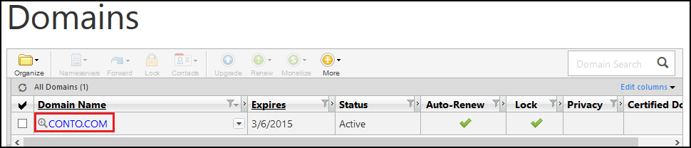
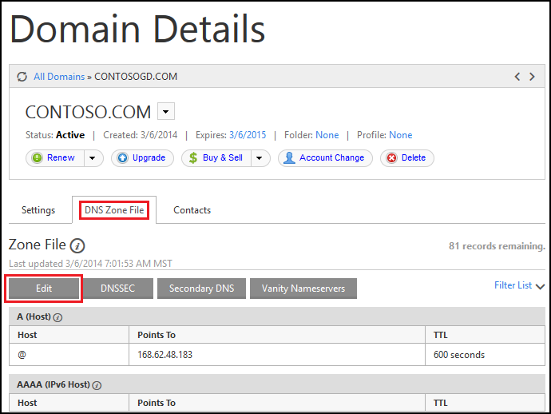
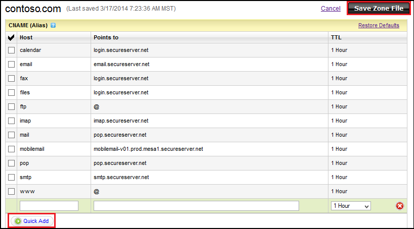

<properties pageTitle="Configure a GoDaddy domain name for an Azure website that uses Traffic Manager" description="" services="web-sites" documentationCenter="" authors="blackmist" manager="wpickett" editor=""/>

<tags ms.service="web-sites" ms.workload="web" ms.tgt_pltfrm="na" ms.devlang="na" ms.topic="article" ms.date="09/17/2014" ms.author="larryfr, jroth"/>

#Configuring a custom domain name for an Azure Website using Traffic Manager (GoDaddy)

<a href="/en-us/documentation/articles/web-sites-custom-domain-name" title="Custom Domain">Custom Domain</a><a href="/en-us/documentation/articles/web-sites-godaddy-custom-domain-name" title="GoDaddy" class="current">GoDaddy</a><a href="/en-us/documentation/articles/web-sites-network-solutions-custom-domain-name" title="Network Solutions">Network Solutions</a><a href="/en-us/documentation/articles/web-sites-registerdotcom-custom-domain-name" title="Register.com">Register.com</a><a href="/en-us/documentation/articles/web-sites-enom-custom-domain-name" title="Enom">Enom</a><a href="/en-us/documentation/articles/web-sites-moniker-custom-domain-name" title="Moniker">Moniker</a><a href="/en-us/documentation/articles/web-sites-dotster-custom-domain-name" title="Dotster">Dotster</a><a href="/en-us/documentation/articles/web-sites-domaindiscover-custom-domain-name" title="DomainDiscover">DomainDiscover</a><a href="/en-us/documentation/articles/web-sites-directnic-custom-domain-name" title="Directnic">Directnic</a>

<a href="/en-us/documentation/articles/web-sites-godaddy-custom-domain-name/" title="Websites">Website</a> | <a href="/en-us/documentation/articles/web-sites-godaddy-traffic-manager-custom-domain-name/" title="Website using Traffic Manager" class="current">Website using Traffic Manager</a>

[WACOM.INCLUDE [websites-cloud-services-css-guided-walkthrough](../includes/websites-cloud-services-css-guided-walkthrough.md)]

[WACOM.INCLUDE [intro](../includes/custom-dns-web-site-intro-traffic-manager.md)]

This article provides instructions on using a custom domain name purchased from [Go Daddy](https://godaddy.com) with Azure Websites.

[WACOM.INCLUDE [tmwebsitefooter](../includes/custom-dns-web-site-traffic-manager-notes.md)]

[WACOM.INCLUDE [introfooter](../includes/custom-dns-web-site-intro-notes.md)]

In this article:

-   [Understanding DNS records](#understanding-records)
-   [Configure your web sites for standard mode](#bkmk_configsharedmode)
-   [Add a DNS record for your custom domain](#bkmk_configurecname)
-   [Enable Traffic Manager for your web site](#enabledomain)

<h2>Understanding DNS records</h2>

[WACOM.INCLUDE [understandingdns](../includes/custom-dns-web-site-understanding-dns-traffic-manager.md)]

<h2>Configure your websites for standard mode</h2>

[WACOM.INCLUDE [modes](../includes/custom-dns-web-site-modes-traffic-manager.md)]

<h2>Add a DNS record for your custom domain</h2>

To associate your custom domain with an Azure Website, you must add a new entry in the DNS table for your custom domain by using tools provided by GoDaddy. Use the following steps to locate the DNS tools for GoDaddy.com

1. Log on to your account with GoDaddy.com, and select **My Account** and then **Manage your domains**. Finally, select the domain name that you wish to use with your Azure Website.

	

2. From the **Domain details** page, select the **DNS Zone File** tab. This is the section used for adding and modifying DNS records for your domain name. Select the **Edit** button to display the **Zone File Editor**.

	

4. The **Zone File Editor** is broken out into sections for each record type, starting with A records (listed as **A (Host)** as the very first section, followed by CNAME records (listed as **CNAME (Alias)**.) To add a new entry, use the **Quick Add** button below the corresponding section. To edit an existing entry, select that entry and modify the existing information.

	

	> [AZURE.NOTE] Before adding entries to the zone file, note that GoDaddy has already created DNS records for popular sub-domains (called **Host** in editor,) such as **email**, **files**, **mail**, and others. If the name you wish to use already exists, modify the existing record instead of creating a new one.

	When adding a CNAME record, you must set the **host** field to the sub-domain you wish to use. For example, **www**. You must set the **Points to** field to the **.trafficmanager.net** domain name of the Traffic Manager profile used with your Azure Website. For example, **contoso.trafficmanager.net**.

	> [AZURE.NOTE] You must only use CNAME records when associating your custom domain name with a website that is load balanced using Traffic Manager.

5. When you have finished adding or modifying records, click **Save Zone File** to save changes.

<h2>Enable Traffic Manager website</h2>

[WACOM.INCLUDE [modes](../includes/custom-dns-web-site-enable-on-traffic-manager.md)]
