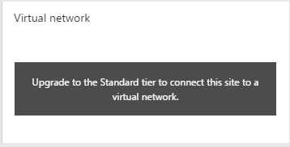
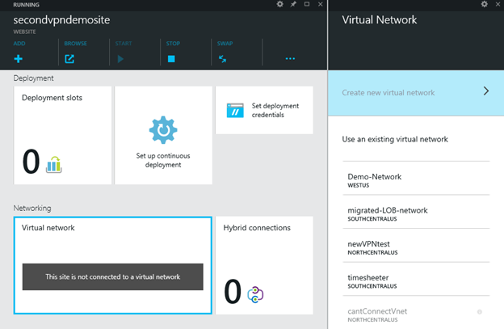
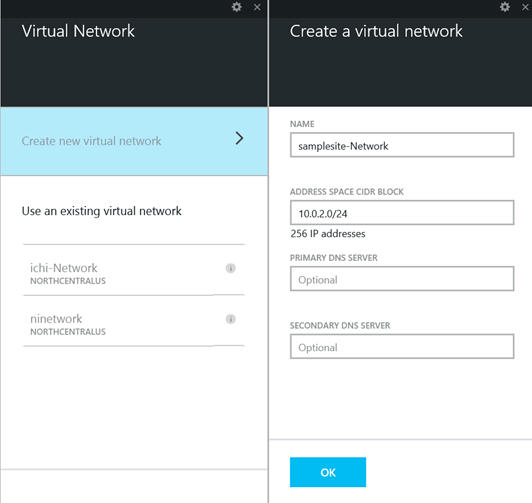
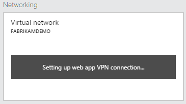
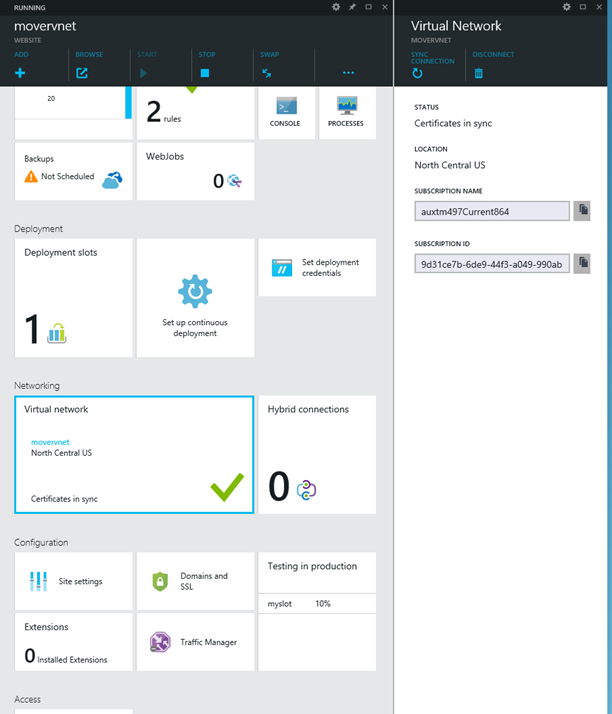
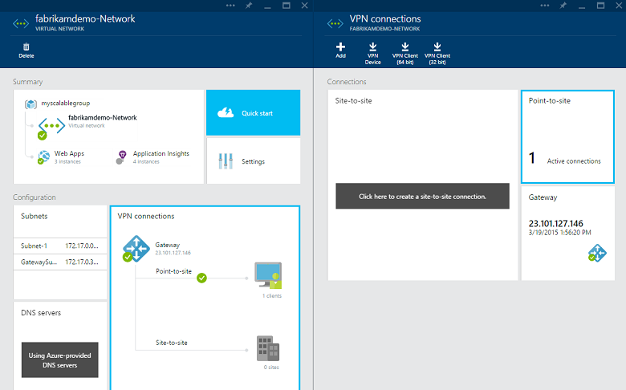
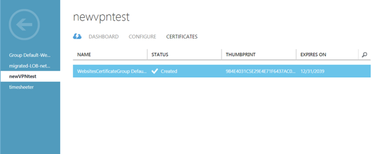
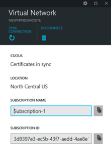

<properties 
	pageTitle="Integrate a web app with an Azure Virtual Network" 
	description="Shows you how to connect an Azure web app in Azure App Service to a new or existing Azure virtual network" 
	services="app-service\web" 
	documentationCenter="" 
	authors="cephalin" 
	manager="wpickett" 
	editor=""/>

<tags 
	ms.service="app-service-web" 
	ms.workload="web" 
	ms.tgt_pltfrm="na" 
	ms.devlang="na" 
	ms.topic="article" 
	ms.date="03/24/2015" 
	ms.author="cephalin"/>

# Integrate a web app with an Azure Virtual Network #
This document describes the virtual network integration preview feature and shows how to set it up with Web Apps in [Azure App Service](http://go.microsoft.com/fwlink/?LinkId=529714).  If you are unfamiliar with Azure Virtual Networks, this is a capability that will allow you to build hybrid solutions with your Azure and on-premise resources.  

This integration gives your web app access to resources in your virtual network but does not grant access to your web app from the virtual network.  Some standard scenarios are where your web app needs access to a database or web services that are running in virtual machines in your virtual network or even in your own data center.  It does not allow you to mount a drive.  It also currently does not support enabling integration with authentication systems in your virtual network.  The feature is in Preview though and will continue to be improved before reaching GA.

For more details on Azure Virtual Networks see Virtual Network Overview about the use cases and benefits of an Azure Virtual Network.

## Getting started ##
Here are some things to keep in mind before connecting your web app to a virtual network.

1.	Web Apps can only be connected to a virtual network if they are running on an App Service Plan that’s in the ‘Standard’ pricing tier.  Web Apps in Free, Shared and Basic plans cannot connect to a virtual network.
2.	If your target virtual network already exists, it must have point-to-site enabled with a Dynamic routing gateway before it can be connected to a Web App.  You cannot enable point-to-site Virtual Private Network (VPN) if your gateway is configured with Static routing.
3.	You can only have up to 5 networks configured in your App Service Plan.  A web app can only be connected to one network at a time.  Those 5 networks can be used by any number of web apps in the same App Service Plan.  

You have the option to connect to a new or existing virtual network.  If you create a new network then a gateway will be pre-configured for you.  Note that creating and configuring a new virtual network will take several minutes.  

If your Web App is not on a Standard App Service Plan, then the UI lets you know and gives you access to the pricing tiers should you want to upgrade.

 

## How the system works ##
Under the covers this feature uses Point-to-Site VPN technology to connect your Web App to your virtual network.  Web Apps in Azure App Service has a multi-tenant system architecture which precludes provisioning a web app directly in a virtual network as is done with virtual machines.  By building on point-to-site technology we limit network access to just the virtual machine hosting the web app.  Access to the network is further restricted on those web app hosts so that your web apps can only access the networks that you configure them to access.  

The work required to secure your networks to only the web apps that need access prevents being able to create SMB connections.  While you can access remote resources this does not include being able to mount a remote drive.

 
If you haven’t configured a DNS server with your virtual network you will need to use IP addresses.  Be sure expose the ports for your desired endpoints through your firewall.  When it comes to testing your connection the only method currently available is to use a web app or web job that makes a call to your desired endpoint.  Tools such as ping or nslookup do not currently work through the Kudu console.  This is an area that will be improved in the near future.  

## Connect to a pre-existing network ##
To connect a web app to a virtual network go to your web app’s blade, click the Virtual network tile in the Networking section, and select one of your pre-existing networks.

 
The system will then create a certificate to authenticate with your virtual network if it is the first web app in your subscription to establish a connection to that network.  To see the certificate go to the [Azure Portal](http://go.microsoft.com/fwlink/?LinkId=529715), navigate to Virtual Networks, select the network and select the Certificates tab.  

In the above image you can see a network named cantConnectVnet that is greyed out and cannot be selected.  There are only a two reasons that this should be the case.  It means that either you do not have point-to-site VPN enabled on your network or you have not provisioned a dynamic routing gateway in your virtual network.  When both items are satisfied then you will be able to select the virtual network for integration with your web app.

## Create and connect to a new Virtual Network ##
In addition to connecting to a pre-existing virtual network, you can also create a new virtual network from the Azure Portal UI and automatically connect to it.  To do this follow the same path to reach the Virtual Network UI and select Create new virtual network.  The UI that opens up allows you to name the network, specify the address space and set the addresses for the DNS servers to be used by the virtual network.

 
The creation of a new virtual network with configured gateways can take up to 30 minutes to complete.  During this time the UI will let you know that it is still working on it and will show the following message.

Once the network has been joined to the web app, the web app will have access to resources in that virtual network over TCP or UDP.  If you wish to access resources in your on premise system that are available through Site-to-site VPN to your virtual network then you will need to add routes on your own corporate network to allow traffic to go from your network to the Point-to-Site addresses configured in your virtual network.

After successfully completing integration, the Azure Portal will display basic information about the connection, give a way to disconnect the web app from the network and also give you a way to synchronize the certificates used to authenticate the connection.  Synchronization may be required if a certificate has been expired or revoked.  

##Managing the virtual network connection##
You can see a list of all virtual networks currently associated with web apps in an App Service Plan by visiting the App Service Plan’s blade.  You can have at most 5 networks associated with a 'Standard' App Service Plan.

Should the App Service Plan be scaled into a lower plan such as Free, Shared or Basic then the virtual network connections that are used by the web apps in that plan will be disabled.  Should the plan be scaled back up to a Standard plan then those network connections would be re-established.

At this time it is not possible in Azure to take an existing virtual machine and move it into a virtual network.  The virtual machine needs to be provisioned into that virtual network during creation.  

## Accessing on premise resources ##
When working with a virtual network that has been configured with Site-to-Site VPN there is an additional step required in order to provide access to your on-premise resources from your  Web App.  Routes need to be added to your on-premise network to allow traffic to go from your network to the Point-to-Site addresses configured in your virtual network.  To see your IP range for your Point-to-Site connectivity go to the Network area in the Azure Portal as shown here.

## Certificates ##
In order to establish a secure connection with your virtual network, there is an exchange of certificates.  You can see the thumbprint for the public certificate that Web Apps generates from the current Network portal as shown below.  

If the certificates go out of sync for whatever reason, such as accidentally deleting it from the Network portal, then connectivity will be broken.  To fix things there is a Sync Connection action in your Web App's virtual network UI that will re-establish connectivity.

This action must also be used if you add a DNS to your virtual network or if you add site-to-site VPN to your network.  

## Compare and contrast with Hybrid Connections ##
There is another feature offered by Web Apps called Hybrid Connections that is similar in some ways to Virtual Network integration.  While there is some use case overlap, neither feature can replace the other.  With Hybrid Connections you can establish connections to multiple application endpoints in a mix of networks.  The Virtual Networks feature connects your web app to a virtual network which can be connected to your on-premise network.  That works great if your resources are all in the scope of that network.  

Another difference is that you need to install a relay agent for Hybrid Connections to work.  This agent needs to run on a Windows Server instance.  With the Virtual Network feature there is nothing to install and it enables access to remote resources regardless of hosting operating systems.  

There are also pricing tier differences at this time between the two features.  This is because at the least expensive levels the Hybrid Connections feature is extremely useful for dev/test scenarios and only gives access to a small number of endpoints.  The virtual network feature gives you access to everything in the VNET or connected to it.  

>[AZURE.NOTE] If you want to get started with Azure App Service before signing up for an Azure account, go to [Try App Service](http://go.microsoft.com/fwlink/?LinkId=523751), where you can immediately create a short-lived starter web app in App Service. No credit cards required; no commitments.

## What's changed
* For a guide to the change from Websites to App Service see: [Azure App Service and Its Impact on Existing Azure Services](http://go.microsoft.com/fwlink/?LinkId=529714)
* For a guide to the change of the old portal to the new portal see: [Reference for navigating the preview portal](http://go.microsoft.com/fwlink/?LinkId=529715)
