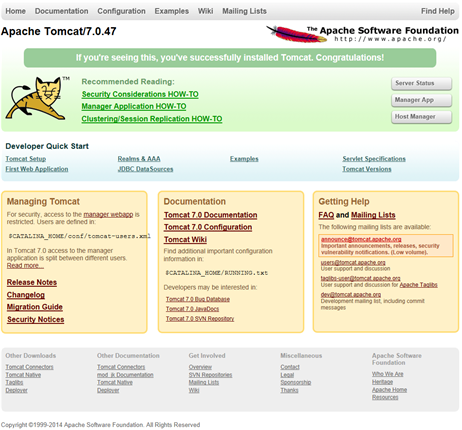
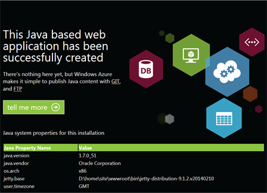

<properties 
	pageTitle="Create a Java web app in Azure App Service" 
	description="This tutorial shows you how to deploy a Java web app to Azure App Service." 
	services="app-service\web" 
	documentationCenter="java" 
	authors="rmcmurray" 
	manager="wpickett" 
	editor="jimbe"/>

<tags 
	ms.service="app-service-web" 
	ms.workload="web" 
	ms.tgt_pltfrm="na" 
	ms.devlang="Java" 
	ms.topic="article" 
	ms.date="03/24/2015" 
	ms.author="robmcm"/>

# Create a Java web app in Azure App Service

This tutorial shows how to create a web app on Microsoft Azure using Java, using either the Azure Marketplace, or the [App Service Web Apps](http://go.microsoft.com/fwlink/?LinkId=529714) configuration UI. 

If you don't want to use either of those techniques, for example, if you want to customize your application container, see [Upload a custom Java web app to Azure](web-sites-java-custom-upload.md).

> [AZURE.NOTE] To complete this tutorial, you need a Microsoft Azure account. If you don't have an account, you can <a href="/en-us/pricing/member-offers/msdn-benefits-details/?WT.mc_id=A261C142F" target="_blank">activate your MSDN subscriber benefits</a> or <a href="/en-us/pricing/free-trial/?WT.mc_id=A261C142F" target="_blank">sign up for a free trial</a>. 

>If you want to get started with Azure App Service before signing up for an Azure account, go to [Try App Service](http://go.microsoft.com/fwlink/?LinkId=523751), where you can immediately create a short-lived starter web app in App Service. No credit cards required; no commitments.

# Create a Java web app using the Azure Marketplace

This information shows how to use the Azure Marketplace to select a Java application container, either Apache Tomcat or Jetty, for your web app.

The following shows how a web app built using Tomcat from the Azure Marketplace would appear:

<!--todo:-->

The following shows how a web app built using Jetty from the Azure Marketplace would appear:

<!--todo:-->

1. Log in to the [Azure Portal](http://go.microsoft.com/fwlink/?LinkId=529715).
2. Click **New** in the bottom left of the page.
3. Click the **Web + Mobile** blade.
4. Click **Azure Marketplace** at the bottom of the **Web + Mobile** blade.
5. Click **Web**.
6. The top of the **Web** page contains a search text box. In this text box, type the desired Java application server - such as **Apache Tomcat** or **Jetty**.
4. Click the desired Java application server.
5. Click **Create**.
6. Specify the URL name.
6. Select a region. For example, **West US**.
7. Click **Create**.

Within a few moments, your web app will be created. To view the web app, within the Azure Management Portal, in the **Web Apps** blade, click your newly created web app, and then click the URL for the web app.

Now that you've created the web app with an app container, see the **Next steps** section for information about uploading your application to the web app.

# Create a Java web app using the Azure configuration UI

This information shows how to use the Azure configuration UI to select a Java application container, either Apache Tomcat or Jetty, for your web app.

1. Log in to the Microsoft Azure Management Portal.
2. Click **New** in the bottom left of the page.
3. Click the **Web + Mobile** blade.
4. Click **Azure Marketplace** at the bottom of the **Web + Mobile** blade.
5. Click **Web**.
6. Click **Web App**.
7. Click **Create**. 
8. Specify the URL name.
9. Select a region. For example, **West US**.
10. Click **Create**.
11. When the web app has been created, click **All settings**.
12. Click **Application settings**.
13. Click the desired Java version.
14. The options for the web container are displayed, for example, Tomcat and Jetty. Select the desired **Web container**. 
15. Click **Save**. 

Within a few moments, your web app will become Java-based. To confirm it is Java-based, click the URL for the web app. Note that the page will provide text stating that the new web app is a Java-based web app.

Now that you've create the web app with an app container, see the **Next steps** section for information about uploading your application to the web app.

# Next steps

At this point, you have a Java application server running as your Java web app on Azure. To add in your own application or web page, see [Add an application or web page to your Java web app](web-sites-java-add-app.md).

## What's changed
* For a guide to the change from Websites to App Service see: [Azure App Service and Its Impact on Existing Azure Services](http://go.microsoft.com/fwlink/?LinkId=529714)
* For a guide to the change of the old portal to the new portal see: [Reference for navigating the preview portal](http://go.microsoft.com/fwlink/?LinkId=529715)
