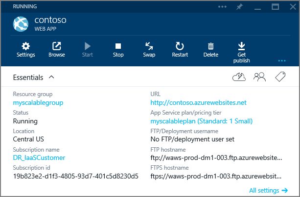
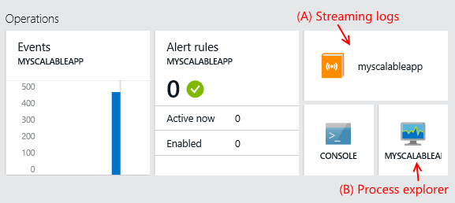

<properties 
	pageTitle="Manage web apps using the Azure Portal" 
	description="Overview of the web app management tasks in Microsoft Azure using the Azure Portal." 
	services="app-service\web" 
	documentationCenter="" 
	authors="MikeWasson" 
	writer="mwasson" 
	manager="wpickett" 
	editor=""/>

<tags 
	ms.service="app-service-web" 
	ms.workload="web" 
	ms.tgt_pltfrm="na" 
	ms.devlang="na" 
	ms.topic="article" 
	ms.date="03/24/2015" 
	ms.author="mwasson"/>

# Manage web apps using the Azure Portal

In the [Azure Portal](https://portal.azure.com), you manage your web apps through a series of *blades*, which are containers for the different components. (For an overview of the Azure Portal, please refer to the [Portal](http://go.microsoft.com/fwlink/?LinkId=529715) changes guide.) 

To view the blade for your web app, click **Home** and then the app name, or click **Browse** to see all of your Azure resources.

The top part of the blade has controls for some common actions:

- **Settings** to see a list of all management settings.

- **Browse** to open the web app in browser window. 

- Other buttons start or stop the app, swap deployment slots, delete the app, and so forth.

**Essentials** lists basic information about the app, including URL, location, [App Service](http://go.microsoft.com/fwlink/?LinkId=529714) plan, and current status (running, stopped, etc).

Below **Essentials** are various parts that you can use to monitor, manage, and deploy your app. To customize the layout of blade, right click and select **Customize** or **Add Parts**. The rest of this topic describes the parts in the default layout.

## Monitoring

Under **Monitoring** is a graph that shows metrics for your web app. To configure the graph, click **Edit**. You can select the time range and which metrics to display. Available metrics include number of requests, average response time, server errors, and CPU time.   

To add an alert rule, click the graph, then click **Add alert**. An alert rule notifies you when a particular metric reaches some threshold. For example, you can be alerted when the number of server errors exceeds some value over a 5-minute period. 

**Monitoring** also includes parts to configure analytics, set up application monitoring, and create availability tests. For more information, see [Monitoring basics for Web Apps in Azure App Service](web-sites-monitor.md).

## Usage

- **File System Storage** shows how much file storage your app is using.
- **Quotas** shows how your app is using its resource usage quota. Click this part to see details.
- **Scale** lets you scale the instance count and set up autoscaling. See [Scale a Web App in Azure App Service](how-to-scale-websites.md).  
- **Estimated spend** shows a cost estimate for the app.
- **Pricing tier** lets you change the pricing tier.

## Operations

- **Events**. Click to view event logs.  
- **Alert rules**. Click to view alert rules, and add new alerts.
- **Streaming logs** (A). Click to view application logs. To enable logs, go to **Settings** and open the **Diagnostics logs** blade. 
- **Console**. Click to open a command line that runs inside the portal. You can use this to run command commands like `mkdir` and `dir`.  
- **Process explorer** (B). Click to view the processes running in the app, including working set and thread count.

## Deployment
 

- Set up continuous deployment. See [Using Git to deploy Web Apps in Azure App Service](web-sites-publish-source-control.md)
- Deployment slots. See [Deploy to Staging Environments for Web Apps in Azure App Service](web-sites-staged-publishing.md)
- Set deployment credentials for Git or FTP. 

## Networking

- Connect the app to a virtual network
- Add hybrid connections

>[AZURE.NOTE] If you want to get started with Azure App Service before signing up for an Azure account, go to [Try App Service](http://go.microsoft.com/fwlink/?LinkId=523751), where you can immediately create a short-lived starter web app in App Service. No credit cards required; no commitments.

## Next steps

- [Scale a Web App in Azure App Service](how-to-scale-websites.md)
- [Run Background tasks with WebJobs](web-sites-create-web-jobs.md)
- [Azure Web Apps backups](web-sites-backup.md) and [restore](web-sites-restore.md)
- [Monitoring basics for Web Apps in Azure App Service](web-sites-monitor.md)

## What's changed
* For a guide to the change from Websites to App Service see: [Azure App Service and Its Impact on Existing Azure Services](http://go.microsoft.com/fwlink/?LinkId=529714)
* For a guide to the change of the old portal to the new portal see: [Reference for navigating the preview portal](http://go.microsoft.com/fwlink/?LinkId=529715)
