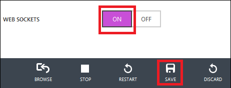

<properties linkid="dev-nodejs-website-with-socketio" urlDisplayName="Website Using Socket.IO" pageTitle="Node.js Website using Socket.io - Azure tutorial" metaKeywords="Azure Node.js socket.io tutorial, Azure Node.js socket.io, Azure Node.js tutorial" description="A tutorial that demonstrates using socket.io in a node.js website hosted on Azure." metaCanonical="" services="web-sites" documentationCenter="Node.js" title="Build a Node.js Chat Application with Socket.IO on an Azure Web Site" authors="larryfr" solutions="" videoId="" scriptId="" manager="paulettm" editor="mollybos" />

#Build a Node.js Chat Application with Socket.IO on an Azure Web Site

Socket.IO provides real-time communication between your node.js server and clients using WebSockets. It also supports fallback to other transports (such as long polling,) that work with older browsers. This tutorial will walk you through hosting a Socket.IO based chat application as an Azure Web Site. For more information on Socket.IO, see [http://socket.io/][socketio].

> [WACOM.NOTE] The procedures in this task apply to Azure Web Sites; for Cloud Services, see <a href="http://www.windowsazure.com/en-us/develop/nodejs/tutorials/app-using-socketio/">Build a Node.js Chat Application with Socket.IO on an Azure Cloud Service</a>.

A screenshot of the completed application is below:

![A browser displaying the chat application][completed-app]

## Download the Chat Example

For this project, we will use the chat example from the [Socket.IO
GitHub repository]. Perform the following steps to download the example
and add it to the project you previously created.

1.  Create a local copy of the repository by using the **Clone** button. You may also use the **ZIP** button to download the project.

    ![A browser window viewing https://github.com/LearnBoost/socket.io/tree/master/examples/chat, with the ZIP download icon highlighted][chat-example-view]

3.  Navigate the directory structure of the local repository until you arrive at the **examples\\chat**
    directory. Copy the contents of this directory to a seperate directory such as
    **\\node\\chat**.

## Modify App.js and Install Modules

Before deploying the application to Azure, we must
make some minor modifications. Perform the following steps to the
app.js file:

1.  Open the app.js file in Notepad or other text editor.

2.  Find the **Module dependencies** section at the beginning of app.js and change the line containing **sio = require('..//..//lib//socket.io')** to **sio = require('socket.io')** as shown below:

		var express = require('express')
  		, stylus = require('stylus')
  		, nib = require('nib')
		//, sio = require('..//..//lib//socket.io'); //Original
  		, sio = require('socket.io');                //Updated

3.  To ensure the application listens on the correct port, open
    app.js in Notepad or your favorite editor, and then change the
    following line by replacing **3000** with **process.env.PORT** as shown below:

        //app.listen(3000, function () {            //Original
		app.listen(process.env.PORT, function () {  //Updated
		  var addr = app.address();
		  console.log('   app listening on http://' + addr.address + ':' + addr.port);
		});

After saving the changes to app.js, use the following steps to
install required modules::

1.  From the command-line, change directories to the **\\node\\chat** directory and use the following command to install the modules required by this application:

        npm install

    This will install the modules listed in the package.json file. After
    the command completes, you should see output similar to the
    following:

    ![The output of the npm install command][npm-output]

2.  Since this example was originally a part of the Socket.IO GitHub
    repository, and directly referenced the Socket.IO library by
    relative path, Socket.IO was not referenced in the package.json
    file, so we must install it by issuing the following command:

        npm install socket.io -save

## Create an Azure Web Site

Follow these steps to create an Azure Web Site,enable Git publishing, and then enable WebSocket support for the web site.

> [WACOM.NOTE] To complete this tutorial, you need an Azure account. If you don't have an account, you can create a free trial account  in just a couple of minutes. For details, see <a href="http://www.windowsazure.com/en-us/pricing/free-trial/?WT.mc_id=A7171371E" target="_blank">Azure Free Trial</a>.

1. From the command-line, change directories to the **\\node\chat** directory and use the following command to create a new Azure Web Site and enable a Git repository for the web site and the local directory. This will also create a Git remote named 'azure'.

		azure site create mysitename --git

	You must replace 'mysitename' with a unique name for your web site.

2. Commit the existing files to the local repository by using the following commands:

		git add .
		git commit -m "Initial commit"

3. Push the files to the Azure Web Site repository with the following command:

		git push azure master

	You will receive status messages as modules are imported on the server. Once this process has completed, the application will be hosted on your Azure Web Site.

 	> [WACOM.NOTE] During module installation, you may notice errors that 'The imported project ... was not found'. These can safely be ignored.

4. Socket.IO uses WebSockets, which are not enabled by default on Azure. To enable web sockets, use the following command:

		azure site set -w

	If prompted, enter the name of the web site.

	>[WACOM.NOTE]
	>The 'azure site set -w' command will only work with version 0.7.4 or higher of the Azure Cross-Platform Command-Line Interface. You can also enable WebSocket support using the Azure Management Portal.
	>
	>To enable WebSockets using the [Azure Management Portal](https://manage.windowsazure.com), select the Configure page for your web site, select 'ON' for the Web Sockets entry, and then click Save.
	>	
	>
	
5. To view the web site on Azure, use the following command to launch your web browser and navigate to the hosted web site:

		azure site browse

Your application is now running on Azure, and can relay chat
messages between different clients using Socket.IO.

> [WACOM.NOTE] For simplicity, this sample is limited to chatting between users connected to the same instance. This means that if the cloud service creates two worker role instances, users will only be able to chat with others connected to the same worker role instance. To scale the application to work with multiple role instances, you could use a technology like Service Bus to share the Socket.IO store state across instances. For examples, see the Service Bus Queues and Topics usage samples in the <a href="https://github.com/WindowsAzure/azure-sdk-for-node">Azure SDK for Node.js GitHub repository</a>.

##Troubleshooting

###Connection limits

Azure Web Sites is available in multiple SKUs, which determine the resources available to your site. This includes the number of allowed WebSocket connections. For more information, see the [Web Sites Pricing page][pricing].

###Messages aren't being sent using WebSockets

If client browsers keep falling back to long polling instead of using WebSockets, it may be because of one of the following.

* **Try limiting the transport to just WebSockets**

	In order for Socket.IO to use WebSockets as the messaging transport, both the server and client must support WebSockets. If one or the other does not, Socket.IO will negotiate another transport, such as long polling. The default list of transports used by Socket.IO is ` websocket, htmlfile, xhr-polling, jsonp-polling`. You can force it to only use WebSockets by adding the following code to the **app.js** file, after the line containing `, nicknames = {};`.

		io.configure(function() {
		  io.set('transports', ['websocket']);
		});

	> [WACOM.NOTE] Note that older browsers that do not support WebSockets will not be able to connect to the site while the above code is active, as it restricts communication to WebSockets only.

* **Use SSL**

	WebSockets relies on some lesser used HTTP headers, such as the **Upgrade** header. Some intermediate network devices, such as web proxies, may remove these headers. To avoid this problem, you can establish the WebSocket connection over SSL.

	An easy way to accomplish this is to configure Socket.IO to `match origin protocol`. This instructs Socket.IO to secure WebSockets communication the same as the originating HTTP/HTTPS request for the web page. If a browser uses an HTTPS URL to visit your web site, subsequent WebSocket communications through Socket.IO will be secured over SSL.

	To modify this example to enable this configuration, add the following code to the **app.js** file after the line containing `, nicknames = {};`.

		io.configure(function() {
		  io.set('match origin protocol', true);
		});

* **Verify web.config settings**

	Azure Web Sites that host Node.js applications use the **web.config** file to route incoming requests to the Node.js application. For WebSockets to function correctly with Node.js applications, the **web.config** must contain the following entry.

		<webSocket enabled="false"/>

	This disables the IIS WebSockets module, which includes its own implementation of WebSockets and conflicts with Node.js specific WebSocket modules such as Socket.IO. If this line is not present, or is set to `true`, this may be the reason that the WebSocket transport is not working for your application.

	Normally, Node.js applications do not include a **web.config** file, so Azure Web Sites will automatically generate one for Node.js applications when they are deployed. Since this file is automatically generated on the server, you must use the FTP or FTPS URL for your web site to view this file. You can find the FTP and FTPS URLs for your site in the Azure Management portal by selecting your web site, and then the **Dashboard** link. The URLs are displayed in the **quick glance** section.

	> [WACOM.NOTE] The **web.config** file is only generated by Azure Web Sites if your application does not provide one. If you provide a **web.config** file in the root of your application project, it will be used by Azure Web Sites.

	If the entry is not present, or is set to a value of `true`, then you should create a **web.config** in the root of your Node.js application and specify a value of `false`.  For reference, the below is a default **web.config** for an application that uses **app.js** as the entry point.

		<?xml version="1.0" encoding="utf-8"?>
		<!--
		     This configuration file is required if iisnode is used to run node processes behind
		     IIS or IIS Express.  For more information, visit:
		
		     https://github.com/tjanczuk/iisnode/blob/master/src/samples/configuration/web.config
		-->
		
		<configuration>
		  <system.webServer>
		    <!-- Visit http://blogs.msdn.com/b/windowsazure/archive/2013/11/14/introduction-to-websockets-on-windows-azure-web-sites.aspx for more information on WebSocket support -->
		    <webSocket enabled="false" />
		    <handlers>
		      <!-- Indicates that the server.js file is a node.js site to be handled by the iisnode module -->
		      <add name="iisnode" path="app.js" verb="*" modules="iisnode"/>
		    </handlers>
		    <rewrite>
		      <rules>
		        <!-- Do not interfere with requests for node-inspector debugging -->
		        <rule name="NodeInspector" patternSyntax="ECMAScript" stopProcessing="true">
		          <match url="^app.js\/debug[\/]?" />
		        </rule>
		
		        <!-- First we consider whether the incoming URL matches a physical file in the /public folder -->
		        <rule name="StaticContent">
		          <action type="Rewrite" url="public{REQUEST_URI}"/>
		        </rule>
		
		        <!-- All other URLs are mapped to the node.js site entry point -->
		        <rule name="DynamicContent">
		          <conditions>
		            <add input="{REQUEST_FILENAME}" matchType="IsFile" negate="True"/>
		          </conditions>
		          <action type="Rewrite" url="app.js"/>
		        </rule>
		      </rules>
		    </rewrite>
		    <!--
		      You can control how Node is hosted within IIS using the following options:
		        * watchedFiles: semi-colon separated list of files that will be watched for changes to restart the server
		        * node_env: will be propagated to node as NODE_ENV environment variable
		        * debuggingEnabled - controls whether the built-in debugger is enabled
		
		      See https://github.com/tjanczuk/iisnode/blob/master/src/samples/configuration/web.config for a full list of options
		    -->
		    <!--<iisnode watchedFiles="web.config;*.js"/>-->
		  </system.webServer>
		</configuration>

	> [WACOM.NOTE] If your application uses an entry point other than **app.js**, you must replace all occurrences of **app.js** with the correct entry point. For example, replacing **app.js** with **server.js**.

##Next steps

In this tutorial you learned how to create a chat application hosted in an Azure Web Site. You can also host this application as an Azure Cloud Service. For steps on how to accomplish this, see [Build a Node.js Chat Application with Socket.IO on an Azure Cloud Service][cloudservice].

[socketio]: http://socket.io/
[completed-app]: ./media/web-sites-nodejs-chat-app-socketio/websitesocketcomplete.png
[Socket.IO GitHub repository]: https://github.com/LearnBoost/socket.io/tree/0.9.14
[cloudservice]: /en-us/develop/nodejs/tutorials/app-using-socketio/

[chat-example-view]: ./media/web-sites-nodejs-chat-app-socketio/socketio-2.png
[npm-output]: ./media/web-sites-nodejs-chat-app-socketio/socketio-7.png
[pricing]: /en-us/pricing/details/web-sites/