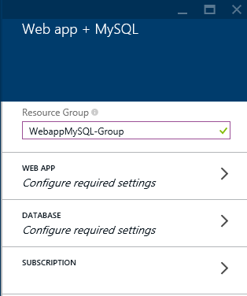

<properties 
	pageTitle="Create and Deploy a PHP-MySQL web app in Azure App Service using WebMatrix" 
	description="A tutorial that demonstrates how to use the free WebMatrix IDE to create and deploy a PHP web app in Azure App Service that stores data in MySQL."
	tags="azure-portal" 
	services="app-service\web" 
	documentationCenter="php" 
	authors="tfitzmac" 
	manager="wpickett" 
	editor="mollybos"/>

<tags 
	ms.service="app-service-web" 
	ms.workload="web" 
	ms.tgt_pltfrm="na" 
	ms.devlang="PHP" 
	ms.topic="article" 
	ms.date="04/22/2015" 
	ms.author="tomfitz"/>

# Create and Deploy a PHP-MySQL web app in Azure App Service using WebMatrix

This tutorial shows you how to use WebMatrix to develop and deploy a PHP-MySQL application to [Azure App Service](http://go.microsoft.com/fwlink/?LinkId=529714) Web Apps. WebMatrix is a free web development tool from Microsoft that includes everything you need for website development. WebMatrix supports PHP and includes intellisense for PHP development.

This tutorial assumes you have [MySQL][install-mysql] installed on your computer so that you can test an application locally. However, you can complete the tutorial without having MySQL installed. Instead, you can deploy your application directly to Azure App Service Web Apps.

Upon completing this guide, you will have a PHP-MySQL website running in Web Apps.
 
You will learn:

* How to create a website in App Service Web Apps and a MySQL database using the [Azure Portal](http://go.microsoft.com/fwlink/?LinkId=529715). Because PHP is enabled in Web Apps by default, nothing special is required to run your PHP code.
* How to develop a PHP application using WebMatrix.
* How to publish and re-publish your application to Web Apps using WebMatrix.
 
By following this tutorial, you will build a simple Tasklist web application in PHP. The application will be hosted in App Service Web Apps. A screenshot of the running application is below:

![Azure PHP Web Site][running-app]

[AZURE.INCLUDE [create-account-and-websites-note](../includes/create-account-and-websites-note.md)]

>[AZURE.NOTE] If you want to get started with Azure App Service before signing up for an Azure account, go to [Try App Service](http://go.microsoft.com/fwlink/?LinkId=523751), where you can immediately create a short-lived starter web app in App Service. No credit cards required; no commitments.

##Prerequisites

1. [Download][tasklist-mysql-download] the Tasklist application files. The Tasklist application is a simple PHP application that allows you to add, mark complete, and delete items from a task list. Task list items are stored in a MySQL database. The application consists of these files:

	* **additem.php**: Adds an item to the list.
	* **createtable.php**: Creates the MySQL table for the application. This file will only be called once.
	* **deleteitem.php**: Deletes an item.
	* **getitems.php**: Gets all items in the database.
	* **index.php**: Displays tasks and provides a form for adding an item to the list.
	* **markitemcomplete.php**: Changes the status of an item to complete.
	* **taskmodel.php**: Contains functions that add, get, update, and delete items from the database.

1. Create a local MySQL database called `tasklist`. You can do this either from the Database workspace in WebMatrix (after it is installed below in the tutorial) or from the MySQL command prompt with this command:

		mysql> create database tasklist;

	This step is only necessary if you want to test your application locally.

## Create a web app and MySQL database

Follow these steps to create a web app and a MySQL database:

1. Login to the [Azure Portal](https://portal.azure.com).

2. Click the **New** icon on the bottom left of the portal.

	

3. Click **Web + Mobile**, then **Web app + MySQL**.

	

4. Enter a valid name for your resource group.

    

5. Enter values for your new web app.

    

6. Enter values for your new database, including agreeing to the legal terms.

	

	When the web app has been created, you will see the new resource group. 

## Get remote MySQL connection information

To connect to the MySQL database that is running in Web Apps, your will need the connection information. To get MySQL connection information, follow these steps:

1. From your resource group, click the database:

	

2. From the database sumamry, select **Properties**.

    

2. Make note of the values for `Database`, `Host`, `User Id`, and `Password`.

    

## Create your application in WebMatrix

In the next few steps you will develop the Tasklist application by adding the files you downloaded earlier and making a few modifications. You could, however, add your own existing files or create new files.

1. Launch [Microsoft WebMatrix](http://www.microsoft.com/web/webmatrix/). If you haven't alreayd installed it yet, do it now.
2. If this is the first time you've used WebMatrix 3, you will be prompted to sign into Azure.  Otherwise, you can click on the **Sign In** button, and choose **Add Account**.  Choose to **Sign in** using your Microsoft Account.

	

3. If you have signed up for an Azure account, you may log in using your Microsoft Account:

	

1. On the start screen, click the **New** button, and choose **Template Gallery** to create a new site from the Template Gallery:

	

4. From the available templates, choose **PHP**.

	![Site from template][site-from-template]

5. Select the **Empty Site** template. Provide a name for the site and click **NEXT**.

	![Provide name for site][site-from-template-2]

	Your site will be opened on WebMatrix with some default files in place.

	In the next few steps you will develop the Tasklist application by adding the files you downloaded earlier and making a few modifications. You could, however, add your own existing files or create new files.

6. Add your application files by clicking **Add Existing**:

	![WebMatrix - Add existing files][edit_addexisting]

	In the resulting dialog, navigate to the files you downloaded earlier, select all of them, and click Open. When prompted, choose to replace the `index.php` file. 

7. Next, you need to add your local MySQL database connection information to the `taskmodel.php` file. Open the  `taskmodel.php` file by double clicking it, and update the database connection information in the `connect` function. (**Note**: Jump to [Publish Your Application](#Publish) if you do not want to test your application locally and want to instead publish directly to Azure App Service Web Apps.)

		// DB connection info
		$host = "localhost";
		$user = "your user name";
		$pwd = "your password";
		$db = "tasklist";

	Save the `taskmodel.php` file.

8. For the application to run, the `items` table needs to be created. Right click the `createtable.php` file and select **Launch in browser**. This will launch `createtable.php` in your browser and execute code that creates the `items` table in the `tasklist` database.

	![WebMatrix - Launch createtable.php in browser][edit_run]

9. Now you can test the application locally. Right click the `index.php` file and select **Launch in browser**. Test the application by adding items, marking them complete, and deleting them.  

## Publish your application

Before publishing your application to App Service Web Apps, the database connection information in `taskmodel.php` needs to be updated with the connection information you obtained earlier (in the [Create a web app and MySQL Database](#CreateWebsite) section).

1. Open the `taskmodel.php` file by double clicking it, and update the database connection information in the `connect` function.

		// DB connection info
		$host = "value of Data Source";
		$user = "value of User Id";
		$pwd = "value of Password";
		$db = "value of Database";
	
	Save the `taskmodel.php` file.

2. Click **Publish** in WebMatrix.

	![WebMatrix - Publish][edit_publish]

3. Click **Choose and existing site from Windows Azure**.

	

3. Select the App Service web app you created earlier.

	

3. Keep clicking **Continue** until WebMatrix publishes the site to Azure App Service Web Apps.

3. Navigate to http://[your web site name].azurewebsites.net/createtable.php to create the `items` table.

4. Lastly, navigate to http://[your web site name].azurewebsites.net/index.php to use the application.
	
##Modify and republish your application

You can easily modify your application by editing the local copy of the site you downloaded earlier and republish or you can make the edit directly in the Remote mode. Here, you will make a simple change to the heading in in the `index.php` file and save it directly to the live site.

1. Click on the Remote tab of your site in WebMatrix and select **Open Remote View**. This will open your remote site for editing directly.
	 ![WebMatrix - Open Remote View][OpenRemoteView]
 
2. Open the `index.php` file by double-clicking it.
	![WebMatrix - Open index file][Remote_editIndex]

3. Change **My ToDo List** to **My Task List** in the **title** and **h1** tags and save the file.

4. When saving has completed, click the Run button to see the changes on the live site.
	![WebMatrix - Launch site in Remote][Remote_run]

## Next Steps

* [WebMatrix web site](http://www.microsoft.com/click/services/Redirect2.ashx?CR_CC=200106398)

## What's changed
* For a guide to the change from Websites to App Service see: [Azure App Service and Its Impact on Existing Azure Services](http://go.microsoft.com/fwlink/?LinkId=529714)
* For a guide to the change of the old portal to the new portal see: [Reference for navigating the preview portal](http://go.microsoft.com/fwlink/?LinkId=529715)

[install-mysql]: http://dev.mysql.com/doc/refman/5.6/en/installing.html
[running-app]: ./media/web-sites-php-mysql-use-webmatrix/tasklist_app_windows.png
[tasklist-mysql-download]: http://go.microsoft.com/fwlink/?LinkId=252506
[NewWebSite1]: ./media/web-sites-php-mysql-use-webmatrix/NewWebSite1.jpg
[NewWebSite2]: ./media/web-sites-php-mysql-use-webmatrix/NewWebSite2.png
[NewWebSite3]: ./media/web-sites-php-mysql-use-webmatrix/NewWebSite3.png
[NewWebSite4]: ./media/web-sites-php-mysql-use-webmatrix/NewWebSite4.png
[NewWebSite5]: ./media/web-sites-php-mysql-use-webmatrix/NewWebSite5.png
[NewWebSite6]: ./media/web-sites-php-mysql-use-webmatrix/NewWebSite6.png
[ConnectionString]: ./media/web-sites-php-mysql-use-webmatrix/ConnectionString.png
[InstallWebMatrix]: ./media/web-sites-php-mysql-use-webmatrix/InstallWebMatrix.png
[download-site]: ./media/web-sites-php-mysql-use-webmatrix/download-site-1.png
[site-from-template]: ./media/web-sites-php-mysql-use-webmatrix/site-from-template.png
[site-from-template-2]: ./media/web-sites-php-mysql-use-webmatrix/site-from-template-2.png
[edit_addexisting]: ./media/web-sites-php-mysql-use-webmatrix/edit_addexisting.png
[edit_run]: ./media/web-sites-php-mysql-use-webmatrix/edit_run.png
[edit_publish]: ./media/web-sites-php-mysql-use-webmatrix/edit_publish.png
[OpenRemoteView]: ./media/web-sites-php-mysql-use-webmatrix/OpenRemoteView.png
[Remote_editIndex]: ./media/web-sites-php-mysql-use-webmatrix/Remote_editIndex.png
[Remote_run]: ./media/web-sites-php-mysql-use-webmatrix/Remote_run.png

[preview-portal]: https://manage.windowsazure.com

