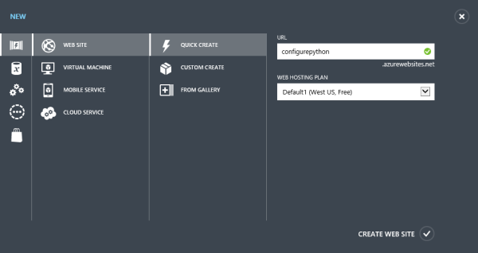

<properties urlDisplayName="Configuring Python with Azure Websites" pageTitle="Configuring Python with Azure Websites" metaKeywords="" description="This tutorial describes options for authoring and configuring a basic Web server Gateway Interface (WSGI) compliant Python application on Azure Websites." metaCanonical="" services="web-sites" documentationCenter="Python" title="Configuring Python with Azure Websites" authors="huvalo" solutions="" manager="wpickett" editor="" />

<tags ms.service="web-sites" ms.workload="web" ms.tgt_pltfrm="na" ms.devlang="python" ms.topic="article" ms.date="08/01/2014" ms.author="huvalo" />

# Configuring Python with Azure Websites #

This tutorial describes options for authoring and configuring a basic Web Server Gateway Interface (WSGI) compliant Python application on Azure Websites. Getting started with Azure Websites is easy, and your Python application will have room to scale and extend to other Azure services. The Azure Websites platform includes Python (2.7.3 or 3.4.0, your choice) and the generic wfastcgi.py FastCGI handler for Python. All you have to do is configure your website to use the Python handler. 

> [WACOM.NOTE] You can select the version of Python that you want to use in the Azure Websites portal by opening the Configure tab of your website and changing the **Python Version** setting.

For a more complex example configuring the Django framework on Azure Websites, please see the following tutorial: 
[http://www.windowsazure.com/en-us/develop/python/tutorials/web-sites-with-django](http://www.windowsazure.com/en-us/develop/python/tutorials/web-sites-with-django).  

## WSGI Support

WSGI is a Python standard described by [PEP 3333](http://www.python.org/dev/peps/pep-3333/) defining an interface between the web server and Python. It provides a standardized interface for writing various web applications and frameworks using Python.  Popular Python web frameworks today use WSGI.  Azure Websites gives you support for any such frameworks; in addition, advanced users can even author their own as long as the custom handler follows the WSGI specification guidelines.

## Website Creation

This tutorial assumes an existing Azure subscription and access to the Azure Management Portal. Detailed guidance on creating a website is available at [http://www.windowsazure.com/en-us/manage/services/web-sites/how-to-create-websites](http://www.windowsazure.com/en-us/manage/services/web-sites/how-to-create-websites).
 
In short, if you do not have an existing website you can create one from the Azure Management Portal. Select the WEBSITES feature and use the QUICK CREATE option, specifying a URL for your website.

## Git Publishing

Use the QUICK START or DASHBOARD tabs for your newly created website to configure Git publishing.  This tutorial uses Git to create, manage, and publish our Python website to Azure Websites. 

Once Git publishing is set up, a Git repository will be created and associated with your website.  The repository's URL will be displayed and can henceforth be used to push data from the local development environment to the cloud. To publish applications via Git, make sure a Git client is also installed and use the instructions provided to push your website content to Azure Websites.

## Website Content

As an example we use a basic Python application with a basic WSGI handler that illustrates the minimal amount of work needed to take advantage of the Python support in Azure Websites.  This skeleton Python application can then be used to start authoring a variety of solutions, with complexity ranging from the example below all the way to a full-fledged web framework.  

Below is the code for the basic WSGI handler. It is similar to that suggested by the [PEP 3333](http://www.python.org/dev/peps/pep-3333/) specification as a starting point for a WSGI compliant application. We saved this content in a file named ConfigurePython.py created in a ConfigurePython folder under the website root:

	def application(environ, start_response):
	    status = '200 OK'
	    response_headers = [('Content-type', 'text/plain')]
	    start_response(status, response_headers)
	    yield 'Hello from Azure Websites\n'

*application* is a Python callable, which will serve as the entry point called by a WSGI-compliant server. This callable object accepts 2 positional arguments: 

* *environ*: a dictionary with various environment variables
* *start_response*: a callable provided by the web server for transfer of HTTP status and response header

This handler will return the plain text "Hello from Azure Websites" for every request made to it.

## Configuration Options

There are 2 different options for configuring your Python application with Azure Websites.

<h3 id="option1">Option 1: Portal</h3>

1.1. Register the FastCGI handler via CONFIGURE tab in the Portal.
For this example we use the FastCGI handler for Python included with Azure Websites. To do the same use the following paths for your script processor and FastCGI handler argument:

* Python script processor path: D:\python27\python.exe
* Python FastCGI handler path: D:\python27\scripts\wfastcgi.py

1.2. Configure app settings via the same CONFIGURE tab in the Portal.
The app settings are converted to environment variables. This is a mechanism you can use for configuration values required by your Python application. For this basic example application we configured the following:

* PYTHONPATH informs Python about the directory to search for modules. Azure Websites provides D:\home\site\wwwroot as syntactic sugar pointing to the root of your website. 
* WSGI\_HANDLER records a module or package name and the attribute to be used.

<h3 id="option2">Option 2: web.config</h3>
The configuration alternative is to use a web.config file under the website root for actions described below. Using the web.config option provides better portability potential for a web application. There are 2 approaches available to route requests to the web application: either set a handler that handles the * path, which instructs IIS to route every incoming request through Python; or set a specific path that Python will handle and subsequently employ URL Rewriting to redirect various URLs to our selected path.  In fact, we recommend the latter approach - using an empty handler file under the website root to serve as the request target (handler.fcgi in our example) - for better performance. In the former scenario, all requests, including those for static content (e.g. image files and style sheets), will have to go through Python, subverting the optimizations the web server provides for accessing static files.  Employing the latter approach allows serving static content efficiently and invoking Python only when necessary.

2.1. Specify the PYTHONPATH variable. 
> This will inform Python where to look for the application code. D:\home\site\wwwroot is also used here as the absolute path to the website.

2.2. Set the WSGI\_HANDLER variable.
> Azure Websites uses this value to direct Python to call our WSGI handler.  The value of this variable is a Python expression which should, when executed, return a callable which represents a WSGI handler. 

2.3. Add a handler for Python.
> This will inform Azure Websites that Python should handle requests made to the path handler.fcgi. It is important for the handler syntax to look exactly like what we have inside the &lt;handlers&gt; tag in the example below unless you bring your own FastCGI handler or Python development stack.

2.4. Rewrite URLs to handler.fcgi.
> Requesting handler.fcgi all the time may not be the best idea. To select the path of files to be handled by the Python handler we used URL Rewriting so all the URLs get handled by our Python handler.

	<configuration>
  		<appSettings>
    		<add key="pythonpath" value="D:\home\site\wwwroot\ConfigurePython" />
    		<add key="WSGI_HANDLER" value="ConfigurePython.application" />
  		</appSettings>
  		<system.webServer>
    		<handlers>
      			<add name="PythonHandler" 
           		verb="*" path="handler.fcgi" 
           		modules="FastCgiModule" 
           		scriptProcessor="D:\Python27\Python.exe|D:\Python27\Scripts\wfastcgi.py" 
           		resourceType="Either" />
   			</handlers>
			<rewrite>
	    		<rules>
					<rule name="Configure Python" stopProcessing="true">
		    			<match url="(.*)" ignoreCase="false" />
		    			<conditions>
							<add input="{REQUEST_FILENAME}" matchType="IsFile" negate="true" />
		    			</conditions>
		    			<action type="Rewrite" url="handler.fcgi/{R:1}" appendQueryString="true" />
					</rule>
	    		</rules>
			</rewrite>
  		</system.webServer>
	</configuration> 

The folder structure for the example under website root is the following (casing of Python folder and file names is significant and reflected in web.config):

* ConfigurePython\ConfigurePython.py
* web.config
* handler.fcgi

Because we are rewriting all URLs to handler.fcgi and handing that path via FastCGI to Python, we need to create a placeholder file with the same name so that IIS will not return an HTTP 404 error. This is due to the internal behavior of the IIS FastCGI module, which enforces that the file being requested must exist before it is passed onto the specified script processor application.

Browse to your website to test correct configuration. For this example the "Hello from Azure Websites" message is visible on access.

