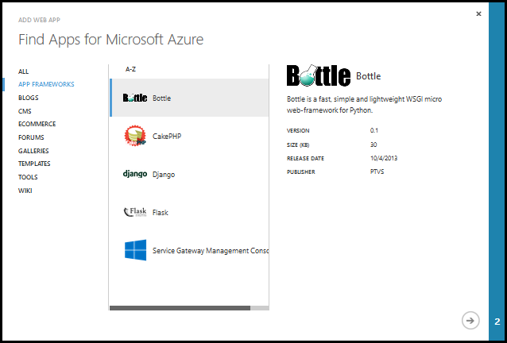
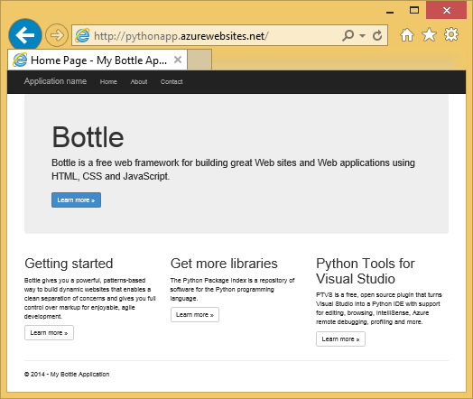
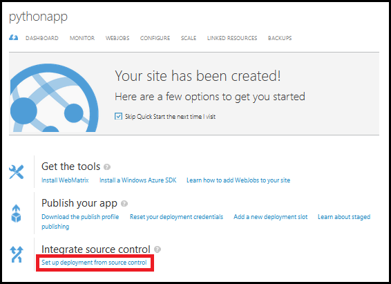

<properties pageTitle="Python Websites with Bottle - Azure tutorial" description="A tutorial that introduces you to running a Python website on Azure." services="web-sites" documentationCenter="python" authors="huguesv" manager="" editor=""/>

<tags ms.service="web-sites" ms.workload="web" ms.tgt_pltfrm="na" ms.devlang="python" ms.topic="article" ms.date="12/17/2014" ms.author="huvalo"/>

# Creating Websites with Bottle

This tutorial describes how to get started running Python on Azure Websites.  Azure Websites provide limited free hosting and rapid deployment, and you can use Python!  As your app grows, you can switch to paid hosting, and you can also integrate with all of the other Azure services.

You will create an application using the Bottle web framework (see alternate versions of this tutorial for [Django](../web-sites-python-create-deploy-django-app) and [Flask](../web-sites-python-create-deploy-flask-app)).  You will create the website from the Azure gallery, set up Git deployment, and clone the repository locally.  Then you will run the application locally, make changes, commit and push them to Azure.  The tutorial shows how to do this from Windows or Mac/Linux.

[AZURE.INCLUDE [create-account-and-websites-note](../includes/create-account-and-websites-note.md)]

+ [Prerequisites](#prerequisites)
+ [Website Creation on Portal](#website-creation-on-portal)
+ [Application Overview](#application-overview)
+ Website Development
  + [Windows - Python Tools for Visual Studio](#website-development-windows-ptvs)
  + [Windows - Command Line](#website-development-windows-command-line)
  + [Mac/Linux - Command Line](#website-development-mac-linux-command-line)
+ [Troubleshooting - Deployment](#troubleshooting-deployment)
+ [Troubleshooting - Package Installation](#troubleshooting-package-installation)
+ [Troubleshooting - Virtual Environment](#troubleshooting-virtual-environment)
+ [Next steps](#next-steps)

<h2>Prerequisites</h2>

- Windows, Mac or Linux
- Python 2.7 or 3.4
- setuptools, pip, virtualenv (Python 2.7 only)
- Git
- Python Tools for Visual Studio (optional)

**Note**: TFS publishing is currently not supported for Python projects.

### Windows

If you don't already have Python 2.7 or 3.4 installed (32-bit), we recommend installing [Azure SDK for Python 2.7](http://go.microsoft.com/fwlink/?linkid=254281&clcid=0x409) or [Azure SDK for Python 3.4](http://go.microsoft.com/fwlink/?LinkID=516990&clcid=0x409) using Web Platform Installer.  This installs the 32-bit version of Python, setuptools, pip, virtualenv, etc (32-bit Python is what's installed on the Azure host machines).  Alternatively, you can get Python from [python.org](http://www.python.org/).

For Git, we recommend [Git for Windows](http://msysgit.github.io/) or [GitHub for Windows](https://windows.github.com/).  If you use Visual Studio, you can use the integrated Git support.

We also recommend installing [Python Tools for Visual Studio](http://pytools.codeplex.com).  This is optional, but if you have [Visual Studio](http://www.visualstudio.com/), including the free Visual Studio Express 2013 for Web, then this will give you a great Python IDE.

### Mac/Linux

You should have Python and Git already installed, but make sure you have either Python 2.7 or 3.4.

<h2>Website Creation on Portal</h2>

The first step in creating your app is to create the website via the Azure Management Portal.  To do this, you will need to login to the portal and click the **NEW** button in the bottom left corner. A window will appear. Click **COMPUTE**, **WEB SITE**, then **FROM GALLERY**.

A window will appear, listing apps available in the gallery. Click the **APP FRAMEWORKS** category on the left, and select **Bottle**.

In the next page, enter a name and a region for your site, and click the complete button.

The site will be quickly set up. You can click the **BROWSE** button from the bottom toolbar, and you'll see your new Bottle application running on Azure.

 
Next, you will add support for publishing via Git.  This can be done by choosing **Set up deployment from source control**.

From the **Set up deployment** dialog, scroll down and select the **Local Git repository** option. Click the right arrow to continue.

After setting up Git publishing, you will momentarily see a page informing you the repository is being created. When it is ready, you will see instructions on how to connect.  

We'll follow these instructions in the next sections.

<h2>Application Overview</h2>

### Git repository contents

Here's an overview of the files you'll find in the initial Git repository, which we'll clone in the next section.

    \routes.py
    \static\content\
    \static\fonts\
    \static\scripts\
    \views\about.tpl
    \views\contact.tpl
    \views\index.tpl
    \views\layout.tpl

Main sources for the application.  Consists of 3 pages (index, about, contact) with a master layout.  Static content and scripts include bootstrap, jquery, modernizr and respond.

    \app.py

Local development server support. Use this to run the application locally.

    \BottleWebProject.pyproj
    \BottleWebProject.sln

Project files for use with [Python Tools for Visual Studio](http://pytools.codeplex.com).

    \ptvs_virtualenv_proxy.py

IIS proxy for virtual environments and PTVS remote debugging support.

    \requirements.txt

External packages needed by this application. The deployment script will pip install the packages listed in this file.
 
    \web.2.7.config
    \web.3.4.config

IIS configuration files.  The deployment script will use the appropriate web.x.y.config and copy it as web.config.

### Optional files - Customizing deployment

[AZURE.INCLUDE [web-sites-python-customizing-deployment](../includes/web-sites-python-customizing-deployment.md)]

### Optional files - Python runtime

[AZURE.INCLUDE [web-sites-python-customizing-runtime](../includes/web-sites-python-customizing-runtime.md)]

### Additional files on server

Some files exist on the server but are not added to the git repository.  These are created by the deployment script.

    \web.config

IIS configuration file.  Created from web.x.y.config on every deployment.

    \env\

Python virtual environment.  Created during deployment if a compatible virtual environment doesn't already exist on the site.  Packages listed in requirements.txt are pip installed, but pip will skip installation if the packages are already installed.

The next 3 sections describe how to proceed with the website development under 3 different environments:

- Windows, with Python Tools for Visual Studio
- Windows, with command line
- Mac/Linux, with command line

<h2>Website Development - Windows - Python Tools for Visual Studio</h2>

### Clone the repository

First, clone the repository using the url provided on the Azure portal.

Open the solution file (.sln) that is included in the root of the repository.

### Create virtual environment

Now we'll create a virtual environment for local development.  Right-click on **Python Environments** select **Add Virtual Environment...**.

- Make sure the name of the environment is `env`.

- Select the base interpreter.  Make sure to use the same version of Python that is selected for your site (in runtime.txt or the site configuration page).

- Make sure the option to download and install packages is checked.

Click **Create**.  This will create the virtual environment, and install dependencies listed in requirements.txt.

### Run using development server

Press F5 to start debugging, and your web browser will open automatically to the page running locally.

You can set breakpoints in the sources, use the watch windows, etc.  See the [PTVS documentation](http://pytools.codeplex.com/documentation) for more information on the various features.

### Make changes

Now you can experiment by making changes to the application sources and/or templates.

After you've tested your changes, commit them to the Git repository:

### Install more packages

Your application may have dependencies beyond Python and Bottle.

You can install additional packages using pip.  To install a package, right-click on the virtual environment and select **Install Python Package**.

For example, to install the Azure SDK for Python, which gives you access to Azure storage, service bus and other Azure services, enter `azure`:

Right-click on the virtual environment and select **Generate requirements.txt** to update requirements.txt.

Then, commit the changes to requirements.txt to the Git repository.

### Deploy to Azure

To trigger a deployment, click on **Sync** or **Push**.  Sync does both a push and a pull.

The first deployment will take some time, as it will create a virtual environment, install packages, etc.

Visual Studio doesn't show the progress of the deployment.  If you'd like to review the output, see the section on [Troubleshooting - Deployment](#troubleshooting-deployment).

Browse to the Azure URL to view your changes.

<h2>Website Development - Windows - Command Line</h2>

### Clone the repository

First, clone the repository using the url provided on the Azure portal, and add the Azure repository as a remote.

    git clone <repo-url>
    cd <repo-folder>
    git remote add azure <repo-url> 

### Create virtual environment

We'll create a new virtual environment for development purposes (do not add it to the repository).  Virtual environments in Python are not relocatable, so every developer working on the application will create their own locally.

Make sure to use the same version of Python that is selected for your site (in runtime.txt or the site configuration page)

For Python 2.7:

    c:\python27\python.exe -m virtualenv env

For Python 3.4:

    c:\python34\python.exe -m venv env

Install any external packages required by your application. You can use the requirements.txt file at the root of the repository to install the packages in your virtual environment:

    env\scripts\pip install -r requirements.txt

### Run using development server

You can launch the application under a development server with the following command:

    env\scripts\python app.py

The console will display the URL and port the server listens to:

Then, open your web browser to that URL.

### Make changes

Now you can experiment by making changes to the application sources and/or templates.

After you've tested your changes, commit them to the Git repository:

    git add <modified-file>
    git commit -m "<commit-comment>"

### Install more packages

Your application may have dependencies beyond Python and Bottle.

You can install additional packages using pip.  For example, to install the Azure SDK for Python, which gives you access to Azure storage, service bus and other Azure services, type:

    env\scripts\pip install azure

Make sure to update requirements.txt:

    env\scripts\pip freeze > requirements.txt

Commit the changes:

    git add requirements.txt
    git commit -m "Added azure package"

### Deploy to Azure

To trigger a deployment, push the changes to Azure:

    git push azure master

You will see the output of the deployment script, including virtual environment creation, installation of packages, creation of web.config.

Browse to the Azure URL to view your changes.

<h2>Website Development - Mac/Linux - Command Line</h2>

### Clone the repository

First, clone the repository using the url provided on the Azure portal, and add the Azure repository as a remote.

    git clone <repo-url>
    cd <repo-folder>
    git remote add azure <repo-url> 

### Create virtual environment

We'll create a new virtual environment for development purposes (do not add it to the repository).  Virtual environments in Python are not relocatable, so every developer working on the application will create their own locally.

Make sure to use the same version of Python that is selected for your site (in runtime.txt or the site configuration page).

For Python 2.7:

    python -m virtualenv env

For Python 3.4:

    python -m venv env

Install any external packages required by your application. You can use the requirements.txt file at the root of the repository to install the packages in your virtual environment:

    env/bin/pip install -r requirements.txt

### Run using development server

You can launch the application under a development server with the following command:

    env/bin/python app.py

The console will display the URL and port the server listens to:

Then, open your web browser to that URL.

### Make changes

Now you can experiment by making changes to the application sources and/or templates.

After you've tested your changes, commit them to the Git repository:

    git add <modified-file>
    git commit -m "<commit-comment>"

### Install more packages

Your application may have dependencies beyond Python and Bottle.

You can install additional packages using pip.  For example, to install the Azure SDK for Python, which gives you access to Azure storage, service bus and other Azure services, type:

    env/bin/pip install azure

Make sure to update requirements.txt:

    env/bin/pip freeze > requirements.txt

Commit the changes:

    git add requirements.txt
    git commit -m "Added azure package"

### Deploy to Azure

To trigger a deployment, push the changes to Azure:

    git push azure master

You will see the output of the deployment script, including virtual environment creation, installation of packages, creation of web.config.

Browse to the Azure URL to view your changes.

<h2>Troubleshooting - Deployment</h2>

[AZURE.INCLUDE [web-sites-python-troubleshooting-deployment](../includes/web-sites-python-troubleshooting-deployment.md)]

<h2>Troubleshooting - Package Installation</h2>

[AZURE.INCLUDE [web-sites-python-troubleshooting-package-installation](../includes/web-sites-python-troubleshooting-package-installation.md)]

<h2>Troubleshooting - Virtual Environment</h2>

[AZURE.INCLUDE [web-sites-python-troubleshooting-virtual-environment](../includes/web-sites-python-troubleshooting-virtual-environment.md)]

<h2>Next Steps</h2>

Follow these links to learn more about Bottle and Python Tools for Visual Studio: 
 
- [Bottle Documentation][]
- [Python Tools for Visual Studio Documentation][] 

For information on using Azure Table Storage and MongoDB:

- [Bottle and MongoDB on Azure with Python Tools 2.1 for Visual Studio][]
- [Bottle and Azure Table Storage on Azure with Python Tools 2.1 for Visual Studio][]

<!--Link references-->
[Bottle and MongoDB on Azure with Python Tools 2.1 for Visual Studio]: ../web-sites-python-ptvs-bottle-table-storage
[Bottle and Azure Table Storage on Azure with Python Tools 2.1 for Visual Studio]: ../web-sites-python-ptvs-bottle-mongodb

<!--External Link references-->
[Python Tools for Visual Studio Documentation]: http://pytools.codeplex.com/documentation 
[Bottle Documentation]: http://bottlepy.org/docs/dev/index.html
