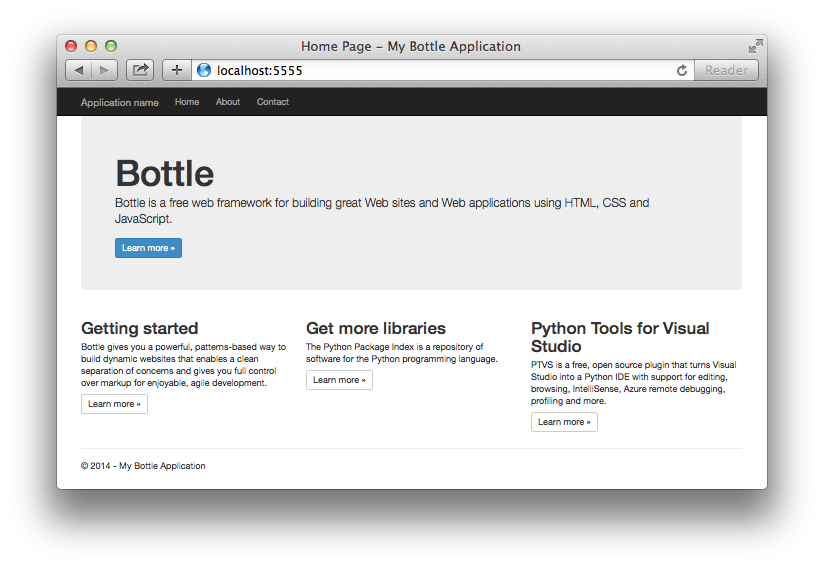

<properties 
	pageTitle="Python web apps with Bottle in Azure" 
	description="A tutorial that introduces you to running a Python web app in Azure App Service Web Apps." 
	services="app-service\web" 
	documentationCenter="python" 
	tags="python"
	authors="huguesv" 
	manager="wpickett" 
	editor=""/>

<tags 
	ms.service="app-service-web" 
	ms.workload="web" 
	ms.tgt_pltfrm="na" 
	ms.devlang="python" 
	ms.topic="article" 
	ms.date="04/15/2015" 
	ms.author="huguesv"/>

# Creating web apps with Bottle in Azure

This tutorial describes how to get started running Python in Azure App Service Web Apps. Web Apps provides limited free hosting and rapid deployment, and you can use Python! As your app grows, you can switch to paid hosting, and you can also integrate with all of the other Azure services.

You will create a web app using the Bottle web framework (see alternate versions of this tutorial for [Django](web-sites-python-create-deploy-django-app.md) and [Flask](web-sites-python-create-deploy-flask-app.md)). You will create the web app from the Azure Marketplace, set up Git deployment, and clone the repository locally. Then you will run the web app locally, make changes, commit and push them to [Azure App Service Web Apps](http://go.microsoft.com/fwlink/?LinkId=529714). The tutorial shows how to do this from Windows or Mac/Linux.

[AZURE.INCLUDE [create-account-and-websites-note](../includes/create-account-and-websites-note.md)]

>[AZURE.NOTE] If you want to get started with Azure App Service before signing up for an Azure account, go to [Try App Service](http://go.microsoft.com/fwlink/?LinkId=523751), where you can immediately create a short-lived starter web app in App Service. No credit cards required; no commitments.

## Prerequisites

- Windows, Mac or Linux
- Python 2.7 or 3.4
- setuptools, pip, virtualenv (Python 2.7 only)
- Git
- [Python Tools 2.1 for Visual Studio] (optional)

**Note**: TFS publishing is currently not supported for Python projects.

### Windows

If you don't already have Python 2.7 or 3.4 installed (32-bit), we recommend installing [Azure SDK for Python 2.7] or [Azure SDK for Python 3.4] using Web Platform Installer. This installs the 32-bit version of Python, setuptools, pip, virtualenv, etc (32-bit Python is what's installed on the Azure host machines). Alternatively, you can get Python from [python.org].

For Git, we recommend [Git for Windows] or [GitHub for Windows]. If you use Visual Studio, you can use the integrated Git support.

We also recommend installing [Python Tools 2.1 for Visual Studio]. This is optional, but if you have [Visual Studio], including the free Visual Studio Community 2013 or Visual Studio Express 2013 for Web, then this will give you a great Python IDE.

### Mac/Linux

You should have Python and Git already installed, but make sure you have either Python 2.7 or 3.4.

## Web app creation on the Azure Preview Portal

The first step in creating your app is to create the web app via the [Azure Preview Portal](https://portal.azure.com).  

1. Log into the Azure Preview Portal and click the **NEW** button in the bottom left corner. 
2. Click **Web + Mobile** > **Azure Marketplace** > **Web Apps**.
3. In the search box, type "python".
4. In the search results, select **Bottle**, then click **Create**.
5. Configure the new Bottle app, such as creating a new App Service plan and a new resource group for it. Then, click **Create**.
6. Configure Git publishing for your newly created web app by following the instructions at [Continuous deployment using GIT in Azure App Service](web-sites-publish-source-control.md).
 
## Application Overview

### Git repository contents

Here's an overview of the files you'll find in the initial Git repository, which we'll clone in the next section.

    \routes.py
    \static\content\
    \static\fonts\
    \static\scripts\
    \views\about.tpl
    \views\contact.tpl
    \views\index.tpl
    \views\layout.tpl

Main sources for the application. Consists of 3 pages (index, about, contact) with a master layout.  Static content and scripts include bootstrap, jquery, modernizr and respond.

    \app.py

Local development server support. Use this to run the application locally.

    \BottleWebProject.pyproj
    \BottleWebProject.sln

Project files for use with [Python Tools for Visual Studio].

    \ptvs_virtualenv_proxy.py

IIS proxy for virtual environments and PTVS remote debugging support.

    \requirements.txt

External packages needed by this application. The deployment script will pip install the packages listed in this file.
 
    \web.2.7.config
    \web.3.4.config

IIS configuration files. The deployment script will use the appropriate web.x.y.config and copy it as web.config.

### Optional files - Customizing deployment

[AZURE.INCLUDE [web-sites-python-customizing-deployment](../includes/web-sites-python-customizing-deployment.md)]

### Optional files - Python runtime

[AZURE.INCLUDE [web-sites-python-customizing-runtime](../includes/web-sites-python-customizing-runtime.md)]

### Additional files on server

Some files exist on the server but are not added to the git repository. These are created by the deployment script.

    \web.config

IIS configuration file. Created from web.x.y.config on every deployment.

    \env\

Python virtual environment. Created during deployment if a compatible virtual environment doesn't already exist on the web app.  Packages listed in requirements.txt are pip installed, but pip will skip installation if the packages are already installed.

The next 3 sections describe how to proceed with the web app development under 3 different environments:

- Windows, with Python Tools for Visual Studio
- Windows, with command line
- Mac/Linux, with command line

## Web App development - Windows - Python Tools for Visual Studio

### Clone the repository

First, clone the repository using the url provided on the Azure Preview Portal. For more information, see [Continuous deployment using GIT in Azure App Service](web-sites-publish-source-control.md).

Open the solution file (.sln) that is included in the root of the repository.

### Create virtual environment

Now we'll create a virtual environment for local development. Right-click on **Python Environments** select **Add Virtual Environment...**.

- Make sure the name of the environment is `env`.

- Select the base interpreter. Make sure to use the same version of Python that is selected for your web app (in runtime.txt or the **Application Settings** blade of your web app in the Azure Preview Portal).

- Make sure the option to download and install packages is checked.

Click **Create**. This will create the virtual environment, and install dependencies listed in requirements.txt.

### Run using development server

Press F5 to start debugging, and your web browser will open automatically to the page running locally.

You can set breakpoints in the sources, use the watch windows, etc. See the [PTVS documentation][] for more information on the various features.

### Make changes

Now you can experiment by making changes to the application sources and/or templates.

After you've tested your changes, commit them to the Git repository:

### Install more packages

Your application may have dependencies beyond Python and Bottle.

You can install additional packages using pip. To install a package, right-click on the virtual environment and select **Install Python Package**.

For example, to install the Azure SDK for Python, which gives you access to Azure storage, service bus and other Azure services, enter `azure`:

Right-click on the virtual environment and select **Generate requirements.txt** to update requirements.txt.

Then, commit the changes to requirements.txt to the Git repository.

### Deploy to Azure

To trigger a deployment, click on **Sync** or **Push**. Sync does both a push and a pull.

The first deployment will take some time, as it will create a virtual environment, install packages, etc.

Visual Studio doesn't show the progress of the deployment. If you'd like to review the output, see the section on [Troubleshooting - Deployment](#troubleshooting-deployment).

Browse to the Azure URL to view your changes.

## Web app development - Windows - Command Line

### Clone the repository

First, clone the repository using the URL provided on the Azure Preview Portal, and add the Azure repository as a remote. For more information, see [Continuous deployment using GIT in Azure App Service](web-sites-publish-source-control.md).

    git clone <repo-url>
    cd <repo-folder>
    git remote add azure <repo-url> 

### Create virtual environment

We'll create a new virtual environment for development purposes (do not add it to the repository). Virtual environments in Python are not relocatable, so every developer working on the application will create their own locally.

Make sure to use the same version of Python that is selected for your web app (in runtime.txt or the Application Settings blade for your web app in the Azure Preview Portal)

For Python 2.7:

    c:\python27\python.exe -m virtualenv env

For Python 3.4:

    c:\python34\python.exe -m venv env

Install any external packages required by your application. You can use the requirements.txt file at the root of the repository to install the packages in your virtual environment:

    env\scripts\pip install -r requirements.txt

### Run using development server

You can launch the application under a development server with the following command:

    env\scripts\python app.py

The console will display the URL and port the server listens to:

Then, open your web browser to that URL.

### Make changes

Now you can experiment by making changes to the application sources and/or templates.

After you've tested your changes, commit them to the Git repository:

    git add <modified-file>
    git commit -m "<commit-comment>"

### Install more packages

Your application may have dependencies beyond Python and Bottle.

You can install additional packages using pip. For example, to install the Azure SDK for Python, which gives you access to Azure storage, service bus and other Azure services, type:

    env\scripts\pip install azure

Make sure to update requirements.txt:

    env\scripts\pip freeze > requirements.txt

Commit the changes:

    git add requirements.txt
    git commit -m "Added azure package"

### Deploy to Azure

To trigger a deployment, push the changes to Azure:

    git push azure master

You will see the output of the deployment script, including virtual environment creation, installation of packages, creation of web.config.

Browse to the Azure URL to view your changes.

## Web app development - Mac/Linux - command line

### Clone the repository

First, clone the repository using the URL provided on the Azure Preview Portal, and add the Azure repository as a remote. For more information, see [Continuous deployment using GIT in Azure App Service](web-sites-publish-source-control.md).

    git clone <repo-url>
    cd <repo-folder>
    git remote add azure <repo-url> 

### Create virtual environment

We'll create a new virtual environment for development purposes (do not add it to the repository). Virtual environments in Python are not relocatable, so every developer working on the application will create their own locally.

Make sure to use the same version of Python that is selected for your web app (in runtime.txt or the Application Settings blade of your web app in the Azure Preview Portal).

For Python 2.7:

    python -m virtualenv env

For Python 3.4:

    python -m venv env

Install any external packages required by your application. You can use the requirements.txt file at the root of the repository to install the packages in your virtual environment:

    env/bin/pip install -r requirements.txt

### Run using development server

You can launch the application under a development server with the following command:

    env/bin/python app.py

The console will display the URL and port the server listens to:

Then, open your web browser to that URL.

### Make changes

Now you can experiment by making changes to the application sources and/or templates.

After you've tested your changes, commit them to the Git repository:

    git add <modified-file>
    git commit -m "<commit-comment>"

### Install more packages

Your application may have dependencies beyond Python and Bottle.

You can install additional packages using pip. For example, to install the Azure SDK for Python, which gives you access to Azure storage, service bus and other Azure services, type:

    env/bin/pip install azure

Make sure to update requirements.txt:

    env/bin/pip freeze > requirements.txt

Commit the changes:

    git add requirements.txt
    git commit -m "Added azure package"

### Deploy to Azure

To trigger a deployment, push the changes to Azure:

    git push azure master

You will see the output of the deployment script, including virtual environment creation, installation of packages, creation of web.config.

Browse to the Azure URL to view your changes.

## Troubleshooting - Package Installation

[AZURE.INCLUDE [web-sites-python-troubleshooting-package-installation](../includes/web-sites-python-troubleshooting-package-installation.md)]

## Troubleshooting - Virtual Environment

[AZURE.INCLUDE [web-sites-python-troubleshooting-virtual-environment](../includes/web-sites-python-troubleshooting-virtual-environment.md)]

## Next Steps

Follow these links to learn more about Bottle and Python Tools for Visual Studio: 
 
- [Bottle Documentation]
- [Python Tools for Visual Studio Documentation]

For information on using Azure Table Storage and MongoDB:

- [Bottle and MongoDB on Azure with Python Tools 2.1 for Visual Studio]
- [Bottle and Azure Table Storage on Azure with Python Tools 2.1 for Visual Studio]

## What's changed
* For a guide to the change from Websites to App Service see: [Azure App Service and Its Impact on Existing Azure Services](http://go.microsoft.com/fwlink/?LinkId=529714)
* For a guide to the change of the old portal to the new portal see: [Reference for navigating the preview portal](http://go.microsoft.com/fwlink/?LinkId=529715)

<!--Link references-->
[Bottle and MongoDB on Azure with Python Tools 2.1 for Visual Studio]: web-sites-python-ptvs-bottle-table-storage.md
[Bottle and Azure Table Storage on Azure with Python Tools 2.1 for Visual Studio]: web-sites-python-ptvs-bottle-mongodb.md

<!--External Link references-->
[Azure SDK for Python 2.7]: http://go.microsoft.com/fwlink/?linkid=254281
[Azure SDK for Python 3.4]: http://go.microsoft.com/fwlink/?linkid=516990
[python.org]: http://www.python.org/
[Git for Windows]: http://msysgit.github.io/
[GitHub for Windows]: https://windows.github.com/
[Python Tools for Visual Studio]: http://aka.ms/ptvs
[Python Tools 2.1 for Visual Studio]: http://go.microsoft.com/fwlink/?LinkId=517189
[Visual Studio]: http://www.visualstudio.com/
[PTVS documentation]: http://pytools.codeplex.com/documentation
[Python Tools for Visual Studio Documentation]: http://pytools.codeplex.com/documentation 
[Bottle Documentation]: http://bottlepy.org/docs/dev/index.html
