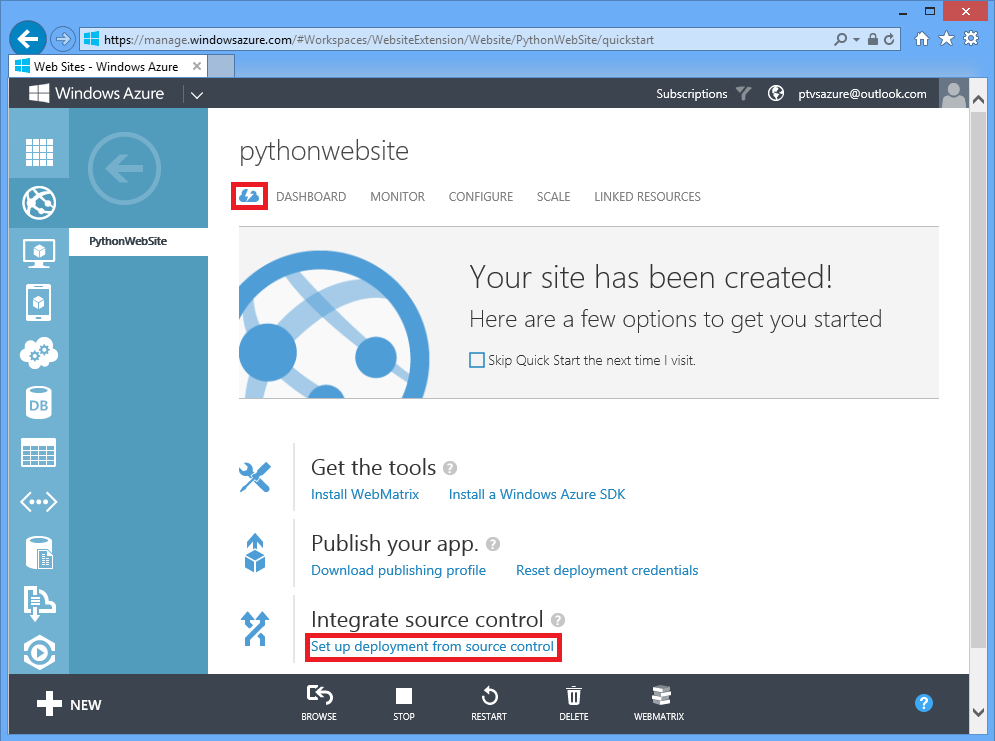
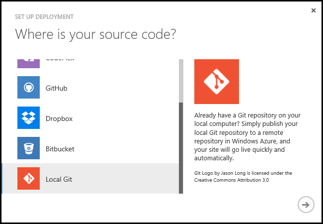
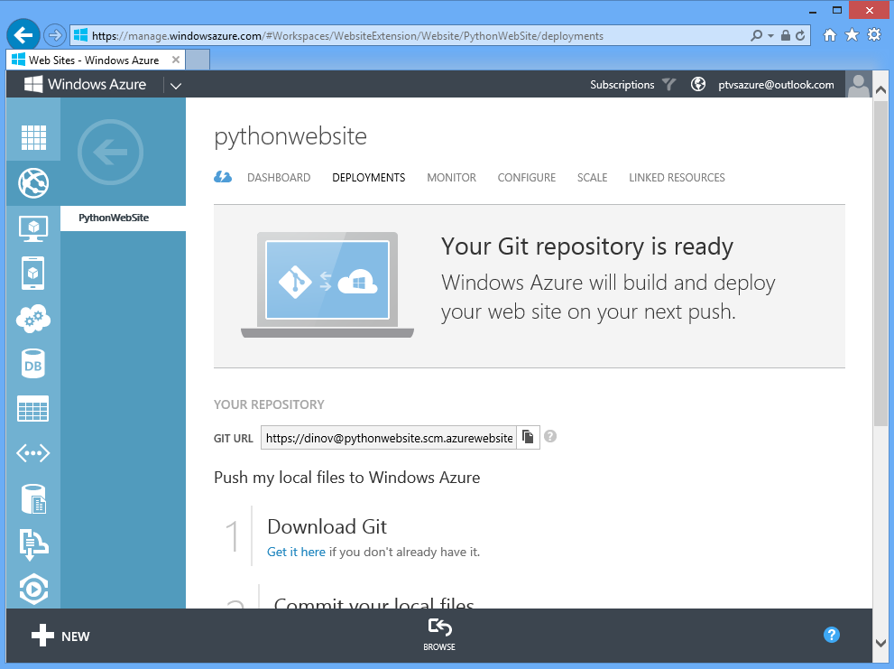
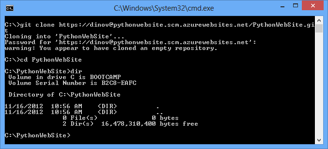
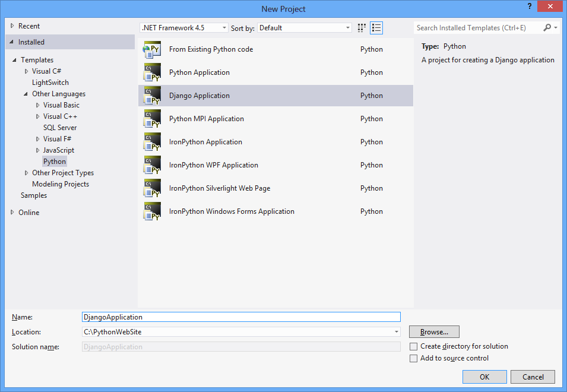
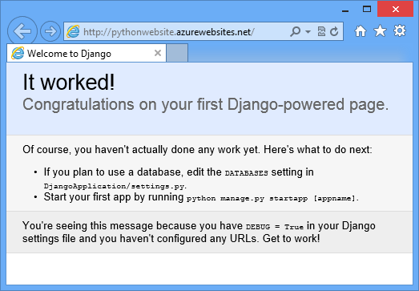

<properties urlDisplayName="Websites with Django" pageTitle="Python Websites with Django - Azure tutorial" metaKeywords="Azure django, django website" description="A tutorial that introduces you to running a Python website on Azure." metaCanonical="" services="web-sites" documentationCenter="Python" title="Creating Websites with Django" authors="huvalo" solutions="" manager="wpickett" editor="" />

<tags ms.service="web-sites" ms.workload="web" ms.tgt_pltfrm="na" ms.devlang="python" ms.topic="article" ms.date="08/01/2014" ms.author="huvalo" />

# Creating Websites with Django

This tutorial describes how to get started running Python on Azure Websites.  Azure Websites provide limited free hosting and rapid deployment, and now, you can use Python!  As your app grows, you can switch to paid hosting, and you can also integrate with all of the other Azure services.  

This tutorial shows you how to deploy an application built using the Django web framework.  The tutorial walks through the steps of deploying your application and any required libraries, including Django.  You will put this all into a Git repository which makes it quick and simple to push updates to your website.  And finally, you will configure the newly created site via Azure so that it runs your Python application.  

[WACOM.INCLUDE [create-account-and-websites-note](../includes/create-account-and-websites-note.md)]

This tutorial uses Python 2.7 and Django 1.4.  You can either get these on your own, or you can quickly and easily install these by using the Windows Installer link on [http://www.windowsazure.com/en-us/develop/python/](http://www.windowsazure.com/en-us/develop/python/).  

**Note**: Azure websites now come with Python (2.7.3 or 3.4.0, your choice) and wfastcgi handler pre-installed.  However, web frameworks such as Django are not included.  You can still use a different Python interpreter if you prefer.  You just need to include it in the Git repository and configure the website to use that interpreter instead of the Python 2.7 interpreter already installed.

> [WACOM.NOTE] You can now select the version of Python that you want to use in the Azure Websites portal by opening the Configure tab of your website and changing the **Python Version** setting.

You will also need to install a deployment option for pushing the site to Azure. There are various deployment tools available, but this tutorial uses Git. We recommend [msysgit](http://code.google.com/p/msysgit/). 

**Note**: TFS publishing is currently not supported for Python projects.

Once you have Python, Django, and Git installed, you will have everything you need to get started.

## Website Creation on Portal

The first step in creating your app is to create the website via the Azure Management Portal.  To do this, you will need to login to the portal and click the NEW button in the bottom left corner. A window will appear. Click **Quick Create**, enter a URL, and select **Create Website**.

The site will be quickly set up.  Next, you will add support for publishing via Git.  This can be done by choosing **Set up deployment from source control**.

From the **Set up deployment** dialog, scroll down and select the **Local Git** option. Click the right arrow to continue.

After setting up Git publishing, you will momentarily see a page informing you the repo is being created. When the repo is ready, you will be taken to the deployments tab. The deployments tab includes instructions on how to connect.  

## Website Development

Now that you have created your Git repository in Azure, you will start filling it in with the website from your local machine.  The first step is to clone the existing empty site using the url provided:

From here, you are ready to setup the enlistment with the website.  You will need to do a few things:

1.  Include the Django library and other libraries that you will be using to run the website.
2.  Include the Django application code.

First, include the Django library.  To do this, create a new directory called site-packages, and copy your installed version of Django there by using these commands:

	mkdir site-packages
	cd site-packages
	xcopy /s C:\Python27\lib\site-packages\* .

These commands copy all the libraries located in site-packages, including Django.  If there are libraries that are not used by your website, feel free to remove them.

 
Next, create your initial Django application.  You can do this just as you would create any other Django application from the command line, or you can use [Python Tools for Visual Studio](http://pytools.codeplex.com/) to create the project.  Both options are shown here.

**Option 1:** 
To create the new project from the command line, run the following command. The command creates the Django application in the DjangoApplication folder:

	 C:\Python27\python.exe -m django.bin.django-admin startproject DjangoApplication

**Option 2:**  
You can also create your new site using Python Tools for Visual Studio.  Start Visual Studio with Python Tools for Visual Studio installed and select **File**->**New Project**.  Under **Other Languages**, drill into the Python projects and select **Django Application**.  Enter **DjangoApplication** for the name of the project, and make sure that **Create directory for solution** is unchecked to get the exact same directory structure as when you create a Django application from the command line. This option will set you up with a Visual Studio solution and project file that give you a great local development experience that includes template debugging and intellisense.

Now, you just need to add all of the files you have just added and push the site to Git.  To do this, run these commands:

	git add DjangoApplication site-packages
	git commit -m "Initial site"
	git remote add azure https://dinov@pythonwebsite.scm.azurewebsites.net/PythonWebSite.git
	git push azure master

The first command will add your untracked files to be tracked.  The second command will commit the files you just added into the repository.  The third command adds a remote with the name *azure* for your repository.  The final command takes the changes and pushes them to the remote repository. This last command will also start the deployment.  After doing this, you should see a result similar to this:

After doing the push, you will see the Azure portal refresh and display the active deployment:

## Website Configuration

Now you need to configure the website so that it will know about your Django project and use the wfastcgi handler.  To do this, you can click on the Configure tab along the top of the screen, and then scroll down to the bottom half of the page which contains the **app settings** and **handler mappings** sections.  

All of the settings that are set here will turn into environment variables during the actual request.  This means that you can use this to configure the DJANGO\_SETTINGS\_MODULE environment variable as well as PYTHONPATH and WSGI\_HANDLER.  If your application has other configuration values, you could assign these here and pick them up out of the environment.  Sometimes you will want to set something which is a path to a file in your website. For example, you will want to do this for PYTHONPATH.  When running as an Azure website, your website will live in **D:\home\site\wwwroot\**, so you can use that in any location where you need a full path to a file on disk.

To set up a Django application, you need to create three environment variables.  The first is DJANGO\_SETTINGS\_MODULE, which provides the module name of the Django application which will be used for configuration.  The second is the PYTHONPATH environment variable that specifies the package that the settings module lives in.  The third is WSGI\_HANDLER.  This variable is a module/package name, followed by the attribute in the module to be used (for example, mypackage.mymodule.handler).  Add parentheses to indicate that the attribute should be called.  So for these variables, set them up as:
                
	DJANGO_SETTINGS_MODULE    DjangoApplication.settings
	PYTHONPATH                D:\home\site\wwwroot\DjangoApplication;D:\home\site\wwwroot\site-packages
	WSGI_HANDLER              django.core.handlers.wsgi.WSGIHandler()

Now you need to configure your handler mapping.  For this, register the handler for all extensions, using the path to the Python interpreter and the path to the wfastcgi.py script:

	EXTENSION                 *
	SCRIPT PROCESSOR PATH     D:\python27\python.exe
	ADDITIONAL ARGUMENTS      D:\python27\scripts\wfastcgi.py

At this point, you can click the **Save** button at the bottom.

Finally, go back to the Dashboard. Go down to the **SITE URL** on the left hand side. Click the link and open your new Django site, which will look like this:

## Next Steps

From here, you can continue the development of your Django application by using the tools you are already using. If you are using [Python Tools for Visual Studio](http://pytools.codeplex.com/) for development, you will likely want to install [VisualGit](http://code.google.com/p/visualgit/) to get source control integration from within Visual Studio.  

Your app may have dependencies beyond Python and Django.  If you installed Python by using the installer at [http://www.windowsazure.com/en-us/develop/python/](http://www.windowsazure.com/en-us/develop/python/), you will already have PIP installed and can use this to quickly add new dependencies.  For example, to install the Natural Language toolkit and all of its dependencies, type:

	pip install nltk

You then need to update the site-packages directory by copying the files from C:\Python27\Lib\site-packages into your local site-packages directory.

After you copy the files, run the command **git status** to see the newly added files, and **git add** followed by **git commit** to commit the changes to the repo.  Finally, you can do a **git push**, which deploys the updated website to Azure.

Now you can go into the DjangoApplication directory and use manage.py as you typically would to start adding new applications to your Django project.  
