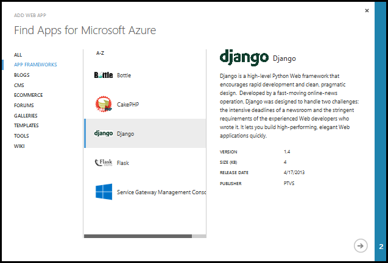
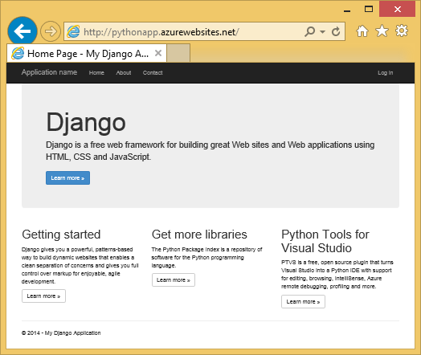
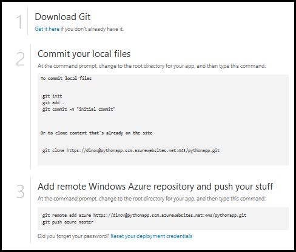
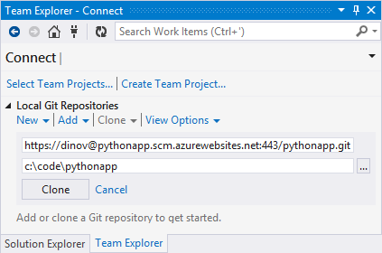
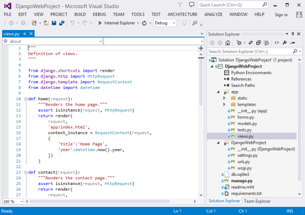
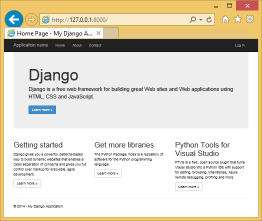

<properties linkid="develop-python-web-site-with-django" urlDisplayName="Websites with Django" pageTitle="Python Websites with Django - Azure tutorial" metaKeywords="Azure django, django website" description="A tutorial that introduces you to running a Python website on Azure." metaCanonical="" services="web-sites" documentationCenter="Python" title="Creating Websites with Django" authors="huvalo" solutions="" manager="" editor="" />

<tags ms.service="web-sites" ms.workload="web" ms.tgt_pltfrm="na" ms.devlang="python" ms.topic="article" ms.date="10/20/2014" ms.author="huvalo" />

# Creating Websites with Django

This tutorial describes how to get started running Python on Azure Websites.  Azure Websites provide limited free hosting and rapid deployment, and you can use Python!  As your app grows, you can switch to paid hosting, and you can also integrate with all of the other Azure services.

You will create an application using the Django web framework (see alternate versions of this tutorial for [Flask](../web-sites-python-create-deploy-flask-app) and [Bottle](../web-sites-python-create-deploy-bottle-app)).  You will create the website from the Azure gallery, set up Git deployment, and clone the repository locally.  Then you will run the application locally, make changes, commit and push them to Azure.  The tutorial shows how to do this from Windows or Mac/Linux.

[WACOM.INCLUDE [create-account-and-websites-note](../includes/create-account-and-websites-note.md)]

+ [Prerequisites](#prerequisites)
+ [Website Creation on Portal](#website-creation-on-portal)
+ [Application Overview](#application-overview)
+ Website Development
  + [Windows - Python Tools for Visual Studio](#website-development-windows-ptvs)
  + [Windows - Command Line](#website-development-windows-command-line)
  + [Mac/Linux - Command Line](#website-development-mac-linux-command-line)
+ [Troubleshooting - Deployment](#troubleshooting-deployment)
+ [Troubleshooting - Package Installation](#troubleshooting-package-installation)
+ [Troubleshooting - Virtual Environment](#troubleshooting-virtual-environment)
+ [Troubleshooting - Static Files](#troubleshooting-static-files)
+ [Troubleshooting - Settings](#troubleshooting-settings)
+ [Using a Database](#using-a-database)
+ [Django Admin Interface](#django-admin-interface)
+ [Next steps](#next-steps)

<h2>Prerequisites</h2>

- Windows, Mac or Linux
- Python 2.7 or 3.4
- setuptools, pip, virtualenv (Python 2.7 only)
- Git
- Python Tools for Visual Studio (optional)

**Note**: TFS publishing is currently not supported for Python projects.

### Windows

If you don't already have Python 2.7 or 3.4 installed (32-bit), we recommend installing [Azure SDK for Python 2.7](http://go.microsoft.com/fwlink/?linkid=254281&clcid=0x409) or [Azure SDK for Python 3.4](http://go.microsoft.com/fwlink/?LinkID=516990&clcid=0x409) using Web Platform Installer.  This installs the 32-bit version of Python, setuptools, pip, virtualenv, etc (32-bit Python is what's installed on the Azure host machines).  Alternatively, you can get Python from [python.org](http://www.python.org/).

For Git, we recommend [Git for Windows](http://msysgit.github.io/). This tutorial uses the Git Shell from Git for Windows.

We also recommend installing [Python Tools for Visual Studio](http://pytools.codeplex.com).  This is optional, but if you have [Visual Studio](http://www.visualstudio.com/), including the free Visual Studio Express 2013 for Web, then this will give you a great Python IDE.

### Mac/Linux

You should have Python and Git already installed, but make sure you have either Python 2.7 or 3.4.

<h2>Website Creation on Portal</h2>

The first step in creating your app is to create the website via the Azure Management Portal.  To do this, you will need to login to the portal and click the **NEW** button in the bottom left corner. A window will appear. Click **COMPUTE**, **WEB SITE**, then **FROM GALLERY**.

A window will appear, listing apps available in the gallery. Click the **APP FRAMEWORKS** category on the left, and select **Django**.

In the next page, enter a name and a region for your site, and click the complete button.

The site will be quickly set up. You can click the **BROWSE** button from the bottom toolbar, and you'll see your new Django application running on Azure.

 
Next, you will add support for publishing via Git.  This can be done by choosing **Set up deployment from source control**.

From the **Set up deployment** dialog, scroll down and select the **Local Git repository** option. Click the right arrow to continue.

After setting up Git publishing, you will momentarily see a page informing you the repository is being created. When it is ready, you will see instructions on how to connect.  

We'll follow these instructions in the next sections.

<h2>Application Overview</h2>

### Git repository contents

Here's an overview of the files you'll find in the initial Git repository, which we'll clone in the next section.

    \app\__init__.py
    \app\forms.py
    \app\models.py
    \app\tests.py
    \app\views.py
    \app\static\content\
    \app\static\fonts\
    \app\static\scripts\
    \app\templates\about.html
    \app\templates\contact.html
    \app\templates\index.html
    \app\templates\layout.html
    \app\templates\login.html
    \app\templates\loginpartial.html
    \DjangoWebProject\__init__.py
    \DjangoWebProject\settings.py
    \DjangoWebProject\urls.py
    \DjangoWebProject\wsgi.py

Main sources for the application.  Consists of 3 pages (index, about, contact) with a master layout.  Static content and scripts include bootstrap, jquery, modernizr and respond.

    \manage.py

Local management and development server support. Use this to run the application locally, synchronize the database, etc.

    \db.sqlite3

Default database. Includes the necessary tables for the application to run, but does not contain any users (synchronize the database to create a user).

    \DjangoWebProject.pyproj
    \DjangoWebProject.sln

Project files for use with [Python Tools for Visual Studio](http://pytools.codeplex.com).

    \ptvs_virtualenv_proxy.py

IIS proxy for virtual environments and PTVS remote debugging support.

    \.deployment
    \deploy.cmd

Custom git deployment support. This provides additional functionality over the default git deployment steps, such as:

- Automatic management of virtual environment
- Installation of packages listed in requirements.txt using pip
- Creation of the appropriate web.config based on the selected Python version.

The deployment script defaults to Python 2.7, but you can change it to use Python 3.4 by editing the default value of `PYTHON_VER` variable in `deploy.cmd`.  

    \requirements.txt

External packages needed by this application. The deployment script will pip install the packages listed in this file.
 
    \web.2.7.config
    \web.3.4.config

IIS configuration files.  The deployment script will use the appropriate web.x.y.config and copy it as web.config.

### Additional files on server

Some files exist on the server but are not added to the git repository.  These are created by the deployment script.

    \web.config

IIS configuration file.  Created from web.x.y.config on every deployment.

    \env\

Python virtual environment.  Created during deployment if a compatible virtual environment doesn't already exist on the site.  Packages listed in requirements.txt are pip installed, but pip will skip installation if the packages are already installed.

The next 3 sections describe how to proceed with the website development under 3 different environments:

- Windows, with Python Tools for Visual Studio
- Windows, with command line
- Mac/Linux, with command line

<h2>Website Development - Windows - Python Tools for Visual Studio</h2>

### Clone the repository

First, clone the repository using the url provided on the Azure portal.

Open the solution file (.sln) that is included in the root of the repository.

### Create virtual environment

Now we'll create a virtual environment for local development.  Right-click on **Python Environments** select **Add Virtual Environment...**.

- Make sure the name of the environment is `env`.

- Select the base interpreter.  Make sure to use the same version of Python that is specified by the PYTHON_VER variable in the deploy.cmd file.

- Make sure the option to download and install packages is checked.

Click **Create**.  This will create the virtual environment, and install dependencies listed in requirements.txt.

### Create a superuser

The database included with the application does not have any superuser defined.  In order to use the sign-in functionality in the application, or the Django admin interface (if you decide to enable it), you'll need to create a superuser.

Run this from the command-line from your project folder:

    env\scripts\python manage.py createsuperuser

Follow the prompts to set the user name, password, etc.

### Run using development server

Press F5 to start debugging, and your web browser will open automatically to the page running locally.

You can set breakpoints in the sources, use the watch windows, etc.  See the [PTVS documentation](http://pytools.codeplex.com/documentation) for more information on the various features.

### Make changes

Now you can experiment by making changes to the application sources and/or templates.

After you've tested your changes, commit them to the Git repository:

### Install more packages

Your application may have dependencies beyond Python and Django.

You can install additional packages using pip.  To install a package, right-click on the virtual environment and select **Install Python Package**.

For example, to install the Azure SDK for Python, which gives you access to Azure storage, service bus and other Azure services, enter `azure`:

Right-click on the virtual environment and select **Generate requirements.txt** to update requirements.txt.

Then, commit the changes to requirements.txt to the Git repository.

### Deploy to Azure

To trigger a deployment, click on **Sync** or **Push**.  Sync does both a push and a pull.

The first deployment will take some time, as it will create a virtual environment, install packages, etc.

Visual Studio doesn't show the progress of the deployment.  If you'd like to review the output, see the section on [Troubleshooting - Deployment](#troubleshooting-deployment).

Browse to the Azure URL to view your changes.

<h2>Website Development - Windows - Command Line</h2>

### Clone the repository

First, clone the repository using the url provided on the Azure portal, and add the Azure repository as a remote.

    git clone <repo-url>
    cd <repo-folder>
    git remote add azure <repo-url> 

### Create virtual environment

We'll create a new virtual environment for development purposes (do not add it to the repository).  Virtual environments in Python are not relocatable, so every developer working on the application will create their own locally.

Make sure to use the same version of Python that is specified by the PYTHON_VER variable in the deploy.cmd file.

For Python 2.7:

    c:\python27\python.exe -m virtualenv env

For Python 3.4:

    c:\python34\python.exe -m venv env

Install any external packages required by your application. You can use the requirements.txt file at the root of the repository to install the packages in your virtual environment:

    env\scripts\pip install -r requirements.txt

### Create a superuser

The database included with the application does not have any superuser defined.  In order to use the sign-in functionality in the application, or the Django admin interface (if you decide to enable it), you'll need to create a superuser.

Run this from the command-line from your project folder:

    env\scripts\python manage.py createsuperuser

Follow the prompts to set the user name, password, etc.

### Run using development server

You can launch the application under a development server with the following command:

    env\scripts\python manage.py runserver

The console will display the URL and port the server listens to:

Then, open your web browser to that URL.

### Make changes

Now you can experiment by making changes to the application sources and/or templates.

After you've tested your changes, commit them to the Git repository:

    git add <modified-file>
    git commit -m "<commit-comment>"

### Install more packages

Your application may have dependencies beyond Python and Django.

You can install additional packages using pip.  For example, to install the Azure SDK for Python, which gives you access to Azure storage, service bus and other Azure services, type:

    env\scripts\pip install azure

Make sure to update requirements.txt:

    env\scripts\pip freeze > requirements.txt

Commit the changes:

    git add requirements.txt
    git commit -m "Added azure package"

### Deploy to Azure

To trigger a deployment, push the changes to Azure:

    git push azure master

You will see the output of the deployment script, including virtual environment creation, installation of packages, creation of web.config.

Browse to the Azure URL to view your changes.

<h2>Website Development - Mac/Linux - Command Line</h2>

### Clone the repository

First, clone the repository using the url provided on the Azure portal, and add the Azure repository as a remote.

    git clone <repo-url>
    cd <repo-folder>
    git remote add azure <repo-url> 

### Create virtual environment

We'll create a new virtual environment for development purposes (do not add it to the repository).  Virtual environments in Python are not relocatable, so every developer working on the application will create their own locally.

Make sure to use the same version of Python that is specified by the PYTHON_VER variable in the deploy.cmd file.

For Python 2.7:

    python -m virtualenv env

For Python 3.4:

    python -m venv env

Install any external packages required by your application. You can use the requirements.txt file at the root of the repository to install the packages in your virtual environment:

    env/bin/pip install -r requirements.txt

### Create a superuser

The database included with the application does not have any superuser defined.  In order to use the sign-in functionality in the application, or the Django admin interface (if you decide to enable it), you'll need to create a superuser.

Run this from the command-line from your project folder:

    env/bin/python manage.py createsuperuser

Follow the prompts to set the user name, password, etc.

### Run using development server

You can launch the application under a development server with the following command:

    env/bin/python manage.py runserver

The console will display the URL and port the server listens to:

Then, open your web browser to that URL.

### Make changes

Now you can experiment by making changes to the application sources and/or templates.

After you've tested your changes, commit them to the Git repository:

    git add <modified-file>
    git commit -m "<commit-comment>"

### Install more packages

Your application may have dependencies beyond Python and Django.

You can install additional packages using pip.  For example, to install the Azure SDK for Python, which gives you access to Azure storage, service bus and other Azure services, type:

    env/bin/pip install azure

Make sure to update requirements.txt:

    env/bin/pip freeze > requirements.txt

Commit the changes:

    git add requirements.txt
    git commit -m "Added azure package"

### Deploy to Azure

To trigger a deployment, push the changes to Azure:

    git push azure master

You will see the output of the deployment script, including virtual environment creation, installation of packages, creation of web.config.

Browse to the Azure URL to view your changes.

<h2>Troubleshooting - Deployment</h2>

If you need to review the deployment output, including the custom deployment script output, navigate to the  **DEPLOYMENTS** page on the Azure portal.

Expand the desired deployment:

Click on **View Log** to see the output of the custom deployment script:

<h2>Troubleshooting - Package Installation</h2>

Some packages may not install using pip when run on Azure.  It may simply be that the package is not available on the Python Package Index.  It could be that a compiler is required (a compiler is not available on the machine running the Azure website).

In this section, we'll look at ways to deal with this issue.

### Request wheels

If the package installation requires a compiler, you should try contacting the package owner to request that wheels be made available for the package.

With the recent availability of [Microsoft Visual C++ Compiler for Python 2.7](http:://aka.ms/vcpython27), it is now easier to build packages that have native code for Python 2.7.

### Build wheels (requires Windows)

Note: When using this option, make sure to compile the package using a Python environment that matches the platform/architecture/version that is used on the Azure website (Windows/32-bit/2.7 or 3.4).

If the package doesn't install because it requires a compiler, you can install the compiler on your local machine and build a wheel for the package, which you will then include in your repository.

Mac/Linux Users: If you don't have access to a Windows machine, see [Create a Virtual Machine Running Windows][] for how to create a VM on Azure.  You can use it to build the wheels, add them to the repository, and discard the VM if you like. 

For Python 2.7, you can install [Microsoft Visual C++ Compiler for Python 2.7](http:://aka.ms/vcpython27).

For Python 3.4, you can install [Microsoft Visual C++ 2010 Express](http://go.microsoft.com/?linkid=9709949).

To build wheels, you'll need the wheel package:

    env\scripts\pip install wheel

You'll use `pip wheel` to compile a dependency:

    env\scripts\pip wheel azure==0.8.4

This creates a .whl file in the \wheelhouse folder.  Add the \wheelhouse folder and wheel files to your repository.

Edit your requirements.txt to add the `--find-links` option at the top. This tells pip to look for an exact match in the local folder before going to the python package index.

    --find-links wheelhouse
    azure==0.8.4

If you want to include all your dependencies in the \wheelhouse folder and not use the python package index at all, you can force pip to ignore the package index by adding `--no-index` to the top of your requirements.txt.

    --no-index

### Customize installation

You can customize the deployment script to install a package in the virtual environment using an alternate installer, such as easy\_install.  See deploy.cmd for an example that is commented out.  Make sure that such packages aren't listed in requirements.txt, to prevent pip from installing them.

Add this to the deployment script:

    env\scripts\easy_install somepackage

You may also be able to use easy\_install to install from an exe installer (some are zip compatible, so easy\_install supports them).  Add the installer to your repository, and invoke easy\_install by passing the path to the executable.

Add this to the deployment script:

    env\scripts\easy_install "%DEPLOYMENT_SOURCE%\installers\somepackage.exe"

### Include the virtual environment in the repository (requires Windows)

Note: When using this option, make sure to use a virtual environment that matches the platform/architecture/version that is used on the Azure website (Windows/32-bit/2.7 or 3.4).

If you include the virtual environment in the repository, you can edit deploy.cmd to prevent it from doing virtual environment management on Azure.

Change the following line:

    SET AUTO_MANAGE_ENV=1

to:

    SET AUTO_MANAGE_ENV=0

We recommend that you delete the existing virtual environment on the site, to prevent leftover files from when the virtual environment was managed automatically.  See the section below for how to do this.

<h2>Troubleshooting - Virtual Environment</h2>

The git deployment script will skip creation of the virtual environment on Azure if it detects that a compatible virtual environment already exists.  This can speed up deployment considerably.  Packages that are already installed will be skipped by pip.

In certain situations, you may want to force delete that virtual environment.  You'll want to do this if you decide to include a virtual environment as part of your repository.  You may also want to do this if you need to get rid of certain packages, or test changes to requirements.txt.

An easy way to delete the virtual environment on Azure is to connect using FTP.  With an FTP client, connect to the server and delete the env folder.  Note that some FTP clients (such as web browsers) may be read-only and won't allow you to delete folders, so you'll want to make sure to use an FTP client with that capability.  The FTP host name and user are displayed in the dashboard page for your website on the Azure portal.

Another solution is to modify the git deployment script to delete the virtual environment if one is found.  However, if you only want to do the deletion once, FTP may be more convenient.

<h2>Troubleshooting - Static Files</h2>

Django has the concept of collecting static files.  This takes all the static files from their original location and copies them to a single folder.  For this application, they are copied to `/static`.

This is done because static files may come from different Django 'apps'.  For example, the static files from the Django admin interfaces are located in a Django library subfolder in the virtual environment.  Static files defined by this application are located in `/app/static`.  As you use more Django 'apps', you'll have static files located in multiple places.

When running the application in debug mode, the application serves the static files from their original location.

When running the application in release mode, the application does **not** serve the static files.  It is the responsibility of the web server to serve the files.  For this application, IIS will serve the static files from `/static`.

The collection of static files is done automatically as part of the deployment script, clearing previously collected files.  This means the collection occurs on every deployment, slowing down deployment a bit, but it ensures that obsolete files won't be available, avoiding a potential security issue. 

If you need to disable collection of static files, edit **deploy.cmd** and set:

    DJANGO_AUTO_COLLECT_STATIC=0

Then you'll need to do the collection manually on your local machine:

    env\scripts\python manage.py collectstatic

Make sure to add the `\static` folder to the Git repository.

<h2>Troubleshooting - Settings</h2>

Various settings for the application can be changed in `DjangoWebProject/settings.py`.

For developer convenience, debug mode is enabled.  One nice side effect of that is you'll be able to see images and other static content when running locally, without having to collect static files.

To disable debug mode:

    DEBUG = False

When debug is disabled, the value for `ALLOWED_HOSTS` needs to be updated to include the Azure host name.  For example:

    ALLOWED_HOSTS = (
        'pythonapp.azurewebsites.net',
    )
 
In practice, you may want to do something more complex to deal with switching between debug and release mode, and getting the host name.

You can set environment variables through the Azure portal **CONFIGURE** page, in the **app settings** section.  This can be useful for setting values that you may not want to appear in the sources (connection strings, passwords, etc), or that you want to set differently between Azure and your local machine.  In `settings.py`, you can query the environment variables using `os.getenv`.

<h2>Using a Database</h2>

The database that is included with the application is a sqlite database.  This is a convenient and useful default database to use for development, as it requires almost no setup.  The database is stored in the db.sqlite3 file in the project folder.

Azure provides database services which are easy to use from a Django application.  Tutorials for using [SQL Database](../web-sites-python-ptvs-django-sql) and [MySQL](../web-sites-python-ptvs-django-mysql) from a Django application show the steps necessary to create the database service, change the database settings in `DjangoWebProject/settings.py`, and the libraries required to install.

Of course, if you prefer to manage your own database servers, you can do so using Windows or Linux virtual machines running on Azure.

<h2>Django Admin Interface</h2>

Once you start building your models, you'll want to populate the database with some data.  An easy way to do add and edit content interactively is to use the Django administration interface.

The code for the admin interface is commented out in the application sources, but it's clearly marked so you can easily enable it (search for 'admin').

After it's enabled, synchronize the database, run the application and navigate to `/admin`.

<h2>Next Steps</h2>

Follow these links to learn more about Django and Python Tools for Visual Studio: 
 
- [Django Documentation][]
- [Python Tools for Visual Studio Documentation][] 

For information on using SQL Database and MySQL:

- [Django and SQL Database on Azure with Python Tools 2.1 for Visual Studio][]
- [Django and MySQL on Azure with Python Tools 2.1 for Visual Studio][]

<!--Link references-->
[Django and MySQL on Azure with Python Tools 2.1 for Visual Studio]: ../web-sites-python-ptvs-django-mysql
[Django and SQL Database on Azure with Python Tools 2.1 for Visual Studio]: ../web-sites-python-ptvs-django-sql

<!--External Link references-->
[Python Tools for Visual Studio Documentation]: http://pytools.codeplex.com/documentation 
[Django Documentation]: https://www.djangoproject.com/
[Create a Virtual Machine Running Windows]: http://azure.microsoft.com/en-us/documentation/articles/virtual-machines-windows-tutorial/
