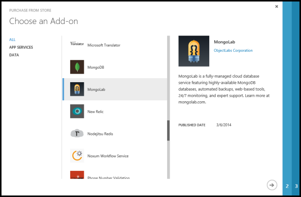
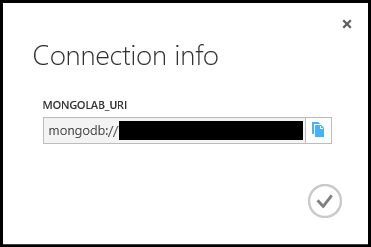
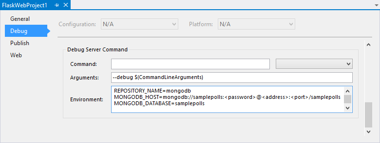
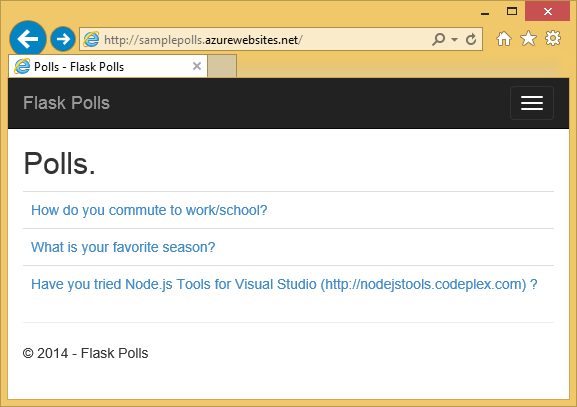

<properties linkid="web-sites-python-ptvs-flask-mongodb" title="Flask and MongoDB on Azure with Python Tools 2.1 for Visual Studio" pageTitle="Flask and MongoDB on Azure with Python Tools 2.1 for Visual Studio" description="Learn how to use the Python Tools for Visual Studio to create a Flask application that stores data in a MongoDB database instance and can be deployed to a web site." metaKeywords="" services="" solutions="" documentationCenter="Python" authors="huvalo" videoId="" scriptId="" manager="wpickett" editor="" />

<tags ms.service="web-sites" ms.workload="web" ms.tgt_pltfrm="na" ms.devlang="python" ms.topic="article" ms.date="10/10/2014" ms.author="huvalo" />

# Flask and MongoDB on Azure with Python Tools 2.1 for Visual Studio

In this tutorial, we'll create a simple polls application using one of the PTVS sample templates. This tutorial is also available as a [video](https://www.youtube.com/watch?v=eql-crFgrAE).

The polls application defines an abstraction for its repository, so you can easily switch between different types of repositories (In-Memory, Azure Table Storage, MongoDB).

We'll learn how to use one of the hosted MongoDB services on Azure, how to configure the application to use MongoDB, and how to publish the application to an Azure Website.

See the [Python Developer Center][] for more articles that cover development of Azure Websites with PTVS using Bottle, Flask and Django web frameworks, with MongoDB, Azure Table Storage, MySQL and SQL Database services.  While this article focuses on Azure Websites, the steps are similar when developing [Azure Cloud Services][].

+ [Prerequisites](#prerequisites)
+ [Create the Project](#create-the-project)
+ [Create a MongoDB Database](#create-a-mongodb-database)
+ [Configure the Project](#configure-the-project)
+ [Explore the MongoDB Database](#explore-the-mongodb-database)
+ [Publish to an Azure Website](#publish-to-an-azure-website)
+ [Configure the Azure Website](#configure-the-azure-website)
+ [Next steps](#next-steps)

##Prerequisites

 - Visual Studio 2012 or 2013
 - [Python Tools 2.1 for Visual Studio][]
 - [Python Tools 2.1 for Visual Studio Samples VSIX][]
 - [Azure SDK Tools for VS 2013][] or [Azure SDK Tools for VS 2012][]
 - [Python 2.7 32-bit][] or [Python 3.4 32-bit][]
 - [RoboMongo][] (optional)

[WACOM.INCLUDE [create-account-and-websites-note](../includes/create-account-and-websites-note.md)]

##Create the Project

In this section, we'll create a Visual Studio project using a sample template.  We'll create a virtual environment and install required packages.  Then we'll run the application locally using the default in-memory repository.

1.  In Visual Studio, select **File**, **New Project**. 

1.  The project templates from the PTVS Samples VSIX are available under **Python**, **Samples**.  Select **Polls Flask Web Project** and click OK to create the project.

  	

1.  You will be prompted to install external packages.  Select **Install into a virtual environment**.

  	

1.  Select **Python 2.7** or **Python 3.4** as the base interpreter.

  	

1.  Confirm that the application works by pressing <kbd>F5</kbd>.  By default, the application uses an in-memory repository which doesn't require any configuration.  All data is lost when the web server is stopped.

1.  Click **Create Sample Polls**, then click on a poll and vote.

  	

##Create a MongoDB Database

For the database, we'll create a MongoLab hosted database on Azure.

As an alternative, you can create your own Virtual Machine running on Azure, then install and administer MongoDB yourself.

You can create a free trial with MongoLab by following these steps.

1.  Log into the [Azure Management Portal][].

1.  At the bottom of the navigation pane, click **NEW**.

  	

1.  Click **STORE**, then **MongoLab**.

  	

1.  In Name, type a name to use for the database service.

1.  Choose a Region/Affinity Group in which to locate the database service. If you will be using the database from your Azure application, select the same region where you will deploy your application.

  	

1.  Click **PURCHASE**.

##Configure the Project

In this section, we'll configure our application to use the MongoDB database we just created.  We'll see how to obtain connection settings from the Azure portal.  Then we'll run the application locally.

1.  In [Azure Management Portal][], click on **ADD-ONS**, then click on the MongoLab service you created earlier.

1.  Click on **CONNECTION INFO**.  You can use the copy button to put the value of **MONGOLAB\_URI** on the clipboard.

  	

1.  In Visual Studio, right-click on your project node in Solution Explorer and select **Properties**.  Click on the **Debug** tab.

  	

1.  Set the values of environment variables required by the application in **Debug Server Command**, **Environment**.

        REPOSITORY_NAME=mongodb
        MONGODB_HOST=<value of MONGOLAB_URI>
        MONGODB_DATABASE=<database name>

    This will set the environment variables when you **Start Debugging**.  If you want the variables to be set when you **Start Without Debugging**, set the same values under **Run Server Command** as well.

    Alternatively, you can define environment variables using the Windows Control Panel.  This is a better option if you want to avoid storing credentials in source code / project file.  Note that you will need to restart Visual Studio for the new environment values to be available to the application.

1.  The code that implements the MongoDB repository is in **models/mongodb.py**.

1.  Run the application with <kbd>F5</kbd>.  Polls that are created with **Create Sample Polls** and the data submitted by voting will be serialized in MongoDB.

1.  Browse to the **About** page to verify that the application is using the   **MongoDB** repository.

  	

##Explore the MongoDB Database

You can use an application such as [RoboMongo][] to query and make edits to a MongoDB database.  In this section we'll use RoboMongo to view the contents of the polls application database.

1.  Create a new connection.  You'll need the **MONGOLAB\_URI** we retrieved in the previous section.

    Note the format of the URI: `mongodb://<name>:<password>@<address>:<port>/<name>`

    The name matches the name you entered when you created the service with Azure.  It is used for both the database name and the user name.

1.  In the connection page, set the **Name** to any name you would like for the   connection.  Also set the **Address** and **Port** fields to the *address* and *port* from **MONGOLAB\_URI**.

  	

1.  In the authentication page, set the **Database** and **User name** to the *name* from **MONGOLAB\_URI**.  Also set the **Password** to the *password* from **MONGOLAB\_URI**.

  	

1.  Save and connect to the database.  You can now query the polls collection.

  	

##Publish to an Azure Website

PTVS provides an easy way to deploy your web application to an Azure Website.

1.  In **Solution Explorer**, right-click on the project node and select **Publish**.

  	

1.  Click on **Microsoft Azure Websites**.

1.  Click on **New** to create a new site.

1.  Select a **Site name** and a **Region** and click **Create**.

  	

1.  Accept all other defaults and click **Publish**.

1.  Your web browser will open automatically to the published site.  If you browse to the about page, you'll see that it uses the **In-Memory** repository, not the **MongoDB** repository.

    That's because the environment variables are not set on the Azure Website, so it uses the default values specified in **settings.py**.

##Configure the Azure Website

In this section, we'll configure environment variables for the site.

1.  In [Azure Management Portal][], click on the site created in the previous section.

1.  In the top menu, click on **CONFIGURE**.

  	

1.  Scroll down to the **app settings** section and set the values for **REPOSITORY\_NAME**, **MONGODB\_HOST** and **MONGODB\_DATABASE** as described in the section above.

  	

1.  In the bottom menu, click on **SAVE**, then **RESTART** and finally **BROWSE**.

  	

1.  You should see the application working as expected, using the **MongoDB** repository.

    Congratulations!

  	

##Next steps

Follow these links to learn more about Python Tools for Visual Studio, Flask and MongoDB.

- [Python Tools for Visual Studio Documentation][]
  - [Web Projects][]
  - [Cloud Service Projects][]
  - [Remote Debugging on Microsoft Azure][]
- [Flask Documentation][]
- [MongoDB][]
- [PyMongo Documentation][]
- [PyMongo][]

<!--Link references-->
[Python Developer Center]: /en-us/develop/python/
[Azure Cloud Services]: ../cloud-services-python-ptvs/

<!--External Link references-->
[Azure Management Portal]: https://manage.windowsazure.com
[RoboMongo]: http://robomongo.org/
[Python Tools 2.1 for Visual Studio]: http://go.microsoft.com/fwlink/?LinkId=517189
[Python Tools 2.1 for Visual Studio Samples VSIX]: http://go.microsoft.com/fwlink/?LinkId=517189
[Azure SDK Tools for VS 2013]: http://go.microsoft.com/fwlink/?LinkId=323510
[Azure SDK Tools for VS 2012]: http://go.microsoft.com/fwlink/?LinkId=323511
[Python 2.7 32-bit]: http://go.microsoft.com/fwlink/?LinkId=517190 
[Python 3.4 32-bit]: http://go.microsoft.com/fwlink/?LinkId=517191
[Python Tools for Visual Studio Documentation]: http://pytools.codeplex.com/documentation
[Flask Documentation]: http://flask.pocoo.org/
[MongoDB]: http://www.mongodb.org/
[PyMongo Documentation]: http://api.mongodb.org/python/current/
[PyMongo]: https://github.com/mongodb/mongo-python-driver
[Remote Debugging on Microsoft Azure]: http://pytools.codeplex.com/wikipage?title=Features%20Azure%20Remote%20Debugging
[Web Projects]: http://pytools.codeplex.com/wikipage?title=Features%20Web%20Project
[Cloud Service Projects]: http://pytools.codeplex.com/wikipage?title=Features%20Cloud%20Project
