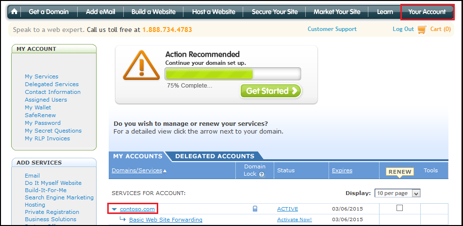
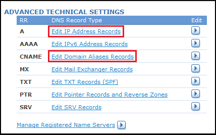
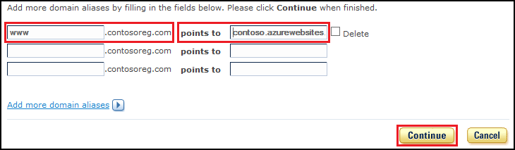
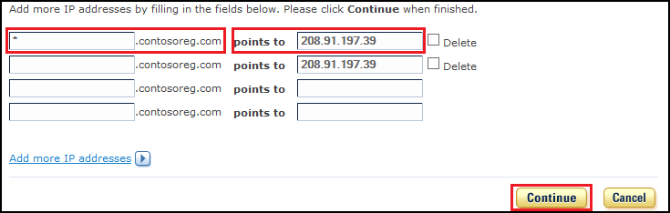

<properties pageTitle="Configure a Register.com domain name for an Azure website" description="" services="web-sites" documentationCenter="" authors="blackmist" manager="wpickett" editor=""/>

<tags ms.service="web-sites" ms.workload="web" ms.tgt_pltfrm="na" ms.devlang="na" ms.topic="article" ms.date="09/17/2014" ms.author="larryfr, jroth"/>

#Configuring a custom domain name for an Azure Website (Register.com)

<a href="/en-us/documentation/articles/web-sites-custom-domain-name" title="Custom Domain">Custom Domain</a><a href="/en-us/documentation/articles/web-sites-godaddy-custom-domain-name" title="GoDaddy">GoDaddy</a><a href="/en-us/documentation/articles/web-sites-network-solutions-custom-domain-name" title="Network Solutions">Network Solutions</a><a href="/en-us/documentation/articles/web-sites-registerdotcom-custom-domain-name" title="Register.com" class="current">Register.com</a><a href="/en-us/documentation/articles/web-sites-enom-custom-domain-name" title="Enom">Enom</a><a href="/en-us/documentation/articles/web-sites-moniker-custom-domain-name" title="Moniker">Moniker</a><a href="/en-us/documentation/articles/web-sites-dotster-custom-domain-name" title="Dotster">Dotster</a><a href="/en-us/documentation/articles/web-sites-domaindiscover-custom-domain-name" title="DomainDiscover">DomainDiscover</a><a href="/en-us/documentation/articles/web-sites-directnic-custom-domain-name" title="Directnic">Directnic</a>

<a href="/en-us/documentation/articles/web-sites-registerdotcom-custom-domain-name/" title="Websites" class="current">Website</a> | <a href="/en-us/documentation/articles/web-sites-registerdotcom-traffic-manager-custom-domain-name/" title="Website using Traffic Manager">Website using Traffic Manager</a>

[AZURE.INCLUDE [websites-cloud-services-css-guided-walkthrough](../includes/websites-cloud-services-css-guided-walkthrough.md)]

[AZURE.INCLUDE [intro](../includes/custom-dns-web-site-intro.md)]

This article provides instructions on using a custom domain name purchased from [Register.com](https://www.register.com) with Azure Websites.

[AZURE.INCLUDE [introfooter](../includes/custom-dns-web-site-intro-notes.md)]

In this article:

-   [Understanding DNS records](#understanding-records)
-   [Configure your web sites for basic, shared or standard mode](#bkmk_configsharedmode)
-   [Add a DNS record for your custom domain](#bkmk_configurecname)
-   [Enable the domain on your web site](#enabledomain)

<h2>Understanding DNS records</h2>

[AZURE.INCLUDE [understandingdns](../includes/custom-dns-web-site-understanding-dns-raw.md)]

<h2>Configure your websites for basic, shared or standard mode</h2>

[AZURE.INCLUDE [modes](../includes/custom-dns-web-site-modes.md)]

<h2>Add a DNS record for your custom domain</h2>

To associate your custom domain with an Azure Website, you must add a new entry in the DNS table for your custom domain by using tools provided by Register.com. Use the following steps to locate and use the DNS tools.

1. Log on to your account at register.com and select **Your Account** in the upper right corner to view your domains, then select your custom domain name.

	

3. Scroll down the page until you see the **Advanced Technical Settings**. The links in this section allow you to manage the records for your domain.

	* For A records, use the **Edit IP Address Records** link.
	* For CNAME records, use the **Edit Domain Aliases Records** link.

	

5. When you click the **Edit** button, you will be presented with a form that you can use to modify existing records, or add new ones. The form is similar for both CNAME and A records.

	* When adding a CNAME record, you must set the **.mydomainname.com** field to the sub-domain you wish to use. For example, **www**. You must select the **points to** value to the **.azurewebsites.net** domain name of your Azure Website. For example, **contoso.azurwebsites.net**. Leave the **Refers to Host Name** as **Select**, as this field is not required when creating a CNAME record for use with Azure Websites.
	
		

		> [AZURE.NOTE] If you will be using an A record, you must also add a CNAME record with one of the following configurations:
		> 
		> * An **Alias** value of **www** with an **Other host** value of **&lt;yourwebsitename&gt;.azurewebsites.net**.
		> 
		> OR
		> 
		> * An **Alias** value of **awverify.www** with an **Other host** value of **awverify.&lt;yourwebsitename&gt;.azurewebsites.net**.
		> 
		> This CNAME record is used by Azure to validate that you own the domain described by the A record.

	* When adding an A record, you must set the **.mydomainname.com** field the sub-domain you wish to use (for example, **www**.) Leave the field blank to set the root domain, or use and **\** to create a wildcard mapping. You must set the **points to** field to the IP address of your Azure Website.

		

5. When you have finished adding or modifying records, click **Continue** to review the changes. Select **Continue** again to save the changes.

<h2>Enable the domain name on your website</h2>

[AZURE.INCLUDE [modes](../includes/custom-dns-web-site-enable-on-web-site.md)]
