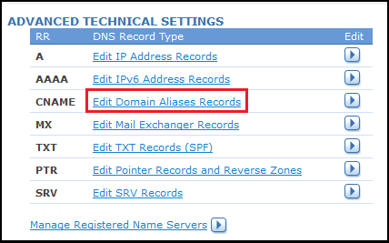

<properties title="Learn how to configure an Azure web site that uses Traffic Manager to use a domain name registered with Register.com" pageTitle="Configure a Register.com domain name for an Azure web site that uses Traffic Manager" metaKeywords="Windows Azure, Windows Azure Web Sites, domain name" description="" services="web-sites" documentationCenter="" authors="larryfr, jroth" />

#Configuring a custom domain name for an Azure Web Site using Traffic Manager (Register.com)

<a href="/en-us/documentation/articles/web-sites-custom-domain-name" title="Custom Domain">Custom Domain</a><a href="/en-us/documentation/articles/web-sites-godaddy-custom-domain-name" title="GoDaddy">GoDaddy</a><a href="/en-us/documentation/articles/web-sites-network-solutions-custom-domain-name" title="Network Solutions">Network Solutions</a><a href="/en-us/documentation/articles/web-sites-registerdotcom-custom-domain-name" title="Register.com" class="current">Register.com</a><a href="/en-us/documentation/articles/web-sites-enom-custom-domain-name" title="Enom">Enom</a><a href="/en-us/documentation/articles/web-sites-moniker-custom-domain-name" title="Moniker">Moniker</a><a href="/en-us/documentation/articles/web-sites-dotster-custom-domain-name" title="Dotster">Dotster</a><a href="/en-us/documentation/articles/web-sites-domaindiscover-custom-domain-name" title="DomainDiscover">DomainDiscover</a><a href="/en-us/documentation/articles/web-sites-directnic-custom-domain-name" title="Directnic">Directnic</a>

<a href="/en-us/documentation/articles/web-sites-registerdotcom-custom-domain-name/" title="Web Sites">Web Site</a> | <a href="/en-us/documentation/articles/web-sites-registerdotcom-traffic-manager-custom-domain-name/" title="Web Site using Traffic Manager" class="current">Web Site using Traffic Manager</a>

[WACOM.INCLUDE [intro](../includes/custom-dns-web-site-intro-traffic-manager.md)]

This article provides instructions on using a custom domain name purchased from [Register.com](https://register.com) with Azure Web Sites.

[WACOM.INCLUDE [tmwebsitefooter](../includes/custom-dns-web-site-traffic-manager-notes.md)]

[WACOM.INCLUDE [introfooter](../includes/custom-dns-web-site-intro-notes.md)]

In this article:

-   [Understanding DNS records](#understanding-records)
-   [Configure your web sites for standard mode](#bkmk_configsharedmode)
-   [Add a DNS record for your custom domain](#bkmk_configurecname)
-   [Enable Traffic Manager for your web site](#enabledomain)

<h2>Understanding DNS records</h2>

[WACOM.INCLUDE [understandingdns](../includes/custom-dns-web-site-understanding-dns-traffic-manager.md)]

<h2>Configure your web sites for standard mode</h2>

[WACOM.INCLUDE [modes](../includes/custom-dns-web-site-modes-traffic-manager.md)]

<h2>Add a DNS record for your custom domain</h2>

To associate your custom domain with an Azure Web Site, you must add a new entry in the DNS table for your custom domain by using tools provided by Register.com. Use the following steps to locate and use the DNS tools.

1. Log on to your account at register.com and select **Your Account** in the upper right corner to view your domains, then select your custom domain name.

	

3. Scroll down the page until you see the **Advanced Technical Settings**. The links in this section allow you to manage the records for your domain. For CNAME records, use the **Edit Domain Aliases Records** link.

	

5. When you click the **Edit** button, you will be presented with a form that you can use to modify existing records, or add new ones. The form is similar for both CNAME and A records.

	* When adding a CNAME record, you must set the **.mydomainname.com** field to the sub-domain you wish to use. For example, **www**. You must select the **points to** value to the **.trafficmanager.net** domain name of the Traffic Manager profile you are using with your Azure Web Site. For example, **contoso.trafficmanager.net**. Leave the **Refers to Host Name** as **Select**, as this field is not required when creating a CNAME record for use with Azure Web Sites.
	
		

5. When you have finished adding or modifying records, click **Continue** to review the changes. Select **Continue** again to save the changes.

<h2>Enable Traffic Manager web site</h2>

[WACOM.INCLUDE [modes](../includes/custom-dns-web-site-enable-on-traffic-manager.md)]
