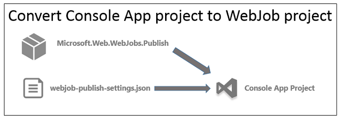
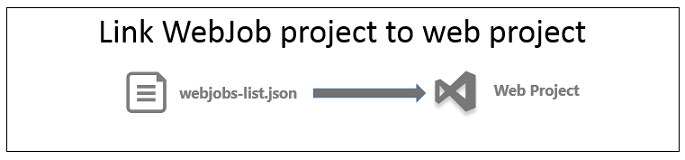
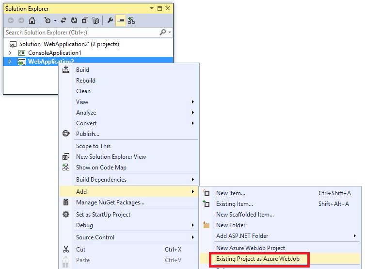
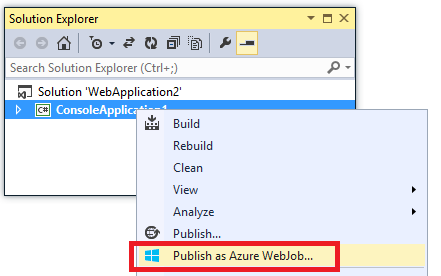

<properties 
	pageTitle="Deploy WebJobs using Visual Studio" 
	description="Learn how to deploy Azure WebJobs to Azure App Service Web Apps using Visual Studio." 
	services="app-service\web" 
	documentationCenter="" 
	authors="tdykstra" 
	manager="wpickett" 
	editor="jimbe"/>

<tags 
	ms.service="app-service-web" 
	ms.devlang="dotnet" 
	ms.topic="article" 
	ms.tgt_pltfrm="na" 
	ms.workload="web" 
	ms.date="04/03/2015" 
	ms.author="tdykstra"/>

# Deploy WebJobs using Visual Studio

## Overview

This topic explains how to use Visual Studio to deploy a Console Application project to a web app in [App Service](http://go.microsoft.com/fwlink/?LinkId=529714) as an [Azure WebJob](http://go.microsoft.com/fwlink/?LinkId=390226). For information about how to deploy WebJobs by using the [Azure Portal](http://go.microsoft.com/fwlink/?LinkId=529715), see [Run Background tasks with WebJobs](web-sites-create-web-jobs.md).

When Visual Studio deploys a WebJobs-enabled Console Application project, it performs two tasks:

* Copies runtime files to the appropriate folder in the web app (*App_Data/jobs/continuous* for continuous WebJobs, *App_Data/jobs/triggered* for scheduled and on-demand WebJobs).
* Sets up [Azure Scheduler jobs](#scheduler) for WebJobs that are scheduled to run at particular times. (This is not needed for continuous WebJobs.)

A WebJobs-enabled project has the following items added to it:

* The [Microsoft.Web.WebJobs.Publish](http://www.nuget.org/packages/Microsoft.Web.WebJobs.Publish/) NuGet package.
* A [webjob-publish-settings.json](#publishsettings) file that contains deployment and scheduler settings. 

You can add these items to an existing Console Application project or use a template to create a new WebJobs-enabled Console Application project. 

You can deploy a project as a WebJob by itself, or link it to a web project so that it automatically deploys whenever you deploy the web project. To link projects, Visual Studio includes the name of the WebJobs-enabled project in a [webjobs-list.json](#webjobslist) file in the web project.

 

## Prerequisites

WebJobs deployment features are available in Visual Studio 2013 when you install Azure SDK version 2.4 or later versions:

* [Azure SDK for Visual Studio 2013](http://go.microsoft.com/fwlink/p/?linkid=323510&clcid=0x409).

The WebJobs deployment features are also included in [Visual Studio 2013 Update 3](http://go.microsoft.com/fwlink/?linkid=397827&clcid=0x409) and later updates.

## Enable WebJobs deployment for an existing Console Application project

You have two options:

* [Enable automatic deployment with a web project](#convertlink).

	Configure an existing Console Application project so that it automatically deploys as a WebJob when you deploy a web project. Use this option when you want to run your WebJob in the same web app in which you run the related web application.

* [Enable deployment without a web project](#convertnolink).

	Configure an existing Console Application project to deploy as a WebJob by itself, with no link to a web project. Use this option when you want to run a WebJob in a web app by itself, with no web application running in the web app. You might want to do this in order to be able to scale your WebJob resources independently of your web application resources.

###  Enable automatic WebJobs deployment with a web project
  
1. Right-click the web project in **Solution Explorer**, and then click **Add** > **Existing Project as Azure WebJob**.

	
	
	The [Add Azure WebJob](#configure) dialog box appears.

1. In the **Project name** drop-down list, select the Console Application project to add as a WebJob.

	

2. Complete the [Add Azure WebJob](#configure) dialog, and then click **OK**. 

###  Enable WebJobs deployment without a web project
  
1. Right-click the Console Application project in **Solution Explorer**, and then click **Publish as Azure WebJob**. 

	
	
	The [Add Azure WebJob](#configure) dialog box appears, with the project selected in the **Project name** box.

2.  Complete the [Add Azure WebJob](#configure) dialog box, and then click **OK**.

	The **Publish Web** wizard appears.  If you don't want to publish immediately, close the wizard. The settings that you've entered are saved for when you do want to [deploy the project](#deploy).

## Create a new WebJobs-enabled project

To create a new WebJobs-enabled project, you can use the Console Application project template and enable WebJobs deployment as explained in [the previous section](#convert). As an alternative, you can use the WebJobs new-project template:

* [Use the WebJobs new-project template for an independent WebJob](#createnolink)

	Create a project and configure it to deploy by itself as a WebJob, with no link to a web project. Use this option when you want to run a WebJob in a web app by itself, with no web application running in the web app. You might want to do this in order to be able to scale your WebJob resources independently of your web application resources.

* [Use the WebJobs new-project template for a WebJob linked to a web project](#createlink)

	Create a project that is configured to deploy automatically as a WebJob when a web project in the same solution is deployed. Use this option when you want to run your WebJob in the same web app in which you run the related web application.

In the SDK 2.4 release, the WebJobs new-project template isn't much easier than creating a Console Application project and enabling WebJobs deployment. In the future, the WebJobs new-project template will be more convenient for [WebJobs SDK](http://www.asp.net/aspnet/overview/developing-apps-with-windows-azure/getting-started-with-windows-azure-webjobs) development, because it will automatically install the appropriate WebJobs SDK NuGet packages. Until then, you can configure a project to use the WebJobs SDK by installing the packages manually as shown in the [WebJobs SDK tutorial](http://www.asp.net/aspnet/overview/developing-apps-with-windows-azure/getting-started-with-windows-azure-webjobs). 

###  Use the WebJobs new-project template for an independent WebJob
  
1. Click **File** > **New Project**, and then in the **New Project** dialog box click **Cloud** > **Microsoft Azure WebJob**.

	
	
2. Follow the directions shown earlier to [make the Console Application project an independent WebJobs project](#convertnolink).

###  Use the WebJobs new-project template for a WebJob linked to a web project

1. Right-click the web project in **Solution Explorer**, and then click **Add** > **New Azure WebJob Project**.

	

	The [Add Azure WebJob](#configure) dialog box appears.

2. Complete the [Add Azure WebJob](#configure) dialog box, and then click **OK**.

## The Add Azure WebJob dialog

The **Add Azure WebJob** dialog enables you to enter WebJob name and scheduling settings for your WebJob. 

The fields in this dialog correspond to fields on the **New Job** dialog of the Azure Management Portal. For more information, see [Run Background tasks with WebJobs](web-sites-create-web-jobs.md).

For a scheduled WebJob (not for continuous WebJobs), Visual Studio creates an [Azure Scheduler](/services/scheduler/) job collection if one doesn't exist yet, and it creates a job in the collection:

* The scheduler job collection is named *WebJobs-{regionname}* where *{regionname}* refers to the region the web app is hosted in. For example: WebJobs-WestUS.
* The scheduler job is named *{webappname}-{webjobname}*. For example: MyWebApp-MyWebJob. 
 
>[AZURE.NOTE]
> 
>* For information about command-line deployment, see [Enabling Command-line or Continuous Delivery of Azure WebJobs](/blog/2014/08/18/enabling-command-line-or-continuous-delivery-of-azure-webjobs/).
>* If you configure a **Recurring Job** and set recurrence frequency to a number of minutes, the Azure Scheduler service is not free. Other frequencies (hours, days, and so forth) are free.
>* If you deploy a WebJob and then decide you want to change the type of WebJob and redeploy, you'll need to delete the webjobs-publish-settings.json file. This will make Visual Studio show the publishing options again, so you can change the type of WebJob.
>* If you deploy a WebJob and later change the run mode from continuous to non-continuous or vice versa, Visual Studio creates a new WebJob in Azure when you redeploy. If you change other scheduling settings but leave run mode the same or switch between Scheduled and On Demand, Visual Studio updates the existing job rather than create a new one.

## webjob-publish-settings.json

When you configure a Console Application for WebJobs deployment, Visual Studio installs the [Microsoft.Web.WebJobs.Publish](http://www.nuget.org/packages/Microsoft.Web.WebJobs.Publish/) NuGet package 
and stores scheduling information in a *webjob-publish-settings.json* file in the project *Properties* folder of the WebJobs project. Here is an example of that file:

		{
		  "$schema": "http://schemastore.org/schemas/json/webjob-publish-settings.json",
		  "webJobName": "WebJob1",
		  "startTime": "2014-06-23T00:00:00-08:00",
		  "endTime": "2014-06-27T00:00:00-08:00",
		  "jobRecurrenceFrequency": "Minute",
		  "interval": 5,
		  "runMode": "Scheduled"
		}

You can edit this file directly, and Visual Studio provides IntelliSense. The file schema is stored at [http://schemastore.org](http://schemastore.org/schemas/json/webjob-publish-settings.json) and can be viewed there.  

>[AZURE.NOTE]
>
>* If you configure a **Recurring Job** and set recurrence frequency to a number of minutes, the Azure Scheduler service is not free. Other frequencies (hours, days, and so forth) are free.

## webjobs-list.json

When you link a WebJobs-enabled project to a web project, Visual Studio stores the name of the WebJobs project in a *webjobs-list.json* file in the web project's *Properties* folder. The list may contain multiple WebJobs projects, as shown in the following example:

		{
		  "$schema": "http://schemastore.org/schemas/json/webjobs-list.json",
		  "WebJobs": [
		    {
		      "filePath": "../ConsoleApplication1/ConsoleApplication1.csproj"
		    },
		    {
		      "filePath": "../WebJob1/WebJob1.csproj"
		    }
		  ]
		}

You can edit this file directly, and Visual Studio provides IntelliSense. The file schema is stored at [http://schemastore.org](http://schemastore.org/schemas/json/webjobs-list.json) and can be viewed there.
  
## Deploy a WebJobs project

A WebJobs project that you have linked to a web project deploys automatically with the web project. For information about web project deployment, see [How to deploy to Web Apps](web-sites-deploy.md).

To deploy a WebJobs project by itself, right-click the project in **Solution Explorer**, and click **Publish as Azure WebJob**. 

	
For an independent WebJob, the same **Publish Web** wizard that is used for web projects appears, but with fewer settings available to change.

>[AZURE.NOTE] If you want to get started with Azure App Service before signing up for an Azure account, go to [Try App Service](http://go.microsoft.com/fwlink/?LinkId=523751), where you can immediately create a short-lived starter web app in App Service. No credit cards required; no commitments.

## Next Steps

For more information about how to deploy Azure WebJobs from Visual Studio and by using a continuous delivery process, see [Azure WebJobs - Recommended Resources - Deployment](http://www.asp.net/aspnet/overview/developing-apps-with-windows-azure/azure-webjobs-recommended-resources#deploying).

## What's changed
* For a guide to the change from Websites to App Service see: [Azure App Service and Its Impact on Existing Azure Services](http://go.microsoft.com/fwlink/?LinkId=529714)
* For a guide to the change of the old portal to the new portal see: [Reference for navigating the preview portal](http://go.microsoft.com/fwlink/?LinkId=529715)
