<properties 
	pageTitle="Create a .NET WebJob in Azure App Service" 
	description="Learn how to create a multi-tier app using ASP.NET MVC and Azure. The frontend runs in a web app in Azure App Service, and the backend runs as a WebJob. The app uses Entity Framework, SQL Database, and Azure storage queues and blobs." 
	services="app-service\web" 
	documentationCenter=".net" 
	authors="tdykstra" 
	manager="wpickett" 
	editor="mollybos"/>

<tags 
	ms.service="app-service-web" 
	ms.workload="web" 
	ms.tgt_pltfrm="na" 
	ms.devlang="na" 
	ms.topic="article" 
	ms.date="04/03/2015" 
	ms.author="tdykstra"/>

# Create a .NET WebJob in Azure App Service

## Overview

This tutorial shows how to create a multi-tier ASP.NET MVC application that uses the WebJobs SDK to work with [Azure queues](http://www.asp.net/aspnet/overview/developing-apps-with-windows-azure/building-real-world-cloud-apps-with-windows-azure/queue-centric-work-pattern) and [Azure blobs](http://www.asp.net/aspnet/overview/developing-apps-with-windows-azure/building-real-world-cloud-apps-with-windows-azure/unstructured-blob-storage) in a web app in [Azure App Service](http://go.microsoft.com/fwlink/?LinkId=529714). The application also uses [Azure SQL Database](http://msdn.microsoft.com/library/azure/ee336279). 

The sample application is an advertising bulletin board. Users create an ad by entering text and uploading an image. They can see a list of ads with thumbnail images, and they can see the full size image when they select an ad to see the details. Here's a screenshot:

You can [download the Visual Studio project][download] from the MSDN Code Gallery. 

[download]: http://code.msdn.microsoft.com/Simple-Azure-Website-with-b4391eeb

## Prerequisites

The tutorial assumes that you know how to work with [ASP.NET MVC](http://www.asp.net/mvc/tutorials/mvc-5/introduction/getting-started) or [Web Forms](http://www.asp.net/web-forms/tutorials/aspnet-45/getting-started-with-aspnet-45-web-forms/introduction-and-overview) projects in Visual Studio. The sample application uses MVC, but most of the tutorial also applies to Web Forms. 

The tutorial instructions work with the following products:

* Visual Studio 2013
* Visual Studio 2013 Community
* Visual Studio 2013 Express for Web

If you don't have one of these, Visual Studio 2013 Express for Web will be installed automatically when you install the Azure SDK.

[AZURE.INCLUDE [free-trial-note](../includes/free-trial-note.md)]

>[AZURE.NOTE] If you want to get started with Azure App Service before signing up for an Azure account, go to [Try App Service](http://go.microsoft.com/fwlink/?LinkId=523751), where you can immediately create a short-lived starter web app in App Service. No credit cards required; no commitments.

## What you'll learn

The tutorial shows how to do the following tasks:

* Enable your machine for Azure development by installing the Azure SDK.
* Create a Console Application project that automatically deploys as an Azure WebJob when you deploy the associated web project.
* Test a WebJobs SDK backend locally on the development computer.
* Publish an application with a WebJobs backend to a web app in App Service.
* Upload files and store them in the Azure Blob service.
* Use the Azure WebJobs SDK to work with Azure Storage queues and blobs.

## Application architecture

The sample application uses the [queue-centric work pattern](http://www.asp.net/aspnet/overview/developing-apps-with-windows-azure/building-real-world-cloud-apps-with-windows-azure/queue-centric-work-pattern) to off-load the CPU-intensive work of creating thumbnails to a backend process. 

The app stores ads in a SQL database, using Entity Framework Code First to create the tables and access the data. For each ad, the database stores two URLs: one for the full-size image and one for the thumbnail.

When a user uploads an image, the frontend of the web app stores the image in an [Azure blob](http://www.asp.net/aspnet/overview/developing-apps-with-windows-azure/building-real-world-cloud-apps-with-windows-azure/unstructured-blob-storage), and it stores the ad information in the database with a URL that points to the blob. At the same time, it writes a message to an Azure queue. A backend process running as an Azure WebJob uses the WebJobs SDK to poll the queue for new messages. When a new message appears, the WebJob creates a thumbnail for that image and updates the thumbnail URL database field for that ad. Here's a diagram that shows how the parts of the application interact:

### Alternative architecture

WebJobs run in the context of a web app and are not scalable separately. For example, if you have one Standard web app instance, you have only one instance of your background process running, and it is using some of the server resources (CPU, memory, etc.) that otherwise would be available to serve web content. 

If traffic varies by time of day or day of week, and if the backend processing you need to do can wait, you could schedule your WebJobs to run at low-traffic times. If the load is still too high for that solution, you can consider alternative environments for your backend program, such as the following:

* Run the program as a WebJob in a separate web app dedicated for that purpose. You can then scale your backend web app independently from your frontend web app.
* Run the program in an Azure Cloud Service worker role. If you choose this option, you could run the frontend in either a Cloud Service web role or a web app.

This tutorial shows how to run the frontend in a web app and the backend as a WebJob in the same web app. For information about how to choose the best environment for your scenario, see [Azure web app, cloud services, and virtual machines comparison](../choose-web-site-cloud-service-vm/).

[AZURE.INCLUDE [install-sdk-2013-only](../includes/install-sdk-2013-only.md)]

The tutorial instructions apply to Azure SDK for .NET 2.5.1 or later. In the create-from-scratch section where you create the WebJob project, the WebJobs SDK packages are automatically included in the project; with earlier versions of the SDK you have to install the packages manually.

## Create an Azure Storage account

An Azure storage account provides resources for storing queue and blob data in the cloud. It is also used by the WebJobs SDK to store logging data for the dashboard.

In a real-world application, you typically create separate accounts for application data versus logging data, and separate accounts for test data versus production data. For this tutorial you'll use just one account.

1. Open the **Server Explorer** window in Visual Studio.

2. Right-click the **Azure** node, and then click **Connect to Microsoft Azure**.

3. Sign in using your Azure credentials.

5. Right-click **Storage** under the Azure node, and then click **Create Storage Account**.

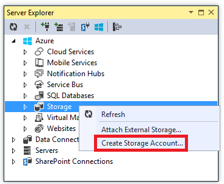

3. In the **Create Storage Account** dialog, enter a name for the storage account. 

	The name must be must be unique (no other Azure storage account can have the same name). If the name you enter is already in use you'll get a chance to change it.

	The URL to access your storage account will be *{name}*.core.windows.net. 

5. Set the **Region or Affinity Group** drop-down list to the region closest to you.

	This setting specifies which Azure datacenter will host your storage account. For this tutorial, your choice won't make a noticeable difference. However, for a production web app, you want your web server and your storage account to be in the same region to minimize latency and data egress charges. The web app (which you'll create later) datacenter should be as close as possible to the browsers accessing the web app in order to minimize latency.

6. Set the **Replication** drop-down list to **Locally redundant**. 

	When geo-replication is enabled for a storage account, the stored content is replicated to a secondary datacenter to enable failover to that location in case of a major disaster in the primary location. Geo-replication can incur additional costs. For test and development accounts, you generally don't want to pay for geo-replication. For more information, see [Create, manage, or delete a storage account](../storage-create-storage-account/#replication-options).

5. Click **Create**. 

	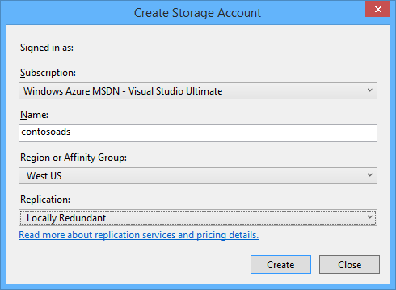	

## Download the application
 
1. Download and unzip the [completed solution][download].

2. Start Visual Studio.

3. From the **File** menu choose **Open** > **Project/Solution**, navigate to where you downloaded the solution, and then open the solution file.

3. Press CTRL+SHIFT+B to build the solution.

	By default, Visual Studio automatically restores the NuGet package content, which was not included in the *.zip* file. If the packages don't restore, install them manually by going to the **Manage NuGet Packages for Solution** dialog and clicking the **Restore** button at the top right. 

3. In **Solution Explorer**, make sure that **ContosoAdsWeb** is selected as the startup project.

## Configure the application to use your storage account

2. Open the application *Web.config* file in the ContosoAdsWeb project.
 
	The file contains a SQL connection string and an Azure storage connection string for working with blobs and queues. 

	The SQL connection string points to a [SQL Server Express LocalDB](http://msdn.microsoft.com/library/hh510202.aspx) database.
 
	The storage connection string is an example that has placeholders for the storage account name and access key. You'll replace this with a connection string that has the name and key of your storage account.  

	<pre class="prettyprint">&lt;connectionStrings&gt;
	  &lt;add name="ContosoAdsContext" connectionString="Data Source=(localdb)\v11.0; Initial Catalog=ContosoAds; Integrated Security=True; MultipleActiveResultSets=True;" providerName="System.Data.SqlClient" /&gt;
	  &lt;add name="AzureWebJobsStorage" connectionString="DefaultEndpointsProtocol=https;AccountName=<mark>[accountname]</mark>;AccountKey=<mark>[accesskey]</mark>"/&gt;
	&lt;/connectionStrings&gt;</pre>

	The storage connection string is named AzureWebJobsStorage because that's the name the WebJobs SDK uses by default. The same name is used here so you have to set only one connection string value in the Azure environment.
 
2. In **Server Explorer**, right-click your storage account under the **Storage** node, and then click **Properties**.

	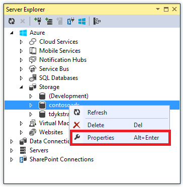	

4. In the **Properties** window, click **Storage Account Keys**, and then click the ellipsis.

		

7. Copy the **Connection String**.

	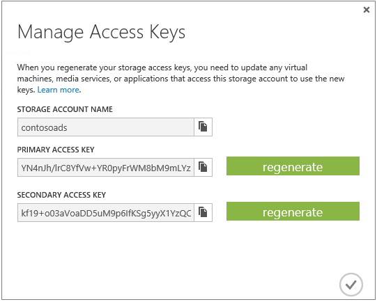	

8. Replace the storage connection string in the *Web.config* file with the connection string you just copied. Make sure you select everything inside the quotation marks but not including the quotation marks before pasting.

4. Open the *App.config* file in the ContosoAdsWebJob project.

	This file has two storage connection strings, one for application data and one for logging. For this tutorial you'll use the same account for both. The connection strings have placeholders for the storage account keys.
  	<pre class="prettyprint">&lt;configuration&gt;
    &lt;connectionStrings&gt;
        &lt;add name="AzureWebJobsDashboard" connectionString="DefaultEndpointsProtocol=https;AccountName=<mark>[accountname]</mark>;AccountKey=<mark>[accesskey]</mark>"/&gt;
        &lt;add name="AzureWebJobsStorage" connectionString="DefaultEndpointsProtocol=https;AccountName=<mark>[accountname]</mark>;AccountKey=<mark>[accesskey]</mark>"/&gt;
        &lt;add name="ContosoAdsContext" connectionString="Data Source=(localdb)\v11.0; Initial Catalog=ContosoAds; Integrated Security=True; MultipleActiveResultSets=True;"/&gt;
    &lt;/connectionStrings&gt;
        &lt;startup&gt; 
            &lt;supportedRuntime version="v4.0" sku=".NETFramework,Version=v4.5" /&gt;
    &lt;/startup&gt;
&lt;/configuration&gt;</pre>

	By default, the WebJobs SDK looks for connection strings named AzureWebJobsStorage and AzureWebJobsDashboard. As an alternative, you can [store the connection string however you want and pass it in explicitly to the `JobHost` object](websites-dotnet-webjobs-sdk-storage-queues-how-to.md/#config).

1. Replace both storage connection strings with the connection string you copied earlier.

5. Save your changes.

## Run the application locally

1. To start the web frontend of the application, press CTRL+F5. 

	The default browser opens to the home page. (The web project runs because you've made it the startup project.)

	

2. To start the WebJob backend of the application, right-click the ContosoAdsWebJob project in **Solution Explorer**, and then click **Debug** > **Start new instance**.

	A console application window opens and displays logging messages indicating the WebJobs SDK JobHost object has started to run.

	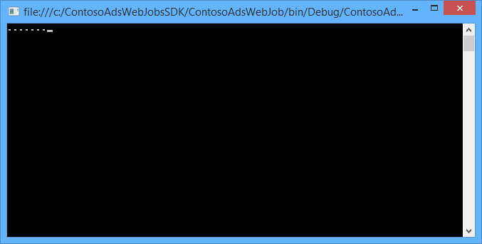

2. In your browser, click  **Create an Ad**.

2. Enter some test data and select an image to upload, and then click **Create**.

	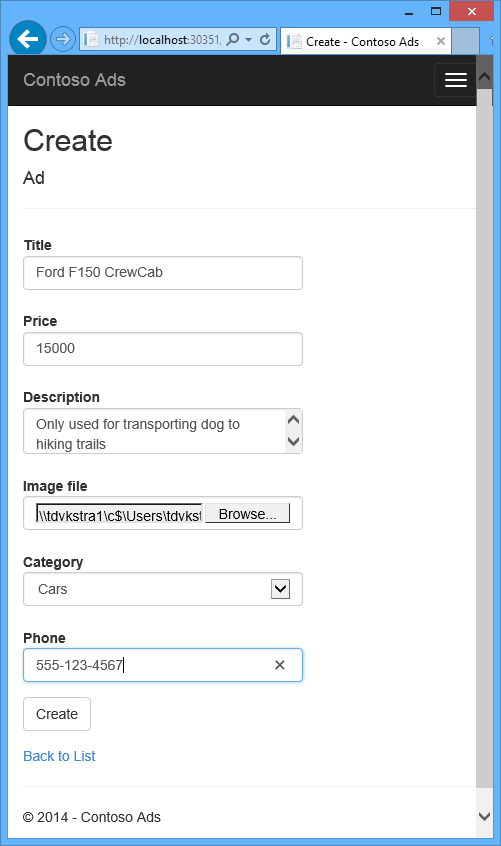

	The app goes to the Index page, but it doesn't show a thumbnail for the new ad because that processing hasn't happened yet.

	Meanwhile, after a short wait a logging message in the console application window shows that a queue message was received and has been processed.   

	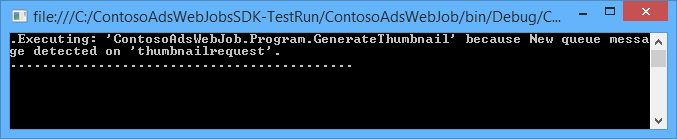

3. After you see the logging messages in the console application window, refresh the Index page to see the thumbnail.

	

4. Click **Details** for your ad to see the full-size image.

	

You've been running the application on your local computer, and it's using a SQL Server database located on your computer, but it's working with queues and blobs in the cloud. In the following section you'll run the application in the cloud, using a cloud database as well as cloud blobs and queues.  

## Run the application in the cloud

You'll do the following steps to run the application in the cloud:

* Deploy to Web Apps. Visual Studio will automatically create a new web app in App Service and SQL Database instance.
* Configure the web app to use your Azure SQL database and storage account.

After you've created some ads while running in the cloud, you'll view the WebJobs SDK dashboard to see the rich monitoring features it has to offer.

### Deploy to Web Apps

1. Close the browser and the console application window.

3. In **Solution Explorer**, right-click the ContosoAdsWeb project, and then click **Publish**.

3. In the **Profile** step of the **Publish Web** wizard, click **Microsoft Azure web apps**.

	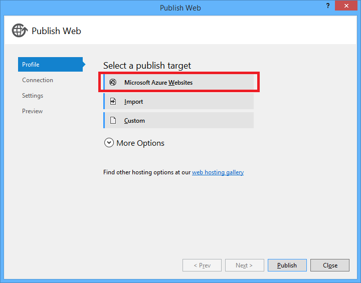	

2. In the **Select existing web app** box, click **Sign In** and enter your credentials if you're not already signed in.
 
5. After you're signed in, click **New**.

	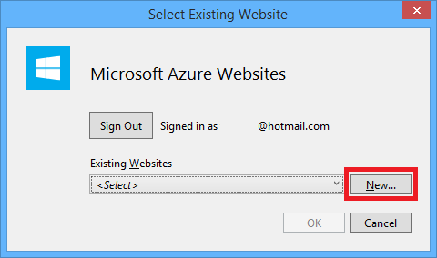

9. In the **Create web app on Microsoft Azure** dialog box, enter a unique name in the **Web app name** box.

	The complete URL will consist of what you enter here plus .azurewebsites.net (as shown next to the **Web app name** text box). For example, if the web app name is ContosoAds, the URL will be ContosoAds.azurewebsites.net.

9. In the **Region** drop-down list choose the same region you chose for your storage account.

	This setting specifies which Azure datacenter your web app will run in. Keeping the web app and storage account in the same datacenter minimizes latency and data egress charges.

9. In the **Database server** drop-down list choose **Create new server**.

	Alternatively, if your subscription already has a server, you can select that server from the drop-down list.

1. Enter an administrator **Database username** and **Database password**. 

	If you selected **New SQL Database server** you aren't entering an existing name and password here, you're entering a new name and password that you're defining now to use later when you access the database. If you selected a server that you created previously, you'll be prompted for the password to the administrative user account you already created.

1. Click **Create**.

	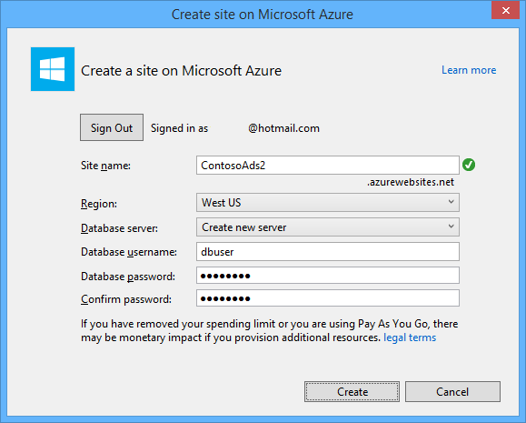	

	Visual Studio creates the solution, the web project, the web app in Azure, and the Azure SQL Database instance.

2. In the **Connection** step of the **Publish Web** wizard, click **Next**.

		

3. In the **Settings** step, clear the **Use this connection string at runtime** check box, and then click **Next**.

	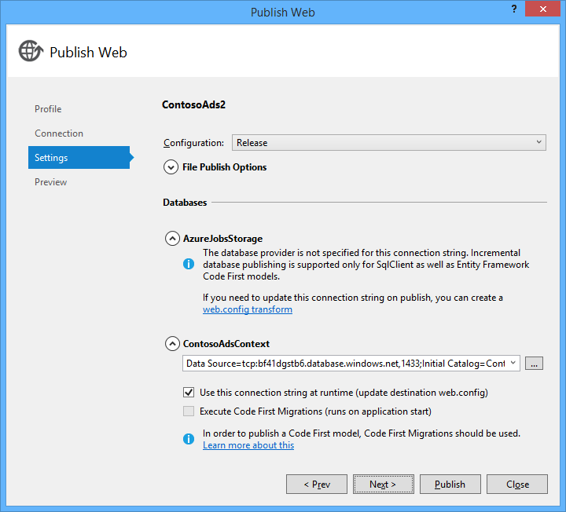	
	
	You don't need to use the publish dialog to set the SQL connection string because you'll set that value in the Azure environment later.

	You can ignore the warnings on this page. 

	* Normally the storage account you use when running in Azure would be different from the one you use when running locally, but for this tutorial you're using the same one in both environments. So the AzureWebJobsStorage connection string does not need to be transformed. Even if you did want to use a different storage account in the cloud, you wouldn't need to transform the connection string because the app will use an Azure environment setting when it runs in Azure. You'll see this later in the tutorial.

	* For this tutorial you aren't going to be making changes to the data model used for the ContosoAdsContext database, so there is no need to use Entity Framework Code First Migrations for deployment. Code First will automatically create a new database the first time the app tries to access SQL data.

	For this tutorial, the default values of the options under **File Publish Options** are fine. 

4. In the **Preview** step, click **Start Preview**.

		

	You can ignore the warning about no databases being published. Entity Framework Code First will create the database; it doesn't need to be published.

	the preview window shows that binaries and configuration files from the WebJob project will be copied to the *app_data\jobs\continuous* folder of the web app.

		

5. Click **Publish**.

	Visual Studio deploys the application and opens the home page URL in the browser. 

	You won't be able to use the web app until you set connection strings in the Azure environment in the next section. You'll see either an error page or the home page depending on web app and database creation options you chose earlier. 

### Configure the web app to use your Azure SQL database and storage account.

It's a security best practice to [avoid putting sensitive information such as connection strings in files that are stored in source code repositories](http://www.asp.net/aspnet/overview/developing-apps-with-windows-azure/building-real-world-cloud-apps-with-windows-azure/source-control#secrets). Azure provides a way to do that: you can set connection string and other setting values in the Azure environment, and ASP.NET configuration APIs automatically pick up those values when the app runs in Azure. In this section you'll set connection string values in Azure.

7. In **Server Explorer**, right-click your web app under the **Web Apps** node, and then click **View Settings**.

	The **Azure Web App** window opens on the **Configuration** tab.

9. Change the name of the DefaultConnection connection string to ContosoAdsContext.

	Azure automatically created this connection string when you created the web app with an associated database, so it already has the right connection string value. You're changing just the name to what your code is looking for.

9. Add two new connection strings, named AzureWebJobsStorage and AzureWebJobsDashboard. Set type to Custom, and set the connection string value to the same value that you used earlier for the *Web.config* and *App.config* files. (Make sure you include the entire connection string, not just the access key, and don't include the quotation marks.)

	These connection strings are used by the WebJobs SDK, one for application data and one for logging. As you saw earlier, the one for application data is also used by the web frontend code.
	
9. Click **Save**.

	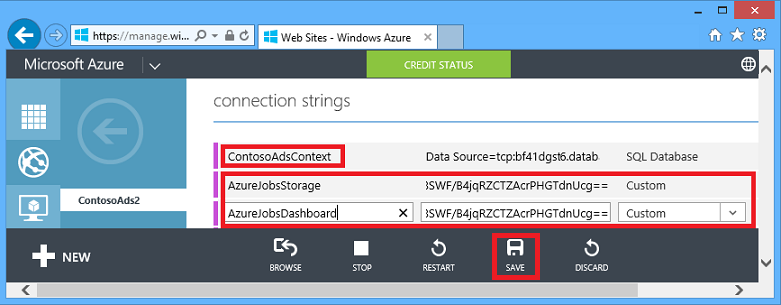

10. In **Server Explorer**, right-click the web app, and then click **Stop web app**. 

12. After the web app stops, right-click the web app again, and then click **Start web app**.

	The WebJob automatically starts when you publish, but it stops when you make a configuration change. To restart it you can either restart the web app or restart the WebJob in the [Azure Portal](http://go.microsoft.com/fwlink/?LinkId=529715). It's generally recommended to restart the web app after a configuration change. 

9. Refresh the browser window that has the web app URL in its address bar.

	The home page appears.

10. Create an ad, as you did when you ran the application locally.

	The Index page shows without a thumbnail at first.

11.	Refresh the page after a few seconds, and the thumbnail appears.

	If the thumbnail doesn't appear, the WebJob may not have started automatically. In that case, go to the WebJobs tab in the 
 

### View the WebJobs SDK dashboard

1. In the Azure Portal, select your web app.

2. Click the **WebJobs** tab.

3. click the URL in the Logs column for your WebJob.

	

	A new browser tab opens to the WebJobs SDK dashboard. The dashboard shows that the WebJob is running and shows a list of functions in your code that the WebJobs SDK triggered.

4. Click one of the functions to see details about its execution 
 
	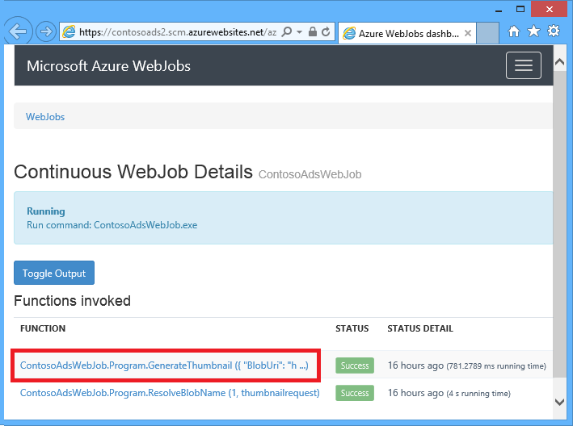	

	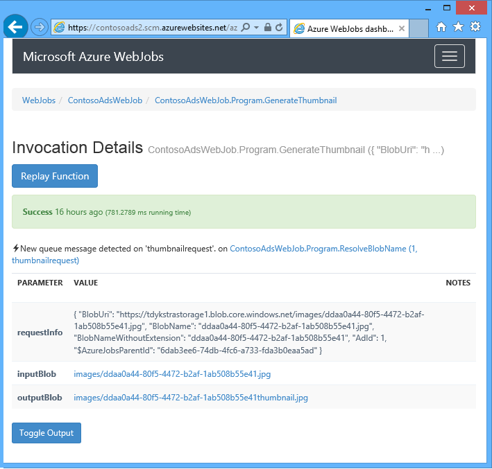	

	The **Replay Function** button on this page causes the WebJobs SDK framework to call the function again, and it gives you a chance to change the data passed to the function first.

>[AZURE.NOTE] When you're finished testing, delete the web app and the SQL Database instance. The web app is free, but the SQL Database instance and storage account accrue charges (minimal due to small size). Also, if you leave the web app running, anyone who finds your URL can create and view ads. In the Azure management portal, go to the **Dashboard** tab for your web app, and then click the **Delete** button at the bottom of the page. You can then select a check box to delete the SQL Database instance at the same time. If you just want to temporarily prevent others from accessing the web app, click **Stop** instead. In that case, charges will continue to accrue for the SQL Database and Storage account. You can follow a similar procedure to delete the SQL database and storage account when you no longer need them.

### Enable AlwaysOn for long-running processes

To make sure your WebJobs are always running, and running on all instances of your web app you have to enabled the [AlwaysOn](http://weblogs.asp.net/scottgu/archive/2014/01/16/windows-azure-staging-publishing-support-for-web-sites-monitoring-improvements-hyper-v-recovery-manager-ga-and-pci-compliance.aspx) feature.

## Create the application from scratch 

In this section you'll do the following tasks:

* Create a Visual Studio solution with a web project.
* Add a class library project for the data access layer that is shared between frontend and backend.
* Add a Console Application project for the backend, with WebJobs deployment enabled.
* Add NuGet packages.
* Set project references.
* Copy application code and configuration files from the downloaded application that you worked with in the previous section of the tutorial.
* Review the parts of the code that work with Azure blobs and queues and the WebJobs SDK.
 
### Create a Visual Studio solution with a web project and class library project

1. In Visual Studio, choose **New** > **Project** from the **File** menu.

2. In the **New Project** dialog, choose **Visual C#** > **Web** > **ASP.NET Web Application**.

3. Name the project ContosoAdsWeb, name the solution ContosoAdsWebJobsSDK (change the solution name if you're putting it in the same folder as the downloaded solution), and then click **OK**.

		

5. In the **New ASP.NET Project** dialog, choose the MVC template, and clear the **Host in the cloud** check box under **Microsoft Azure**.

	Selecting **Host in the cloud** enables Visual Studio to automatically create a new Azure web app and SQL Database. Since you already created these earlier, you don't need to do so now while creating the project. If you want to create a new one, select the check box. You can then configure the new web app and SQL database the same way you did earlier when you were deploying the application.

5. Click **Change Authentication**.

	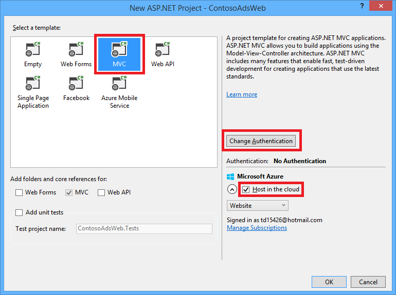	

7. In the **Change Authentication** dialog, choose **No Authentication**, and then click **OK**.

	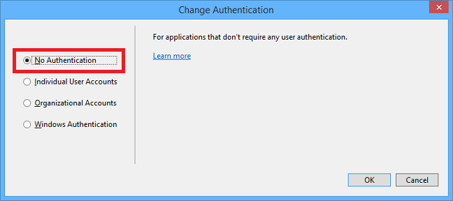	

8. In the **New ASP.NET Project** dialog, click **OK**. 

	Visual Studio creates the solution and the web project.

9. In **Solution Explorer**, right-click the solution (not the project), and choose **Add** > **New Project**.

11. In the **Add New Project** dialog, choose **Visual C#** > **Windows Desktop** > **Class Library** template.  

10. Name the project *ContosoAdsCommon*, and then click **OK**.

	This project will contain the Entity Framework context and the data model which both the frontend and backend will use. As an alternative you could define the EF-related classes in the web project and reference that project from the WebJob project. But then your WebJob project would have a reference to web assemblies which it doesn't need.

### Add a Console Application project that has WebJobs deployment enabled

11. Right-click the web project (not the solution or the class library project), and then click **Add** > **New Azure WebJob Project**.

	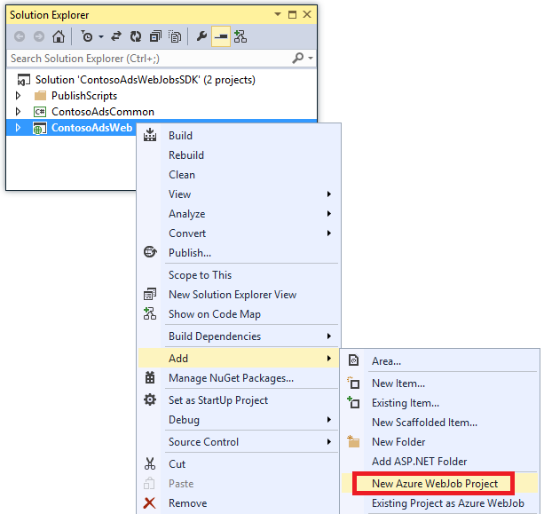	

1. In the **Add Azure WebJob** dialog, enter ContosoAdsWebJob as both the **Project name** and the **WebJob name**. Leave **WebJob run mode** set to **Run Continuously**.

2.  Click **OK**.
  
	Visual Studio creates a Console application that is configured to deploy as a WebJob whenever you deploy the web project. To do that it performed the following tasks after creating the project:

	* Added a *webjob-publish-settings.json* file in the WebJob project Properties folder.
	* Added a *webjobs-list.json* file in the web project Properties folder.
	* Installed the Microsoft.Web.WebJobs.Publish NuGet package in the WebJob project.
	 
	For more information about these changes, see [How to Deploy WebJobs by using Visual Studio](websites-dotnet-deploy-webjobs.md).

### Add NuGet packages

The new-project template for a WebJob project automatically installs the WebJobs SDK NuGet package [Microsoft.Azure.WebJobs](http://www.nuget.org/packages/Microsoft.Azure.WebJobs) and its dependencies. 

One of the WebJobs SDK dependencies that is installed automatically in the WebJob project is the Azure Storage Client Library (SCL). However, you need to add it to the web project to work with blobs and queues.

11. Open the **Manage NuGet Packages** dialog for the solution.

12. In the left pane, select **Installed packages**.
   
13. Find the *Azure Storage* package, and then click **Manage**.

13. In the **Select Projects** box, select the **ContosoAdsWeb** check box, and then click **OK**. 

All three projects use the Entity Framework to work with data in SQL Database.

12. In the left pane, select **Online**.
   
16. Find the *EntityFramework* NuGet package, and install it in all three projects.

### Set project references

Both web and WebJob projects will work with the SQL database, so both need a reference to the ContosoAdsCommon project.

10. In the ContosoAdsWeb project, set a reference to the ContosoAdsCommon project. (Right-click the ContosoAdsWeb project, and then click **Add** > **Reference**. In the **Reference Manager** dialog box, select **Solution** > **Projects** > **ContosoAdsCommon**, and then click **OK**.)

11. In the ContosoAdsWebJob project, set a reference to the ContosAdsCommon project.

The WebJob project needs references for working with images and for accessing connection strings.

11. In the ContosoAdsWebJob project, set a reference to `System.Drawing` and `System.Configuration`.

### Add code and configuration files

This tutorial does not show how to [create MVC controllers and views using scaffolding](http://www.asp.net/mvc/tutorials/mvc-5/introduction/getting-started), how to [write Entity Framework code that works with SQL Server databases](http://www.asp.net/mvc/tutorials/getting-started-with-ef-using-mvc), or [the basics of asynchronous programming in ASP.NET 4.5](http://www.asp.net/aspnet/overview/developing-apps-with-windows-azure/building-real-world-cloud-apps-with-windows-azure/web-development-best-practices#async). So all that remains to do is copy code and configuration files from the downloaded solution into the new solution. After you do that, the following sections will show and explain key parts of the code.

To add files to a project or a folder, right-click the project or folder and click **Add** > **Existing Item**. Select the files you want and click **Add**. If asked whether you want to replace existing files, click **Yes**.

3. In the ContosoAdsCommon project, delete the *Class1.cs* file and add in its place the following files from the downloaded project.

	- *Ad.cs*
	- *ContosoAdscontext.cs*
	- *BlobInformation.cs*  

3. In the ContosoAdsWeb project, add the following files from the downloaded project.

	- *Web.config*
	- *Global.asax.cs*  
	- In the *Controllers* folder: *AdController.cs* 
	- In the *Views\Shared* folder: <em>_Layout.cshtml</em> file. 
	- In the *Views\Home* folder: *Index.cshtml*. 
	- In the *Views\Ad* folder (create the folder first): five *.cshtml* files.  

3. In the ContosoAdsWebJob project, add the following files from the downloaded project.

	- *App.config* (change the file type filter to **All Files**)
	- *Program.cs*
	- *Functions.cs*

You can now build, run, and deploy the application as instructed earlier in the tutorial. Before you do that, however, stop the WebJob that is still running in the first web app you deployed to. Otherwise that WebJob will process queue messages created locally or by the app running in a new web app, since all are using the same storage account.

## Review the application code

The following sections explain the code related to working with the WebJobs SDK and Azure Storage blobs and queues. For the code specific to the WebJobs SDK, see the [Program.cs section](#programcs).

### ContosoAdsCommon - Ad.cs

The Ad.cs file defines an enum for ad categories and a POCO entity class for ad information.

		public enum Category
		{
		    Cars,
		    [Display(Name="Real Estate")]
		    RealEstate,
		    [Display(Name = "Free Stuff")]
		    FreeStuff
		}

		public class Ad
		{
		    public int AdId { get; set; }

		    [StringLength(100)]
		    public string Title { get; set; }

		    public int Price { get; set; }

		    [StringLength(1000)]
		    [DataType(DataType.MultilineText)]
		    public string Description { get; set; }

		    [StringLength(1000)]
		    [DisplayName("Full-size Image")]
		    public string ImageURL { get; set; }

		    [StringLength(1000)]
		    [DisplayName("Thumbnail")]
		    public string ThumbnailURL { get; set; }

		    [DataType(DataType.Date)]
		    [DisplayFormat(DataFormatString = "{0:yyyy-MM-dd}", ApplyFormatInEditMode = true)]
		    public DateTime PostedDate { get; set; }

		    public Category? Category { get; set; }
		    [StringLength(12)]
		    public string Phone { get; set; }
		}

### ContosoAdsCommon - ContosoAdsContext.cs

The ContosoAdsContext class specifies that the Ad class is used in a DbSet collection, which Entity Framework will store in a SQL database.

		public class ContosoAdsContext : DbContext
		{
		    public ContosoAdsContext() : base("name=ContosoAdsContext")
		    {
		    }
		    public ContosoAdsContext(string connString)
		        : base(connString)
		    {
		    }
		    public System.Data.Entity.DbSet<Ad> Ads { get; set; }
		}
 
The class has two constructors. The first of them is used by the web project, and specifies the name of a connection string that is stored in the Web.config file or the Azure runtime environment. The second constructor enables you to pass in the actual connection string. That is needed by the WebJob project, since it doesn't have a Web.config file. You saw earlier where this connection string was stored, and you'll see later how the code retrieves the connection string when it instantiates the DbContext class.

### ContosoAdsCommon - BlobInformation.cs

The `BlobInformation` class is used to store information about an image blob in a queue message.

		public class BlobInformation
		{
		    public Uri BlobUri { get; set; }
		    
		    public string BlobName
		    {
		        get
		        {
		            return BlobUri.Segments[BlobUri.Segments.Length - 1];
		        }
		    }
		    public string BlobNameWithoutExtension
		    {
		        get
		        {
		            return Path.GetFileNameWithoutExtension(BlobName);
		        }
		    }
		    public int AdId { get; set; }
		}

### ContosoAdsWeb - Global.asax.cs

Code that is called from the `Application_Start` method creates an *images* blob container and an *images* queue if they don't already exist. This ensures that whenever you start using a new storage account, the required blob container and queue will be created automatically.

The code gets access to the storage account by using the storage connection string from the *Web.config* file or Azure runtime environment.

		var storageAccount = CloudStorageAccount.Parse
		    (ConfigurationManager.ConnectionStrings["AzureWebJobsStorage"].ToString());

Then it gets a reference to the *images* blob container, creates the container if it doesn't already exist, and sets access permissions on the new container. By default new containers allow only clients with storage account credentials to access blobs. The web app needs the blobs to be public so that it can display images using URLs that point to the image blobs.

		var blobClient = storageAccount.CreateCloudBlobClient();
		var imagesBlobContainer = blobClient.GetContainerReference("images");
		if (imagesBlobContainer.CreateIfNotExists())
		{
		    imagesBlobContainer.SetPermissions(
		        new BlobContainerPermissions
		        {
		            PublicAccess = BlobContainerPublicAccessType.Blob
		        });
		}

Similar code gets a reference to the *blobnamerequest* queue and creates a new queue. In this case no permissions change is needed. The [ResolveBlobName](#resolveblobname) section later in the tutorial explains why the queue that the web application writes to is used just for getting blob names and not for generating thumbnails.

		CloudQueueClient queueClient = storageAccount.CreateCloudQueueClient();
		var imagesQueue = queueClient.GetQueueReference("blobnamerequest");
		imagesQueue.CreateIfNotExists();

### ContosoAdsWeb - _Layout.cshtml

The *_Layout.cshtml* file sets the app name in the header and footer, and creates an "Ads" menu entry.

### ContosoAdsWeb - Views\Home\Index.cshtml

The *Views\Home\Index.cshtml* file displays category links on the home page. The links pass the integer value of the `Category` enum in a querystring variable to the Ads Index page.
	
		<li>@Html.ActionLink("Cars", "Index", "Ad", new { category = (int)Category.Cars }, null)</li>
		<li>@Html.ActionLink("Real estate", "Index", "Ad", new { category = (int)Category.RealEstate }, null)</li>
		<li>@Html.ActionLink("Free stuff", "Index", "Ad", new { category = (int)Category.FreeStuff }, null)</li>
		<li>@Html.ActionLink("All", "Index", "Ad", null, null)</li>

### ContosoAdsWeb - AdController.cs

In the *AdController.cs* file the constructor calls the `InitializeStorage` method to create Azure Storage Client Library objects that provide an API for working with blobs and queues. 

Then the code gets a reference to the *images* blob container as you saw earlier in *Global.asax.cs*. While doing that it sets a default [retry policy](http://www.asp.net/aspnet/overview/developing-apps-with-windows-azure/building-real-world-cloud-apps-with-windows-azure/transient-fault-handling) appropriate for a web app. The default exponential backoff retry policy could hang the web app for longer than a minute on repeated retries for a transient fault. The retry policy specified here waits 3 seconds after each try for up to 3 tries.

		var blobClient = storageAccount.CreateCloudBlobClient();
		blobClient.DefaultRequestOptions.RetryPolicy = new LinearRetry(TimeSpan.FromSeconds(3), 3);
		imagesBlobContainer = blobClient.GetContainerReference("images");

Similar code gets a reference to the *images* queue.

		CloudQueueClient queueClient = storageAccount.CreateCloudQueueClient();
		queueClient.DefaultRequestOptions.RetryPolicy = new LinearRetry(TimeSpan.FromSeconds(3), 3);
		imagesQueue = queueClient.GetQueueReference("blobnamerequest");

Most of the controller code is typical for working with an Entity Framework data model using a DbContext class. An exception is the HttpPost `Create` method, which uploads a file and saves it in blob storage. The model binder provides an [HttpPostedFileBase](http://msdn.microsoft.com/library/system.web.httppostedfilebase.aspx) object to the method.

		[HttpPost]
		[ValidateAntiForgeryToken]
		public async Task<ActionResult> Create(
		    [Bind(Include = "Title,Price,Description,Category,Phone")] Ad ad,
		    HttpPostedFileBase imageFile)

If the user selected a file to upload, the code uploads the file, saves it in a blob, and updates the Ad database record with a URL that points to the blob.

		if (imageFile != null && imageFile.ContentLength != 0)
		{
		    blob = await UploadAndSaveBlobAsync(imageFile);
		    ad.ImageURL = blob.Uri.ToString();
		}

The code that does the upload is in the `UploadAndSaveBlobAsync` method. It creates a GUID name for the blob, uploads and saves the file, and returns a reference to the saved blob.

		private async Task<CloudBlockBlob> UploadAndSaveBlobAsync(HttpPostedFileBase imageFile)
		{
		    string blobName = Guid.NewGuid().ToString() + Path.GetExtension(imageFile.FileName);
		    CloudBlockBlob imageBlob = imagesBlobContainer.GetBlockBlobReference(blobName);
		    using (var fileStream = imageFile.InputStream)
		    {
		        await imageBlob.UploadFromStreamAsync(fileStream);
		    }
		    return imageBlob;
		}

After the HttpPost `Create` method uploads a blob and updates the database, it creates a queue message to inform the back-end process that an image is ready for conversion to a thumbnail.

		BlobInformation blobInfo = new BlobInformation() { AdId = ad.AdId, BlobUri = new Uri(ad.ImageURL) };
		var queueMessage = new CloudQueueMessage(JsonConvert.SerializeObject(blobInfo));
		await thumbnailRequestQueue.AddMessageAsync(queueMessage);

The code for the HttpPost `Edit` method is similar except that if the user selects a new image file any blobs that already exist for this ad must be deleted.
 
		if (imageFile != null && imageFile.ContentLength != 0)
		{
		    await DeleteAdBlobsAsync(ad);
		    imageBlob = await UploadAndSaveBlobAsync(imageFile);
		    ad.ImageURL = imageBlob.Uri.ToString();
		}

Here is the code that deletes blobs when you delete an ad:

		private async Task DeleteAdBlobsAsync(Ad ad)
		{
		    if (!string.IsNullOrWhiteSpace(ad.ImageURL))
		    {
		        Uri blobUri = new Uri(ad.ImageURL);
		        await DeleteAdBlobAsync(blobUri);
		    }
		    if (!string.IsNullOrWhiteSpace(ad.ThumbnailURL))
		    {
		        Uri blobUri = new Uri(ad.ThumbnailURL);
		        await DeleteAdBlobAsync(blobUri);
		    }
		}
		private static async Task DeleteAdBlobAsync(Uri blobUri)
		{
		    string blobName = blobUri.Segments[blobUri.Segments.Length - 1];
		    CloudBlockBlob blobToDelete = imagesBlobContainer.GetBlockBlobReference(blobName);
		    await blobToDelete.DeleteAsync();
		}
 
### ContosoAdsWeb - Views\Ad\Index.cshtml and Details.cshtml

The *Index.cshtml* file displays thumbnails with the other ad data:

		

The *Details.cshtml* file displays the full-size image:

		

### ContosoAdsWeb - Views\Ad\Create.cshtml and Edit.cshtml

The *Create.cshtml* and *Edit.cshtml* files specify form encoding that enables the controller to get the `HttpPostedFileBase` object.

		@using (Html.BeginForm("Create", "Ad", FormMethod.Post, new { enctype = "multipart/form-data" }))

An `<input>` element tells the browser to provide a file selection dialog.

		<input type="file" name="imageFile" accept="image/*" class="form-control fileupload" />

### ContosoAdsWebJob - Program.cs

When the WebJob starts, the `Main` method calls the WebJobs SDK `JobHost.RunAndBlock` method to begin execution of triggered functions on the current thread.

		static void Main(string[] args)
		{
		    JobHost host = new JobHost();
		    host.RunAndBlock();
		}

### ContosoAdsWebJob - Functions.cs - GenerateThumbnail method

The WebJobs SDK calls this method when a queue message is received. The method creates a thumbnail and puts the thumbnail URL in the database.

		public static void GenerateThumbnail(
		[QueueTrigger("thumbnailrequest")] BlobInformation blobInfo,
		[Blob("images/{BlobName}", FileAccess.Read)] Stream input,
		[Blob("images/{BlobNameWithoutExtension}_thumbnail.jpg")] CloudBlockBlob outputBlob)
		{
		    using (Stream output = outputBlob.OpenWrite())
		    {
		        ConvertImageToThumbnailJPG(input, output);
		        outputBlob.Properties.ContentType = "image/jpeg";
		    }
		
		    // Entity Framework context class is not thread-safe, so it must
		    // be instantiated and disposed within the function.
		    using (ContosoAdsContext db = new ContosoAdsContext())
		    {
		        var id = blobInfo.AdId;
		        Ad ad = db.Ads.Find(id);
		        if (ad == null)
		        {
		            throw new Exception(String.Format("AdId {0} not found, can't create thumbnail", id.ToString()));
		        }
		        ad.ThumbnailURL = outputBlob.Uri.ToString();
		        db.SaveChanges();
		    }
		}

* The `QueueTrigger` attribute directs the WebJobs SDK to call this method when a new message is received on the thumbnailrequest queue.

		[QueueTrigger("thumbnailrequest")] BlobInformation blobInfo,

	The `BlobInformation` object in the queue message is automatically deserialized into the `blobInfo` parameter. When the method completes, the queue message is deleted. If the method fails before completing, the queue message is not deleted; after a 10-minute lease expires, the message is released to be picked up again and processed. This sequence won't be repeated indefinitely if a message always causes an exception. After 5 unsuccessful attempts to process a message, the message is moved to a queue named {queuename}-poison. The maximum number of attempts is configurable. 

* The two `Blob` attributes provide objects that are bound to blobs: one to the existing image blob and one to a new thumbnail blob that the method creates. 

		[Blob("images/{BlobName}", FileAccess.Read)] Stream input,
		[Blob("images/{BlobNameWithoutExtension}_thumbnail.jpg")] CloudBlockBlob outputBlob)

	Blob names come from properties of the `BlobInformation` object received in the queue message (`BlobName` and `BlobNameWithoutExtension`). To get the full functionality of the Storage Client Library you can use the `CloudBlockBlob` class to work with blobs. If you want to reuse code that was written to work with `Stream` objects, you can use the `Stream` class. 

For more information about how to write functions that use  WebJobs SDK attributes, see the following resources:

* [How to use Azure queue storage with the WebJobs SDK](websites-dotnet-webjobs-sdk-storage-queues-how-to.md)
* [How to use Azure blob storage with the WebJobs SDK](websites-dotnet-webjobs-sdk-storage-blobs-how-to.md)
* [How to use Azure table storage with the WebJobs SDK](websites-dotnet-webjobs-sdk-storage-tables-how-to.md)
* [How to use Azure Service Bus with the WebJobs SDK](websites-dotnet-webjobs-sdk-service-bus.md)

>[AZURE.NOTE] 
>* If your web app runs on multiple VMs, this program will run on each machine, and each machine will wait for triggers and attempt to run functions. In some scenarios this can lead to some functions processing the same data twice, so functions should be idempotent (written so that calling them repeatedly with the same input data doesn't produce duplicate results).
>* For information about how to implement graceful shutdown, see [Graceful Shutdown](websites-dotnet-webjobs-sdk-storage-queues-how-to.md#graceful).   
>* The code in the `ConvertImageToThumbnailJPG` method (not shown) uses classes in the `System.Drawing` namespace for simplicity. However, the classes in this namespace were designed for use with Windows Forms. They are not supported for use in a Windows or ASP.NET service.

### WebJobs SDK versus Cloud Service worker role without WebJobs SDK

If you compare the amount of code in the `GenerateThumbnails` method in this sample application with the worker role code in the [Cloud Service version of the application](cloud-services-dotnet-get-started.md), you can see how much work the WebJobs SDK is doing for you. The advantage is greater than it appears, because the Cloud Service sample application code doesn't do all of the things (such as poison message handling) that you would do in a production application, and which the WebJobs SDK does for you.

In the Cloud Service version of the application, the record ID is the only information in the queue message, and the background process gets the image URL from the database. In the WebJobs SDK version of the application, the queue message includes the image URL so that it can be provided to the `Blob` attributes. If the queue message didn't have the blob URL, you could [use the Blob attribute in the body of the method instead of in the method signature](websites-dotnet-webjobs-sdk-storage-queues-how-to.md#blobbody).

### Using the WebJobs SDK outside of WebJobs

A program that uses the WebJobs SDK doesn't have to run in Azure in a WebJob. It can run locally, and it can also run in other environments such as a Cloud Service worker role or a Windows service. However, you can only access the WebJobs SDK dashboard through an Azure web app. To use the dashboard you have to connect the web app to the storage account you're using by setting the AzureWebJobsDashboard connection string on the **Configure** tab of the management portal. Then you can get to the Dashboard by using the following URL:

https://{webappname}.scm.azurewebsites.net/azurejobs/#/functions

For more information, see [Getting a dashboard for local development with the WebJobs SDK](http://blogs.msdn.com/b/jmstall/archive/2014/01/27/getting-a-dashboard-for-local-development-with-the-webjobs-sdk.aspx), but note that it shows an old connection string name. 

## Next steps

In this tutorial you've seen a simple multi-tier application that uses the WebJobs SDK for backend processing. The application has been kept simple for a getting-started tutorial. For example, it doesn't implement [dependency injection](http://www.asp.net/mvc/tutorials/hands-on-labs/aspnet-mvc-4-dependency-injection) or the [repository and unit of work patterns](http://www.asp.net/mvc/tutorials/getting-started-with-ef-using-mvc/advanced-entity-framework-scenarios-for-an-mvc-web-application#repo), it doesn't [use an interface for logging](http://www.asp.net/aspnet/overview/developing-apps-with-windows-azure/building-real-world-cloud-apps-with-windows-azure/monitoring-and-telemetry#log), it doesn't use [EF Code First Migrations](http://www.asp.net/mvc/tutorials/getting-started-with-ef-using-mvc/migrations-and-deployment-with-the-entity-framework-in-an-asp-net-mvc-application) to manage data model changes or [EF Connection Resiliency](http://www.asp.net/mvc/tutorials/getting-started-with-ef-using-mvc/connection-resiliency-and-command-interception-with-the-entity-framework-in-an-asp-net-mvc-application) to manage transient network errors, and so forth.

For more information, see [Azure Web Jobs Recommended Resources](http://go.microsoft.com/fwlink/?LinkId=390226).

## What's changed
* For a guide to the change from Websites to App Service see: [Azure App Service and Its Impact on Existing Azure Services](http://go.microsoft.com/fwlink/?LinkId=529714)
* For a guide to the change of the old portal to the new portal see: [Reference for navigating the preview portal](http://go.microsoft.com/fwlink/?LinkId=529715)
